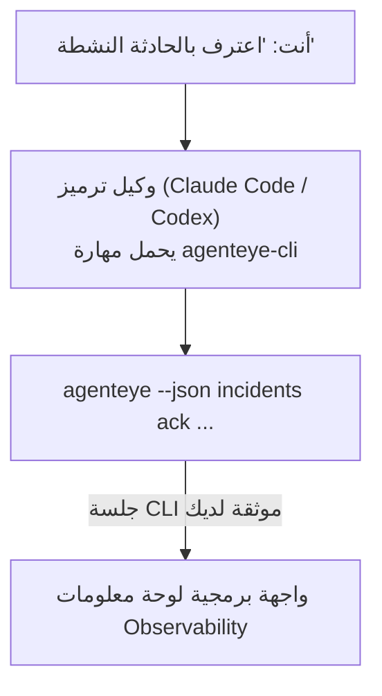

---
---
title: "مهارة عامل Failproof AI Observability CLI"
description: "اسأل وكيل الترميز الخاص بك \"هل حدث عطل ما اليوم؟\" ودعه يجيب من بيانات Failproof AI Observability المباشرة، بدون الحاجة لحفظ أوامر."
---


اسأل وكيل الترميز الخاص بك *"هل حدث عطل ما اليوم؟"* ودعه يجيب من بيانات Failproof AI Observability المباشرة، بدون الحاجة لحفظ أوامر. **مهارة Failproof AI Observability CLI** (`agenteye-cli`) هي *مهارة عامل*: مجلد صغير يحتوي على تعليمات يحملها وكيل ترميز مثل Claude Code أو Codex عند الحاجة. تعلم الوكيل كيفية تشغيل نشر Observability الخاص بك من خلال [`agenteye` CLI](/ar/agenteye/cli) من طلبات باللغة الإنجليزية العادية مثل *"أعط CI مفتاح يمكنه فقط دفع الأحداث"* أو *"اعترف بالحادثة النشطة وعينها لي."*

إنها **ليست** خدمة أو ملف تنفيذي منفصل؛ لا شيء للنشر. تعتمد على CLI الذي لديك بالفعل: يقوم الوكيل بتنفيذ `agenteye --json …`، ويحلل JSON النظيف، ويجيبك بنص عادي. كل شيء يمكنه القيام به، يمكنك القيام به بنفسك بكتابة نفس الأوامر.

---

## كيف يرتبط بواجهات Failproof AI Observability الأخرى

Failproof AI Observability يعطيك أربع طرق للوصول إلى نفس البيانات والتحكم. تكمل بعضها بعضاً:

| الواجهة | ما هي | حيث تعمل | استخدمها عندما |
|---|---|---|---|
| **[CLI](/ar/agenteye/cli)** | مرجع الأوامر والخيارات لـ `agenteye` | محطة طرفية | تريد تشغيل أو كتابة أمر معين |
| **[وصفات CLI](/ar/agenteye/cli-recipes)** | أنماط `jq`/أنابيب جاهزة للنسخ | محطة طرفية / نصوص برمجية | تريد دمج CLI في أتمتة |
| **مهارة CLI** (هذا المستند) | باب أمامي بلغة طبيعية على CLI | وكيل ترميز، على محطة العمل الخاصة بك | تريد فقط أن تسأل ودع الوكيل يختار الأمر |
| **[مهارة المقيّم](/ar/agenteye/evaluator-skill)** | مهارة شقيقة تصمم وتبني خدمة التسجيل الخاصة بك | وكيل ترميز، على محطة العمل الخاصة بك | تريد **إنتاج** درجات التقييم بدلاً من قراءتها |
| **[مهارة Python SDK](/ar/agenteye/python-sdk-skill)** | مهارة شقيقة تجهز وكيلك لإصدار بيانات تلميترية | وكيل ترميز، على محطة العمل الخاصة بك | تريد من وكيلك **إنتاج** الأحداث التي تقرأها هذه المهارة |
| **[مساعد AI في لوحة المعلومات](/ar/agenteye/assistant)** | دردشة مضمنة في لوحة المعلومات | من جهة الخادم (في لوحة المعلومات) | تريد أسئلة وأجوبة داخل لوحة المعلومات حول البيانات |

المهارة نفسها ليس لديها امتيازات خاصة بها؛ فهي تحول كلماتك ببساطة إلى استدعاءات CLI يتم تشغيلها باسمك:



### مقابل مساعد AI في لوحة المعلومات: تمييز مهم

هذان أداتان مختلفتان جداً بنطاقات انفجار مختلفة جداً:

- **مساعد AI في لوحة المعلومات** ([مساعد AI](/ar/agenteye/assistant)) هو دردشة مضمنة في لوحة المعلومات، مدعومة بخدمة الوكيل. إنها **قراءة فقط بالإضافة إلى تأليف محمي بموافقة**: يمكنها صياغة الاستعلامات والمحاور المحفوظة، لكن كل عملية كتابة تتوقف لموافقتك الصريحة بالنقر، ولا تحذف أبداً. يتم حمايتها بواسطة إذن `agent:use` وترى فقط البيانات للمؤسسة التي تعرضها.
- **مهارة CLI** تعمل على *محطة العمل الخاصة بك* داخل *وكيل ترميز خاص بك* وتشغل CLI `agenteye` بـ **أنت**. يمكنها تنفيذ **السطح الكامل للـ CLI، بما في ذلك التغييرات** (إنشاء/تدوير/تعطيل مفاتيح API، تغيير إعدادات المؤسسة، حل الحوادث، حذف الاستعلامات المحفوظة)، محدودة فقط بأذونات تسجيل دخول CLI الخاص بك. تعامل معها بنفس الحذر الذي ستتعامل به إذا قمت بتشغيل تلك الأوامر يدوياً.

---

## المتطلبات الأساسية

1. **`agenteye` CLI مثبتة** وعلى `PATH` (انظر [مرجع CLI](/ar/agenteye/cli): `pipx install agenteye`).
2. **عنوان URL لوحة المعلومات الخاصة بك** محدد (`AGENTEYE_DASHBOARD_URL`، أو يمرر الوكيل `--base-url`).
3. **جلسة مسجلة الدخول**: قم بتشغيل `agenteye login` بنفسك أولاً. المهارة **لا يمكنها** إكمال تسجيل الدخول برمز لمرة واحدة عبر البريد الإلكتروني نيابة عنك؛ ستخبرك أن تشغل `agenteye login` إذا كانت الجلسة مفقودة أو منتهية الصلاحية (رمز خروج CLI `4`).

---

## حيث تحصل عليها

تُنشر المهارة في مجموعة المهارات العامة لـ Failproof AI:

**[github.com/FailproofAI/skills](https://github.com/FailproofAI/skills)** → [`skills/agenteye-cli/`](https://github.com/FailproofAI/skills/tree/main/skills/agenteye-cli)

لا شيء محمي في ذلك — المستودع عام والمهارة لا تحتاج إلى بيانات اعتماد خاصة بها، لأنها تشغل فقط `agenteye` CLI **العام** ضد لوحة المعلومات *الخاصة بك*، باستخدام الجلسة *التي سجلت بها الدخول*. لا تحتاج إلى طلب إذن من أحد.

لاحظ أنها تأتي كمجلد خاص بها و**ليست** داخل حزمة `pipx install agenteye`، لذا لا تبحث عنها هناك.

## تثبيت المهارة

أسرع طريق هي [`skills`](https://skills.sh) CLI، التي تجلب المجلد وتضعه حيث ينظر وكيلك:

```bash
# Claude Code، هذا المشروع فقط
npx skills add FailproofAI/skills --skill agenteye-cli -a claude-code

# كل مشروع (التثبيت في ~/.claude/skills/)
npx skills add FailproofAI/skills --skill agenteye-cli -a claude-code -g --copy

# Codex بدلاً من ذلك
npx skills add FailproofAI/skills --skill agenteye-cli -a codex
```

ثم أدرها مثل أي مهارة أخرى:

```bash
npx skills list -a claude-code      # ما هو مثبت
npx skills update agenteye-cli      # اسحب أحدث إصدار
npx skills remove agenteye-cli      # أزلها
```

تفضل التثبيت يدوياً؟ مهارة عامل ما هي إلا مجلد يحتوي على `SKILL.md` (بالإضافة إلى مراجع اختيارية)، لذا نسخها يعمل أيضاً:

- **Claude Code**: ضع مجلد `agenteye-cli/` في `~/.claude/skills/` (كل مشروع) أو `<your-repo>/.claude/skills/` (ذلك المستودع فقط). Claude Code يكتشفه تلقائياً — تحقق من قائمة `/skills`، أو ببساطة اسأل سؤالاً يطابق وصفه.
- **Codex (OpenAI)**: يقرأ Codex نفس `SKILL.md`. يعيّن `agents/openai.yaml` المضمن `allow_implicit_invocation: true`، لذا يختار Codex المهارة تلقائياً عندما تطابق المهمة؛ وإلا قم باستدعاؤها بشكل صريح كـ `$agenteye-cli`.

---

## الأمان: التغييرات لا تطلب موافقة عندما يشغل الوكيل CLI

> **تحذير:** اقرأ هذا قبل السماح لوكيل بإجراء تغييرات.

CLI `agenteye` عادة ما يسأل *"هل أنت متأكد؟"* قبل إجراء تدميري. إنه **يتخطى هذا التأكيد تلقائياً كلما لم يكن متصلاً بمحطة طرفية (وهذا بالضبط كيفية تشغيل الوكيل له)، و `--json` يتخطاه أيضاً.** لذا فإن موجه الأمان لن **ينطلق** للوكيل.

تمت كتابة المهارة للتعويض: تم تعليمها بيان الأمر الدقيق الذي ستشغله والحصول على موافقتك الصريحة **OK قبل أي تغيير في الحالة**. حافظ على هذا النظام. عندما تشغل Failproof AI Observability من خلال وكيل، *أنت* خطوة التأكيد. أوامر تغيير الحالة التي يجب مراقبتها:

- `keys create` / `update` / `disable` / `regenerate`
- `users create` / `update` / `disable` / `enable`
- `settings set`
- `alerts create` / `update` / `delete` / `test`
- أوامر الكتابة في `incidents`: `ack` / `assign` / `resolve` / `open` / `comment-add` / `comment-delete` / `subscribe` / `unsubscribe`
- `query create` / `update` / `delete`
- `agent rename` / `delete`
- `orgs switch`

كل شيء تحت **Observe** (`events`, `sessions`, `evals`, `errors`, `list`, `whoami`, `orgs list/current/perms`) للقراءة فقط ولا يغير شيء.

لأن الوكيل يتصرف ب **أنت**، يمكنه فقط القيام بما يسمح به تسجيل دخولك؛ يتم حل الأذونات **لكل منظمة** (انظر [مفاتيح API](/ar/agenteye/api-keys)). الأمر الذي لا تملك إذناً له يرجع رمز خروج `5` مع الإذن المحدد بالضبط، لذا يمكن للوكيل أن يخبرك بالضبط ما الذي يجب عليك طلبه من المسؤول بدلاً من الفشل بشكل غير واضح.

---

## ما الذي يمكنك أن تسأله

إليك ما يبدو عليه جولة ذهاب وإياب حقيقية، قراءة ثم تغيير ينتظر موافقتك:

```text
أنت   ▸ هل حدث عطل ما في اليوم الأخير؟

وكيل ▸ تشغيل: agenteye --json errors --since 24h --aggregate
       3 أنواع أخطاء في آخر 24 ساعة. الأكبر هو TimeoutError
       (18 نقرة، جميعها على checkout-agent)، ثم RateLimited (5).
       تريد الجلسات الفاشلة لـ TimeoutError؟

أنت   ▸ أعط CI مفتاح يمكنه فقط دفع الأحداث.

وكيل ▸ هذا ينشئ مفتاح API. سأشغل:
       agenteye keys create ci --add events:add
       OK للمتابعة؟

أنت   ▸ نعم

وكيل ▸ تم. تم إنشاء المفتاح "ci" مع events:add فقط.
       يتم عرض السر مرة واحدة فقط، لذا قم بتخزينه الآن. لا يمكنني إعادة طباعته.
```

تعيّن المهارة كل نية باللغة الإنجليزية العادية إلى أمر `agenteye` الصحيح، واكتشف القيم الصحيحة أولاً (`list <kind>`, `whoami`) حتى لا تخمن، وحدد الأمر الدقيق قبل أي تغيير. المزيد من الأمثلة:

- *"هل حدث عطل / فشل في آخر 24 ساعة؟"* → `errors --since 24h --aggregate`، ثم تفصيل.
- *"لماذا فشلت الجلسة `run-001`؟"* → `events --session-id run-001 --all` + `evals --session-id run-001`.
- *"كيف تتجه الجودة هذا الأسبوع؟"* → `evals --aggregate --since 7d`، ثم الحفر في التشغيلات منخفضة التسجيل.
- *"أعط CI مفتاح يمكنه فقط دفع الأحداث."* → `keys create ci --add events:add` (يحدد الأمر، ثم ينشئه ويأسر السر لمرة واحدة).
- *"من لديه حق الوصول؟ اجعل Dana للقراءة فقط."* → `users list` → `users update dana@… --permission-set read-only` (بعد التأكيد معك).
- *"اعترف بالحادثة النشطة وعينها لي."* → `incidents list --state firing` → `incidents ack <id>` / `incidents assign <id> you@…`.

للأوامر والخيارات والأشكال JSON الدقيقة خلف هذا، انظر [مرجع CLI](/ar/agenteye/cli) و[وصفات CLI للوكلاء](/ar/agenteye/cli-recipes).

---

## الخطوات التالية

- **[CLI](/ar/agenteye/cli)**: مرجع أمر وخيار كامل لـ `agenteye`.
- **[وصفات CLI للوكلاء](/ar/agenteye/cli-recipes)**: أنماط `jq` جاهزة للنسخ ومعالجة رموز الخروج.
- **[مهارة وكيل المقيّم](/ar/agenteye/evaluator-skill)**: المهارة الشقيقة، لبناء المقيّم الذي تقرأه `agenteye evals`.
- **[مهارة وكيل Python SDK](/ar/agenteye/python-sdk-skill)**: المهارة الشقيقة، لتجهيز وكيل حتى يصدر البيانات التي يقرأها `agenteye`.
- **[مساعد AI](/ar/agenteye/assistant)**: مساعد لوحة المعلومات (لا تخلطها مع مهارة المحطة الطرفية هذه).
- **[مفاتيح API](/ar/agenteye/api-keys)**: نموذج الأذونات لكل منظمة الذي يحدد ما يمكن للمهارة القيام به.