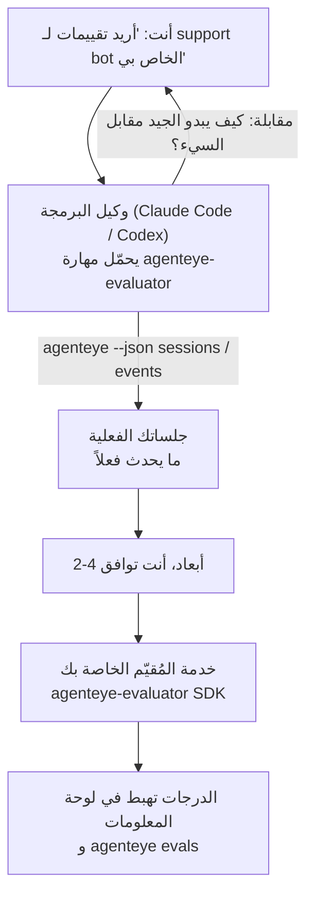

---
---
title: "مهارة وكيل Failproof AI Observability Evaluator"
description: "انتقل من \"أعتقد أن وكيلنا سيء أحياناً\" إلى خدمة تقييم مُنتشرة، مع قيام وكيل البرمجة بكل من القرار والبناء."
---


انتقل من *"أعتقد أن وكيلنا سيء أحياناً"* إلى خدمة تقييم مُنتشرة، مع قيام وكيل البرمجة بكل من القرار والبناء. **مهارة Failproof AI Observability evaluator** (`agenteye-evaluator`) هي *مهارة وكيل*: مجلد صغير من التعليمات يحمّله وكيل برمجة مثل Claude Code أو Codex عند الحاجة. تعلّم الوكيل كيفية تحديد أي أبعاد جودة تستحق التتبع لـ *وكيلك*، ثم كتابة واختبار ونشر [خدمة المُقيّم](/ar/agenteye/evaluation-suite) التي تقيّمها.

إنها **ليست** محدد درجات مستضاف، ولا سجل تحمّل عليه، ولا نظام إضافات. يبقى المُقيّم خدمة HTTP خاصة بك على البنية الأساسية الخاصة بك، بالضبط كما هو موضح في دليل [مجموعة التقييم](/ar/agenteye/evaluation-suite). تعلّم المهارة وكيلك فقط ليبنيها بشكل جيد، لذلك كل ما تفعله يمكنك أن تفعله بنفسك بكتابة الكود ذاته.

---

## الجزء الصعب هو تحديد ما يجب تقييمه

سطح SDK صغير — ديكوريتور ونموذجان — والوكيل يمكنه كتابة ذلك من [العقد](/ar/agenteye/evaluation-suite#http-contract) وحده. هذا ليس حيث يفشل المُقيّمون. يفشلون لأنهم يقيّمون الشيء الخطأ، والمُقيّم الذي يقيّم الشيء الخطأ أسوأ من لا شيء: فهو ينتج لوحة معلومات يتعلم الجميع تجاهلها.

لذلك معظم المهارة هي الجزء قبل وجود أي كود. يحتوي على الوكيل الذي يقابلك (*"اصف تشغيلاً سار بشكل جيد؛ الآن واحداً سار بشكل سيء"*) ثم يسحب جلساتك الفعلية من خلال [`agenteye` CLI](/ar/agenteye/cli) ويقرأها من البداية إلى النهاية. هذان النصفان عادة ما يختلفان، والفجوة هي النقطة: ما تنوي قياسه مقابل ما يمكن لنصوصك فعلاً دعمه. يبقى البعد فقط إذا كان **قابلاً للحساب** من الأحداث و**تمييزياً** — إذا حقق 0.9 على جلستك الجيدة والسيئة معاً، فهو لا يعلم شيئاً ويتم حذفه.

ما يعود عليك هو اقتراح 2-4 أبعاد مع التفكير المرفق، لتصديق عليها قبل كتابة سطر واحد.



---

## كيفية ارتباطها بأجزاء التقييم الأخرى

أربعة مستندات تغطي التقييم، وتسلمها لبعضها البعض بالترتيب:

| الصفحة | ما هي | استخدمها عندما |
|---|---|---|
| **[التقييمات](/ar/agenteye/evaluations)** | الميزة: درجات على شبكة الجلسات، لوحات المعلومات، إعادة تقييم | تريد معرفة ما يحصل عليه التقييم التلقائي |
| **[مجموعة التقييم](/ar/agenteye/evaluation-suite)** | عقد HTTP، SDK، متغيرات بيئة الخادم | تقوم بتطبيق أو تصحيح المُقيّم بنفسك |
| **مهارة المُقيّم** (هذا المستند) | باب باللغة الطبيعية لتصميم *وبناء* المقيّم | تريد الانتقال من "أريد تقييمات" إلى خدمة قيد التشغيل |
| **[مهارة CLI](/ar/agenteye/cli-skill)** | باب باللغة الطبيعية على `agenteye` CLI | تريد *قراءة* الدرجات التي لديك بالفعل |
| **[مهارة Python SDK](/ar/agenteye/python-sdk-skill)** | باب باللغة الطبيعية على جهاز وكيلك | وكيلك لا ينبت جلسات حتى الآن — لا يوجد شيء لتقييمه |

### مقابل مهارة CLI: البناء مقابل القراءة

المهارتان متعمداً غير متداخلتان، والتثبيت كليهما هو الإعداد الطبيعي — يختار الوكيل بينهما بناءً على ما تطلبه:

- **`agenteye-evaluator`** (هذا المستند) يبني الشيء الذي *ينتج* الدرجات. تنتهي وظيفته عندما تهبط الدرجات للمرة الأولى.
- **[`agenteye-cli`](/ar/agenteye/cli-skill)** يقرأ درجات موجودة بالفعل (`agenteye evals`). *"هل انخفضت الجودة هذا الأسبوع؟"* هو سؤاله، وليس سؤال هذه المهارة.

---

## المتطلبات الأساسية

1. **`agenteye` CLI مثبت وقيد التسجيل** (`pipx install agenteye`، ثم `agenteye login`). تعتمد المهارة عليها مرتين: لسحب الجلسات الفعلية التي تصممها، والتأكيد من أن درجاتك هبطت في النهاية. يحتاج تسجيلك إلى `events:read`, بالإضافة إلى `evaluations:read` للتحقق النهائي. كما هو الحال مع مهارة CLI، **لا يمكنها** إكمال تسجيل دخول الرمز أحادي الاستخدام عبر البريد الإلكتروني نيابة عنك.
2. **مكان للمُقيّم ليعيش فيه.** يتم بناؤه في صورة ويعمل كخدمة طويلة الأجل، لذا فهو يحتاج إلى ريبو حقيقي، وليس ملف مؤقت. غالباً ما تعيش المُقيّمون في ريبو خاصة بهم، منفصلة عن الوكيل الذي يتم تقييمه — تبحث المهارة عن ريبو موجود وتطلب قبل إنشاء ريبو جديد.
3. **عجلة SDK `agenteye-evaluator`** — اقرأ القسم التالي قبل أن يبدأ وكيلك بكتابة أوامر `pip`.

---

## أين تحصل عليها

تُنشر المهارة في مجموعة المهارات العامة في Failproof AI:

**[github.com/FailproofAI/skills](https://github.com/FailproofAI/skills)** → [`skills/agenteye-evaluator/`](https://github.com/FailproofAI/skills/tree/main/skills/agenteye-evaluator)

المستودع عام والمهارة لا تحتاج إلى بيانات اعتماد خاصة بها — فهي فقط تشغيل `agenteye` CLI مع جلسة *أنت* قيد التسجيل، وتكتب كوداً في *ريبوك* الخاص. لاحظ أنها تُشحن كمجلد خاص بها وهي **ليست** داخل حزمة `pipx install agenteye`، لذا لا تبحث عنها هناك.

## تثبيت المهارة

أسرع طريق هي CLI [`skills`](https://skills.sh)، الذي يحضر المجلد وينزله حيث يبحث وكيلك:

```bash
# Claude Code، هذا المشروع فقط
npx skills add FailproofAI/skills --skill agenteye-evaluator -a claude-code

# كل مشروع (يثبت إلى ~/.claude/skills/)
npx skills add FailproofAI/skills --skill agenteye-evaluator -a claude-code -g --copy

# Codex بدلاً من ذلك
npx skills add FailproofAI/skills --skill agenteye-evaluator -a codex
```

ثم أدره مثل أي مهارة أخرى:

```bash
npx skills list -a claude-code           # ما هو مثبت
npx skills update agenteye-evaluator     # اسحب أحدث إصدار
npx skills remove agenteye-evaluator     # أزله
```

تفضل التثبيت يدوياً؟ مهارة وكيل هي مجرد مجلد يحتوي على `SKILL.md` (بالإضافة إلى مراجع اختيارية)، لذا نسخه يعمل أيضاً:

- **Claude Code**: ضع مجلد `agenteye-evaluator/` في `~/.claude/skills/` (كل مشروع) أو `<your-repo>/.claude/skills/` (هذا الريبو فقط). Claude Code يكتشفه تلقائياً — تحقق مع قائمة `/skills`، أو اطلب فقط تقييمات.
- **Codex (OpenAI)**: يقرأ Codex نفس `SKILL.md`. يعيّن `agents/openai.yaml` المرفق `allow_implicit_invocation: true`، لذا يختار Codex تلقائياً المهارة عندما تطابق المهمة؛ وإلا استدعِها بشكل صريح كـ `$agenteye-evaluator`.

---

## SDK ليس على PyPI العام

> **تحذير:** اقرأ هذا قبل السماح لوكيل بتثبيت SDK.

المهارة عامة؛ SDK الذي تقوده ليس كذلك. `agenteye-evaluator` يُشحن فقط كقطعة إصدار خاصة، وخلافاً لـ `agenteye`، الاسم **غير مطالب به على PyPI العام** — لذا `pip install agenteye-evaluator` بسيط قد يسحب حزمة شخص غريب إلى الخدمة التي تقرأ نصوصك الإنتاجية. هذه مشكلة سلسلة التوريد، وليست خطأ إملائي.

تعرف المهارة هذا وتعمل لأسفل سلم التثبيت بدلاً من ذلك، متوقفة عند أول درجة تنطبق: مصدر أحادي الريبو إذا كنت داخل ريبو AgentEye، وإلا عجلة الإصدار الخاصة من GitHub Releases (تحتاج إلى وصول)، وإذا لم تكن متاحة فإنها **توقف وتخبرك بطلب عجلة من جهة Failproof AI الخاصة بك** بدلاً من الارتجال.

لذا إذا اقترح وكيلك `pip install agenteye-evaluator` بسيطة من PyPI العام، هذا يشير إلى أن المهارة لم تحمّل أبداً. توقف هناك وتحقق من تثبيتها.

---

## ما يمكنك طلبه

جولة ذهاب وإياب حقيقية تبدأ بطلب غامض وتنتهي بتصميم موقّع، وليس بكود:

```text
أنت   ▸ أريد تقييمات لـ support bot الخاص بنا. أعتقد أنه سيء أحياناً.

وكيل ▸ قبل أن أكتب أي شيء: اصف تشغيلاً سار بشكل جيد،
        وواحداً سار بشكل سيء.

أنت   ▸ جيد: يجيب من المستندات. سيء: يختلق أشياء،
        أو يستسلم ويقول "اتصل بالدعم".

وكيل ▸ تشغيل: agenteye --json sessions --status error --since 7d
        قراءة 5 جلسات، بما في ذلك اثنتان كنت ستسميهما سيئة.

        كلماتك تقول دقة وتحويل. تتفق النصوص على التحويل
        (اثنتان من 5 تنتهي مع تحويل دعم، وهو واضح في
        model_response.content)، لكن الدقة تحتاج حقيقة
        أرضية لا يحملها حدثك.

        إذن كنت أقيّم ثلاثة أشياء:
          - deflection      قواعد، رخيص، يفصل تشغيلاتك
          - tool_efficiency قواعد، يمسك حلقة الإعادة في run-004
          - groundedness    قاضي LLM: هل كل مطالبة في المستندات التي سحبتها؟

        كان "factuality" يحتاج حقيقة أرضية ليس لدينا؛ groundedness
        هو أقرب شيء يمكن لنصوصك فعلاً دعمه.
        بخير مع تلك الأسماء الثلاثة؟ إعادة التسمية لاحقاً تقسم التاريخ.

أنت   ▸ نعم

وكيل ▸ لا يوجد مُقيّم في هذا الريبو. هل يجب أن أنشئ واحداً هنا، أم
        لديك واحد في مكان آخر؟
```

من هناك يكتب الأبعاد القائمة على القواعد أولاً (مجاني، فوري، حتمي)، يختبرها مقابل جلسة حقيقية مأخوذة بما في ذلك الفارغة والتي لم تنتهِ أبداً التي تحطم المُقيّمين الساذجين، ولا تصل فقط إلى قاضي LLM على البعد الموضوعي. يعرف حدود [المرسل](/ar/agenteye/evaluation-suite#configuring-the-server) — مهلة 30 ثانية وثمانية استدعاءات متزامنة بنطاق النشر — لذا إذا لم يناسب القاضي بشكل موثوق، يذهب غير متزامن مع `JobPending` بدلاً من السماح لقاضيك بالإلغاء وإعادة المحاولة خمس مرات بخمسة أضعاف التكلفة.

ثم ينشر، يعيّن متغيري بيئة الخادم، ويؤكد مع `agenteye --json evals --session-id <id>` أن الدرجات هبطت فعلاً. هبوط الدرجات هو الدليل الوحيد.

---

## ما يجب الانتباه له

- **أسماء الأبعاد قريبة من الدائمة.** مفاتيح الدرجات سلاسل اختيارية والمنصة تتجه أينما أرسلت، مما يعني لا شيء يصحح لاحقاً خياراً سيئاً. أعد التسمية لاحقاً وينقسم التاريخ: الجلسات القديمة تحتفظ بالمفتاح القديم وينقطع الاتجاه. هذا هو السبب في حصول المهارة على موافقة صريحة قبل كتابة الكود — خذ هذا الحث بجدية.
- **الدعائم هي نصوص إنتاجية حقيقية.** يعني التصميم مقابل جلسات حقيقية سحبها إلى الديسك، ويمكنها أن تحتوي بيانات العملاء. تطلب المهارة قبل التعهد بهم إلى git؛ إذا كنت غير متأكد، احفظ `fixtures/` خارج الريبو وليترك كل مطور سحب الخاص به.
- **الوكيل يكتب وينشر خدمة تقرأ كل نص.** يتصرف كأنك، محدود بأذونات تسجيل دخول CLI الخاصة بك، لكن مراجعة المُقيّم مثل أي كود آخر يلمس بيانات الإنتاج.

---

## الخطوات التالية

- **[مجموعة التقييم](/ar/agenteye/evaluation-suite)**: عقد HTTP، SDK، ومتغيرات بيئة الخادم التي تقوم المهارة بتكوينها.
- **[التقييمات](/ar/agenteye/evaluations)**: حيث تظهر الدرجات مرة تهبط.
- **[مهارة CLI](/ar/agenteye/cli-skill)**: المهارة الشقيقة، لقراءة النتائج بدلاً من بناء المُقيّم.
- **[CLI](/ar/agenteye/cli)**: مرجع الأوامر خلف بيانات الجلسة التي تصممها المهارة.