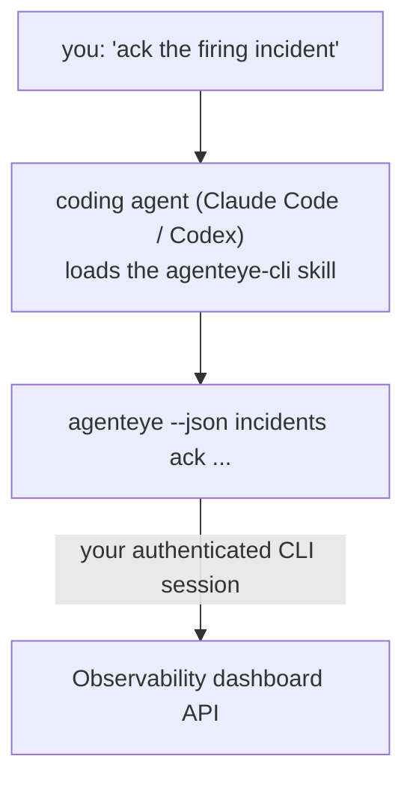

Fragen Sie Ihren Coding-Agenten *„Ist heute irgendetwas kaputt?"* und lassen Sie ihn die Antwort aus Ihren Live-Failproof AI Observability-Daten beziehen – ohne Befehle auswendig lernen zu müssen. Der **Failproof AI Observability CLI Skill** (`agenteye-cli`) ist ein *Agent Skill*: ein kleiner Ordner mit Anweisungen, den ein Coding-Agent wie Claude Code oder Codex bei Bedarf lädt. Er bringt dem Agenten bei, Ihre Observability-Deployment über die [`agenteye` CLI](/de/agenteye/cli) anhand von Anfragen in normalem Englisch zu bedienen – etwa *„Gib CI einen Schlüssel, der nur Events pushen kann"* oder *„Bestätige den ausgelösten Incident und weise ihn mir zu."*

Es handelt sich **nicht** um einen Dienst oder eine separate Binärdatei; es gibt nichts zu deployen. Es setzt auf der bereits installierten CLI auf: Der Agent ruft `agenteye --json …` auf, analysiert das saubere JSON und antwortet Ihnen in Prosaform. Alles, was er tun kann, könnten Sie selbst durch Eingabe derselben Befehle tun.

---

## Verhältnis zu den anderen Failproof AI Observability-Schnittstellen

Failproof AI Observability bietet Ihnen vier Wege, um auf dieselben Daten und Steuerungsmöglichkeiten zuzugreifen. Sie ergänzen sich gegenseitig:

| Schnittstelle | Was es ist | Wo es läuft | Verwenden Sie es, wenn |
|---|---|---|---|
| **[CLI](/de/agenteye/cli)** | Die Befehls-/Flag-Referenz für `agenteye` | Ihr Terminal | Sie einen bestimmten Befehl ausführen oder skripten möchten |
| **[CLI-Rezepte](/de/agenteye/cli-recipes)** | Copy-paste-`jq`/Pipeline-Muster | Ihr Terminal / Skripte | Sie die CLI in Automatisierungen einbinden |
| **CLI Skill** (dieses Dokument) | Eine natürlichsprachige Eingabetür zur CLI | Ihr Coding-Agent, auf Ihrer Workstation | Sie einfach fragen und den Agenten den Befehl wählen lassen möchten |
| **[Evaluator Skill](/de/agenteye/evaluator-skill)** | Ein verwandter Skill, der Ihren Scoring-Dienst entwirft und aufbaut | Ihr Coding-Agent, auf Ihrer Workstation | Sie Eval-Scores *erstellen* möchten, anstatt sie zu lesen |
| **[Python SDK Skill](/de/agenteye/python-sdk-skill)** | Ein verwandter Skill, der Ihren Agenten instrumentiert, damit er überhaupt Telemetrie aussendet | Ihr Coding-Agent, auf Ihrer Workstation | Ihr Agent die Events *erzeugen* soll, die dieser Skill liest |
| **[In-Dashboard-KI-Assistent](/de/agenteye/assistant)** | Ein im Dashboard eingebetteter Chat | Serverseitig (im Dashboard) | Sie Q&A über Ihre Daten direkt im Dashboard wünschen |

Der Skill selbst hat keine eigenen Rechte; er übersetzt lediglich Ihre Worte in CLI-Aufrufe, die als Sie ausgeführt werden:



### vs. dem In-Dashboard-KI-Assistenten: ein wichtiger Unterschied

Dies sind zwei verschiedene Tools mit sehr unterschiedlichem Wirkungsradius:

- Der **In-Dashboard-KI-Assistent** ([KI-Assistent](/de/agenteye/assistant)) ist ein im Dashboard eingebetteter Chat, der vom Agenten-Dienst unterstützt wird. Er ist **lesend plus genehmigungspflichtig beim Erstellen**: Er kann gespeicherte Abfragen und Dashboards entwerfen, aber jeder Schreibvorgang pausiert für Ihre ausdrückliche Klickgenehmigung, und er löscht nie. Er ist durch die Berechtigung `agent:use` geschützt und sieht immer nur Daten für die Organisation, die Sie gerade ansehen.
- Der **CLI Skill** läuft auf *Ihrer* Workstation innerhalb *Ihres* Coding-Agenten und steuert die `agenteye` CLI **als Sie**. Er kann die **gesamte CLI-Oberfläche nutzen, einschließlich Mutationen** (API-Schlüssel erstellen/rotieren/deaktivieren, Org-Einstellungen ändern, Incidents auflösen, gespeicherte Abfragen löschen) – begrenzt nur durch die Berechtigungen Ihres CLI-Logins. Gehen Sie damit genauso sorgfältig um, wie Sie diese Befehle manuell eingeben würden.

---

## Voraussetzungen

1. Die **`agenteye` CLI ist installiert** und im `PATH` (siehe [CLI](/de/agenteye/cli)-Referenz: `pipx install agenteye`).
2. Ihre **Dashboard-URL** ist gesetzt (`AGENTEYE_DASHBOARD_URL`, oder der Agent übergibt `--base-url`).
3. Eine **eingeloggte Sitzung**: Führen Sie `agenteye login` selbst zuerst aus. Der Skill **kann** den per E-Mail versendeten Einmalcode-Login nicht für Sie abschließen; er wird Sie auffordern, `agenteye login` auszuführen, wenn die Sitzung fehlt oder abgelaufen ist (CLI-Exit-Code `4`).

---

## Wo Sie ihn bekommen

Der Skill ist in Failproof AIs öffentlicher Skills-Sammlung veröffentlicht:

**[github.com/FailproofAI/skills](https://github.com/FailproofAI/skills)** → [`skills/agenteye-cli/`](https://github.com/FailproofAI/skills/tree/main/skills/agenteye-cli)

Nichts daran ist gesperrt – das Repository ist öffentlich, und der Skill benötigt keine eigenen Anmeldeinformationen, da er nur die **öffentliche** `agenteye` CLI gegen *Ihr* Dashboard treibt und dabei die Sitzung verwendet, mit der *Sie* eingeloggt sind. Sie müssen niemanden darum bitten.

Beachten Sie, dass er als eigener Ordner ausgeliefert wird und **nicht** im `pipx install agenteye`-Paket enthalten ist – suchen Sie dort also nicht danach.

## Den Skill installieren

Der schnellste Weg ist die [`skills`](https://skills.sh) CLI, die den Ordner holt und dort ablegt, wo Ihr Agent sucht:

```bash
# Claude Code, nur dieses Projekt
npx skills add FailproofAI/skills --skill agenteye-cli -a claude-code

# jedes Projekt (installiert nach ~/.claude/skills/)
npx skills add FailproofAI/skills --skill agenteye-cli -a claude-code -g --copy

# stattdessen Codex
npx skills add FailproofAI/skills --skill agenteye-cli -a codex
```

Verwalten Sie ihn dann wie jeden anderen Skill:

```bash
npx skills list -a claude-code      # was ist installiert
npx skills update agenteye-cli      # neueste Version holen
npx skills remove agenteye-cli      # entfernen
```

Möchten Sie lieber manuell installieren? Ein Agent Skill ist nur ein Ordner mit einer `SKILL.md` (plus optionalen Referenzen), daher funktioniert auch das Kopieren:

- **Claude Code**: Legen Sie den Ordner `agenteye-cli/` in `~/.claude/skills/` (jedes Projekt) oder `<your-repo>/.claude/skills/` (nur dieses Repository). Claude Code erkennt ihn automatisch – überprüfen Sie es mit der `/skills`-Liste oder stellen Sie einfach eine Frage, die zu seiner Beschreibung passt.
- **Codex (OpenAI)**: Codex liest dieselbe `SKILL.md`. Das enthaltene `agents/openai.yaml` setzt `allow_implicit_invocation: true`, sodass Codex den Skill automatisch auswählt, wenn eine Aufgabe passt; andernfalls rufen Sie ihn explizit als `$agenteye-cli` auf.

---

## Sicherheit: Mutationen zeigen KEINE Bestätigungsabfrage, wenn ein Agent die CLI ausführt

> **Warnung:** Lesen Sie dies, bevor Sie einen Agenten Änderungen vornehmen lassen.

Die `agenteye` CLI fragt normalerweise *„Sind Sie sicher?"* vor einer destruktiven Aktion. Sie **überspringt diese Bestätigung automatisch, wenn sie nicht an ein Terminal angehängt ist (was genau der Fall ist, wenn ein Coding-Agent sie ausführt), und `--json` überspringt sie ebenfalls.** Die Sicherheitsabfrage wird für den Agenten daher **nicht** ausgelöst.

Der Skill ist so geschrieben, dass er dies ausgleicht: Er ist angewiesen, den genauen Befehl anzugeben, den er ausführen wird, und Ihre ausdrückliche **Zustimmung vor jeder Zustandsänderung** einzuholen. Halten Sie diese Disziplin aufrecht. Wenn Sie Failproof AI Observability über einen Agenten steuern, *sind Sie* der Bestätigungsschritt. Die zustandsändernden Befehle, auf die Sie achten sollten:

- `keys create` / `update` / `disable` / `regenerate`
- `users create` / `update` / `disable` / `enable`
- `settings set`
- `alerts create` / `update` / `delete` / `test`
- die schreibenden `incidents`-Unterbefehle: `ack` / `assign` / `resolve` / `open` / `comment-add` / `comment-delete` / `subscribe` / `unsubscribe`
- `query create` / `update` / `delete`
- `agent rename` / `delete`
- `orgs switch`

Alles unter **Observe** (`events`, `sessions`, `evals`, `errors`, `list`, `whoami`, `orgs list/current/perms`) ist schreibgeschützt und ändert nichts.

Da der Agent **als Sie** agiert, kann er nur das tun, was Ihr Login erlaubt; Berechtigungen werden **pro Org** aufgelöst (siehe [API-Schlüssel](/de/agenteye/api-keys)). Ein Befehl, für den Sie keine Berechtigung haben, gibt Exit-Code `5` mit dem genauen Berechtigungsnamen zurück, sodass der Agent Ihnen genau sagen kann, was Sie einen Administrator fragen müssen, anstatt undurchsichtig zu scheitern.

---

## Was Sie fragen können

So sieht ein echter Ablauf aus – zuerst eine Leseanfrage, dann eine Änderung, die auf Ihre Zustimmung wartet:

```text
you   ▸ Is anything broken in the last day?

agent ▸ Running: agenteye --json errors --since 24h --aggregate
        3 error types in the last 24h. The biggest is TimeoutError
        (18 hits, all on the checkout-agent), then RateLimited (5).
        Want the failing sessions for TimeoutError?

you   ▸ Give CI a key that can only push events.

agent ▸ This creates an API key. I'll run:
          agenteye keys create ci --add events:add
        OK to proceed?

you   ▸ yes

agent ▸ Done. Key "ci" created with events:add only.
        The secret is shown only once, so store it now. I can't reprint it.
```

Der Skill ordnet jede natürlichsprachige Absicht dem richtigen `agenteye`-Befehl zu, ermittelt dabei zuerst gültige Werte (`list <kind>`, `whoami`), rät nicht und gibt den genauen Befehl vor jeder Änderung an. Weitere Beispiele:

- *„Ist irgendetwas kaputt / fehlgeschlagen in den letzten 24 Stunden?"* → `errors --since 24h --aggregate`, dann eine Aufschlüsselung.
- *„Warum ist Sitzung `run-001` fehlgeschlagen?"* → `events --session-id run-001 --all` + `evals --session-id run-001`.
- *„Wie entwickelt sich die Qualität diese Woche?"* → `evals --aggregate --since 7d`, dann Drilldown in schlecht bewertete Läufe.
- *„Gib CI einen Schlüssel, der nur Events pushen kann."* → `keys create ci --add events:add` (der Befehl wird angegeben, dann erstellt und das einmalige Secret erfasst).
- *„Wer hat Zugriff? Mache Dana schreibgeschützt."* → `users list` → `users update dana@… --permission-set read-only` (nach Ihrer Bestätigung).
- *„Bestätige den ausgelösten Incident und weise ihn mir zu."* → `incidents list --state firing` → `incidents ack <id>` / `incidents assign <id> you@…`.

Die genauen Befehle, Flags und JSON-Strukturen hinter diesen Beispielen finden Sie in der [CLI](/de/agenteye/cli)-Referenz und den [CLI-Rezepten für Agenten](/de/agenteye/cli-recipes).

---

## Nächste Schritte

- **[CLI](/de/agenteye/cli)**: vollständige Befehls- und Flag-Referenz für `agenteye`.
- **[CLI-Rezepte für Agenten](/de/agenteye/cli-recipes)**: Copy-paste-`jq`-Muster und Exit-Code-Behandlung.
- **[Evaluator Agent Skill](/de/agenteye/evaluator-skill)**: der verwandte Skill zum Aufbau des Evaluators, dessen Scores `agenteye evals` liest.
- **[Python SDK Agent Skill](/de/agenteye/python-sdk-skill)**: der verwandte Skill zum Instrumentieren eines Agenten, damit er die Telemetrie aussendet, die `agenteye` liest.
- **[KI-Assistent](/de/agenteye/assistant)**: der In-Dashboard-Assistent (nicht mit diesem Terminal-Skill zu verwechseln).
- **[API-Schlüssel](/de/agenteye/api-keys)**: das Berechtigungsmodell pro Org, das den Wirkungsbereich des Skills begrenzt.