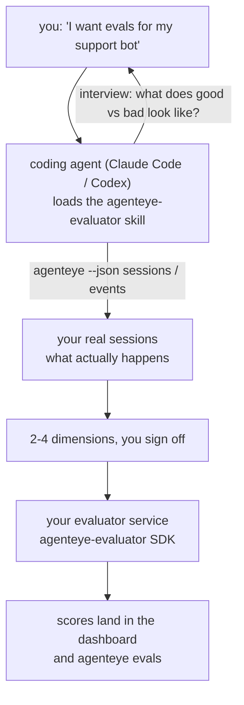

Von *„Ich glaube, unser Agent ist manchmal schlecht"* zu einem produktiven Scoring-Service – während dein Coding-Agent sowohl die Konzeption als auch die Umsetzung übernimmt. Der **Failproof AI Observability Evaluator Skill** (`agenteye-evaluator`) ist ein *Agent Skill*: ein kleines Verzeichnis mit Anweisungen, das ein Coding-Agent wie Claude Code oder Codex bei Bedarf lädt. Er bringt dem Agenten bei, herauszufinden, welche Qualitätsdimensionen es für *deinen* Agenten zu verfolgen lohnt, und dann den [Evaluator-Service](/de/agenteye/evaluation-suite) zu schreiben, zu testen und zu deployen, der sie bewertet.

Es handelt sich **nicht** um einen gehosteten Scorer, eine Registry zum Hochladen oder ein Plugin-System. Dein Evaluator bleibt dein eigener HTTP-Service auf deiner eigenen Infrastruktur, genau wie im [Evaluation suite](/de/agenteye/evaluation-suite)-Leitfaden beschrieben. Der Skill lehrt deinen Agenten nur, ihn gut zu bauen – alles, was er tut, könntest du selbst tun, indem du denselben Code schreibst.

---

## Das Schwierige ist zu entscheiden, was bewertet werden soll

Die SDK-Oberfläche ist klein – ein Decorator und zwei Modelle – und ein Agent kann das allein aus dem [Contract](/de/agenteye/evaluation-suite#http-contract) herleiten. Daran scheitern Evaluatoren nicht. Sie scheitern daran, dass sie das Falsche bewerten, und ein Evaluator, der das Falsche bewertet, ist schlimmer als keiner: Er produziert ein Dashboard, das alle lernen zu ignorieren.

Deshalb liegt der Schwerpunkt des Skills auf dem Teil, bevor überhaupt Code entsteht. Der Agent interviewt dich (*„Beschreib einen Lauf, der gut war; jetzt einen, der schlecht war"*), zieht dann deine echten Sessions durch die [`agenteye` CLI](/de/agenteye/cli) und liest sie von Anfang bis Ende. Diese beiden Hälften widersprechen sich meistens, und genau das ist der Punkt: was du zu messen beabsichtigst versus was deine Transcripts tatsächlich hergeben. Eine Dimension überlebt nur, wenn sie aus den Events **berechenbar** und **diskriminierend** ist – wenn sie sowohl für deinen guten als auch für deinen schlechten Lauf 0,9 ergibt, lehrt sie nichts und wird gestrichen.

Das Ergebnis ist ein Vorschlag von 2–4 Dimensionen mit der zugehörigen Begründung, dem du zustimmen musst, bevor eine Zeile Code geschrieben wird.



---

## Beziehung zu den anderen Evaluation-Komponenten

Vier Docs behandeln das Scoring und gehen in dieser Reihenfolge ineinander über:

| Seite | Was es ist | Verwende es, wenn |
|---|---|---|
| **[Evaluations](/de/agenteye/evaluations)** | Das Feature: Scores im Sessions-Grid, Dashboards, Re-evaluate | Du wissen möchtest, was automatisches Scoring dir bringt |
| **[Evaluation suite](/de/agenteye/evaluation-suite)** | Der HTTP-Contract, das SDK, die Server-Umgebungsvariablen | Du den Evaluator selbst implementierst oder debuggst |
| **Evaluator Skill** (dieses Dokument) | Ein sprachbasierter Einstieg in das Designen *und* Bauen des Scorers | Du von „Ich will Evals" zu einem laufenden Service kommen möchtest |
| **[CLI skill](/de/agenteye/cli-skill)** | Ein sprachbasierter Einstieg in die `agenteye` CLI | Du die bereits vorhandenen Scores *lesen* möchtest |
| **[Python SDK skill](/de/agenteye/python-sdk-skill)** | Ein sprachbasierter Einstieg in die Instrumentierung deines Agenten | Dein Agent noch keine Sessions emittiert – es gibt noch nichts zu bewerten |

### vs. CLI Skill: Bauen versus Lesen

Die beiden Skills überschneiden sich bewusst nicht, und beide zu installieren ist der Normalfall – der Agent wählt je nach Anfrage zwischen ihnen:

- **`agenteye-evaluator`** (dieses Dokument) baut das, was Scores *erzeugt*. Seine Aufgabe endet, wenn Scores zum ersten Mal eintreffen.
- **[`agenteye-cli`](/de/agenteye/cli-skill)** liest bereits vorhandene Scores (`agenteye evals`). *„Hat die Qualität diese Woche nachgelassen?"* ist seine Frage, nicht die dieses Skills.

---

## Voraussetzungen

1. **Die `agenteye` CLI installiert und eingeloggt** (`pipx install agenteye`, dann `agenteye login`). Der Skill nutzt sie an zwei Stellen: um die echten Sessions zu holen, gegen die er designed, und um am Ende zu bestätigen, dass deine Scores angekommen sind. Dein Login benötigt `events:read`, sowie `evaluations:read` für die abschließende Prüfung. Wie beim CLI Skill kann er das per E-Mail zugesandte Einmal-Code-Login **nicht** für dich abschließen.
2. **Einen Ort für den Evaluator.** Er wird in ein Image gebaut und als langlebiger Service betrieben, benötigt also ein echtes Repo, keine temporäre Datei. Evaluatoren leben oft in einem eigenen Repo, getrennt vom bewerteten Agenten – der Skill sucht nach einem vorhandenen und fragt, bevor er ein neues anlegt.
3. **Das `agenteye-evaluator` SDK Wheel** – lies den nächsten Abschnitt, bevor dein Agent `pip`-Befehle einzutippen beginnt.

---

## Bezugsquelle

Der Skill ist in Failproof AI's öffentlicher Skills-Sammlung veröffentlicht:

**[github.com/FailproofAI/skills](https://github.com/FailproofAI/skills)** → [`skills/agenteye-evaluator/`](https://github.com/FailproofAI/skills/tree/main/skills/agenteye-evaluator)

Das Repository ist öffentlich und der Skill benötigt keine eigenen Zugangsdaten – er steuert nur die `agenteye` CLI mit dem Session, mit dem *du* eingeloggt bist, und schreibt Code in *dein* Repo. Beachte, dass er als eigenes Verzeichnis ausgeliefert wird und **nicht** im `pipx install agenteye`-Paket enthalten ist – such ihn dort also nicht.

## Den Skill installieren

Der schnellste Weg ist die [`skills`](https://skills.sh) CLI, die das Verzeichnis abruft und dort ablegt, wo dein Agent sucht:

```bash
# Claude Code, nur dieses Projekt
npx skills add FailproofAI/skills --skill agenteye-evaluator -a claude-code

# jedes Projekt (installiert nach ~/.claude/skills/)
npx skills add FailproofAI/skills --skill agenteye-evaluator -a claude-code -g --copy

# stattdessen Codex
npx skills add FailproofAI/skills --skill agenteye-evaluator -a codex
```

Anschließend verwaltest du ihn wie jeden anderen Skill:

```bash
npx skills list -a claude-code           # was installiert ist
npx skills update agenteye-evaluator     # neueste Version holen
npx skills remove agenteye-evaluator     # entfernen
```

Bevorzugst du manuelle Installation? Ein Agent Skill ist nur ein Verzeichnis mit einer `SKILL.md` (plus optionalen Referenzen), das Kopieren funktioniert also ebenfalls:

- **Claude Code**: Lege das `agenteye-evaluator/`-Verzeichnis in `~/.claude/skills/` (jedes Projekt) oder `<dein-repo>/.claude/skills/` (nur dieses Repo). Claude Code erkennt es automatisch – prüfe mit der `/skills`-Liste oder frage einfach nach Evals.
- **Codex (OpenAI)**: Codex liest dieselbe `SKILL.md`. Die mitgelieferte `agents/openai.yaml` setzt `allow_implicit_invocation: true`, sodass Codex den Skill automatisch auswählt, wenn eine Aufgabe passt; andernfalls rufst du ihn explizit als `$agenteye-evaluator` auf.

---

## Das SDK ist nicht auf dem öffentlichen PyPI

> **Warnung:** Lies dies, bevor du einen Agenten das SDK installieren lässt.

Der Skill ist öffentlich; das SDK, das er verwendet, ist es nicht. `agenteye-evaluator` wird nur als privates Release-Artefakt ausgeliefert, und anders als `agenteye` ist der Name auf dem öffentlichen PyPI **nicht beansprucht** – ein blankes `pip install agenteye-evaluator` könnte also das Paket eines Fremden in den Service ziehen, der deine Produktions-Transcripts liest. Das ist ein Supply-Chain-Problem, kein Tippfehler.

Der Skill weiß das und arbeitet stattdessen eine Installations-Leiter ab, die beim ersten zutreffenden Schritt stoppt: die Monorepo-Quelle, wenn du im AgentEye-Repo bist, sonst das private Release-Wheel von GitHub Releases (erfordert Zugriff), und wenn keines davon erreichbar ist, **stoppt er und teilt dir mit, deinen Failproof AI-Kontakt nach dem Wheel zu fragen**, anstatt zu improvisieren.

Wenn dein Agent also ein blankes `pip install agenteye-evaluator` von Public PyPI vorschlägt, ist das das Zeichen, dass der Skill nie geladen wurde. Halte dort an und prüfe, ob er installiert ist.

---

## Was du ihn fragen kannst

Ein echter Durchlauf beginnt mit einer vagen Anfrage und endet mit einem abgezeichneten Design, nicht mit Code:

```text
you   ▸ I want evals for our support bot. I think it's sometimes bad.

agent ▸ Before I write anything: describe a run that went well,
        and one that went badly.

you   ▸ Good: it answers from the docs. Bad: it makes stuff up,
        or gives up and says "contact support".

agent ▸ Running: agenteye --json sessions --status error --since 7d
        Reading 5 sessions, including two you'd call bad.

        Your words say factuality and deflection. The transcripts
        agree on deflection (2 of 5 end with a support hand-off,
        and it's plain in model_response.content), but factuality
        needs a ground truth your events don't carry.

        So I'd score three things:
          - deflection      rules, cheap, separates your two runs
          - tool_efficiency rules, catches the retry loop in run-004
          - groundedness    LLM judge: is every claim in the docs it retrieved?

        "factuality" would need ground truth we don't have; groundedness
        is the closest thing your transcripts can actually support.
        OK with those three names? Renaming later splits the history.

you   ▸ yes

agent ▸ No evaluator in this repo. Should I scaffold one here, or do
        you have one elsewhere?
```

Anschließend schreibt er die regelbasierten Dimensionen zuerst (kostenlos, sofort, deterministisch), testet sie gegen eine echte erfasste Session – einschließlich der leeren und nie abgeschlossenen Sessions, die naive Evaluatoren zum Absturz bringen – und greift nur für die subjektive Dimension auf einen LLM-Judge zurück. Er kennt die [Grenzen des Dispatchers](/de/agenteye/evaluation-suite#configuring-the-server) – ein 30-Sekunden-Request-Timeout und 8 gleichzeitige Calls deployment-weit – wenn der Judge nicht zuverlässig hineinpasst, geht er daher asynchron mit `JobPending` vor, anstatt zuzulassen, dass dein Judge fünfmal abgebrochen und mit fünffachen Kosten neu versucht wird.

Dann deployt er, setzt die beiden Server-Umgebungsvariablen und bestätigt mit `agenteye --json evals --session-id <id>`, dass Scores tatsächlich angekommen sind. Das Ankommen der Scores ist der einzige Beweis.

---

## Worauf du achten solltest

- **Dimensionsnamen sind nahezu dauerhaft.** Score-Keys sind beliebige Strings, und die Plattform verfolgt Trends für alles, was du sendest – das bedeutet, nichts downstream korrigiert eine schlechte Wahl. Benennst du sie später um, teilt sich die Historie: Alte Sessions behalten den alten Key und der Trend bricht ab. Deshalb holt sich der Skill explizite Zustimmung, bevor er Code schreibt – nimm diese Aufforderung ernst.
- **Fixtures sind echte Produktions-Transcripts.** Das Design gegen echte Sessions bedeutet, sie auf die Festplatte zu holen, und sie können Kundendaten enthalten. Der Skill fragt, bevor er sie in Git committet; im Zweifelsfall halte `fixtures/` aus dem Repo heraus und lass jeden Entwickler seine eigenen holen.
- **Der Agent schreibt und deployt einen Service, der jeden Transcript liest.** Er handelt als du, gebunden durch die Berechtigungen deines CLI-Logins, aber überprüfe den Evaluator wie jeden anderen Code, der Produktionsdaten berührt.

---

## Nächste Schritte

- **[Evaluation suite](/de/agenteye/evaluation-suite)**: der HTTP-Contract, das SDK und die Server-Umgebungsvariablen, die der Skill konfiguriert.
- **[Evaluations](/de/agenteye/evaluations)**: wo die Scores erscheinen, sobald sie ankommen.
- **[CLI skill](/de/agenteye/cli-skill)**: der Schwester-Skill, zum Lesen von Ergebnissen statt zum Bauen des Scorers.
- **[CLI](/de/agenteye/cli)**: die Befehlsreferenz hinter den Session-Daten, gegen die der Skill designed.