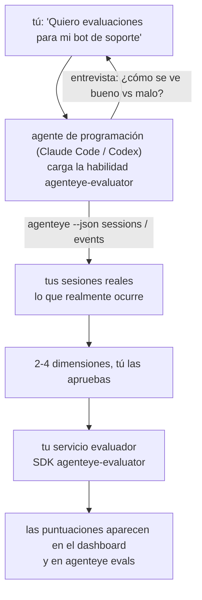

Pasa de *«creo que nuestro agente a veces falla»* a un servicio de puntuación desplegado, con tu agente de programación tomando las decisiones y construyendo la solución. La **habilidad evaluadora de Observabilidad de Failproof AI** (`agenteye-evaluator`) es una *Agent Skill*: una pequeña carpeta de instrucciones que un agente de programación como Claude Code o Codex carga bajo demanda. Le enseña al agente a determinar qué dimensiones de calidad vale la pena rastrear para *tu* agente y luego escribir, probar y desplegar el [servicio evaluador](/es/agenteye/evaluation-suite) que las puntúa.

**No** es un puntuador alojado, un registro al que subir archivos ni un sistema de plugins. Tu evaluador permanece como tu propio servicio HTTP en tu propia infraestructura, exactamente como se describe en la guía de la [Suite de evaluación](/es/agenteye/evaluation-suite). La habilidad solo enseña a tu agente a construirlo bien, de modo que todo lo que hace, podrías hacerlo tú mismo escribiendo el mismo código.

---

## La parte difícil es decidir qué puntuar

La superficie del SDK es pequeña — un decorador y dos modelos — y un agente puede escribirla a partir del [contrato](/es/agenteye/evaluation-suite#http-contract) por sí solo. Ahí no es donde fallan los evaluadores. Fallan porque puntúan la cosa equivocada, y un evaluador que puntúa la cosa equivocada es peor que ninguno: produce un dashboard que todos aprenden a ignorar.

Por eso la mayor parte de la habilidad es la etapa previa a que exista cualquier código. Hace que el agente te entreviste (*«describe una ejecución que salió bien; ahora una que salió mal»*), luego recorre tus sesiones reales a través de la [CLI `agenteye`](/es/agenteye/cli) y las lee de principio a fin. Esas dos mitades suelen no coincidir, y la brecha es precisamente el punto: lo que pretendes medir frente a lo que tus transcripciones pueden respaldar realmente. Una dimensión solo sobrevive si es **computable** a partir de los eventos y **discriminante** — si puntúa 0,9 tanto en tu ejecución buena como en la mala, no enseña nada y se elimina.

Lo que se devuelve es una propuesta de 2 a 4 dimensiones con el razonamiento adjunto, para que la apruebes antes de que se escriba una sola línea.



---

## Su relación con las demás piezas de evaluación

Cuatro documentos cubren la puntuación, y se encadenan entre sí en orden:

| Página | Qué es | Úsala cuando |
|---|---|---|
| **[Evaluaciones](/es/agenteye/evaluations)** | La funcionalidad: puntuaciones en la cuadrícula de sesiones, dashboards, re-evaluación | Quieres saber qué te aporta la puntuación automática |
| **[Suite de evaluación](/es/agenteye/evaluation-suite)** | El contrato HTTP, el SDK, las variables de entorno del servidor | Estás implementando o depurando el evaluador tú mismo |
| **Habilidad evaluadora** (este doc) | Una puerta de entrada en lenguaje natural para diseñar *y* construir el puntuador | Quieres pasar de «quiero evaluaciones» a un servicio en ejecución |
| **[Habilidad CLI](/es/agenteye/cli-skill)** | Una puerta de entrada en lenguaje natural para la CLI `agenteye` | Quieres *leer* las puntuaciones que ya tienes |
| **[Habilidad Python SDK](/es/agenteye/python-sdk-skill)** | Una puerta de entrada en lenguaje natural para instrumentar tu agente | Tu agente aún no emite sesiones — no hay nada que puntuar |

### vs. la habilidad CLI: construir versus leer

Las dos habilidades están deliberadamente diseñadas para no solaparse, e instalar ambas es la configuración normal — el agente elige entre ellas según lo que le pidas:

- **`agenteye-evaluator`** (este doc) construye la cosa que *produce* puntuaciones. Su trabajo termina cuando las puntuaciones aparecen por primera vez.
- **[`agenteye-cli`](/es/agenteye/cli-skill)** lee las puntuaciones que ya existen (`agenteye evals`). *«¿Bajó la calidad esta semana?»* es su pregunta, no la de esta habilidad.

---

## Requisitos previos

1. **La CLI `agenteye` instalada e iniciada sesión** (`pipx install agenteye`, luego `agenteye login`). La habilidad la utiliza en dos momentos: para obtener las sesiones reales con las que diseña, y para confirmar que tus puntuaciones llegaron al final. Tu sesión necesita `events:read`, más `evaluations:read` para esa verificación final. Al igual que con la habilidad CLI, **no puede** completar el inicio de sesión con código de un solo uso enviado por correo electrónico en tu lugar.
2. **Un lugar donde alojar el evaluador.** Se construye como una imagen y se ejecuta como un servicio de larga duración, por lo que necesita un repositorio real, no un archivo temporal. Los evaluadores suelen vivir en su propio repositorio, separado del agente que se está puntuando — la habilidad busca uno existente y pregunta antes de crear un andamiaje nuevo.
3. **El wheel del SDK `agenteye-evaluator`** — lee la siguiente sección antes de dejar que tu agente empiece a escribir comandos `pip`.

---

## Dónde conseguirla

La habilidad está publicada en la colección pública de habilidades de Failproof AI:

**[github.com/FailproofAI/skills](https://github.com/FailproofAI/skills)** → [`skills/agenteye-evaluator/`](https://github.com/FailproofAI/skills/tree/main/skills/agenteye-evaluator)

El repositorio es público y la habilidad no necesita credenciales propias — solo maneja la CLI `agenteye` con la sesión *tuya* en la que iniciaste sesión, y escribe código en *tu* repositorio. Ten en cuenta que se distribuye como su propia carpeta y **no** está dentro del paquete `pipx install agenteye`, así que no la busques ahí.

## Instalación de la habilidad

La forma más rápida es la CLI [`skills`](https://skills.sh), que descarga la carpeta y la coloca donde tu agente la busca:

```bash
# Claude Code, solo este proyecto
npx skills add FailproofAI/skills --skill agenteye-evaluator -a claude-code

# todos los proyectos (instala en ~/.claude/skills/)
npx skills add FailproofAI/skills --skill agenteye-evaluator -a claude-code -g --copy

# Codex en su lugar
npx skills add FailproofAI/skills --skill agenteye-evaluator -a codex
```

Luego adminístrala como cualquier otra habilidad:

```bash
npx skills list -a claude-code           # qué está instalado
npx skills update agenteye-evaluator     # obtener la última versión
npx skills remove agenteye-evaluator     # eliminarla
```

¿Prefieres instalar manualmente? Una Agent Skill es simplemente una carpeta que contiene un `SKILL.md` (más referencias opcionales), así que copiarla también funciona:

- **Claude Code**: coloca la carpeta `agenteye-evaluator/` en `~/.claude/skills/` (todos los proyectos) o en `<tu-repo>/.claude/skills/` (solo ese repositorio). Claude Code la descubre automáticamente — verifica con la lista `/skills`, o simplemente pide evaluaciones.
- **Codex (OpenAI)**: Codex lee el mismo `SKILL.md`. El archivo incluido `agents/openai.yaml` establece `allow_implicit_invocation: true`, por lo que Codex selecciona la habilidad automáticamente cuando una tarea coincide; de lo contrario, invócala explícitamente como `$agenteye-evaluator`.

---

## El SDK no está en PyPI público

> **Advertencia:** Lee esto antes de dejar que un agente instale el SDK.

La habilidad es pública; el SDK que maneja no lo es. `agenteye-evaluator` se distribuye únicamente como un artefacto de lanzamiento privado, y a diferencia de `agenteye`, el nombre está **sin reclamar en PyPI público** — así que un `pip install agenteye-evaluator` sin más podría descargar el paquete de un desconocido en el servicio que lee tus transcripciones de producción. Eso es un problema de cadena de suministro, no un error tipográfico.

La habilidad lo sabe y recorre una escalera de instalación en su lugar, deteniéndose en el primer peldaño que aplica: el código fuente del monorepo si estás dentro del repositorio de AgentEye, de lo contrario el wheel de lanzamiento privado desde GitHub Releases (requiere acceso), y si ninguno es accesible **se detiene y te dice que pidas el wheel a tu contacto de Failproof AI** en lugar de improvisar.

Por tanto, si tu agente propone un `pip install agenteye-evaluator` simple desde PyPI público, esa es la señal de que la habilidad nunca se cargó. Detente ahí y comprueba que está instalada.

---

## Qué puedes pedirle

Un ciclo completo real empieza con una petición vaga y termina con un diseño aprobado, no con código:

```text
tú    ▸ Quiero evaluaciones para nuestro bot de soporte. Creo que a veces falla.

agente▸ Antes de escribir nada: describe una ejecución que salió bien,
        y una que salió mal.

tú    ▸ Bien: responde a partir de la documentación. Mal: se inventa cosas,
        o se rinde y dice "contacta con soporte".

agente▸ Ejecutando: agenteye --json sessions --status error --since 7d
        Leyendo 5 sesiones, incluyendo dos que considerarías malas.

        Tus palabras dicen veracidad y evasión. Las transcripciones
        coinciden en evasión (2 de 5 terminan con una derivación a soporte,
        y es evidente en model_response.content), pero la veracidad
        necesita una verdad de base que tus eventos no contienen.

        Así que puntuaría tres cosas:
          - deflection      reglas, barato, separa tus dos ejecuciones
          - tool_efficiency reglas, detecta el bucle de reintentos en run-004
          - groundedness    juez LLM: ¿cada afirmación está en los docs que recuperó?

        "factuality" necesitaría una verdad de base que no tenemos; groundedness
        es lo más cercano que tus transcripciones pueden respaldar realmente.
        ¿De acuerdo con esos tres nombres? Renombrar después divide el historial.

tú    ▸ sí

agente▸ No hay evaluador en este repositorio. ¿Debo crear el andamiaje aquí, o
        tienes uno en otro lugar?
```

A partir de ahí escribe primero las dimensiones basadas en reglas (gratuitas, instantáneas, deterministas), las prueba contra una sesión capturada real incluyendo las vacías y las que nunca se completaron y que hacen fallar a los evaluadores ingenuos, y solo recurre a un juez LLM para la dimensión subjetiva. Conoce los [límites del dispatcher](/es/agenteye/evaluation-suite#configuring-the-server) — un tiempo de espera de solicitud de 30s y 8 llamadas concurrentes en todo el despliegue — así que si el juez no cabe de forma fiable, va asíncrono con `JobPending` en lugar de dejar que tu juez sea cancelado y reintentado cinco veces a cinco veces el coste.

Luego lo despliega, configura las dos variables de entorno del servidor y confirma con `agenteye --json evals --session-id <id>` que las puntuaciones realmente llegaron. Que lleguen las puntuaciones es la única prueba.

---

## Qué tener en cuenta

- **Los nombres de las dimensiones son casi permanentes.** Las claves de puntuación son cadenas arbitrarias y la plataforma traza tendencias de lo que envíes, lo que significa que nada en el downstream corrige una mala elección. Renombrar después divide el historial: las sesiones antiguas conservan la clave antigua y la tendencia se rompe. Por eso la habilidad obtiene una aprobación explícita antes de escribir código — tómate ese aviso en serio.
- **Los fixtures son transcripciones reales de producción.** Diseñar contra sesiones reales implica descargarlas al disco, y pueden contener datos de clientes. La habilidad pregunta antes de agregarlos a git; en caso de duda, mantén `fixtures/` fuera del repositorio y pide a cada desarrollador que descargue las suyas propias.
- **El agente escribe y despliega un servicio que lee cada transcripción.** Actúa como tú, acotado por los permisos de tu sesión de CLI, pero revisa el evaluador como cualquier otro código que toque datos de producción.

---

## Próximos pasos

- **[Suite de evaluación](/es/agenteye/evaluation-suite)**: el contrato HTTP, el SDK y las variables de entorno del servidor que configura la habilidad.
- **[Evaluaciones](/es/agenteye/evaluations)**: dónde aparecen las puntuaciones una vez que llegan.
- **[Habilidad CLI](/es/agenteye/cli-skill)**: la habilidad hermana, para leer resultados en lugar de construir el puntuador.
- **[CLI](/es/agenteye/cli)**: la referencia de comandos detrás de los datos de sesión con los que la habilidad diseña.