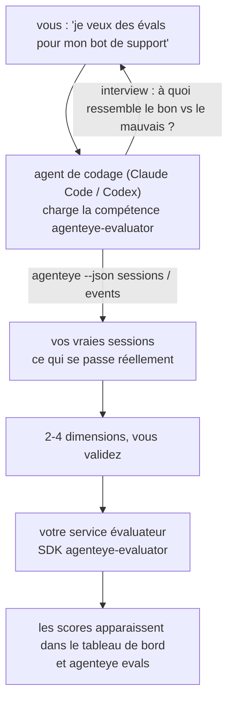

Passez de *« je pense que notre agent est parfois mauvais »* à un service de scoring déployé, votre agent de codage se chargeant à la fois de la conception et de la construction. La **compétence évaluateur Failproof AI Observability** (`agenteye-evaluator`) est une *Agent Skill* : un petit dossier d'instructions qu'un agent de codage tel que Claude Code ou Codex charge à la demande. Elle apprend à l'agent à déterminer quelles dimensions de qualité méritent d'être suivies pour *votre* agent, puis à écrire, tester et déployer le [service évaluateur](/fr/agenteye/evaluation-suite) qui les note.

Il ne s'agit **pas** d'un scoring hébergé, d'un registre vers lequel vous téléversez du contenu, ni d'un système de plugins. Votre évaluateur reste votre propre service HTTP sur votre propre infrastructure, exactement comme décrit dans le guide [Evaluation suite](/fr/agenteye/evaluation-suite). La compétence apprend simplement à votre agent à le construire correctement — tout ce qu'elle fait, vous pourriez le faire vous-même en écrivant le même code.

---

## La partie difficile, c'est de décider quoi noter

La surface du SDK est réduite — un décorateur et deux modèles — et un agent peut l'écrire à partir du seul [contrat](/fr/agenteye/evaluation-suite#http-contract). Ce n'est pas là que les évaluateurs échouent. Ils échouent parce qu'ils mesurent la mauvaise chose, et un évaluateur qui mesure la mauvaise chose est pire qu'aucun : il produit un tableau de bord que tout le monde apprend à ignorer.

L'essentiel de la compétence concerne donc ce qui précède tout code. Elle fait interviewer l'agent (*« décrivez une exécution qui s'est bien passée ; maintenant une qui s'est mal passée »*), puis lui fait parcourir vos vraies sessions via la [CLI `agenteye`](/fr/agenteye/cli) et les lire de bout en bout. Ces deux sources divergent généralement, et l'écart est justement le point central : ce que vous avez l'intention de mesurer par rapport à ce que vos transcriptions peuvent réellement étayer. Une dimension ne survit que si elle est **calculable** à partir des événements et **discriminante** — si elle donne 0,9 à la fois sur votre bonne exécution et sur la mauvaise, elle n'enseigne rien et est supprimée.

Ce qui en ressort est une proposition de 2 à 4 dimensions avec le raisonnement associé, que vous devez valider avant qu'une seule ligne ne soit écrite.



---

## Relation avec les autres composants d'évaluation

Quatre pages couvrent le scoring, et se relaient dans l'ordre :

| Page | Ce que c'est | À utiliser quand |
|---|---|---|
| **[Evaluations](/fr/agenteye/evaluations)** | La fonctionnalité : scores sur la grille de sessions, tableaux de bord, réévaluation | Vous voulez savoir ce que le scoring automatique vous apporte |
| **[Evaluation suite](/fr/agenteye/evaluation-suite)** | Le contrat HTTP, le SDK, les variables d'environnement serveur | Vous implémentez ou déboguez vous-même l'évaluateur |
| **Compétence évaluateur** (ce doc) | Une entrée en langage naturel pour concevoir *et* construire le scorer | Vous voulez passer de « je veux des évals » à un service opérationnel |
| **[CLI skill](/fr/agenteye/cli-skill)** | Une entrée en langage naturel sur la CLI `agenteye` | Vous voulez *lire* les scores que vous avez déjà |
| **[Python SDK skill](/fr/agenteye/python-sdk-skill)** | Une entrée en langage naturel pour instrumenter votre agent | Votre agent n'émet pas encore de sessions — il n'y a rien à noter |

### Par rapport à la CLI skill : construire versus lire

Les deux compétences sont délibérément sans chevauchement, et les installer toutes les deux est la configuration habituelle — l'agent choisit entre elles en fonction de ce que vous demandez :

- **`agenteye-evaluator`** (ce doc) construit ce qui *produit* les scores. Sa mission se termine quand les scores arrivent pour la première fois.
- **[`agenteye-cli`](/fr/agenteye/cli-skill)** lit les scores déjà existants (`agenteye evals`). *« La qualité a-t-elle baissé cette semaine ? »* est sa question, pas celle de cette compétence.

---

## Prérequis

1. **La CLI `agenteye` installée et connectée** (`pipx install agenteye`, puis `agenteye login`). La compétence s'appuie dessus à deux reprises : pour récupérer les vraies sessions sur lesquelles elle se base lors de la conception, et pour confirmer que vos scores sont bien arrivés à la fin. Votre connexion nécessite `events:read`, plus `evaluations:read` pour cette vérification finale. Comme avec la CLI skill, elle **ne peut pas** compléter la connexion par code à usage unique envoyé par e-mail à votre place.
2. **Un endroit où héberger l'évaluateur.** Il est construit dans une image et exécuté en tant que service de longue durée, il a donc besoin d'un vrai dépôt, pas d'un fichier temporaire. Les évaluateurs vivent souvent dans leur propre dépôt, séparé de l'agent évalué — la compétence cherche un dépôt existant et demande avant d'en créer un nouveau.
3. **La roue SDK `agenteye-evaluator`** — lisez la section suivante avant que votre agent commence à taper des commandes `pip`.

---

## Où l'obtenir

La compétence est publiée dans la collection publique de compétences de Failproof AI :

**[github.com/FailproofAI/skills](https://github.com/FailproofAI/skills)** → [`skills/agenteye-evaluator/`](https://github.com/FailproofAI/skills/tree/main/skills/agenteye-evaluator)

Le dépôt est public et la compétence n'a pas besoin de ses propres identifiants — elle pilote uniquement la CLI `agenteye` avec la session *sur laquelle vous êtes connecté*, et écrit du code dans *votre* dépôt. Notez qu'elle est livrée dans son propre dossier et n'est **pas** incluse dans le package `pipx install agenteye`, donc ne la cherchez pas là.

## Installer la compétence

Le chemin le plus rapide passe par la CLI [`skills`](https://skills.sh), qui récupère le dossier et le place là où votre agent le cherche :

```bash
# Claude Code, ce projet uniquement
npx skills add FailproofAI/skills --skill agenteye-evaluator -a claude-code

# tous les projets (installe dans ~/.claude/skills/)
npx skills add FailproofAI/skills --skill agenteye-evaluator -a claude-code -g --copy

# Codex à la place
npx skills add FailproofAI/skills --skill agenteye-evaluator -a codex
```

Puis gérez-la comme n'importe quelle autre compétence :

```bash
npx skills list -a claude-code           # ce qui est installé
npx skills update agenteye-evaluator     # récupérer la dernière version
npx skills remove agenteye-evaluator     # la supprimer
```

Vous préférez installer manuellement ? Une Agent Skill est juste un dossier contenant un `SKILL.md` (plus des références optionnelles), donc la copier fonctionne aussi :

- **Claude Code** : placez le dossier `agenteye-evaluator/` dans `~/.claude/skills/` (tous les projets) ou `<votre-dépôt>/.claude/skills/` (ce dépôt uniquement). Claude Code le découvre automatiquement — vérifiez avec la liste `/skills`, ou demandez simplement des évals.
- **Codex (OpenAI)** : Codex lit le même `SKILL.md`. Le fichier `agents/openai.yaml` fourni définit `allow_implicit_invocation: true`, donc Codex sélectionne automatiquement la compétence quand une tâche correspond ; sinon invoquez-la explicitement avec `$agenteye-evaluator`.

---

## Le SDK n'est pas sur PyPI public

> **Avertissement :** Lisez ceci avant de laisser un agent installer le SDK.

La compétence est publique ; le SDK qu'elle pilote ne l'est pas. `agenteye-evaluator` est livré uniquement comme artefact de version privée, et contrairement à `agenteye`, le nom est **non revendiqué sur PyPI public** — donc un simple `pip install agenteye-evaluator` pourrait installer le package d'un inconnu dans le service qui lit vos transcriptions de production. C'est un problème de chaîne d'approvisionnement, pas une faute de frappe.

La compétence le sait et parcourt à la place une liste d'installation par priorité, s'arrêtant à la première qui s'applique : la source du monodépôt si vous êtes dans le dépôt AgentEye, sinon la roue de version privée depuis GitHub Releases (nécessite un accès), et si aucune n'est accessible, elle **s'arrête et vous indique de demander la roue à votre contact Failproof AI** plutôt que d'improviser.

Donc si votre agent propose un simple `pip install agenteye-evaluator` depuis PyPI public, c'est le signe que la compétence n'a jamais été chargée. Arrêtez-vous et vérifiez qu'elle est bien installée.

---

## Ce que vous pouvez lui demander

Un vrai aller-retour commence par une demande vague et se termine par une conception validée, pas par du code :

```text
vous  ▸ Je veux des évals pour notre bot de support. Je pense qu'il est parfois mauvais.

agent ▸ Avant d'écrire quoi que ce soit : décrivez une exécution qui s'est bien
        passée, et une qui s'est mal passée.

vous  ▸ Bien : il répond à partir de la documentation. Mal : il invente des choses,
        ou abandonne et dit « contactez le support ».

agent ▸ Exécution : agenteye --json sessions --status error --since 7d
        Lecture de 5 sessions, dont deux que vous qualifieriez de mauvaises.

        Vos mots évoquent la factualité et le décrochage. Les transcriptions
        confirment le décrochage (2 sur 5 se terminent par un transfert au support,
        clairement visible dans model_response.content), mais la factualité
        nécessite une vérité terrain que vos événements ne contiennent pas.

        Je mesurerais donc trois choses :
          - deflection      règles, peu coûteux, distingue vos deux exécutions
          - tool_efficiency règles, détecte la boucle de réessai dans run-004
          - groundedness    juge LLM : chaque affirmation est-elle dans les docs récupérés ?

        « factualité » nécessiterait une vérité terrain que nous n'avons pas ;
        groundedness est ce que vos transcriptions peuvent réellement étayer.
        D'accord avec ces trois noms ? Les renommer plus tard divise l'historique.

vous  ▸ oui

agent ▸ Pas d'évaluateur dans ce dépôt. Dois-je en créer un ici, ou en avez-vous
        un ailleurs ?
```

À partir de là, il écrit d'abord les dimensions basées sur des règles (gratuites, instantanées, déterministes), les teste contre une vraie session capturée incluant les sessions vides et inachevées qui font planter les évaluateurs naïfs, et n'utilise un juge LLM que pour la dimension subjective. Il connaît les [limites du dispatcher](/fr/agenteye/evaluation-suite#configuring-the-server) — un délai de requête de 30s et 8 appels simultanés dans tout le déploiement — donc si le juge ne s'y adapte pas de manière fiable, il passe en asynchrone avec `JobPending` plutôt que de laisser votre juge être annulé et réessayé cinq fois au quintuple du coût.

Ensuite il déploie, définit les deux variables d'environnement serveur, et confirme avec `agenteye --json evals --session-id <id>` que les scores sont bien arrivés. L'arrivée des scores est la seule preuve.

---

## Ce à quoi faire attention

- **Les noms de dimensions sont quasi permanents.** Les clés de score sont des chaînes arbitraires et la plateforme suit les tendances de tout ce que vous envoyez, ce qui signifie que rien en aval ne corrige un mauvais choix. Renommer plus tard divise l'historique : les anciennes sessions conservent l'ancienne clé et la tendance se brise. C'est pourquoi la compétence obtient une validation explicite avant d'écrire du code — prenez cette invite au sérieux.
- **Les fixtures sont de vraies transcriptions de production.** Concevoir à partir de vraies sessions signifie les télécharger sur le disque, et elles peuvent contenir des données clients. La compétence demande avant de les committer dans git ; en cas de doute, gardez `fixtures/` hors du dépôt et faites récupérer les siennes à chaque développeur.
- **L'agent écrit et déploie un service qui lit chaque transcription.** Il agit en votre nom, limité par les permissions de votre connexion CLI, mais examinez l'évaluateur comme n'importe quel autre code qui touche des données de production.

---

## Prochaines étapes

- **[Evaluation suite](/fr/agenteye/evaluation-suite)** : le contrat HTTP, le SDK et les variables d'environnement serveur que la compétence configure.
- **[Evaluations](/fr/agenteye/evaluations)** : là où les scores s'affichent une fois qu'ils arrivent.
- **[CLI skill](/fr/agenteye/cli-skill)** : la compétence jumelle, pour lire les résultats plutôt que construire le scorer.
- **[CLI](/fr/agenteye/cli)** : la référence des commandes derrière les données de session sur lesquelles la compétence se base.