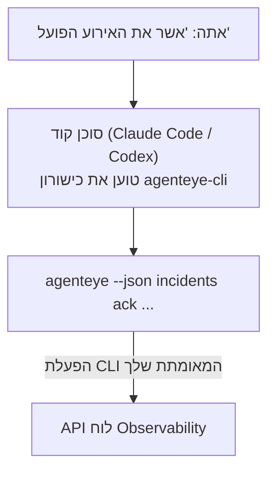

---
---
title: "כישורון CLI Observability של Failproof AI"
description: "שאל את סוכן הקוד שלך \"האם משהו שבור היום?\" והנח לו לענות מנתוני Failproof AI Observability השידוריים שלך, ללא צורך לשנן פקודות."
---


שאל את סוכן הקוד שלך *"האם משהו שבור היום?"* והנח לו לענות מנתוני Failproof AI Observability השידוריים שלך, ללא צורך לשנן פקודות. **כישורון CLI Observability של Failproof AI** (`agenteye-cli`) הוא *Agent Skill*: תיקייה קטנה של הוראות שסוכן קוד כגון Claude Code או Codex טוען לפי הצורך. היא מלמדת את הסוכן להפעיל את התפוצה של Observability שלך דרך ה-[`agenteye` CLI](/he/agenteye/cli) מבקשות בעברית רגילה כמו *"תן ל-CI מפתח שיכול רק לדחוף אירועים"* או *"אשר את האירוע הפועל והקצה אותו אלי."*

זה **לא** שירות או בינארי נפרד; אין כלום לפרוס. זה עובד על גבי ה-CLI שכבר התקנת: הסוכן שדרג אל `agenteye --json …`, מנתח את ה-JSON הנקי, והשיב לך בטקסט. כל דבר שהוא יכול לעשות, אתה יכול לעשות בעצמך בהקלדת אותן פקודות.

---

## איך זה קשור לממשקים אחרים של Failproof AI Observability

Failproof AI Observability נותן לך ארבע דרכים להגיע לאותם נתונים ובקרות. הם משלימים זה את זה:

| ממשק | מה זה | איפה זה רץ | הגש אליו כאשר |
|---|---|---|---|
| **[CLI](/he/agenteye/cli)** | ההתייחסות לפקודה/דגל עבור `agenteye` | הטרמינל שלך | אתה רוצה להריץ או לתסריט פקודה ספציפית |
| **[CLI recipes](/he/agenteye/cli-recipes)** | דוגמות `jq`/pipeline להעתקה-הדבקה | הטרמינל / סקריפטים שלך | אתה מחברת את ה-CLI לאוטומציה |
| **כישורון CLI** (מסמך זה) | דלת חזיתית בשפה טבעית ל-CLI | סוכן הקוד שלך, בתחנת העבודה שלך | אתה רוצה לשאול ולתת לסוכן לבחור את הפקודה |
| **[כישורון Evaluator](/he/agenteye/evaluator-skill)** | כישורון אחות שתכנן ובונה את שירות הניקוד שלך | סוכן הקוד שלך, בתחנת העבודה שלך | אתה רוצה **לייצר** ניקוד eval במקום לקרוא אותו |
| **[כישורון Python SDK](/he/agenteye/python-sdk-skill)** | כישורון אחות שמכשיר את הסוכן שלך כך שהוא פולט טלמטריה כלל | סוכן הקוד שלך, בתחנת העבודה שלך | אתה רוצה שהסוכן שלך **ייצור** את האירועים שכישורון זה קורא |
| **[עוזר AI בתוך הלוח](/he/agenteye/assistant)** | צ'אט משובץ בלוח המחוונים | צד שרת (בלוח המחוונים) | אתה רוצה שאלות ותשובות בתוך לוח המחוונים על הנתונים שלך |

לכישורון עצמו אין הרשאות שלו; הוא רק הופך את המילים שלך לקריאות CLI שרצות כך:



### לעומת עוזר ה-AI בתוך הלוח: הבחנה חשובה

אלה שני כלים שונים עם טווחי פיצוץ שונים מאוד:

- **עוזר ה-AI בתוך הלוח** ([AI assistant](/he/agenteye/assistant)) הוא צ'אט משובץ בלוח המחוונים, בגיבוי שירות הסוכן. זה **קריאה בלבד בתוספת כתיבה שאושרה**: הוא יכול לטיוטה שאלות שמורות ולוחות, אך כל כתיבה עוצרת לאישור ההקלקה המפורש שלך, והוא לעולם לא מוחק. זה נשער על ידי ההרשאה `agent:use` ורק אי פעם רואה נתונים עבור הארגון שאתה צופה בו.
- **כישורון CLI** רץ על *תחנת העבודה שלך* בתוך *סוכן הקוד שלך* ומנהל את `agenteye` CLI כ-**אתה**. הוא יכול לבצע את **המשטח המלא של ה-CLI, כולל מוטציות** (יצור/סיבוב/הפסקה של מפתחות API, שנה הגדרות ארגון, פתור אירועים, מחק שאלות שמורות), מוגבל רק בהרשאות ההתחברות שלך ל-CLI. התייחס אליו בדיוק כפי שהיית מתייחס להרצת אותן פקודות ביד.

---

## דרישות ראשוניות

1. **ה-`agenteye` CLI מותקן** ו-`PATH` (ראה את התייחסות [CLI](/he/agenteye/cli): `pipx install agenteye`).
2. **כתובת ה-URL של לוח המחוונים שלך** מוגדרת (`AGENTEYE_DASHBOARD_URL`, או הסוכן עובר `--base-url`).
3. **הפעלה שנכנסה**: הרץ `agenteye login` בעצמך קודם לכן. הכישורון **לא יכול** להשלים את הכניסה לקוד חד-פעמי בדוא״ל עבורך; זה אמר לך להרוץ `agenteye login` אם ההפעלה חסרה או פג תוקף (קוד יציאת CLI `4`).

---

## איפה להשיג את זה

הכישורון פורסם באוסף הכישורונים הציבורי של Failproof AI:

**[github.com/FailproofAI/skills](https://github.com/FailproofAI/skills)** → [`skills/agenteye-cli/`](https://github.com/FailproofAI/skills/tree/main/skills/agenteye-cli)

שום דבר בו לא משוער — המאגר ציבורי והכישורון לא זקוק לעדות משלו משום שהוא רק מנהל את `agenteye` CLI **הציבורי** מול לוח המחוונים שלך, תוך שימוש בהפעלה **שהתחברת אליה**. אתה לא צריך לשאול אף אחד על זה.

שימו לב שהוא משתלח כתיקייה משלו והוא **לא** בתוך חבילת `pipx install agenteye`, כך שלא תחפש אותו שם.

## התקנת הכישורון

הנתיב המהיר ביותר הוא CLI [`skills`](https://skills.sh), אשר אחזר את התיקייה ושוחק אותה כאשר הסוכן שלך מחפש:

```bash
# Claude Code, פרויקט זה בלבד
npx skills add FailproofAI/skills --skill agenteye-cli -a claude-code

# כל פרויקט (מתקין ל-~/.claude/skills/)
npx skills add FailproofAI/skills --skill agenteye-cli -a claude-code -g --copy

# Codex במקום זאת
npx skills add FailproofAI/skills --skill agenteye-cli -a codex
```

לאחר מכן נהל אותו כמו כל כישורון אחר:

```bash
npx skills list -a claude-code      # מה שהותקן
npx skills update agenteye-cli      # משוך את הגרסה העדכנית
npx skills remove agenteye-cli      # הסר אותו
```

מעדיף להתקין ביד? Agent Skill הוא רק תיקייה המכילה `SKILL.md` (בתוספת התייחסויות אופציונליות), כך שהעתקה פועלת גם:

- **Claude Code**: שים את תיקיית `agenteye-cli/` ב-`~/.claude/skills/` (כל פרויקט) או `<your-repo>/.claude/skills/` (רק אותו רפו). Claude Code מגלה זאת באופן אוטומטי — אמת עם רשימת `/skills`, או פשוט שאל שאלה התואמת את התיאור שלו.
- **Codex (OpenAI)**: Codex קורא את אותה `SKILL.md`. ה-`agents/openai.yaml` המצורף קובע `allow_implicit_invocation: true`, כך ש-Codex בוחר באופן אוטומטי את הכישורון כאשר משימה תואמת; אחרת הפעל אותו באופן מפורש כ-`$agenteye-cli`.

---

## בטיחות: מוטציות **לא** מבקשות כאשר סוכן מריץ את ה-CLI

> **אזהרה:** קרא זאת לפני שאתה נותן לסוכן לבצע שינויים.

ה-CLI `agenteye` בדרך כלל שואל *"האם אתה בטוח?"* לפני פעולה הרסנית. זה **דילוג אוטומטי על אישור זה בכל פעם שלא מוצמד לטרמינל (שהוא בדיוק איך סוכן קוד מריץ אותו), ו-`--json` דילוג עליו גם.** אז הנושא הבטיחות **לא** יופעל עבור הסוכן.

הכישורון כתוב לפיצוי: הוא מוּעד להצהיר על הפקודה המדויקת שהוא יריץ ולהשיג את ה-**אישור המפורש שלך לפני כל שינוי מצב**. השמור על המשמעת הזו. כאשר אתה מנהל את Failproof AI Observability דרך סוכן, *אתה* הצעד האישור. הפקודות המשנות מצב שצריך להיזהר מהן:

- `keys create` / `update` / `disable` / `regenerate`
- `users create` / `update` / `disable` / `enable`
- `settings set`
- `alerts create` / `update` / `delete` / `test`
- תת-הפקודות הכתיבה `incidents`: `ack` / `assign` / `resolve` / `open` / `comment-add` / `comment-delete` / `subscribe` / `unsubscribe`
- `query create` / `update` / `delete`
- `agent rename` / `delete`
- `orgs switch`

הכל תחת **Observe** (`events`, `sessions`, `evals`, `errors`, `list`, `whoami`, `orgs list/current/perms`) הוא קריאה בלבד ולא משנה שום דבר.

מכיוון שהסוכן פועל כ-**אתה**, הוא יכול לעשות רק מה שההתחברות שלך מורשת לעשות; הרשאות מתבררות **לכל ארגון** (ראה [API keys](/he/agenteye/api-keys)). פקודה שאתה חסר הרשאה עבורה מחזירה קוד יציאה `5` עם ההרשאה המדויקת שנקראה, כך שהסוכן יכול לומר לך בדיוק למה לבקש מ-admin במקום להיכשל בעלום.

---

## מה אתה יכול לשאול אותו

הנה איך נראית סיבוב בעולם האמת, קריאה ואחריה שינוי שמחכה לאישור שלך:

```text
אתה   ▸ האם משהו שבור בבחינה האחרונה?

סוכן ▸ ריצה: agenteye --json errors --since 24h --aggregate
        3 סוגי שגיאה בבחינה האחרונה. הגדול ביותר הוא TimeoutError
        (18 עוקבים, כולם ב-checkout-agent), ואחריו RateLimited (5).
        רוצה את ההפעלות הנכשלות עבור TimeoutError?

אתה   ▸ תן ל-CI מפתח שיכול רק לדחוף אירועים.

סוכן ▸ זה יוצר מפתח API. אני אריץ:
          agenteye keys create ci --add events:add
        בסדר להמשיך?

אתה   ▸ כן

סוכן ▸ בוצע. מפתח "ci" נוצר עם events:add בלבד.
        הסוד מוצג רק פעם אחת, כך שאחסן אותו עכשיו. אני לא יכול להדפיס מחדש.
```

הכישורון ממפה כל כוונה בשפה טבעית לפקודת `agenteye` הנכונה, תוך גילוי ערכים חוקיים קודם (`list <kind>`, `whoami`) כך שהוא לא מנחש, והצהיר על הפקודה המדויקת לפני כל שינוי. עוד דוגמאות:

- *"האם משהו שבור / נכשל בבחינה האחרונה?"* → `errors --since 24h --aggregate`, ואחריו פירוט.
- *"למה הפעלה `run-001` נכשלה?"* → `events --session-id run-001 --all` + `evals --session-id run-001`.
- *"איך האיכות מתגברת בשבוע זה?"* → `evals --aggregate --since 7d`, ואחריו קדרילה לתוך ריצות בציון נמוך.
- *"תן ל-CI מפתח שיכול רק לדחוף אירועים."* → `keys create ci --add events:add` (זה מצהיר על הפקודה, ואחריו יוצר אותה ותופס את הסוד החד-פעמי).
- *"מי יש גישה? הפוך את Dana לקריאה בלבד."* → `users list` → `users update dana@… --permission-set read-only` (לאחר אישור איתך).
- *"אשר את האירוע הפועל והקצה אותו אלי."* → `incidents list --state firing` → `incidents ack <id>` / `incidents assign <id> you@…`.

עבור הפקודות המדויקות, הדגלים, וצורות JSON שמאחוריהן, ראה את התייחסות [CLI](/he/agenteye/cli) ו-[CLI recipes for agents](/he/agenteye/cli-recipes).

---

## שלבים הבאים

- **[CLI](/he/agenteye/cli)**: ההתייחסות המלאה לפקודה ודגל עבור `agenteye`.
- **[CLI recipes for agents](/he/agenteye/cli-recipes)**: דוגמות `jq` להעתקה-הדבקה וטיפול בקוד יציאה.
- **[כישורון סוכן Evaluator](/he/agenteye/evaluator-skill)**: הכישורון אחות, לבניית ה-evaluator שאותו ניקוד `agenteye evals` קורא.
- **[כישורון סוכן Python SDK](/he/agenteye/python-sdk-skill)**: הכישורון אחות, להכשרת סוכן כך שהוא פולט את הטלמטריה שקוראת `agenteye`.
- **[עוזר AI](/he/agenteye/assistant)**: העוזר בתוך הלוח (לא להתבלבל עם כישורון הטרמינל הזה).
- **[API keys](/he/agenteye/api-keys)**: מודל ההרשאה לכל ארגון שמגביל מה הכישורון יכול לעשות.