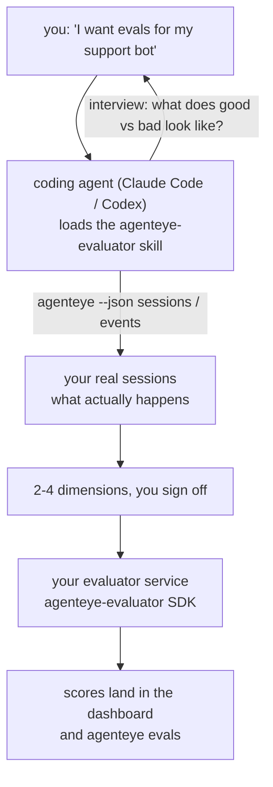

---
---
title: "כישרון סוכן הערכה של Failproof AI Observability"
description: "עבור מ\"אני חושב שהסוכן שלנו לפעמים רע\" לשירות ניקוד פרוס, כשהסוכן הקוד שלך עושה גם את ההחלטה וגם את הבנייה."
---


עבור מ*\"אני חושב שהסוכן שלנו לפעמים רע\"* לשירות ניקוד פרוס, כשהסוכן הקוד שלך עושה גם את ההחלטה וגם את הבנייה. **כישרון Failproof AI Observability evaluator** (`agenteye-evaluator`) הוא *Agent Skill*: תיקייה קטנה של הוראות שסוכן קוד כמו Claude Code או Codex טוען לפי דרישה. זה מלמד את הסוכן לעבוד ולברר אילו מימדי איכות כדאי לעקוב עבור *הסוכן שלך*, ואז לכתוב, לבדוק ולפרוס את [שירות ה-evaluator](/he/agenteye/evaluation-suite) שמדרג אותם.

זה **לא** מדרג מתארח, רישום שאתה מעלה אליו, או מערכת תוספים. ה-evaluator שלך נשאר שירות HTTP שלך בתשתית שלך, בדיוק כما מתואר בהדרכה [Evaluation suite](/he/agenteye/evaluation-suite). הכישרון רק מלמד את הסוכן שלך לבנות זאת טוב, כך שכל מה שהוא עושה, אתה יכול לעשות בעצמך על ידי כתיבת אותו קוד.

---

## החלק הקשה הוא להחליט מה לדרג

משטח ה-SDK קטן — דקורטור ושני מודלים — וסוכן יכול לכתוב את זה מ[החוזה](/he/agenteye/evaluation-suite#http-contract) לבד. זה לא המקום שבו evaluators נכשלים. הם נכשלים כי הם דורגים את הדבר הלא נכון, וה-evaluator שדורג את הדבר הלא נכון הוא גרוע מכלום: הוא מייצר לוח מחוונים שכולם למדו להתעלם ממנו.

אז רוב הכישרון הוא החלק לפני שקוד כלשהו קיים. יש לסוכן לראיין אותך (*\"תאר הפעלה שהלכה טוב; עכשיו אחת שהלכה בצורה רעה\"*), ואז לשוך את הסשנים האמיתיים שלך דרך [`agenteye` CLI](/he/agenteye/cli) וקרא אותם מקצה לקצה. שתי החצאים האלה בדרך כלל לא מסכימים, והפער הוא הנקודה: מה אתה מתכוון למדוד בעבור מה שהתמלילים שלך יכולים להתמוך בו. מימד שורד רק אם הוא **ניתן לחישוב** מהאירועים ו**מבדיל** — אם הוא מדרג 0.9 גם בהפעלה הטובה שלך וגם בהרעה, הוא לא מלמד כלום ומתחלק.

מה שחוזר הוא הצעה של 2-4 מימדים כשהנימוק מצורף, בשבילך לאשר לפני שכתוב שורה אחת.



---

## איך זה קשור לחלקי ההערכה האחרים

ארבע מסמכים מכסים ניקוד, והם מוסרים זה לזה בסדר:

| עמוד | מה זה | הגע אליו כאשר |
|---|---|---|
| **[Evaluations](/he/agenteye/evaluations)** | התכונה: ניקודים בגריד הסשנים, לוחות מחוונים, הערכה מחדש | אתה רוצה לדעת מה ניקוד אוטומטי מקבל לך |
| **[Evaluation suite](/he/agenteye/evaluation-suite)** | החוזה HTTP, ה-SDK, משתני סביבת השרת | אתה מיישם או ניפוי באגים ב-evaluator בעצמך |
| **Evaluator skill** (מסמך זה) | דלת קדמית בשפה טבעית לעיצוב *וגם* בנייה של המדרג | אתה רוצה להעבור מ"אני רוצה evals" לשירות שרץ |
| **[CLI skill](/he/agenteye/cli-skill)** | דלת קדמית בשפה טבעית על ה-`agenteye` CLI | אתה רוצה *לקרוא* את הניקודים שכבר יש לך |
| **[Python SDK skill](/he/agenteye/python-sdk-skill)** | דלת קדמית בשפה טבעית על כלי הסוכן שלך | הסוכן שלך עדיין לא משדר סשנים — אין שום דבר לדרג |

### לעומת CLI skill: בנייה לעומת קריאה

שני הכישרונות מכוונים במכוון שאינם חופפים, והתקנת שניהם היא ההגדרה הרגילה — הסוכן בוחר ביניהם על סמך מה שאתה שואל:

- **`agenteye-evaluator`** (מסמך זה) בונה את הדבר שמייצר ניקודים. עבודתו מסתיימת כאשר ניקודים נוחתים בפעם הראשונה.
- **[`agenteye-cli`](/he/agenteye/cli-skill)** קורא ניקודים שכבר קיימים (`agenteye evals`). *"האם איכות ירדה השבוע?"* היא השאלה שלה, לא של הכישרון הזה.

---

## דרישות מוקדמות

1. **`agenteye` CLI מותקן ומחובר** (`pipx install agenteye`, ואז `agenteye login`). הכישרון מסתמך עליו פעמיים: לשוך את הסשנים האמיתיים שהוא מעצב בהם, ולאשר שהניקודים שלך נוחתו בסוף. הכניסה שלך צריכה `events:read`, בתוספת `evaluations:read` לאישור סופי זה. כמו CLI skill, היא **לא יכולה** להשלים את כניסת קוד חד-פעמית שנשלחה בדוא\"ל עבורך.
2. **מקום ל-evaluator לחיות בו.** הוא מובנה לתמונה ורץ כשירות ממושך, אז הוא צריך ריפו אמיתי, לא קובץ סקראץ'. Evaluators לעתים קרובות חיים בריפו שלהם, נפרדים מהסוכן שנדרג — הכישרון חפש אחד קיים ושואל לפני סיבוך חדש.
3. **גלגל `agenteye-evaluator` SDK** — קרא את הסעיף הבא לפני שהסוכן שלך מתחיל להקליד `pip` פקודות.

---

## איפה להשיג זאת

הכישרון פורסם בקולקציית הכישרונות הציבורית של Failproof AI:

**[github.com/FailproofAI/skills](https://github.com/FailproofAI/skills)** → [`skills/agenteye-evaluator/`](https://github.com/FailproofAI/skills/tree/main/skills/agenteye-evaluator)

המחסן ציבורי והכישרון לא זקוק לכל אישור משלו — הוא רק מנהל את `agenteye` CLI עם הסשן *שלך* התחברת אליו, וכותב קוד בריפו *שלך*. שים לב שהוא מסופק כתיקייה משלו ו**לא** בתוך חבילת `pipx install agenteye`, אז אל תחפש אותו שם.

## התקנת הכישרון

הנתיב המהיר ביותר הוא [`skills`](https://skills.sh) CLI, המביא את התיקייה וזורקת אותה למקום שהסוכן שלך מחפש:

```bash
# Claude Code, this project only
npx skills add FailproofAI/skills --skill agenteye-evaluator -a claude-code

# every project (installs to ~/.claude/skills/)
npx skills add FailproofAI/skills --skill agenteye-evaluator -a claude-code -g --copy

# Codex instead
npx skills add FailproofAI/skills --skill agenteye-evaluator -a codex
```

אז נהל זאת כמו כל כישרון אחר:

```bash
npx skills list -a claude-code           # what's installed
npx skills update agenteye-evaluator     # pull the latest version
npx skills remove agenteye-evaluator     # remove it
```

מעדיף להתקין ביד? Agent Skill הוא רק תיקייה המכילה `SKILL.md` (בתוספת הפניות אופציונליות), אז הועתקה עובדת גם:

- **Claude Code**: הצב את תיקייה `agenteye-evaluator/` ב-`~/.claude/skills/` (כל פרויקט) או `<your-repo>/.claude/skills/` (הריפו הזה בלבד). Claude Code גילוי אוטומטי שלה — אימות עם רשימה `/skills`, או פשוט שאל אותו evals.
- **Codex (OpenAI)**: Codex קורא אותו `SKILL.md`. ה-`agents/openai.yaml` המצורף מגדיר `allow_implicit_invocation: true`, אז Codex בחירה אוטומטית בכישרון כאשר משימה תואמת; אחרת הזמן זאת בפירוש כ-`$agenteye-evaluator`.

---

## ה-SDK לא ב-PyPI הציבורי

> **Warning:** קרא את זה לפני שאתה מעביר סוכן להתקין את ה-SDK.

הכישרון ציבורי; ה-SDK שהוא מנהל אינו. `agenteye-evaluator` משודר רק כיצירה ריליז פרטית, ובשונה מ-`agenteye`, השם הוא **לא תבועה על PyPI ציבורי** — אז `pip install agenteye-evaluator` חשוף יכול לשוך חבילה של זר לתוך השירות שקורא את התמלילים של הייצור שלך. זה בעיה של שרשרת אספקה, לא טעות הקלדה.

הכישרון יודע זאת ועוסק בסולם התקנה במקום, עוצר בשלב הראשון החל: ה-monorepo מקור אם אתה בתוך ריפו AgentEye, אחרת גלגל ריליז פרטי מ-GitHub Releases (צריך גישה), ואם כלום לא נגיע זה **עוצר ואומר לך לשאול את איש הקשר Failproof AI שלך לגלגל** במקום improvising.

אז אם הסוכן שלך מציע `pip install agenteye-evaluator` חשוף מ-PyPI ציבורי, זה הדבר שהכישרון לא היה נטען. עצור שם בדוק שהוא מותקן.

---

## מה אתה יכול לשאול אותו

סיבוב טיול אמיתי מתחיל בשאלה עמומה ומסתיים בעיצוב שחתום, לא עם קוד:

```text
you   ▸ I want evals for our support bot. I think it's sometimes bad.

agent ▸ Before I write anything: describe a run that went well,
        and one that went badly.

you   ▸ Good: it answers from the docs. Bad: it makes stuff up,
        or gives up and says "contact support".

agent ▸ Running: agenteye --json sessions --status error --since 7d
        Reading 5 sessions, including two you'd call bad.

        Your words say factuality and deflection. The transcripts
        agree on deflection (2 of 5 end with a support hand-off,
        and it's plain in model_response.content), but factuality
        needs a ground truth your events don't carry.

        So I'd score three things:
          - deflection      rules, cheap, separates your two runs
          - tool_efficiency rules, catches the retry loop in run-004
          - groundedness    LLM judge: is every claim in the docs it retrieved?

        "factuality" would need ground truth we don't have; groundedness
        is the closest thing your transcripts can actually support.
        OK with those three names? Renaming later splits the history.

you   ▸ yes

agent ▸ No evaluator in this repo. Should I scaffold one here, or do
        you have one elsewhere?
```

משם זה כותב את המימדים המבוססים על כללים קודם (חינם, מיידי, דטרמיניסטי), בודק אותם כנגד סשן שלכד אמיתי כולל הריקים והעולם לא בסוף שמתרסקים naive evaluators, ורק מגיע לשופט LLM בממד הסובייקטיבי. זה יודע את [מגבלות ה-dispatcher](/he/agenteye/evaluation-suite#configuring-the-server) — timeout בקשה 30 שניות ו-8 שיחות בו-זמנית פריסה-רחבה — אז אם השופט לא יתאים בהצלחה, זה הולך async עם `JobPending` במקום להפוך את השופט שלך לחצוי וחזור חמש פעמים בחמש פעמים העלות.

אז זה פורס, מגדיר את שני משתני סביבת השרת, ומאשר עם `agenteye --json evals --session-id <id>` ש-scores בעצם נוחתו. ניקודים נחתו הוא ההוכחה היחידה.

---

## מה להשגיח על

- **שמות מימדים קרובים לקבוע.** מפתחות ניקוד הם מחרוזות שרירותיות והפלטפורמה עולה כל דבר שאתה שולח, מה שאומר שום דבר במורד הזרם מתקן בחירה רעה. שנה קורא ובמימדים נפרדים: סשנים ישנים שמור המפתח הישן והטרנד שבר. זו הסיבה שהכישרון מקבל חתימה מוגדרת לפני קוד כתיבה — קח את ההנחיה ברצינות.
- **Fixtures הם תמלילי ייצור אמיתיים.** עיצוב כנגד סשנים אמיתיים אומר שוך אותם לדיסק, והם יכולים להכיל נתוני לקוח. הכישרון שואל לפני התחייב שלהם לגיט; אם בספק, שמור `fixtures/` מחוץ לריפו ויש כל מפתח לשוך שלהם שלהם.
- **הסוכן כותב ופורס שירות שקורא כל תמליל.** זה עובד כמוך, מחובר לפי ההרשאות של כניסת ה-CLI שלך, אבל סקור את ה-evaluator כמו כל קוד אחר שנוגע לנתוני ייצור.

---

## הצעדים הבאים

- **[Evaluation suite](/he/agenteye/evaluation-suite)**: החוזה HTTP, ה-SDK, ומשתני סביבת השרת שהכישרון מגדיר.
- **[Evaluations](/he/agenteye/evaluations)**: איפה הניקודים מופיעים ברגע שהם נוחתו.
- **[CLI skill](/he/agenteye/cli-skill)**: הכישרון האחות, לקריאת תוצאות במקום בנייה של המדרג.
- **[CLI](/he/agenteye/cli)**: הנושא הפקודה מאחורי נתוני הסשן שהכישרון עיצוב כנגדו.