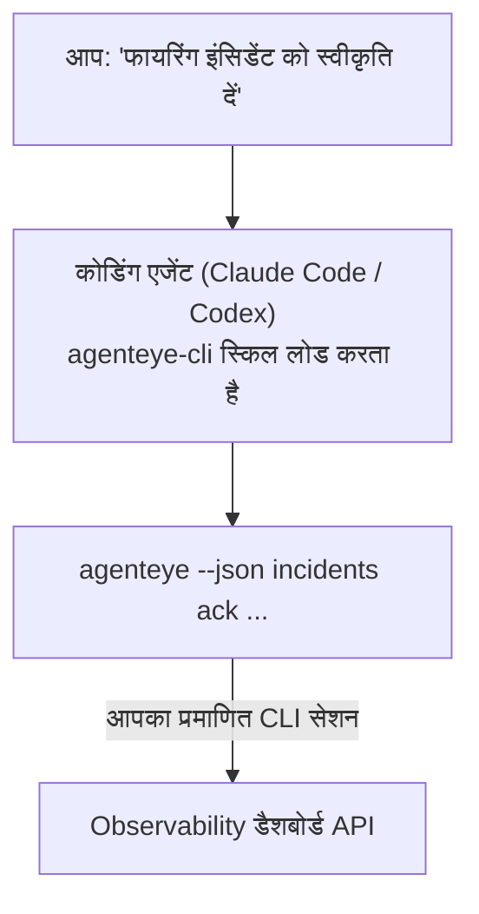

अपने कोडिंग एजेंट से *"क्या आज कुछ टूटा है?"* पूछें और इसे अपने लाइव Failproof AI Observability डेटा से जवाब दें, कोई कमांड याद रखने की जरूरत नहीं। **Failproof AI Observability CLI स्किल** (`agenteye-cli`) एक *Agent Skill* है: निर्देशों का एक छोटा फोल्डर जिसे Claude Code या Codex जैसा कोडिंग एजेंट मांग पर लोड करता है। यह एजेंट को [`agenteye` CLI](/hi/agenteye/cli) के माध्यम से आपके Observability डिप्लॉयमेंट को संचालित करना सिखाता है साधारण अंग्रेजी अनुरोधों से जैसे *"CI को एक कुंजी दें जो केवल इवेंट पुश कर सके"* या *"फायरिंग इंसिडेंट को स्वीकृति दें और इसे मुझे असाइन करें।"*

यह **नहीं** एक सेवा या अलग बाइनरी है; तैनात करने के लिए कुछ भी नहीं है। यह उस CLI के ऊपर काम करता है जिसे आप पहले से इंस्टॉल कर चुके हैं: एजेंट `agenteye --json …` को शेल करता है, स्वच्छ JSON को पार्स करता है, और आपको गद्य में जवाब देता है। यह जो कुछ भी कर सकता है, आप इसे स्वयं कर सकते हैं।

---

## यह अन्य Failproof AI Observability इंटरफेस से कैसे संबंधित है

Failproof AI Observability आपको समान डेटा और नियंत्रण तक पहुंचने के चार तरीके देता है। वे एक दूसरे की पूरक हैं:

| इंटरफेस | यह क्या है | यह कहां चलता है | इसे कब चुनें |
|---|---|---|---|
| **[CLI](/hi/agenteye/cli)** | `agenteye` के लिए कमांड/फ्लैग संदर्भ | आपका टर्मिनल | जब आप एक विशिष्ट कमांड चलाना या स्क्रिप्ट करना चाहते हैं |
| **[CLI recipes](/hi/agenteye/cli-recipes)** | कॉपी-पेस्ट `jq`/पाइपलाइन पैटर्न | आपका टर्मिनल / स्क्रिप्ट | जब आप CLI को ऑटोमेशन में वायर कर रहे हैं |
| **CLI स्किल** (यह दस्तावेज़) | CLI पर एक प्राकृतिक भाषा का प्रवेश द्वार | आपका कोडिंग एजेंट, आपके वर्कस्टेशन पर | जब आप बस पूछना चाहते हैं और एजेंट को कमांड चुनने दें |
| **[Evaluator स्किल](/hi/agenteye/evaluator-skill)** | एक सहायक स्किल जो आपकी स्कोरिंग सेवा डिज़ाइन और बनाती है | आपका कोडिंग एजेंट, आपके वर्कस्टेशन पर | जब आप eval स्कोर पढ़ने के बजाय *उत्पन्न* करना चाहते हैं |
| **[Python SDK स्किल](/hi/agenteye/python-sdk-skill)** | एक सहायक स्किल जो आपके एजेंट को सभी टेलीमेट्री उत्सर्जित करने के लिए सक्षम करती है | आपका कोडिंग एजेंट, आपके वर्कस्टेशन पर | जब आप अपने एजेंट को यह स्किल जो इवेंट पढ़ती है उन्हें *उत्पन्न* करना चाहते हैं |
| **[In-dashboard AI सहायक](/hi/agenteye/assistant)** | डैशबोर्ड में एम्बेड किया गया एक चैट | सर्वर-साइड (डैशबोर्ड में) | जब आप अपने डेटा पर इन-डैशबोर्ड प्रश्नोत्तर चाहते हैं |

स्किल के अपने कोई विशेषाधिकार नहीं हैं; यह केवल आपके शब्दों को CLI कॉल में बदलता है जो आपके रूप में चलते हैं:



### बनाम in-dashboard AI सहायक: एक महत्वपूर्ण अंतर

ये दो बिल्कुल अलग उपकरण हैं जिनके अलग-अलग प्रभाव हैं:

- **in-dashboard AI सहायक** ([AI सहायक](/hi/agenteye/assistant)) डैशबोर्ड में एम्बेड किया गया एक चैट है, जो एजेंट सेवा द्वारा समर्थित है। यह **केवल-पढ़ने योग्य और अनुमोदन-गेटेड लेखन** है: यह सहेजे गए क्वेरी और डैशबोर्ड का ड्राफ्ट कर सकता है, लेकिन प्रत्येक लिखने से आपकी स्पष्ट क्लिक-अनुमोदन के लिए रुकता है, और यह कभी हटाता नहीं है। यह `agent:use` अनुमति द्वारा गेट किया जाता है और केवल उस संगठन के लिए डेटा देखता है जिसे आप देख रहे हैं।
- **CLI स्किल** आपके वर्कस्टेशन पर आपके कोडिंग एजेंट के अंदर चलती है और `agenteye` CLI को **आपके रूप में** चलाती है। यह CLI की **पूर्ण सतह, म्यूटेशन सहित** कर सकती है (API कुंजी बनाएं/घुमाएं/अक्षम करें, संगठन सेटिंग्स बदलें, इंसिडेंट हल करें, सहेजे गए क्वेरी हटाएं), केवल आपकी CLI लॉगिन की अनुमतियों द्वारा सीमित। इसे बिल्कुल उसी तरह व्यवहार करें जैसे आप उन कमांडों को हाथ से चलाना चाहते हैं।

---

## आवश्यकताएं

1. **`agenteye` CLI इंस्टॉल** और `PATH` पर (देखें [CLI](/hi/agenteye/cli) संदर्भ: `pipx install agenteye`)।
2. आपका **डैशबोर्ड URL सेट** (`AGENTEYE_DASHBOARD_URL`, या एजेंट `--base-url` पास करता है)।
3. एक **लॉगिन किया गया सेशन**: पहले स्वयं `agenteye login` चलाएं। स्किल **नहीं** कर सकता ईमेल किए गए एकबारी-कोड लॉगिन को आपके लिए पूरा करना; यह आपको `agenteye login` चलाने के लिए कहेगा यदि सेशन अनुपस्थित या समाप्त है (CLI एक्सिट कोड `4`)।

---

## इसे कहां से प्राप्त करें

स्किल Failproof AI के सार्वजनिक स्किल संग्रह में प्रकाशित है:

**[github.com/FailproofAI/skills](https://github.com/FailproofAI/skills)** → [`skills/agenteye-cli/`](https://github.com/FailproofAI/skills/tree/main/skills/agenteye-cli)

इसके बारे में कुछ भी गेटेड नहीं है — रिपॉजिटरी सार्वजनिक है और स्किल को अपने क्रेडेंशियल की आवश्यकता नहीं है, क्योंकि यह केवल **सार्वजनिक** `agenteye` CLI को आपके डैशबोर्ड के विरुद्ध चलाता है, सेशन का उपयोग करते हुए *आप* लॉगिन किए हैं। आपको किसी से इसके लिए पूछना नहीं है।

नोट करें कि यह अपने स्वयं के फोल्डर के रूप में शिप करता है और `pipx install agenteye` पैकेज के अंदर **नहीं** है, इसलिए इसे वहां न ढूंढें।

## स्किल स्थापित करना

सबसे तेज़ रास्ता [`skills`](https://skills.sh) CLI है, जो फोल्डर लाता है और इसे वहां डालता है जहां आपका एजेंट देखता है:

```bash
# Claude Code, केवल यह प्रोजेक्ट
npx skills add FailproofAI/skills --skill agenteye-cli -a claude-code

# हर प्रोजेक्ट (~/.claude/skills/ में इंस्टॉल करता है)
npx skills add FailproofAI/skills --skill agenteye-cli -a claude-code -g --copy

# इसके बजाय Codex
npx skills add FailproofAI/skills --skill agenteye-cli -a codex
```

फिर इसे किसी अन्य स्किल की तरह प्रबंधित करें:

```bash
npx skills list -a claude-code      # क्या इंस्टॉल है
npx skills update agenteye-cli      # नवीनतम संस्करण लाएं
npx skills remove agenteye-cli      # इसे निकालें
```

हाथ से इंस्टॉल करना पसंद करते हैं? एक Agent Skill केवल एक फोल्डर है जिसमें एक `SKILL.md` है (साथ ही वैकल्पिक संदर्भ), इसलिए इसे कॉपी करना भी काम करता है:

- **Claude Code**: `agenteye-cli/` फोल्डर को `~/.claude/skills/` (हर प्रोजेक्ट) या `<your-repo>/.claude/skills/` (केवल वह रेपो) में रखें। Claude Code इसे स्वचालित रूप से खोजता है — `/skills` सूची के साथ सत्यापित करें, या बस एक प्रश्न पूछें जो इसके विवरण से मेल खाता हो।
- **Codex (OpenAI)**: Codex समान `SKILL.md` को पढ़ता है। बंडल किया गया `agents/openai.yaml` `allow_implicit_invocation: true` सेट करता है, इसलिए Codex स्वचालित रूप से कार्य से मेल खाने पर स्किल चुनता है; अन्यथा इसे `$agenteye-cli` के रूप में स्पष्ट रूप से आह्वान करें।

---

## सुरक्षा: म्यूटेशन जब एजेंट CLI चलाता है तो प्रॉम्प्ट नहीं करता

> **चेतावनी:** एजेंट को परिवर्तन करने देने से पहले यह पढ़ें।

`agenteye` CLI आमतौर पर विनाशकारी कार्य से पहले *"क्या आप सुनिश्चित हैं?"* पूछता है। यह **स्वचालित रूप से पुष्टि को छोड़ देता है जब यह टर्मिनल से जुड़ा नहीं होता है (जो बिल्कुल वैसे ही होता है जैसे एक कोडिंग एजेंट इसे चलाता है), और `--json` भी इसे छोड़ देता है।** तो सुरक्षा प्रॉम्प्ट एजेंट के लिए **नहीं** चलेगा।

स्किल इसे मुआवजे के लिए लिखी गई है: इसे सटीक कमांड बताने के लिए निर्देश दिया जाता है जो यह चलाएगा और किसी भी स्थिति परिवर्तन से पहले आपकी स्पष्ट **OK** प्राप्त करना होगा। उस अनुशासन को रखें। जब आप Failproof AI Observability को एजेंट के माध्यम से चलाते हैं, *आप* पुष्टि चरण हैं। स्थिति-परिवर्तन कमांड देखने के लिए:

- `keys create` / `update` / `disable` / `regenerate`
- `users create` / `update` / `disable` / `enable`
- `settings set`
- `alerts create` / `update` / `delete` / `test`
- लिखने वाली `incidents` उप-कमांड: `ack` / `assign` / `resolve` / `open` / `comment-add` / `comment-delete` / `subscribe` / `unsubscribe`
- `query create` / `update` / `delete`
- `agent rename` / `delete`
- `orgs switch`

**Observe** के अंतर्गत सब कुछ (`events`, `sessions`, `evals`, `errors`, `list`, `whoami`, `orgs list/current/perms`) केवल-पढ़ने योग्य है और कुछ नहीं बदलता।

क्योंकि एजेंट **आपके रूप में** कार्य करता है, यह केवल वही कर सकता है जो आपकी लॉगिन को अनुमति दी गई है; अनुमतियां **प्रति संगठन** हल होती हैं (देखें [API कुंजी](/hi/agenteye/api-keys))। एक कमांड जिसके लिए आपके पास अनुमति नहीं है exit code `5` को सटीक अनुमति के साथ लौटाता है, इसलिए एजेंट आपको बता सकता है कि आप प्रशासक से क्या पूछ सकते हैं बजाय अस्पष्ट रूप से विफल होने के।

---

## आप इससे क्या पूछ सकते हैं

यहां एक वास्तविक राउंड-ट्रिप दिखता है, एक पढ़ना, फिर एक परिवर्तन जो आपकी OK की प्रतीक्षा करता है:

```text
आप   ▸ क्या पिछले दिन में कुछ टूटा है?

एजेंट ▸ चल रहा है: agenteye --json errors --since 24h --aggregate
        पिछले 24 घंटे में 3 त्रुटि प्रकार। सबसे बड़ा TimeoutError
        (18 हिट, सभी checkout-agent पर), फिर RateLimited (5)।
        क्या आप TimeoutError के लिए विफल सेशन चाहते हैं?

आप   ▸ CI को एक कुंजी दें जो केवल इवेंट पुश कर सके।

एजेंट ▸ यह एक API कुंजी बनाता है। मैं चलाऊंगा:
          agenteye keys create ci --add events:add
        क्या आगे बढ़ना OK है?

आप   ▸ हां

एजेंट ▸ हो गया। कुंजी "ci" केवल events:add के साथ बनाई गई।
        गुप्त केवल एक बार दिखाया जाता है, इसलिए इसे अभी स्टोर करें। मैं इसे फिर से प्रिंट नहीं कर सकता।
```

स्किल प्रत्येक सादे अंग्रेजी इरादे को सही `agenteye` कमांड पर मैप करती है, पहले मान्य मान खोजती है (`list <kind>`, `whoami`) इसलिए यह अनुमान नहीं लगाता, और किसी भी परिवर्तन से पहले सटीक कमांड बताता है। अधिक उदाहरण:

- *"क्या पिछले 24 घंटों में कुछ टूटा / विफल है?"* → `errors --since 24h --aggregate`, फिर एक विस्तृतीकरण।
- *"सेशन `run-001` क्यों विफल रहा?"* → `events --session-id run-001 --all` + `evals --session-id run-001`।
- *"इस हफ्ते गुणवत्ता कैसी है?"* → `evals --aggregate --since 7d`, फिर कम-स्कोरिंग रन में ड्रिल करें।
- *"CI को एक कुंजी दें जो केवल इवेंट पुश कर सके।"* → `keys create ci --add events:add` (यह कमांड बताता है, फिर इसे बनाता है और एकबारी गुप्त को कैप्चर करता है)।
- *"किसके पास पहुंच है? Dana को केवल-पढ़ने योग्य बनाएं।"* → `users list` → `users update dana@… --permission-set read-only` (आपकी पुष्टि के बाद)।
- *"फायरिंग इंसिडेंट को स्वीकृति दें और इसे मुझे असाइन करें।"* → `incidents list --state firing` → `incidents ack <id>` / `incidents assign <id> you@…`।

सटीक कमांड, फ्लैग और JSON आकार के लिए, [CLI](/hi/agenteye/cli) संदर्भ और [एजेंट के लिए CLI recipes](/hi/agenteye/cli-recipes) देखें।

---

## अगले कदम

- **[CLI](/hi/agenteye/cli)**: `agenteye` के लिए पूर्ण कमांड और फ्लैग संदर्भ।
- **[एजेंट के लिए CLI recipes](/hi/agenteye/cli-recipes)**: कॉपी-पेस्ट `jq` पैटर्न और exit-code हैंडलिंग।
- **[Evaluator एजेंट स्किल](/hi/agenteye/evaluator-skill)**: सहायक स्किल, evaluator बनाने के लिए जिसके स्कोर `agenteye evals` पढ़ता है।
- **[Python SDK एजेंट स्किल](/hi/agenteye/python-sdk-skill)**: सहायक स्किल, एजेंट को सक्षम करने के लिए जो टेलीमेट्री उत्सर्जित करता है `agenteye` पढ़ता है।
- **[AI सहायक](/hi/agenteye/assistant)**: in-dashboard सहायक (इस टर्मिनल स्किल के साथ भ्रमित न करें)।
- **[API कुंजी](/hi/agenteye/api-keys)**: प्रति-संगठन अनुमति मॉडल जो स्किल को क्या कर सकता है इसे बांधता है।