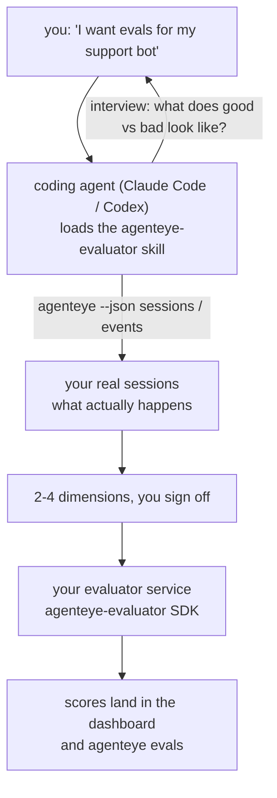

---
---
title: "Failproof AI Observability Evaluator Agent Skill"
description: "Go from \"I think our agent is sometimes bad\" to a deployed scoring service, with your coding agent doing both the deciding and the building."
---

*"मुझे लगता है हमारा agent कभी-कभी खराब है"* से लेकर deployed scoring service तक जाएं, आपके coding agent के साथ both the deciding और building दोनों कर रहे हों। **Failproof AI Observability evaluator skill** (`agenteye-evaluator`) एक *Agent Skill* है: instructions का एक छोटा folder जो एक coding agent जैसे Claude Code या Codex on demand load करता है। यह agent को सिखाता है कि कौन से quality dimensions आपके *agent* के लिए tracking के लायक हैं, फिर [evaluator service](/hi/agenteye/evaluation-suite) को write, test, और deploy करते हैं जो उन्हें score करता है।

यह एक **hosted scorer नहीं है**, न ही एक registry जहां आप upload करते हैं, न ही एक plugin system। आपका evaluator आपका अपना HTTP service रहता है आपके अपने infrastructure पर, बिल्कुल जैसा [Evaluation suite](/hi/agenteye/evaluation-suite) guide में described है। skill केवल आपके agent को इसे अच्छे तरीके से बनाना सिखाती है, इसलिए जो कुछ भी यह करता है, आप खुद कर सकते हैं same code लिखकर।

---

## कठिन हिस्सा है कि क्या score करें यह तय करना

SDK surface छोटा है — एक decorator और two models — और एक agent इसे [contract](/hi/agenteye/evaluation-suite#http-contract) से ही लिख सकता है। यहीं से evaluators fail नहीं होते। वे fail होते हैं क्योंकि वे गलत चीज़ को score करते हैं, और एक evaluator जो गलत चीज़ को score करता है वह कोई भी नहीं होने से बदतर है: यह एक dashboard produce करता है जिसे सब ignore करना सीख जाते हैं।

तो skill का ज़्यादातर हिस्सा code exist करने से पहले का है। इसमें agent आपसे interview करता है (*"एक run describe करें जो अच्छा गया; अब एक जो बुरा गया"*), फिर आपके real sessions को [`agenteye` CLI](/hi/agenteye/cli) के through pull करता है और उन्हें end to end पढ़ता है। ये दोनों halves आमतौर पर disagree करते हैं, और gap ही वह point है: जो आप measure करना चाहते हैं बनाम जो आपके transcripts actually support कर सकते हैं। एक dimension तभी survive करता है जब वह events से **computable** हो और **discriminating** हो — अगर यह आपके good run और bad run दोनों पर 0.9 score करता है, तो यह कुछ नहीं सिखाता और cut हो जाता है।

जो वापस आता है वह 2-4 dimensions का एक proposal है reasoning के साथ, जिसे आप कोई भी line लिखने से पहले sign off करते हैं।



---

## यह दूसरे evaluation pieces से कैसे संबंधित है

चार docs scoring को cover करते हैं, और वे order में एक-दूसरे को hand off करते हैं:

| Page | यह क्या है | इसे तब use करें जब |
|---|---|---|
| **[Evaluations](/hi/agenteye/evaluations)** | Feature: sessions grid पर scores, dashboards, re-evaluate | आप जानना चाहते हैं कि automatic scoring आपको क्या देता है |
| **[Evaluation suite](/hi/agenteye/evaluation-suite)** | HTTP contract, SDK, server env vars | आप evaluator को खुद implement या debug कर रहे हैं |
| **Evaluator skill** (यह doc) | Scorer को design *और* build करने का एक natural-language front door | आप "I want evals" से एक running service तक जाना चाहते हैं |
| **[CLI skill](/hi/agenteye/cli-skill)** | `agenteye` CLI का एक natural-language front door | आप scores को पढ़ना चाहते हैं जो आपके पास पहले से हैं |
| **[Python SDK skill](/hi/agenteye/python-sdk-skill)** | अपने agent को instrument करने का एक natural-language front door | आपका agent sessions emit नहीं कर रहा है — score करने के लिए कुछ नहीं है |

### CLI skill के मुकाबले: build बनाम read

दोनों skills intentionally non-overlapping हैं, और दोनों को install करना normal setup है — agent यह तय करता है कि आप क्या पूछते हैं इसके आधार पर:

- **`agenteye-evaluator`** (यह doc) उस चीज़ को build करता है जो scores *produce* करता है। इसका job तब खत्म होता है जब scores पहली बार land करते हैं।
- **[`agenteye-cli`](/hi/agenteye/cli-skill)** scores को पढ़ता है जो पहले से exist करते हैं (`agenteye evals`)। *"क्या quality इस हफ्ते drop हुई?"* इसका सवाल है, इस skill का नहीं।

---

## Prerequisites

1. **`agenteye` CLI installed और logged in** (`pipx install agenteye`, फिर `agenteye login`)। Skill इसे दो बार use करती है: real sessions को pull करने के लिए जिसके against यह design करती है, और यह confirm करने के लिए कि आपके scores end में land हुए। आपके login को `events:read` की ज़रूरत है, प्लस उस final check के लिए `evaluations:read`। CLI skill की तरह, यह **नहीं** कर सकता emailed one-time-code login को complete करना आपके लिए।
2. **Evaluator के लिए कहीं रहने के लिए जगह।** यह एक image में build हो जाता है और एक long-running service के रूप में run होता है, तो इसे एक real repo की ज़रूरत है, scratch file नहीं। Evaluators अक्सर अपने अपने repo में रहते हैं, agent से अलग जिसे scored किया जा रहा है — skill एक existing को look करती है और नए को scaffold करने से पहले पूछती है।
3. **`agenteye-evaluator` SDK wheel** — अपने agent के `pip` commands type करना शुरू करने से पहले अगला section पढ़ें।

---

## इसे कहां से प्राप्त करें

Skill Failproof AI के public skills collection में publish है:

**[github.com/FailproofAI/skills](https://github.com/FailproofAI/skills)** → [`skills/agenteye-evaluator/`](https://github.com/FailproofAI/skills/tree/main/skills/agenteye-evaluator)

Repository public है और skill को अपने credential की ज़रूरत नहीं है — यह केवल `agenteye` CLI को drive करता है session के साथ *जिसे* आप logged in थे, और *आपके* repo में code लिखता है। ध्यान दें कि यह अपने folder के रूप में ship होता है और `pipx install agenteye` package के inside **नहीं** है, तो इसे वहां न ढूंढें।

## Skill को install करना

सबसे तेज़ path [`skills`](https://skills.sh) CLI है, जो folder को fetch करता है और वहां drop करता है जहां आपका agent look करता है:

```bash
# Claude Code, यह project केवल
npx skills add FailproofAI/skills --skill agenteye-evaluator -a claude-code

# हर project (installs to ~/.claude/skills/)
npx skills add FailproofAI/skills --skill agenteye-evaluator -a claude-code -g --copy

# Codex इसकी जगह
npx skills add FailproofAI/skills --skill agenteye-evaluator -a codex
```

फिर इसे किसी दूसरे skill की तरह manage करें:

```bash
npx skills list -a claude-code           # क्या installed है
npx skills update agenteye-evaluator     # latest version pull करें
npx skills remove agenteye-evaluator     # इसे हटाएं
```

हाथ से install करना पसंद हैं? एक Agent Skill सिर्फ एक folder है जिसमें `SKILL.md` है (plus optional references), तो इसे copy करना काम करता है:

- **Claude Code**: `agenteye-evaluator/` folder को `~/.claude/skills/` में रखें (हर project) या `<your-repo>/.claude/skills/` में (केवल वह repo)। Claude Code इसे auto-discover करता है — `/skills` list से verify करें, या बस evals के लिए पूछें।
- **Codex (OpenAI)**: Codex same `SKILL.md` को read करता है। Bundled `agents/openai.yaml` `allow_implicit_invocation: true` set करता है, तो Codex skill को auto-select करता है जब task match हो; अन्यथा इसे explicitly invoke करें `$agenteye-evaluator` के रूप में।

---

## SDK public PyPI पर नहीं है

> **Warning:** Agent को SDK install करने देने से पहले यह पढ़ें।

Skill public है; जिस SDK को यह drive करता है वह नहीं है। `agenteye-evaluator` केवल एक private release artifact के रूप में ship होता है, और `agenteye` के विपरीत, name public PyPI पर **unclaimed** है — तो एक bare `pip install agenteye-evaluator` एक stranger के package को pull कर सकता है उस service में जो आपके production transcripts को read करता है। यह एक supply-chain problem है, typo नहीं।

Skill यह जानता है और इसकी जगह एक install ladder down करता है, पहले rung पर रुकता है जो apply होता है: monorepo source अगर आप AgentEye repo के inside हैं, अन्यथा GitHub Releases से private release wheel (needs access), और अगर न ही कोई reachable है तो यह **रुकता है और आपको अपने Failproof AI contact से wheel पूछने के लिए बताता है** improvising करने की बजाय।

तो अगर आपका agent public PyPI से bare `pip install agenteye-evaluator` propose करता है, वह flag है कि skill कभी load नहीं हुई। वहीं रुकें और check करें कि यह installed है।

---

## आप इससे क्या पूछ सकते हैं

एक real round-trip एक vague ask से शुरू होता है और code के साथ नहीं, signed-off design के साथ end होता है:

```text
you   ▸ मुझे हमारे support bot के लिए evals चाहिए। मुझे लगता है यह कभी-कभी
        खराब है।

agent ▸ कुछ लिखने से पहले: एक run describe करें जो अच्छा गया,
        और एक जो बुरा गया।

you   ▸ अच्छा: यह docs से answer करता है। बुरा: यह stuff बनाता है,
        या हार मानता है और कहता है "contact support"।

agent ▸ Running: agenteye --json sessions --status error --since 7d
        5 sessions पढ़ रहे हैं, दो सहित जिन्हें आप bad कहेंगे।

        आपके शब्द factuality और deflection कहते हैं। Transcripts
        deflection पर सहमत हैं (5 में से 2 support hand-off के साथ
        end होते हैं, और यह model_response.content में plain है),
        लेकिन factuality को ground truth की ज़रूरत है जो आपके
        events carry नहीं करते।

        तो मैं तीन चीज़ें score करूंगा:
          - deflection      rules, cheap, आपके दोनों runs को अलग करता है
          - tool_efficiency rules, run-004 में retry loop को catch करता है
          - groundedness    LLM judge: क्या हर claim जो यह retrieved है
                            docs में है?

        "factuality" को ground truth की ज़रूरत होगी जो हमारे पास
        नहीं है; groundedness सबसे करीबी चीज़ है जो आपके transcripts
        actually support कर सकते हैं। ये तीनों names के साथ ठीक है?
        बाद में rename करने से history split हो जाता है।

you   ▸ हां

agent ▸ इस repo में कोई evaluator नहीं। क्या मुझे यहां एक scaffold
        करना चाहिए, या क्या आपके पास कहीं और एक है?
```

वहां से यह पहले rules-based dimensions लिखता है (free, instant, deterministic), उन्हें एक real captured session के against test करता है जिसमें empty और never-finished ones भी शामिल हैं जो naive evaluators को crash करते हैं, और केवल subjective dimension पर एक LLM judge के लिए पहुंचता है। यह [dispatcher की limits](/hi/agenteye/evaluation-suite#configuring-the-server) को जानता है — 30s request timeout और 8 concurrent calls deployment-wide — तो अगर judge reliably fit नहीं होगा, तो यह `JobPending` के साथ async जाता है न कि आपके judge को cancelled और retried होने देता है पांच बार पांच बार लागत पर।

फिर यह deploy करता है, दो server env vars set करता है, और `agenteye --json evals --session-id <id>` से confirm करता है कि scores actually land हुए। Scores landing ही एकमात्र proof है।

---

## देखने के लिए क्या है

- **Dimension names करीब-करीब permanent हैं।** Score keys arbitrary strings हैं और platform जो कुछ भी आप send करते हैं उसे trend करता है, जिसका मतलब है कि कोई भी downstream एक bad choice को correct नहीं करता। बाद में rename करें और history split हो जाता है: old sessions old key को keep करते हैं और trend break हो जाता है। यही है कि skill को code लिखने से पहले explicit sign-off क्यों मिलता है — वह prompt को seriously लें।
- **Fixtures real production transcripts हैं।** Real sessions के against design करने का मतलब है उन्हें disk पर pull करना, और उनमें customer data हो सकता है। Skill यह commit करने से पहले पूछती है कि क्या git में करें; अगर doubt हो तो `fixtures/` को repo के बाहर रखें और हर developer को अपने अपने pull करने दें।
- **Agent एक service write और deploy करता है जो हर transcript को read करता है।** यह आपके रूप में कार्य करता है, bounded by आपके CLI login की permissions, लेकिन evaluator को review करें जैसे कोई अन्य code जो production data को touch करता है।

---

## अगले कदम

- **[Evaluation suite](/hi/agenteye/evaluation-suite)**: HTTP contract, SDK, और server env vars जिन्हें skill configure करता है।
- **[Evaluations](/hi/agenteye/evaluations)**: जहां scores show up होते हैं एक बार जब वे land करते हैं।
- **[CLI skill](/hi/agenteye/cli-skill)**: sibling skill, scorer build करने की बजाय results read करने के लिए।
- **[CLI](/hi/agenteye/cli)**: command reference जिसके against skill session data design करती है।