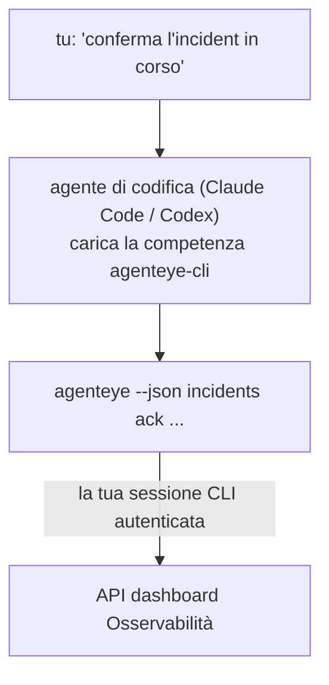

Chiedi al tuo agente di codifica *"c'è qualcosa di rotto oggi?"* e lascia che risponda dai tuoi dati di Osservabilità Failproof AI in tempo reale, senza comandi da memorizzare. La **competenza CLI di Osservabilità Failproof AI** (`agenteye-cli`) è un'*Agent Skill*: una piccola cartella di istruzioni che un agente di codifica come Claude Code o Codex carica su richiesta. Insegna all'agente a operare il tuo deployment di Osservabilità tramite la [`agenteye` CLI](/it/agenteye/cli) da richieste in linguaggio naturale come *"dai a CI una chiave che può solo inviare eventi"* o *"conferma l'incident in corso e assegnalo a me."*

**Non** è un servizio o un binario separato; non c'è nulla da distribuire. Funziona sulla CLI che hai già installato: l'agente esegue `agenteye --json …`, analizza il JSON pulito, e ti risponde in prosa. Tutto ciò che può fare, potresti farlo tu digitando gli stessi comandi.

---

## Come si relaziona con le altre interfacce di Osservabilità Failproof AI

Osservabilità Failproof AI ti offre quattro modi per raggiungere gli stessi dati e controlli. Si completano a vicenda:

| Interfaccia | Che cos'è | Dove viene eseguita | Usala quando |
|---|---|---|---|
| **[CLI](/it/agenteye/cli)** | Il riferimento comando/flag per `agenteye` | Il tuo terminale | Vuoi eseguire o scrivere uno script per un comando specifico |
| **[Ricette CLI](/it/agenteye/cli-recipes)** | Pattern `jq`/pipeline da copiare e incollare | Il tuo terminale / script | Stai integrando la CLI nell'automazione |
| **Competenza CLI** (questo documento) | Una porta in linguaggio naturale sulla CLI | Il tuo agente di codifica, sulla tua workstation | Vuoi *semplicemente chiedere* e lasciare che l'agente scelga il comando |
| **[Competenza Evaluator](/it/agenteye/evaluator-skill)** | Una competenza gemella che progetta e costruisce il tuo servizio di scoring | Il tuo agente di codifica, sulla tua workstation | Vuoi *produrre* punteggi di valutazione piuttosto che leggerli |
| **[Competenza Python SDK](/it/agenteye/python-sdk-skill)** | Una competenza gemella che strumenta il tuo agente in modo che emetta telemetria | Il tuo agente di codifica, sulla tua workstation | Vuoi che il tuo agente *produca* gli eventi che questa competenza legge |
| **[Assistente AI nella dashboard](/it/agenteye/assistant)** | Una chat incorporata nella dashboard | Lato server (nella dashboard) | Vuoi domande e risposte nella dashboard sui tuoi dati |

La competenza stessa non ha privilegi propri; converte semplicemente le tue parole in chiamate CLI che vengono eseguite come te:



### vs. assistente AI nella dashboard: una distinzione importante

Questi sono due strumenti diversi con raggi di esplosione molto diversi:

- L'**assistente AI nella dashboard** ([Assistente AI](/it/agenteye/assistant)) è una chat incorporata nella dashboard, supportata dal servizio agente. È **di sola lettura più authoring controllato dall'approvazione**: può bozze salvate query e dashboard, ma ogni scrittura si ferma per la tua approvazione esplicita cliccabile, e non cancella mai. È controllato dall'autorizzazione `agent:use` e vede solo i dati dell'organizzazione che stai visualizzando.
- La **competenza CLI** viene eseguita sulla *tua* workstation dentro *il tuo* agente di codifica e guida la CLI `agenteye` come **tu**. Può eseguire la **superficie completa, incluse le mutazioni** (create/ruota/disabilita chiavi API, cambia impostazioni org, risolvi incident, elimina query salvate), limitato solo dalle autorizzazioni del tuo accesso CLI. Trattala esattamente come faresti con l'esecuzione manuale di quei comandi.

---

## Prerequisiti

1. La **CLI `agenteye` installata** e su `PATH` (vedi il riferimento [CLI](/it/agenteye/cli): `pipx install agenteye`).
2. Il **tuo URL della dashboard impostato** (`AGENTEYE_DASHBOARD_URL`, o l'agente passa `--base-url`).
3. Una **sessione autenticata**: esegui prima `agenteye login` tu stesso. La competenza **non può** completare l'accesso con codice monouso inviato per email; ti dirà di eseguire `agenteye login` se la sessione manca o è scaduta (codice di uscita CLI `4`).

---

## Dove trovarla

La competenza è pubblicata nella raccolta di competenze pubbliche di Failproof AI:

**[github.com/FailproofAI/skills](https://github.com/FailproofAI/skills)** → [`skills/agenteye-cli/`](https://github.com/FailproofAI/skills/tree/main/skills/agenteye-cli)

Niente è controllato — il repository è pubblico e la competenza non ha bisogno di credenziali proprie, perché guida solo la CLI `agenteye` **pubblica** contro *la tua* dashboard, usando la sessione in cui *tu* hai effettuato l'accesso. Non devi chiedere a nessuno.

Nota che viene spedita come sua propria cartella e **non** si trova all'interno del pacchetto `pipx install agenteye`, quindi non cercarla lì.

## Installazione della competenza

Il percorso più veloce è la CLI [`skills`](https://skills.sh), che recupera la cartella e la mette dove il tuo agente guarda:

```bash
# Claude Code, questo progetto solo
npx skills add FailproofAI/skills --skill agenteye-cli -a claude-code

# ogni progetto (installa in ~/.claude/skills/)
npx skills add FailproofAI/skills --skill agenteye-cli -a claude-code -g --copy

# Codex invece
npx skills add FailproofAI/skills --skill agenteye-cli -a codex
```

Quindi gestiscila come qualsiasi altra competenza:

```bash
npx skills list -a claude-code      # cosa è installato
npx skills update agenteye-cli      # tira l'ultima versione
npx skills remove agenteye-cli      # rimuovila
```

Preferisci installare a mano? Un'Agent Skill è solo una cartella contenente un `SKILL.md` (più riferimenti opzionali), quindi copiarla funziona:

- **Claude Code**: metti la cartella `agenteye-cli/` in `~/.claude/skills/` (ogni progetto) o `<your-repo>/.claude/skills/` (solo quel repository). Claude Code la scopre automaticamente — verifica con la lista `/skills`, o semplicemente fai una domanda che corrisponde alla sua descrizione.
- **Codex (OpenAI)**: Codex legge lo stesso `SKILL.md`. Il `agents/openai.yaml` in bundle imposta `allow_implicit_invocation: true`, quindi Codex seleziona automaticamente la competenza quando un'attività corrisponde; altrimenti invocala esplicitamente come `$agenteye-cli`.

---

## Sicurezza: le mutazioni NON chiedono conferma quando un agente esegue la CLI

> **Avvertenza:** Leggi questo prima di lasciare che un agente faccia cambiamenti.

La CLI `agenteye` normalmente chiede *"sei sicuro?"* prima di un'azione distruttiva. **Salta automaticamente quella conferma ogni volta che non è collegata a un terminale (che è esattamente come un agente di codifica la esegue), e `--json` la salta anche.** Quindi il prompt di sicurezza **non** attiverà per l'agente.

La competenza è scritta per compensare: le è stato insegnato di dichiarare il comando esatto che eseguirà e ottenere il tuo **OK esplicito prima di qualsiasi cambio di stato**. Mantieni quella disciplina. Quando guidi Osservabilità Failproof AI attraverso un agente, *tu* sei il passo di conferma. I comandi che cambiano lo stato da osservare:

- `keys create` / `update` / `disable` / `regenerate`
- `users create` / `update` / `disable` / `enable`
- `settings set`
- `alerts create` / `update` / `delete` / `test`
- i sottocomandi di scrittura `incidents`: `ack` / `assign` / `resolve` / `open` / `comment-add` / `comment-delete` / `subscribe` / `unsubscribe`
- `query create` / `update` / `delete`
- `agent rename` / `delete`
- `orgs switch`

Tutto sotto **Observe** (`events`, `sessions`, `evals`, `errors`, `list`, `whoami`, `orgs list/current/perms`) è di sola lettura e non cambia nulla.

Poiché l'agente agisce come **tu**, può fare solo ciò che il tuo accesso è autorizzato a fare; le autorizzazioni vengono risolte **per organizzazione** (vedi [Chiavi API](/it/agenteye/api-keys)). Un comando per il quale non hai autorizzazione restituisce il codice di uscita `5` con l'autorizzazione esatta denominata, quindi l'agente può dirti precisamente cosa chiedere a un amministratore invece di fallire oscuramente.

---

## Cosa puoi chiederle

Ecco come appare un vero scambio, una lettura, quindi un cambio che attende il tuo OK:

```text
tu    ▸ C'è qualcosa di rotto nell'ultimo giorno?

agente ▸ Esecuzione: agenteye --json errors --since 24h --aggregate
         3 tipi di errore nelle ultime 24h. Il più grande è TimeoutError
         (18 hit, tutti su checkout-agent), poi RateLimited (5).
         Vuoi le sessioni fallite per TimeoutError?

tu    ▸ Dai a CI una chiave che può solo inviare eventi.

agente ▸ Questo crea una chiave API. Eseguirò:
         agenteye keys create ci --add events:add
         OK per procedere?

tu    ▸ sì

agente ▸ Fatto. Chiave "ci" creata con solo events:add.
         Il segreto viene mostrato solo una volta, quindi salvalo ora. Non posso ristamparlo.
```

La competenza mappa ogni intento in linguaggio naturale al giusto comando `agenteye`, scoprendo prima i valori validi (`list <kind>`, `whoami`) quindi non indovina, e dichiara il comando esatto prima di qualsiasi cambio. Altri esempi:

- *"C'è qualcosa di rotto / fallito nelle ultime 24 ore?"* → `errors --since 24h --aggregate`, poi un breakdown.
- *"Perché la sessione `run-001` ha fallito?"* → `events --session-id run-001 --all` + `evals --session-id run-001`.
- *"Come sta andando la qualità questa settimana?"* → `evals --aggregate --since 7d`, poi approfondisci nei run con punteggio basso.
- *"Dai a CI una chiave che può solo inviare eventi."* → `keys create ci --add events:add` (dichiara il comando, lo crea e cattura il segreto monouso).
- *"Chi ha accesso? Rendi Dana di sola lettura."* → `users list` → `users update dana@… --permission-set read-only` (dopo confirmare con te).
- *"Conferma l'incident in corso e assegnalo a me."* → `incidents list --state firing` → `incidents ack <id>` / `incidents assign <id> you@…`.

Per i comandi esatti, flag e forme JSON dietro questi, vedi il riferimento [CLI](/it/agenteye/cli) e [Ricette CLI per agenti](/it/agenteye/cli-recipes).

---

## Prossimi passi

- **[CLI](/it/agenteye/cli)**: riferimento completo di comando e flag per `agenteye`.
- **[Ricette CLI per agenti](/it/agenteye/cli-recipes)**: pattern `jq` da copiare e incollare e gestione del codice di uscita.
- **[Competenza agente Evaluator](/it/agenteye/evaluator-skill)**: la competenza gemella, per costruire l'evaluator i cui punteggi `agenteye evals` legge.
- **[Competenza agente Python SDK](/it/agenteye/python-sdk-skill)**: la competenza gemella, per strumentare un agente in modo che emetta la telemetria che `agenteye` legge.
- **[Assistente AI](/it/agenteye/assistant)**: l'assistente nella dashboard (da non confondere con questa competenza di terminale).
- **[Chiavi API](/it/agenteye/api-keys)**: il modello di autorizzazione per organizzazione che limita quello che la competenza può fare.