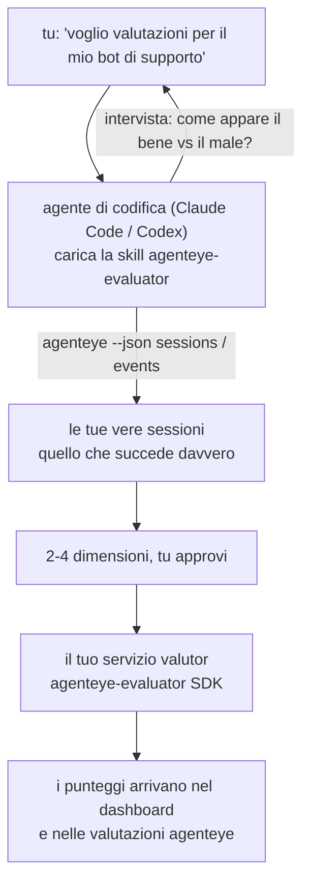

Da *«penso che il nostro agente a volte funzioni male»* a un servizio di scoring distribuito, con il tuo agente che decide e costruisce tutto. La **skill di valutazione Failproof AI Observability** (`agenteye-evaluator`) è un *Agent Skill*: una piccola cartella di istruzioni che un agente di codifica come Claude Code o Codex carica su richiesta. Insegna all'agente a capire quali dimensioni di qualità vale la pena tracciare per *il tuo* agente, quindi scrivere, testare e distribuire il [servizio di valutazione](/it/agenteye/evaluation-suite) che le punteggia.

**Non** è uno scorer ospitato, un registro su cui caricare dati, o un sistema di plugin. Il tuo valutor rimane un tuo servizio HTTP sulla tua infrastruttura, esattamente come descritto nella guida [Evaluation suite](/it/agenteye/evaluation-suite). La skill insegna semplicemente al tuo agente a costruirlo bene, così tutto ciò che fa, potresti farlo tu scrivendo lo stesso codice.

---

## La parte difficile è decidere cosa punteggiare

La superficie dell'SDK è piccola — un decoratore e due modelli — e un agente può scriverla dal [contratto](/it/agenteye/evaluation-suite#http-contract) da solo. Non è lì che i valutor falliscono. Falliscono perché punteggiamo la cosa sbagliata, e un valutor che punteggia la cosa sbagliata è peggio di niente: produce una dashboard che tutti imparano a ignorare.

Quindi gran parte della skill è la parte prima che esista del codice. Fa sì che l'agente ti intervisti (*«descrivi un'esecuzione andata bene; ora una andata male»*), poi tiri le tue vere sessioni attraverso la [`agenteye` CLI](/it/agenteye/cli) e le legga da cima a fondo. Queste due parti di solito non concordano, e il divario è il punto: quello che intendi misurare rispetto a quello che i tuoi transcript possono effettivamente supportare. Una dimensione sopravvive solo se è **calcolabile** dagli eventi e **discriminante** — se punteggia 0.9 sia sulla tua buona esecuzione che su quella cattiva, non insegna nulla e viene tagliata.

Quello che torna è una proposta di 2-4 dimensioni con il ragionamento allegato, per te da approvare prima che venga scritta una riga.



---

## Come si relaziona agli altri pezzi di valutazione

Quattro documenti riguardano il scoring e si passano il testimone in ordine:

| Pagina | Cos'è | Usalo quando |
|---|---|---|
| **[Evaluations](/it/agenteye/evaluations)** | La funzione: punteggi nella griglia delle sessioni, dashboard, rivalutazione | Vuoi sapere cosa ottiene il scoring automatico |
| **[Evaluation suite](/it/agenteye/evaluation-suite)** | Il contratto HTTP, l'SDK, le variabili d'ambiente del server | Stai implementando o debuggando il valutor tu stesso |
| **Evaluator skill** (questo doc) | Una porta d'ingresso in linguaggio naturale per progettare *e* costruire il valutor | Vuoi passare da «voglio valutazioni» a un servizio in esecuzione |
| **[CLI skill](/it/agenteye/cli-skill)** | Una porta d'ingresso in linguaggio naturale sulla `agenteye` CLI | Vuoi *leggere* i punteggi che hai già |
| **[Python SDK skill](/it/agenteye/python-sdk-skill)** | Una porta d'ingresso in linguaggio naturale sull'instrumentazione del tuo agente | Il tuo agente non sta ancora emettendo sessioni — non c'è nulla da punteggiare |

### vs. la CLI skill: costruire rispetto a leggere

Le due skill sono deliberatamente non sovrapposte, e installare entrambe è la configurazione normale — l'agente sceglie tra loro in base a quello che chiedi:

- **`agenteye-evaluator`** (questo doc) costruisce la cosa che *produce* punteggi. Il suo lavoro finisce quando i punteggi arrivano per la prima volta.
- **[`agenteye-cli`](/it/agenteye/cli-skill)** legge punteggi che già esistono (`agenteye evals`). «La qualità è diminuita questa settimana?» è sua domanda, non di questa skill.

---

## Prerequisiti

1. La **`agenteye` CLI installata e connessa** (`pipx install agenteye`, poi `agenteye login`). La skill vi fa affidamento due volte: per tirare le vere sessioni su cui progetta, e per confermare che i tuoi punteggi sono arrivati alla fine. Il tuo login ha bisogno di `events:read`, più `evaluations:read` per quel controllo finale. Come con la CLI skill, **non può** completare per te il login con codice monouso inviato per email.
2. **Un posto dove il valutor vive.** Viene costruito in un'immagine ed eseguito come servizio a lungo termine, quindi ha bisogno di un vero repo, non di un file temporaneo. I valutor spesso vivono nel loro repo, separato dall'agente che viene punteggiato — la skill cerca uno esistente e chiede prima di scaffoldare uno nuovo.
3. **La wheel dell'SDK `agenteye-evaluator`** — leggi la prossima sezione prima che il tuo agente inizi a digitare comandi `pip`.

---

## Dove ottenerlo

La skill è pubblicata nella collezione pubblica di skill di Failproof AI:

**[github.com/FailproofAI/skills](https://github.com/FailproofAI/skills)** → [`skills/agenteye-evaluator/`](https://github.com/FailproofAI/skills/tree/main/skills/agenteye-evaluator)

Il repository è pubblico e la skill non ha bisogno di credenziali proprie — guida solo la `agenteye` CLI con la sessione in cui *tu* ti sei connesso, e scrive codice nel *tuo* repo. Nota che viene spedita come propria cartella e **non** è dentro il pacchetto `pipx install agenteye`, quindi non cercarla lì.

## Installazione della skill

Il percorso più veloce è la CLI [`skills`](https://skills.sh), che scarica la cartella e la mette dove il tuo agente guarda:

```bash
# Claude Code, questo progetto solo
npx skills add FailproofAI/skills --skill agenteye-evaluator -a claude-code

# ogni progetto (installa a ~/.claude/skills/)
npx skills add FailproofAI/skills --skill agenteye-evaluator -a claude-code -g --copy

# Codex invece
npx skills add FailproofAI/skills --skill agenteye-evaluator -a codex
```

Poi gestiscila come qualsiasi altra skill:

```bash
npx skills list -a claude-code           # cosa è installato
npx skills update agenteye-evaluator     # tira l'ultima versione
npx skills remove agenteye-evaluator     # rimuovila
```

Preferisci installare a mano? Un Agent Skill è solo una cartella contenente un `SKILL.md` (più riferimenti opzionali), quindi copiarlo funziona anche:

- **Claude Code**: metti la cartella `agenteye-evaluator/` in `~/.claude/skills/` (ogni progetto) o `<tuo-repo>/.claude/skills/` (solo quel repo). Claude Code la scopre automaticamente — verifica con la lista `/skills`, o semplicemente chiedi valutazioni.
- **Codex (OpenAI)**: Codex legge lo stesso `SKILL.md`. Il `agents/openai.yaml` incluso imposta `allow_implicit_invocation: true`, quindi Codex auto-seleziona la skill quando un compito corrisponde; altrimenti invocare esplicitamente come `$agenteye-evaluator`.

---

## L'SDK non è su PyPI pubblico

> **Avviso:** Leggi questo prima di lasciare che un agente installi l'SDK.

La skill è pubblica; l'SDK che guida non lo è. `agenteye-evaluator` viene spedito solo come artefatto di rilascio privato, e a differenza di `agenteye`, il nome è **non rivendicato su PyPI pubblico** — quindi un semplice `pip install agenteye-evaluator` potrebbe tirare il pacchetto di uno straniero nel servizio che legge i tuoi transcript di produzione. Questo è un problema di supply chain, non un errore di battitura.

La skill lo sa e funziona secondo una scala di installazione, fermandosi al primo gradino che si applica: il codice del monorepo se sei dentro il repo AgentEye, altrimenti la wheel di rilascio privata da GitHub Releases (serve accesso), e se nessuno dei due è raggiungibile **si ferma e ti dice di chiedere al tuo contatto Failproof AI la wheel** piuttosto che improvvisare.

Quindi se il tuo agente propone un semplice `pip install agenteye-evaluator` da PyPI pubblico, quello è il segnale che la skill non è mai stata caricata. Fermati lì e controlla che sia installata.

---

## Cosa puoi chiedergli

Un vero percorso completo inizia con una richiesta vaga e finisce con un design approvato, non con il codice:

```text
tu    ▸ Voglio valutazioni per il nostro bot di supporto. Penso 
        sia a volte cattivo.

agente ▸ Prima che scriva qualsiasi cosa: descrivi un'esecuzione 
        andata bene, e una andata male.

tu    ▸ Bene: risponde dai documenti. Male: inventa cose, o rinuncia 
        e dice «contatta il supporto».

agente ▸ Esecuzione: agenteye --json sessions --status error --since 7d
        Leggo 5 sessioni, incluse due che chiameresti cattive.

        Le tue parole dicono fattualità e defezione. I transcript 
        concordano sulla defezione (2 di 5 terminano con una 
        consegna al supporto, ed è evidente in model_response.content), 
        ma la fattualità ha bisogno di una ground truth che i tuoi 
        eventi non portano.

        Quindi punteggierei tre cose:
          - deflection      regole, economico, separa le tue due esecuzioni
          - tool_efficiency regole, cattura il loop di riprova in run-004
          - groundedness    giudice LLM: ogni affermazione è nei documenti che ha recuperato?

        «factuality» avrebbe bisogno di ground truth che non abbiamo; 
        groundedness è la cosa più vicina che i tuoi transcript possono 
        effettivamente supportare. OK con questi tre nomi? Rinominare 
        dopo spacca la cronologia.

tu    ▸ sì

agente ▸ Nessun valutor in questo repo. Dovrei scaffoldarne uno qui, 
        o ne hai uno altrove?
```

Da lì scrive le dimensioni basate su regole per prime (gratis, istantanee, deterministiche), le testa rispetto a una sessione catturata reale incluse quelle vuote e mai finite che fanno crashare i valutor ingenui, e raggiunge solo un giudice LLM sulla dimensione soggettiva. Conosce i [limiti del dispatcher](/it/agenteye/evaluation-suite#configuring-the-server) — un timeout di richiesta di 30 secondi e 8 chiamate concorrenti deployment-wide — quindi se il giudice non si adatterà in modo affidabile, va asincrono con `JobPending` piuttosto che lasciare che il tuo giudice sia cancellato e riprovato cinque volte cinque volte il costo.

Poi distribuisce, imposta le due variabili d'ambiente del server, e conferma con `agenteye --json evals --session-id <id>` che i punteggi sono effettivamente arrivati. I punteggi che arrivano sono l'unica prova.

---

## Cosa stare attenti

- **I nomi delle dimensioni sono quasi permanenti.** Le chiavi di score sono stringhe arbitrarie e la piattaforma tende quello che invii, il che significa che nulla downstream corregge una scelta sbagliata. Rinominare dopo e la cronologia si spacca: le vecchie sessioni mantengono la vecchia chiave e il trend si interrompe. Per questo la skill ottiene l'approvazione esplicita prima di scrivere il codice — prendi quel prompt seriamente.
- **Le fixture sono veri transcript di produzione.** Progettare rispetto a sessioni reali significa tirarle su disco, e possono contenere dati dei clienti. La skill chiede prima di commetterli a git; se hai dubbi, mantieni `fixtures/` fuori dal repo e fai in modo che ogni sviluppatore tiri i propri.
- **L'agente scrive e distribuisce un servizio che legge ogni transcript.** Agisce come te, limitato dalle autorizzazioni del login della tua CLI, ma rivedi il valutor come qualsiasi altro codice che tocca dati di produzione.

---

## Prossimi passi

- **[Evaluation suite](/it/agenteye/evaluation-suite)**: il contratto HTTP, l'SDK, e le variabili d'ambiente del server che la skill configura.
- **[Evaluations](/it/agenteye/evaluations)**: dove i punteggi compaiono una volta che arrivano.
- **[CLI skill](/it/agenteye/cli-skill)**: la skill gemella, per leggere i risultati piuttosto che costruire il valutor.
- **[CLI](/it/agenteye/cli)**: il riferimento dei comandi dietro i dati di sessione su cui la skill progetta.