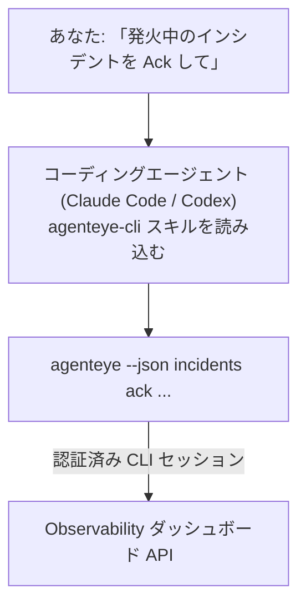

コーディングエージェントに *「今日何か壊れてる？」* と聞くだけで、ライブの Failproof AI Observability データから回答を得られます。コマンドを暗記する必要はありません。**Failproof AI Observability CLI スキル**（`agenteye-cli`）は *エージェントスキル* です。これは、Claude Code や Codex などのコーディングエージェントがオンデマンドで読み込む小さな指示フォルダです。このスキルにより、エージェントは *「CI にイベントのプッシュだけできるキーを作って」* や *「発火中のインシデントを Ack して私にアサインして」* といった平易な英語のリクエストを通じて、[`agenteye` CLI](/ja/agenteye/cli) を使って Observability のデプロイを操作できるようになります。

これは**サービスでも独立したバイナリでもありません**。デプロイするものは何もありません。すでにインストール済みの CLI の上で動作し、エージェントが `agenteye --json …` を呼び出してクリーンな JSON をパースし、散文で回答します。エージェントができることはすべて、同じコマンドを入力すれば自分でもできます。

---

## 他の Failproof AI Observability インターフェースとの関係

Failproof AI Observability では、同じデータとコントロールに到達する方法が4つあります。それぞれ補完し合う関係です：

| インターフェース | 内容 | 実行場所 | 使いどころ |
|---|---|---|---|
| **[CLI](/ja/agenteye/cli)** | `agenteye` のコマンド・フラグリファレンス | ターミナル | 特定のコマンドを実行またはスクリプト化したいとき |
| **[CLI レシピ](/ja/agenteye/cli-recipes)** | コピペ可能な `jq`/パイプラインパターン | ターミナル / スクリプト | CLI を自動化に組み込みたいとき |
| **CLI スキル**（このドキュメント） | CLI への自然言語フロントドア | ワークステーション上のコーディングエージェント | コマンドを選ばずに *ただ聞く* だけにしたいとき |
| **[Evaluator スキル](/ja/agenteye/evaluator-skill)** | スコアリングサービスを設計・構築するための兄弟スキル | ワークステーション上のコーディングエージェント | eval スコアを *読む* のではなく *生成* したいとき |
| **[Python SDK スキル](/ja/agenteye/python-sdk-skill)** | エージェントがテレメトリを送出できるようにする兄弟スキル | ワークステーション上のコーディングエージェント | このスキルが読み取るイベントをエージェントに *生成* させたいとき |
| **[ダッシュボード内 AI アシスタント](/ja/agenteye/assistant)** | ダッシュボードに埋め込まれたチャット | サーバーサイド（ダッシュボード内） | データに対するダッシュボード内 Q&A を使いたいとき |

スキル自体は独自の権限を持ちません。あなたの言葉を CLI コールに変換し、あなたとして実行するだけです：



### ダッシュボード内 AI アシスタントとの違い：重要な区別

これらは影響範囲が大きく異なる2つの別ツールです：

- **ダッシュボード内 AI アシスタント**（[AI アシスタント](/ja/agenteye/assistant)）はダッシュボードに埋め込まれたチャットで、エージェントサービスによってバックアップされています。**読み取り専用＋承認ゲート付き作成**：保存クエリやダッシュボードの下書きを作成できますが、書き込みはすべてあなたの明示的なクリック承認を求めて停止し、削除は行いません。`agent:use` 権限でゲートされており、閲覧中の組織のデータのみを参照します。
- **CLI スキル**は *あなたの* ワークステーション上の *あなたの* コーディングエージェント内で動作し、**あなた**として `agenteye` CLI を操作します。API キーの作成・ローテーション・無効化、組織設定の変更、インシデントの解決、保存クエリの削除など、**ミューテーションを含む CLI の全機能**を実行できます。制限はあなたの CLI ログインの権限のみです。これらのコマンドを手動で実行するのと同じくらい慎重に扱ってください。

---

## 前提条件

1. **`agenteye` CLI がインストール済み**で `PATH` に通っていること（[CLI](/ja/agenteye/cli) リファレンス参照：`pipx install agenteye`）。
2. **ダッシュボード URL** が設定されていること（`AGENTEYE_DASHBOARD_URL`、またはエージェントが `--base-url` を渡す）。
3. **ログイン済みセッション**：事前に `agenteye login` を実行しておくこと。スキルはメールで送られるワンタイムコードによるログインを**完了できません**。セッションが存在しないか期限切れの場合（CLI 終了コード `4`）、`agenteye login` を実行するよう案内します。

---

## 入手方法

このスキルは Failproof AI の公開スキルコレクションで公開されています：

**[github.com/FailproofAI/skills](https://github.com/FailproofAI/skills)** → [`skills/agenteye-cli/`](https://github.com/FailproofAI/skills/tree/main/skills/agenteye-cli)

一切ゲートはありません。リポジトリは公開されており、スキルは独自の認証情報を必要としません。**公開**の `agenteye` CLI をあなたのダッシュボードに対して、あなたがログインしたセッションを使って動かすだけだからです。誰かに許可を求める必要はありません。

スキルは独自のフォルダとして提供されており、`pipx install agenteye` パッケージには**含まれていません**。そこを探さないようにしてください。

## スキルのインストール

最も手軽な方法は [`skills`](https://skills.sh) CLI です。フォルダを取得し、エージェントが参照する場所に配置します：

```bash
# Claude Code、このプロジェクトのみ
npx skills add FailproofAI/skills --skill agenteye-cli -a claude-code

# すべてのプロジェクト（~/.claude/skills/ にインストール）
npx skills add FailproofAI/skills --skill agenteye-cli -a claude-code -g --copy

# Codex の場合
npx skills add FailproofAI/skills --skill agenteye-cli -a codex
```

インストール後は他のスキルと同様に管理できます：

```bash
npx skills list -a claude-code      # インストール済みスキルの確認
npx skills update agenteye-cli      # 最新バージョンに更新
npx skills remove agenteye-cli      # 削除
```

手動でインストールしたい場合も可能です。エージェントスキルは `SKILL.md`（およびオプションの参照ファイル）を含むフォルダに過ぎないので、コピーするだけで機能します：

- **Claude Code**：`agenteye-cli/` フォルダを `~/.claude/skills/`（すべてのプロジェクト）または `<リポジトリ>/.claude/skills/`（そのリポジトリのみ）に配置します。Claude Code が自動検出します。`/skills` リストで確認するか、スキルの説明に合致する質問をするだけで確認できます。
- **Codex（OpenAI）**：Codex は同じ `SKILL.md` を読み込みます。バンドルされている `agents/openai.yaml` で `allow_implicit_invocation: true` が設定されているため、タスクが一致すると Codex が自動でスキルを選択します。明示的に呼び出す場合は `$agenteye-cli` を使用してください。

---

## 安全性：エージェントが CLI を実行するときミューテーションは確認を求めません

> **警告：** エージェントに変更を加えさせる前に必ずお読みください。

`agenteye` CLI は通常、破壊的な操作の前に *「本当によろしいですか？」* と尋ねます。しかし、**ターミナルに接続されていない場合（コーディングエージェントが実行する方法はまさにこれです）は確認を自動スキップし、`--json` もスキップします。** そのため、エージェントに対して安全確認プロンプトは**表示されません**。

スキルはこれを補うように設計されています。実行するコマンドを明示し、**状態変更の前に明示的な OK を求める**よう指示されています。この規律を守ってください。エージェントを通じて Failproof AI Observability を操作するとき、*あなた自身*が確認ステップです。注意すべき状態変更コマンドは以下のとおりです：

- `keys create` / `update` / `disable` / `regenerate`
- `users create` / `update` / `disable` / `enable`
- `settings set`
- `alerts create` / `update` / `delete` / `test`
- 書き込み系の `incidents` サブコマンド：`ack` / `assign` / `resolve` / `open` / `comment-add` / `comment-delete` / `subscribe` / `unsubscribe`
- `query create` / `update` / `delete`
- `agent rename` / `delete`
- `orgs switch`

**Observe** 系（`events`、`sessions`、`evals`、`errors`、`list`、`whoami`、`orgs list/current/perms`）はすべて読み取り専用で、何も変更しません。

エージェントは**あなた**として動作するため、あなたのログインが許可していることしかできません。権限は**組織ごと**に解決されます（[API キー](/ja/agenteye/api-keys)を参照）。権限のないコマンドは終了コード `5` と該当する権限名を返すため、エージェントは不透明に失敗するのではなく、管理者に何を依頼すればよいかを正確に伝えられます。

---

## 何を聞けるか

実際のやり取りの例です。まず読み取り、次に OK を待つ変更：

```text
you   ▸ Is anything broken in the last day?

agent ▸ Running: agenteye --json errors --since 24h --aggregate
        3 error types in the last 24h. The biggest is TimeoutError
        (18 hits, all on the checkout-agent), then RateLimited (5).
        Want the failing sessions for TimeoutError?

you   ▸ Give CI a key that can only push events.

agent ▸ This creates an API key. I'll run:
          agenteye keys create ci --add events:add
        OK to proceed?

you   ▸ yes

agent ▸ Done. Key "ci" created with events:add only.
        The secret is shown only once, so store it now. I can't reprint it.
```

スキルは各平易な英語の意図を適切な `agenteye` コマンドにマッピングします。有効な値を先に確認し（`list <kind>`、`whoami`）、推測せず、変更前に正確なコマンドを提示します。その他の例：

- *「過去24時間で何か壊れている・失敗しているものはある？」* → `errors --since 24h --aggregate`、その後詳細。
- *「セッション `run-001` はなぜ失敗した？」* → `events --session-id run-001 --all` + `evals --session-id run-001`。
- *「今週の品質トレンドは？」* → `evals --aggregate --since 7d`、その後低スコアの実行を詳しく調査。
- *「CI にイベントのプッシュだけできるキーを作って。」* → `keys create ci --add events:add`（コマンドを提示し、作成してワンタイムシークレットを取得）。
- *「誰がアクセス権を持っている？Dana を読み取り専用にして。」* → `users list` → `users update dana@… --permission-set read-only`（あなたに確認後）。
- *「発火中のインシデントを Ack して私にアサインして。」* → `incidents list --state firing` → `incidents ack <id>` / `incidents assign <id> you@…`。

これらの背後にある正確なコマンド、フラグ、JSON の形式については、[CLI](/ja/agenteye/cli) リファレンスと[エージェント向け CLI レシピ](/ja/agenteye/cli-recipes)を参照してください。

---

## 次のステップ

- **[CLI](/ja/agenteye/cli)**：`agenteye` のコマンドとフラグの完全リファレンス。
- **[エージェント向け CLI レシピ](/ja/agenteye/cli-recipes)**：コピペ可能な `jq` パターンと終了コードの処理。
- **[Evaluator エージェントスキル](/ja/agenteye/evaluator-skill)**：`agenteye evals` が読み取るスコアを生成する評価器を構築するための兄弟スキル。
- **[Python SDK エージェントスキル](/ja/agenteye/python-sdk-skill)**：`agenteye` が読み取るテレメトリを送出するようにエージェントを計装する兄弟スキル。
- **[AI アシスタント](/ja/agenteye/assistant)**：ダッシュボード内アシスタント（このターミナルスキルとは別物です）。
- **[API キー](/ja/agenteye/api-keys)**：スキルが実行できる内容を制限する組織ごとの権限モデル。