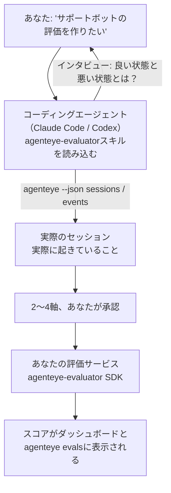

「エージェントの品質が不安定かもしれない」という状態から、コーディングエージェントが設計と実装の両方を担いながら、スコアリングサービスをデプロイするところまで到達できます。**Failproof AI オブザーバビリティ 評価スキル**（`agenteye-evaluator`）は*エージェントスキル*です。Claude Code や Codex などのコーディングエージェントがオンデマンドで読み込む、小さな命令のフォルダーです。このスキルは、エージェントが*あなたの*エージェントにとって追跡すべき品質軸を判断し、それをスコアリングする[評価サービス](/ja/agenteye/evaluation-suite)を作成・テスト・デプロイする方法を教えます。

これはホスト型のスコアラーでも、アップロード先のレジストリでも、プラグインシステムでもありません。評価サービスは[Evaluation suite](/ja/agenteye/evaluation-suite)ガイドに記載のとおり、あくまでご自身のインフラ上で動作するHTTPサービスとして、あなた自身のものとして維持されます。このスキルは、エージェントがそれをうまく構築できるよう教えるだけです。スキルが行うことは、同じコードを自分で書けばすべて自分でも実現できます。

---

## 難しいのは、何をスコアリングするかを決めること

SDKのサーフェスは小さく、デコレーターとふたつのモデルだけです。エージェントは[コントラクト](/ja/agenteye/evaluation-suite#http-contract)だけからでもそれを書くことができます。評価システムが失敗するのはそこではありません。失敗の原因は、間違ったものをスコアリングすることです。そして間違ったものをスコアリングする評価システムは、ないよりも悪い結果をもたらします。誰もが無視することを覚えてしまうダッシュボードを生み出すからです。

だから、スキルの大部分はコードが存在する前の段階にあります。スキルはエージェントにあなたへのインタビューをさせます（「うまくいったセッションを説明してください。次に、うまくいかなかったものを」）。そして[`agenteye` CLI](/ja/agenteye/cli)を通じて実際のセッションを取得し、最初から最後まで読み込みます。この２つの側面は通常一致せず、そのギャップこそが重要です。あなたが測定したいと意図していることと、実際のトランスクリプトがサポートできることの差です。ある軸が残るのは、イベントから**算出可能**で、かつ**識別力がある**場合のみです。良いセッションでも悪いセッションでも0.9のスコアになるなら、何も教えてくれないため除外されます。

返ってくるのは、コードが一行も書かれる前に、あなたが承認するための理由付きの2〜4軸の提案です。



---

## 他の評価コンポーネントとの関係

スコアリングに関するドキュメントは4つあり、順番に引き継ぎ合います。

| ページ | 内容 | 参照するタイミング |
|---|---|---|
| **[Evaluations](/ja/agenteye/evaluations)** | 機能：セッショングリッドのスコア、ダッシュボード、再評価 | 自動スコアリングで何が得られるか知りたいとき |
| **[Evaluation suite](/ja/agenteye/evaluation-suite)** | HTTPコントラクト、SDK、サーバー環境変数 | 評価サービスを自分で実装またはデバッグするとき |
| **評価スキル**（このドキュメント） | スコアラーの設計と構築のための自然言語インターフェース | 「evalを作りたい」から動作するサービスまで進めたいとき |
| **[CLIスキル](/ja/agenteye/cli-skill)** | `agenteye` CLIへの自然言語インターフェース | すでにあるスコアを*読み取りたい*とき |
| **[Python SDKスキル](/ja/agenteye/python-sdk-skill)** | エージェントのインストルメント化への自然言語インターフェース | エージェントがまだセッションを出力していない — スコアリング対象がない |

### CLIスキルとの違い：構築 vs. 読み取り

ふたつのスキルは意図的に重複しないよう設計されており、両方インストールするのが通常の構成です。エージェントはあなたの質問内容に応じてどちらを使うか選択します。

- **`agenteye-evaluator`**（このドキュメント）はスコアを*生成する*ものを構築します。初めてスコアが出るところでその役割を終えます。
- **[`agenteye-cli`](/ja/agenteye/cli-skill)**はすでに存在するスコアを読み取ります（`agenteye evals`）。「今週、品質は下がったか？」がその問いであり、このスキルの問いではありません。

---

## 前提条件

1. **`agenteye` CLIのインストールとログイン**（`pipx install agenteye`、その後`agenteye login`）。スキルはこれを2回使います。設計の元となる実際のセッションを取得するときと、最後にスコアが届いたことを確認するときです。ログインには`events:read`と、最終確認のための`evaluations:read`が必要です。CLIスキルと同様に、メールで届くワンタイムコードを使ったログインを代行することは**できません**。
2. **評価サービスを置く場所。** サービスはイメージとしてビルドされ、常駐するサービスとして実行されます。そのため、一時的なファイルではなく、正式なリポジトリが必要です。評価サービスはスコアリング対象のエージェントとは別のリポジトリに置かれることが多く、スキルは既存のリポジトリを探し、新しくスキャフォールドする前に確認を求めます。
3. **`agenteye-evaluator` SDKホイール** — エージェントが`pip`コマンドを打ち始める前に次のセクションを読んでください。

---

## 入手先

スキルはFailproof AIの公開スキルコレクションで公開されています。

**[github.com/FailproofAI/skills](https://github.com/FailproofAI/skills)** → [`skills/agenteye-evaluator/`](https://github.com/FailproofAI/skills/tree/main/skills/agenteye-evaluator)

リポジトリは公開されており、スキル自体に認証情報は不要です。ログインしたセッションで`agenteye` CLIを操作し、*あなたの*リポジトリにコードを書くだけです。スキルは独自のフォルダーとして配布されており、`pipx install agenteye`パッケージには含まれていません。そちらで探さないようにしてください。

## スキルのインストール

最も手軽な方法は[`skills`](https://skills.sh) CLIを使うことです。フォルダーを取得し、エージェントが参照する場所に配置します。

```bash
# Claude Code、このプロジェクトのみ
npx skills add FailproofAI/skills --skill agenteye-evaluator -a claude-code

# すべてのプロジェクト（~/.claude/skills/ にインストール）
npx skills add FailproofAI/skills --skill agenteye-evaluator -a claude-code -g --copy

# Codexの場合
npx skills add FailproofAI/skills --skill agenteye-evaluator -a codex
```

インストール後は、他のスキルと同様に管理できます。

```bash
npx skills list -a claude-code           # インストール済みを確認
npx skills update agenteye-evaluator     # 最新版を取得
npx skills remove agenteye-evaluator     # 削除
```

手動でインストールする場合は、エージェントスキルは`SKILL.md`（とオプションの参照ファイル）を含むフォルダーにすぎないため、コピーするだけでも動作します。

- **Claude Code**：`agenteye-evaluator/`フォルダーを`~/.claude/skills/`（全プロジェクト共通）または`<your-repo>/.claude/skills/`（そのリポジトリのみ）に置いてください。Claude Codeは自動で認識します。`/skills`リストで確認するか、evalについて質問してみてください。
- **Codex（OpenAI）**：Codexも同じ`SKILL.md`を読み取ります。同梱の`agents/openai.yaml`に`allow_implicit_invocation: true`が設定されているため、タスクが一致するとCodexが自動でスキルを選択します。明示的に呼び出す場合は`$agenteye-evaluator`と指定してください。

---

## SDKは公開PyPIにありません

> **警告：** エージェントにSDKをインストールさせる前にこのセクションを読んでください。

スキルは公開されていますが、それが使用するSDKは公開されていません。`agenteye-evaluator`はプライベートのリリース成果物としてのみ配布されており、`agenteye`と異なり、**公開PyPIではパッケージ名が未取得**です。そのため、`pip install agenteye-evaluator`と単純に実行すると、第三者のパッケージが本番のトランスクリプトを読み取るサービスに取り込まれる可能性があります。これはタイポの問題ではなく、サプライチェーンのリスクです。

スキルはこれを認識しており、代わりにインストールの優先順位を順番に確認します。AgentEyeのリポジトリ内であればモノレポのソース、そうでなければGitHub Releases（アクセス権が必要）からのプライベートリリースホイール、いずれも利用できない場合は、**その場での代替策をとるのではなく、Failproof AIの担当者にホイールを問い合わせるよう案内して停止します**。

したがって、エージェントが公開PyPIから`pip install agenteye-evaluator`を単純に提案してきた場合、それはスキルが読み込まれていないサインです。その場で止めて、スキルが正しくインストールされているか確認してください。

---

## 何を依頼できるか

実際のやり取りは、漠然とした依頼から始まり、コードではなく承認済みの設計で終わります。

```text
あなた ▸ サポートボットの評価を作りたいんだけど。品質が不安定な気がする。

エージェント ▸ 何かを書く前に：うまくいったセッションと、
               うまくいかなかったセッションをそれぞれ説明してください。

あなた ▸ 良い例：ドキュメントから回答できている。悪い例：でたらめなことを言う、
         または諦めて「サポートに連絡してください」と言う。

エージェント ▸ 実行中：agenteye --json sessions --status error --since 7d
               5つのセッションを読み込み中、うち2つはあなたが問題と判断するもの。

               あなたの言葉から「正確性」と「回避」が見えます。トランスクリプトは
               回避については同意（5件中2件がサポートへの引き継ぎで終わっており、
               model_response.contentで明確に確認できます）が、正確性については
               イベントにグラウンドトゥルースが含まれていないため判定できません。

               そこで、次の3つをスコアリングすることを提案します：
                 - deflection      ルールベース、コスト低、2つのセッションを識別可能
                 - tool_efficiency ルールベース、run-004のリトライループを検出
                 - groundedness    LLMジャッジ：すべての主張が取得したドキュメントにあるか？

               「正確性」にはグラウンドトゥルースが必要ですが存在しません。
               「groundedness」がトランスクリプトで実際にサポートできる最も近い指標です。
               この3つの名前でよいですか？後で変更すると履歴が分裂します。

あなた ▸ はい

エージェント ▸ このリポジトリに評価サービスが見当たりません。
               ここにスキャフォールドしますか、それとも別の場所にありますか？
```

ここからエージェントは、まずルールベースの軸を書きます（無料、即時、決定論的）。そして、単純な評価システムをクラッシュさせる空のセッションや未完了のセッションを含む、実際にキャプチャされたセッションに対してテストします。主観的な軸にのみLLMジャッジを使います。[ディスパッチャーの制限](/ja/agenteye/evaluation-suite#configuring-the-server)（リクエストタイムアウト30秒、デプロイ全体で同時8リクエスト）を把握しているため、ジャッジが確実に収まらない場合は、5倍のコストでキャンセル・リトライが繰り返されるのを避けるため、`JobPending`で非同期処理を選択します。

そしてデプロイし、2つのサーバー環境変数を設定し、`agenteye --json evals --session-id <id>`でスコアが実際に届いたことを確認します。スコアが届くことだけが唯一の証明です。

---

## 注意すべき点

- **軸の名前はほぼ永続的です。** スコアのキーは任意の文字列であり、プラットフォームは送信された値をそのままトレンド表示します。つまり、後から誰かが悪い選択を修正することはありません。後から名前を変更すると履歴が分裂します。古いセッションは古いキーを保持し、トレンドが壊れます。だからこそスキルはコードを書く前に明示的な承認を求めます。そのプロンプトを真剣に受け止めてください。
- **フィクスチャーは実際の本番トランスクリプトです。** 実際のセッションを元に設計するということは、それらをディスクに取得することを意味し、顧客データが含まれている可能性があります。スキルはgitにコミットする前に確認を求めます。不安な場合は`fixtures/`をリポジトリから除外し、各開発者が自分でセッションを取得するようにしてください。
- **エージェントはすべてのトランスクリプトを読み取るサービスを作成・デプロイします。** CLIログインの権限の範囲内であなたとして動作しますが、本番データに触れる他のコードと同様に、評価サービスをレビューしてください。

---

## 次のステップ

- **[Evaluation suite](/ja/agenteye/evaluation-suite)**：スキルが設定するHTTPコントラクト、SDK、サーバー環境変数。
- **[Evaluations](/ja/agenteye/evaluations)**：スコアが届いた後に表示される場所。
- **[CLIスキル](/ja/agenteye/cli-skill)**：スコアラーを構築するのではなく結果を読み取るための、姉妹スキル。
- **[CLI](/ja/agenteye/cli)**：スキルが設計の元となるセッションデータのコマンドリファレンス。