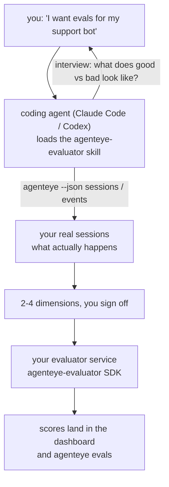

코딩 에이전트가 설계와 구현을 모두 담당하여, *"에이전트 품질이 가끔 떨어지는 것 같다"* 는 막연한 생각을 실제 배포된 스코어링 서비스로 만들어 드립니다. **Failproof AI Observability 평가자 스킬** (`agenteye-evaluator`)은 *Agent Skill*입니다. Claude Code나 Codex 같은 코딩 에이전트가 필요할 때 불러오는 소규모 지침 폴더로, 에이전트에게 *여러분의* 에이전트에서 추적할 가치가 있는 품질 지표를 파악하고, 그 지표를 평가하는 [평가자 서비스](/ko/agenteye/evaluation-suite)를 작성·테스트·배포하는 방법을 가르칩니다.

이 스킬은 호스팅된 스코어러도, 업로드 레지스트리도, 플러그인 시스템도 **아닙니다**. 여러분의 평가자는 [Evaluation suite](/ko/agenteye/evaluation-suite) 가이드에 설명된 대로, 여러분의 인프라에서 운영되는 HTTP 서비스로 완전히 여러분의 소유입니다. 이 스킬은 에이전트가 그것을 잘 만들 수 있도록 가르칠 뿐이며, 스킬이 하는 모든 작업은 여러분이 직접 동일한 코드를 작성해서도 할 수 있습니다.

---

## 가장 어려운 부분은 무엇을 평가할지 결정하는 것입니다

SDK 인터페이스는 간단합니다 — 데코레이터 하나와 모델 두 개 — 그리고 에이전트는 [계약](/ko/agenteye/evaluation-suite#http-contract)만으로도 이를 작성할 수 있습니다. 평가자가 실패하는 원인은 거기에 있지 않습니다. 실패의 원인은 잘못된 것을 측정하기 때문입니다. 잘못된 것을 측정하는 평가자는 없는 것보다 나쁩니다. 모두가 무시하게 되는 대시보드를 만들어낼 뿐입니다.

그래서 이 스킬의 대부분은 코드가 작성되기 전 단계에 할애됩니다. 스킬은 에이전트가 여러분을 인터뷰하도록 합니다(*"잘 동작한 실행을 설명해 주세요. 이제 잘못된 실행을 설명해 주세요"*). 그런 다음 [`agenteye` CLI](/ko/agenteye/cli)를 통해 실제 세션을 가져와 처음부터 끝까지 읽습니다. 이 두 가지는 대개 서로 다른 그림을 보여주는데, 그 차이가 핵심입니다: 여러분이 측정하려는 것과 실제 트랜스크립트에서 지원 가능한 것 사이의 간극입니다. 이벤트에서 **계산 가능**하고 **변별력이 있는** 경우에만 지표로 살아남습니다 — 좋은 실행과 나쁜 실행 모두에서 0.9를 기록한다면, 아무것도 알려주지 못하므로 제외됩니다.

결과물은 2~4개 지표와 그 근거가 담긴 제안서로, 코드 한 줄이 작성되기 전에 여러분의 승인을 받습니다.



---

## 다른 평가 구성 요소와의 관계

평가(scoring)를 다루는 문서는 네 가지이며, 순서대로 서로 연결됩니다:

| 페이지 | 내용 | 참조 시점 |
|---|---|---|
| **[Evaluations](/ko/agenteye/evaluations)** | 기능: 세션 그리드의 점수, 대시보드, 재평가 | 자동 평가가 무엇을 제공하는지 알고 싶을 때 |
| **[Evaluation suite](/ko/agenteye/evaluation-suite)** | HTTP 계약, SDK, 서버 환경 변수 | 직접 평가자를 구현하거나 디버깅할 때 |
| **평가자 스킬** (이 문서) | 스코어러 설계 *및* 구현을 위한 자연어 진입점 | "평가를 원한다"는 생각에서 실행 중인 서비스까지 가고 싶을 때 |
| **[CLI skill](/ko/agenteye/cli-skill)** | `agenteye` CLI를 위한 자연어 진입점 | 이미 보유한 점수를 *읽고* 싶을 때 |
| **[Python SDK skill](/ko/agenteye/python-sdk-skill)** | 에이전트 계측을 위한 자연어 진입점 | 에이전트가 아직 세션을 내보내지 않아 평가할 대상이 없을 때 |

### CLI 스킬 대비: 생성 vs 읽기

두 스킬은 의도적으로 겹치지 않으며, 둘 다 설치하는 것이 일반적인 구성입니다 — 에이전트는 여러분의 요청에 따라 적절한 스킬을 선택합니다:

- **`agenteye-evaluator`** (이 문서)는 점수를 *생성하는* 것을 구축합니다. 처음으로 점수가 생성되면 역할이 끝납니다.
- **[`agenteye-cli`](/ko/agenteye/cli-skill)** 는 이미 존재하는 점수를 읽습니다(`agenteye evals`). *"이번 주 품질이 떨어졌나요?"* 는 이 스킬이 답하는 질문이고, 이 문서의 스킬이 답하는 질문이 아닙니다.

---

## 사전 요구 사항

1. **`agenteye` CLI가 설치되고 로그인된 상태** (`pipx install agenteye`, 이후 `agenteye login`). 스킬은 두 가지 용도로 CLI를 사용합니다: 설계 기반이 되는 실제 세션 가져오기, 그리고 마지막에 점수가 제대로 생성됐는지 확인하기. 로그인 계정에는 `events:read` 권한이 필요하고, 최종 확인을 위해 `evaluations:read` 권한도 필요합니다. CLI 스킬과 마찬가지로, 이메일로 전송되는 일회용 코드 로그인은 **자동으로 완료할 수 없습니다**.
2. **평가자가 실행될 공간.** 평가자는 이미지로 빌드되어 장기 실행 서비스로 운영되므로, 임시 파일이 아닌 실제 저장소가 필요합니다. 평가자는 평가 대상 에이전트와 별도의 저장소에 운영되는 경우가 많습니다 — 스킬은 기존 저장소를 찾아보고, 새로 생성하기 전에 확인을 요청합니다.
3. **`agenteye-evaluator` SDK 휠** — 에이전트가 `pip` 명령을 입력하기 전에 다음 섹션을 먼저 읽으세요.

---

## 입수 방법

이 스킬은 Failproof AI의 공개 스킬 컬렉션에 게시되어 있습니다:

**[github.com/FailproofAI/skills](https://github.com/FailproofAI/skills)** → [`skills/agenteye-evaluator/`](https://github.com/FailproofAI/skills/tree/main/skills/agenteye-evaluator)

저장소는 공개되어 있으며 스킬 자체에는 별도의 인증 정보가 필요 없습니다 — 스킬은 여러분이 로그인한 세션으로 `agenteye` CLI를 구동하고 *여러분의* 저장소에 코드를 작성할 뿐입니다. 이 스킬은 별도 폴더로 제공되며 `pipx install agenteye` 패키지에는 포함되어 있지 **않으니**, 그곳에서 찾지 마세요.

## 스킬 설치

가장 빠른 방법은 [`skills`](https://skills.sh) CLI를 사용하는 것입니다. 폴더를 가져와 에이전트가 찾는 위치에 배치해 줍니다:

```bash
# Claude Code, 이 프로젝트에만 적용
npx skills add FailproofAI/skills --skill agenteye-evaluator -a claude-code

# 모든 프로젝트 (~/.claude/skills/에 설치)
npx skills add FailproofAI/skills --skill agenteye-evaluator -a claude-code -g --copy

# Codex 사용 시
npx skills add FailproofAI/skills --skill agenteye-evaluator -a codex
```

이후 다른 스킬과 동일하게 관리합니다:

```bash
npx skills list -a claude-code           # 설치된 스킬 목록
npx skills update agenteye-evaluator     # 최신 버전으로 업데이트
npx skills remove agenteye-evaluator     # 제거
```

수동으로 설치하고 싶으신가요? Agent Skill은 `SKILL.md`(및 선택적 참조 파일)가 포함된 폴더에 불과하므로, 복사해서 사용해도 됩니다:

- **Claude Code**: `agenteye-evaluator/` 폴더를 `~/.claude/skills/`(모든 프로젝트) 또는 `<your-repo>/.claude/skills/`(해당 저장소 전용)에 배치하세요. Claude Code가 자동으로 인식합니다 — `/skills` 목록으로 확인하거나, 평가를 요청해 보세요.
- **Codex (OpenAI)**: Codex도 동일한 `SKILL.md`를 읽습니다. 번들된 `agents/openai.yaml`에는 `allow_implicit_invocation: true`가 설정되어 있어, 작업 내용이 일치하면 Codex가 자동으로 스킬을 선택합니다. 명시적으로 호출하려면 `$agenteye-evaluator`를 사용하세요.

---

## SDK는 공개 PyPI에 없습니다

> **경고:** 에이전트가 SDK를 설치하기 전에 반드시 읽으세요.

스킬은 공개되어 있지만, 스킬이 구동하는 SDK는 그렇지 않습니다. `agenteye-evaluator`는 비공개 릴리스 아티팩트로만 제공되며, `agenteye`와 달리 공개 PyPI에서 **이름이 등록되어 있지 않습니다** — 따라서 `pip install agenteye-evaluator`를 그냥 실행하면 프로덕션 트랜스크립트를 읽는 서비스에 알 수 없는 패키지가 설치될 수 있습니다. 이는 오타의 문제가 아니라 공급망 보안 문제입니다.

스킬은 이를 알고 있으며, 적용 가능한 첫 번째 단계부터 순서대로 설치를 시도합니다: AgentEye 저장소 내부라면 모노레포 소스, 그렇지 않으면 GitHub Releases의 비공개 릴리스 휠(접근 권한 필요), 둘 다 접근할 수 없으면 **즉흥적으로 처리하는 대신 Failproof AI 담당자에게 휠을 문의하라고 안내하고 중단합니다**.

따라서 에이전트가 공개 PyPI에서 `pip install agenteye-evaluator`를 바로 제안한다면, 스킬이 로드되지 않은 것입니다. 즉시 중단하고 스킬이 설치되어 있는지 확인하세요.

---

## 사용 가능한 요청 예시

실제 진행 과정은 막연한 요청으로 시작해서 코드 작성이 아닌 승인된 설계로 끝납니다:

```text
you   ▸ I want evals for our support bot. I think it's sometimes bad.

agent ▸ Before I write anything: describe a run that went well,
        and one that went badly.

you   ▸ Good: it answers from the docs. Bad: it makes stuff up,
        or gives up and says "contact support".

agent ▸ Running: agenteye --json sessions --status error --since 7d
        Reading 5 sessions, including two you'd call bad.

        Your words say factuality and deflection. The transcripts
        agree on deflection (2 of 5 end with a support hand-off,
        and it's plain in model_response.content), but factuality
        needs a ground truth your events don't carry.

        So I'd score three things:
          - deflection      rules, cheap, separates your two runs
          - tool_efficiency rules, catches the retry loop in run-004
          - groundedness    LLM judge: is every claim in the docs it retrieved?

        "factuality" would need ground truth we don't have; groundedness
        is the closest thing your transcripts can actually support.
        OK with those three names? Renaming later splits the history.

you   ▸ yes

agent ▸ No evaluator in this repo. Should I scaffold one here, or do
        you have one elsewhere?
```

여기서부터 에이전트는 규칙 기반 지표를 먼저 작성합니다(비용 없음, 즉각적, 결정적). 그런 다음 빈 세션이나 중단된 세션처럼 단순한 평가자를 충돌시킬 수 있는 실제 캡처된 세션에 대해 테스트하고, 주관적인 지표에만 LLM 판정을 사용합니다. 에이전트는 [디스패처의 제한 사항](/ko/agenteye/evaluation-suite#configuring-the-server) — 30초 요청 타임아웃과 배포 전체에서 동시 8건 처리 — 을 알고 있으므로, 판정이 안정적으로 완료되기 어렵다면 비용을 5배로 늘려가며 취소와 재시도를 반복하는 대신 `JobPending`으로 비동기 처리합니다.

이후 배포를 완료하고, 두 개의 서버 환경 변수를 설정하며, `agenteye --json evals --session-id <id>`로 점수가 실제로 생성됐는지 확인합니다. 점수 생성이 유일한 증거입니다.

---

## 주의 사항

- **지표 이름은 사실상 영구적입니다.** 점수 키는 임의 문자열이고 플랫폼은 전송되는 모든 것의 추세를 추적하므로, 잘못된 선택을 사후에 교정할 방법이 없습니다. 나중에 이름을 바꾸면 히스토리가 분리됩니다: 이전 세션에는 이전 키가 유지되어 추세가 끊깁니다. 이것이 스킬이 코드를 작성하기 전에 명시적인 승인을 받는 이유입니다 — 그 프롬프트를 진지하게 받아들이세요.
- **픽스처는 실제 프로덕션 트랜스크립트입니다.** 실제 세션을 기반으로 설계한다는 것은 세션을 디스크로 가져온다는 의미이며, 고객 데이터가 포함될 수 있습니다. 스킬은 git에 커밋하기 전에 확인을 요청합니다. 확신이 없다면 `fixtures/`를 저장소 밖에 두고 각 개발자가 직접 가져오도록 하세요.
- **에이전트가 모든 트랜스크립트를 읽는 서비스를 작성하고 배포합니다.** CLI 로그인 권한 범위 내에서 여러분처럼 행동하지만, 프로덕션 데이터에 접근하는 다른 모든 코드와 동일하게 평가자를 검토하세요.

---

## 다음 단계

- **[Evaluation suite](/ko/agenteye/evaluation-suite)**: 스킬이 구성하는 HTTP 계약, SDK, 서버 환경 변수.
- **[Evaluations](/ko/agenteye/evaluations)**: 점수가 생성된 후 표시되는 위치.
- **[CLI skill](/ko/agenteye/cli-skill)**: 스코어러를 구축하는 대신 결과를 읽기 위한 형제 스킬.
- **[CLI](/ko/agenteye/cli)**: 스킬이 설계 기반으로 삼는 세션 데이터의 명령어 참조.