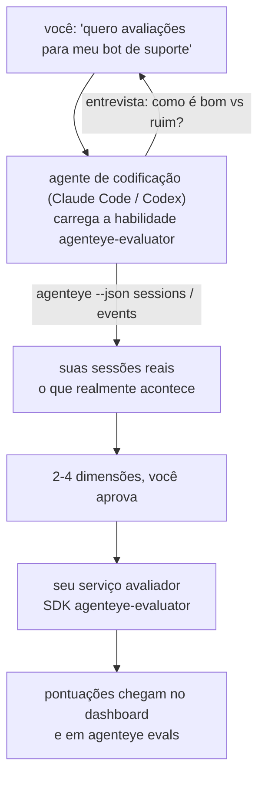

Vá de *"acho que nosso agente às vezes falha"* a um serviço de pontuação implantado, com seu agente de codificação tanto decidindo quanto construindo. A **habilidade de avaliador de Observabilidade Failproof AI** (`agenteye-evaluator`) é uma *Agent Skill*: uma pequena pasta de instruções que um agente de codificação como Claude Code ou Codex carrega sob demanda. Ela ensina o agente a determinar quais dimensões de qualidade valem a pena rastrear para o *seu* agente, e então escrever, testar e implantar o [serviço avaliador](/pt-br/agenteye/evaluation-suite) que os pontua.

Ela **não** é um pontuador hospedado, um registro para o qual você faz upload, ou um sistema de plugins. Seu avaliador permanece sendo seu próprio serviço HTTP na sua própria infraestrutura, exatamente como descrito no guia [Evaluation suite](/pt-br/agenteye/evaluation-suite). A habilidade apenas ensina seu agente a construí-lo bem, de modo que tudo o que ela faz, você poderia fazer escrevendo o mesmo código.

---

## A parte difícil é decidir o que pontuar

A superfície do SDK é pequena — um decorator e dois modelos — e um agente pode escrever isso apenas com o [contrato](/pt-br/agenteye/evaluation-suite#http-contract). Não é aí que os avaliadores falham. Eles falham porque pontuam a coisa errada, e um avaliador que pontua a coisa errada é pior do que nenhum: ele produz um dashboard que todos aprendem a ignorar.

Por isso, a maior parte da habilidade é a etapa anterior a qualquer código. Ela faz o agente entrevistá-lo (*"descreva uma execução que correu bem; agora uma que correu mal"*), depois puxa suas sessões reais pelo [`agenteye` CLI](/pt-br/agenteye/cli) e as lê do início ao fim. Essas duas metades geralmente discordam, e a lacuna é exatamente o ponto: o que você pretende medir versus o que suas transcrições podem realmente suportar. Uma dimensão só sobrevive se for **computável** a partir dos eventos e **discriminatória** — se pontua 0,9 tanto na sua boa execução quanto na ruim, não ensina nada e é cortada.

O resultado é uma proposta de 2 a 4 dimensões com o raciocínio anexado, para você aprovar antes que uma linha seja escrita.



---

## Como ela se relaciona com as outras partes de avaliação

Quatro documentos cobrem pontuação, e eles se encadeiam em ordem:

| Página | O que é | Consulte quando |
|---|---|---|
| **[Evaluations](/pt-br/agenteye/evaluations)** | O recurso: pontuações na grade de sessões, dashboards, reavaliar | Você quer saber o que a pontuação automática oferece |
| **[Evaluation suite](/pt-br/agenteye/evaluation-suite)** | O contrato HTTP, o SDK, as variáveis de ambiente do servidor | Você está implementando ou depurando o avaliador por conta própria |
| **Habilidade de avaliador** (este documento) | Uma porta de entrada em linguagem natural para projetar *e* construir o pontuador | Você quer ir de "quero avaliações" a um serviço em execução |
| **[CLI skill](/pt-br/agenteye/cli-skill)** | Uma porta de entrada em linguagem natural para o `agenteye` CLI | Você quer *ler* as pontuações que já possui |
| **[Python SDK skill](/pt-br/agenteye/python-sdk-skill)** | Uma porta de entrada em linguagem natural para instrumentar seu agente | Seu agente ainda não está emitindo sessões — não há nada para pontuar |

### vs. a CLI skill: construir versus ler

As duas habilidades são deliberadamente não sobrepostas, e instalar ambas é a configuração normal — o agente escolhe entre elas com base no que você pede:

- **`agenteye-evaluator`** (este documento) constrói a coisa que *produz* pontuações. Seu trabalho termina quando as pontuações chegam pela primeira vez.
- **[`agenteye-cli`](/pt-br/agenteye/cli-skill)** lê pontuações que já existem (`agenteye evals`). *"A qualidade caiu esta semana?"* é a pergunta dela, não desta habilidade.

---

## Pré-requisitos

1. O **`agenteye` CLI instalado e com login efetuado** (`pipx install agenteye`, depois `agenteye login`). A habilidade depende dele duas vezes: para puxar as sessões reais com as quais projeta, e para confirmar que suas pontuações chegaram ao final. Seu login precisa de `events:read`, mais `evaluations:read` para essa verificação final. Como acontece com a CLI skill, ela **não pode** completar o login com código único enviado por e-mail por você.
2. **Um lugar para o avaliador residir.** Ele é construído em uma imagem e executado como um serviço de longa duração, portanto precisa de um repositório real, não de um arquivo temporário. Avaliadores geralmente vivem em seu próprio repositório, separado do agente sendo pontuado — a habilidade procura um existente e pergunta antes de criar um novo.
3. **O wheel do SDK `agenteye-evaluator`** — leia a próxima seção antes de deixar seu agente começar a digitar comandos `pip`.

---

## Onde obtê-la

A habilidade está publicada na coleção pública de habilidades da Failproof AI:

**[github.com/FailproofAI/skills](https://github.com/FailproofAI/skills)** → [`skills/agenteye-evaluator/`](https://github.com/FailproofAI/skills/tree/main/skills/agenteye-evaluator)

O repositório é público e a habilidade não precisa de nenhuma credencial própria — ela apenas aciona o `agenteye` CLI com a sessão com a qual *você* fez login, e escreve código no *seu* repositório. Observe que ela é distribuída como sua própria pasta e **não** está dentro do pacote `pipx install agenteye`, portanto não a procure lá.

## Instalando a habilidade

O caminho mais rápido é o CLI [`skills`](https://skills.sh), que busca a pasta e a coloca onde seu agente procura:

```bash
# Claude Code, somente este projeto
npx skills add FailproofAI/skills --skill agenteye-evaluator -a claude-code

# todos os projetos (instala em ~/.claude/skills/)
npx skills add FailproofAI/skills --skill agenteye-evaluator -a claude-code -g --copy

# Codex em vez disso
npx skills add FailproofAI/skills --skill agenteye-evaluator -a codex
```

Depois gerencie como qualquer outra habilidade:

```bash
npx skills list -a claude-code           # o que está instalado
npx skills update agenteye-evaluator     # baixar a versão mais recente
npx skills remove agenteye-evaluator     # remover
```

Prefere instalar manualmente? Uma Agent Skill é apenas uma pasta contendo um `SKILL.md` (mais referências opcionais), então copiá-la também funciona:

- **Claude Code**: coloque a pasta `agenteye-evaluator/` em `~/.claude/skills/` (todos os projetos) ou `<seu-repositório>/.claude/skills/` (somente aquele repositório). Claude Code a descobre automaticamente — verifique com a lista `/skills`, ou simplesmente peça avaliações.
- **Codex (OpenAI)**: Codex lê o mesmo `SKILL.md`. O arquivo `agents/openai.yaml` incluído define `allow_implicit_invocation: true`, então o Codex seleciona automaticamente a habilidade quando uma tarefa combina; caso contrário, invoque-a explicitamente como `$agenteye-evaluator`.

---

## O SDK não está no PyPI público

> **Aviso:** Leia isso antes de deixar um agente instalar o SDK.

A habilidade é pública; o SDK que ela aciona não é. O `agenteye-evaluator` é distribuído apenas como um artefato de release privado e, ao contrário do `agenteye`, o nome está **sem registro no PyPI público** — então um simples `pip install agenteye-evaluator` poderia puxar o pacote de um desconhecido para o serviço que lê suas transcrições de produção. Isso é um problema de cadeia de suprimentos, não um erro de digitação.

A habilidade sabe disso e percorre uma escada de instalação em vez disso, parando no primeiro degrau que se aplica: o código-fonte do monorepo se você estiver dentro do repositório AgentEye, caso contrário o wheel de release privado do GitHub Releases (requer acesso), e se nenhum estiver acessível ela **para e diz para você perguntar ao seu contato na Failproof AI pelo wheel** em vez de improvisar.

Portanto, se seu agente propõe um simples `pip install agenteye-evaluator` do PyPI público, isso é o sinal de que a habilidade nunca foi carregada. Pare aí e verifique se ela está instalada.

---

## O que você pode pedir a ela

Uma rodada completa começa com uma solicitação vaga e termina com um design aprovado, não com código:

```text
você  ▸ Quero avaliações para nosso bot de suporte. Acho que às vezes ele falha.

agente▸ Antes de escrever qualquer coisa: descreva uma execução que correu bem,
        e uma que correu mal.

você  ▸ Boa: ele responde pela documentação. Ruim: ele inventa coisas,
        ou desiste e diz "entre em contato com o suporte".

agente▸ Executando: agenteye --json sessions --status error --since 7d
        Lendo 5 sessões, incluindo duas que você consideraria ruins.

        Suas palavras dizem factualidade e desvio. As transcrições
        concordam com desvio (2 de 5 terminam com encaminhamento ao suporte,
        e está claro em model_response.content), mas factualidade
        precisa de uma resposta de referência que seus eventos não carregam.

        Então eu pontuaria três coisas:
          - deflection      regras, barato, separa suas duas execuções
          - tool_efficiency regras, captura o loop de retentativa em run-004
          - groundedness    juiz LLM: cada afirmação está nos documentos recuperados?

        "factuality" precisaria de resposta de referência que não temos; groundedness
        é o mais próximo que suas transcrições podem realmente suportar.
        OK com esses três nomes? Renomear depois divide o histórico.

você  ▸ sim

agente▸ Nenhum avaliador neste repositório. Devo criar um aqui, ou você
        tem um em outro lugar?
```

A partir daí ele escreve primeiro as dimensões baseadas em regras (gratuitas, instantâneas, determinísticas), testa-as contra uma sessão real capturada, incluindo as vazias e as nunca concluídas que travam avaliadores ingênuos, e só recorre a um juiz LLM na dimensão subjetiva. Ele conhece os [limites do dispatcher](/pt-br/agenteye/evaluation-suite#configuring-the-server) — um timeout de requisição de 30s e 8 chamadas concorrentes em todo o deployment — portanto, se o juiz não couber de forma confiável, ele vai assíncrono com `JobPending` em vez de deixar seu juiz ser cancelado e repetido cinco vezes ao custo de cinco vezes mais.

Depois implanta, configura as duas variáveis de ambiente do servidor e confirma com `agenteye --json evals --session-id <id>` que as pontuações realmente chegaram. As pontuações chegando é a única prova.

---

## O que observar

- **Nomes de dimensões são quase permanentes.** As chaves de pontuação são strings arbitrárias e a plataforma rastreia tendências de tudo o que você envia, o que significa que nada downstream corrige uma escolha ruim. Renomeie depois e o histórico se divide: sessões antigas mantêm a chave antiga e a tendência se quebra. É por isso que a habilidade obtém aprovação explícita antes de escrever código — leve esse prompt a sério.
- **Fixtures são transcrições reais de produção.** Projetar contra sessões reais significa baixá-las para o disco, e elas podem conter dados de clientes. A habilidade pergunta antes de commitá-las no git; em caso de dúvida, mantenha `fixtures/` fora do repositório e peça a cada desenvolvedor que baixe as suas próprias.
- **O agente escreve e implanta um serviço que lê todas as transcrições.** Ele age como você, limitado pelas permissões do seu login no CLI, mas revise o avaliador como qualquer outro código que toca dados de produção.

---

## Próximos passos

- **[Evaluation suite](/pt-br/agenteye/evaluation-suite)**: o contrato HTTP, o SDK e as variáveis de ambiente do servidor que a habilidade configura.
- **[Evaluations](/pt-br/agenteye/evaluations)**: onde as pontuações aparecem assim que chegam.
- **[CLI skill](/pt-br/agenteye/cli-skill)**: a habilidade irmã, para ler resultados em vez de construir o pontuador.
- **[CLI](/pt-br/agenteye/cli)**: a referência de comandos por trás dos dados de sessão com os quais a habilidade projeta.