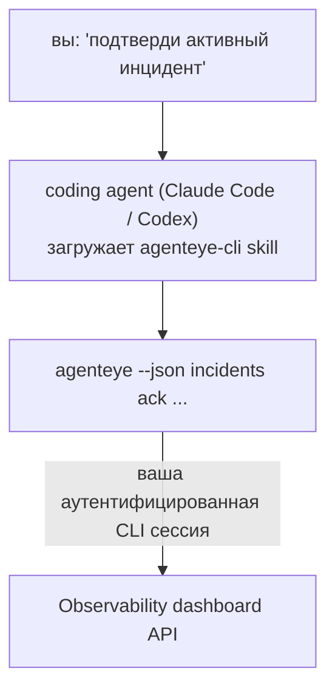

Спросите у вашего coding agent *«сегодня что-нибудь сломалось?»* и позвольте ему ответить на основе ваших live данных Failproof AI Observability, без необходимости запоминать команды. **Failproof AI Observability CLI skill** (`agenteye-cli`) — это *Agent Skill*: небольшая папка с инструкциями, которую coding agent, такой как Claude Code или Codex, загружает по требованию. Она учит agent управлять вашей Observability deploymentом через [`agenteye` CLI](/ru/agenteye/cli) на основе запросов на обычном английском языке, таких как *«выдай CI ключ, который может только отправлять события»* или *«подтверди активный инцидент и назначь его на меня»*.

Это **не** сервис и не отдельный бинарный файл; нет ничего, что нужно разворачивать. Он работает поверх уже установленного вами CLI: agent выполняет `agenteye --json …`, парсит чистый JSON и отвечает вам прозой. Всё, что он может сделать, вы можете сделать сами, набрав те же команды.

---

## Как это соотносится с другими интерфейсами Failproof AI Observability

Failproof AI Observability предоставляет четыре способа доступа к одним и тем же данным и элементам управления. Они дополняют друг друга:

| Интерфейс | Что это такое | Где выполняется | Используйте, когда |
|---|---|---|---|
| **[CLI](/ru/agenteye/cli)** | Справочник команд и флагов для `agenteye` | Ваш терминал | Вы хотите запустить или создать сценарий для конкретной команды |
| **[CLI recipes](/ru/agenteye/cli-recipes)** | Шаблоны `jq`/pipelines для копирования и вставки | Ваш терминал / скрипты | Вы интегрируете CLI в автоматизацию |
| **CLI skill** (этот документ) | Дверь с естественным языком для CLI | Ваш coding agent на рабочей станции | Вы просто хотите спросить и позволить agent выбрать команду |
| **[Evaluator skill](/ru/agenteye/evaluator-skill)** | Родственный skill, который проектирует и создаёт ваш сервис оценивания | Ваш coding agent на рабочей станции | Вы хотите *производить* баллы оценивания, а не только их читать |
| **[Python SDK skill](/ru/agenteye/python-sdk-skill)** | Родственный skill, который инструментирует agent, чтобы он вообще испускал телеметрию | Ваш coding agent на рабочей станции | Вы хотите, чтобы agent *производил* события, которые этот skill читает |
| **[In-dashboard AI assistant](/ru/agenteye/assistant)** | Чат, встроенный в приборную панель | Серверная сторона (в приборной панели) | Вы хотите Q&A в приборной панели над вашими данными |

Сам skill не имеет собственных привилегий; он просто преобразует ваши слова в вызовы CLI, которые выполняются от вас:



### в сравнении с in-dashboard AI assistant: важное различие

Это два совершенно разных инструмента с очень разными областями влияния:

- **In-dashboard AI assistant** ([AI assistant](/ru/agenteye/assistant)) — это чат, встроенный в приборную панель, поддерживаемый сервисом agent. Он **только для чтения плюс создание с одобрением**: он может создавать черновики сохранённых запросов и панелей управления, но каждая запись требует вашего явного подтверждения, и он никогда не удаляет. Он защищён разрешением `agent:use` и видит только данные организации, которую вы просматриваете.
- **CLI skill** работает на *вашей* рабочей станции внутри *вашего* coding agent и управляет `agenteye` CLI от вас. Он может выполнять **полный набор CLI, включая изменения** (создание/ротация/отключение API ключей, изменение параметров org, разрешение инцидентов, удаление сохранённых запросов), ограниченные только разрешениями вашей CLI-сессии. Относитесь к этому ровно так же осторожно, как вы относились бы к выполнению этих команд вручную.

---

## Предварительные требования

1. **`agenteye` CLI установлен** и находится в `PATH` (см. [CLI](/ru/agenteye/cli) справочник: `pipx install agenteye`).
2. Ваш **URL приборной панели установлен** (`AGENTEYE_DASHBOARD_URL`, или agent передаёт `--base-url`).
3. **Сессия с аутентификацией**: сначала запустите `agenteye login` сами. Skill **не может** завершить отправку одноразового кода по электронной почте за вас; он подскажет вам запустить `agenteye login`, если сессия отсутствует или истекла (CLI код выхода `4`).

---

## Где это взять

Skill опубликован в публичной коллекции skills Failproof AI:

**[github.com/FailproofAI/skills](https://github.com/FailproofAI/skills)** → [`skills/agenteye-cli/`](https://github.com/FailproofAI/skills/tree/main/skills/agenteye-cli)

Ничто в нём не защищено — репозиторий открыт, и skill не требует собственных учётных данных, потому что он только управляет **публичным** `agenteye` CLI против *вашей* приборной панели, используя сессию, под которую *вы* вошли. Вам не нужно ничего у кого-то просить.

Обратите внимание, что он поставляется как отдельная папка и **не находится** в пакете `pipx install agenteye`, поэтому не ищите его там.

## Установка skill

Самый быстрый способ — это [`skills`](https://skills.sh) CLI, который загружает папку и размещает её там, где ваш agent её ищет:

```bash
# Claude Code, только этот проект
npx skills add FailproofAI/skills --skill agenteye-cli -a claude-code

# каждый проект (устанавливает в ~/.claude/skills/)
npx skills add FailproofAI/skills --skill agenteye-cli -a claude-code -g --copy

# Codex вместо этого
npx skills add FailproofAI/skills --skill agenteye-cli -a codex
```

Затем управляйте им как любым другим skill:

```bash
npx skills list -a claude-code      # что установлено
npx skills update agenteye-cli      # загрузить последнюю версию
npx skills remove agenteye-cli      # удалить его
```

Предпочитаете установку вручную? Agent Skill — это просто папка, содержащая `SKILL.md` (плюс дополнительные справки), поэтому копирование тоже работает:

- **Claude Code**: положите папку `agenteye-cli/` в `~/.claude/skills/` (каждый проект) или `<ваш-репо>/.claude/skills/` (только этот репо). Claude Code автоматически её обнаруживает — проверьте со списком `/skills` или просто задайте вопрос, который совпадает с её описанием.
- **Codex (OpenAI)**: Codex читает тот же `SKILL.md`. Включённый `agents/openai.yaml` устанавливает `allow_implicit_invocation: true`, поэтому Codex автоматически выбирает skill, когда задача совпадает; в противном случае вызовите его явно как `$agenteye-cli`.

---

## Безопасность: изменения НЕ требуют подтверждения, когда agent запускает CLI

> **Warning:** Прочитайте это перед тем, как позволить agent вносить изменения.

`agenteye` CLI обычно запрашивает *«ты уверен?»* перед деструктивным действием. Он **автоматически пропускает это подтверждение, когда он не подключён к терминалу (что является в точности тем, как coding agent его запускает), и `--json` тоже пропускает это.** Поэтому подсказка о безопасности **не будет** активирована для agent.

Skill написан, чтобы это компенсировать: ему дано указание указать точную команду, которую он будет запускать, и получить ваше явное **ОК перед любым изменением состояния**. Соблюдайте эту дисциплину. Когда вы управляете Failproof AI Observability через agent, *вы* — это шаг подтверждения. Команды, изменяющие состояние, на которые нужно обратить внимание:

- `keys create` / `update` / `disable` / `regenerate`
- `users create` / `update` / `disable` / `enable`
- `settings set`
- `alerts create` / `update` / `delete` / `test`
- команды записи `incidents`: `ack` / `assign` / `resolve` / `open` / `comment-add` / `comment-delete` / `subscribe` / `unsubscribe`
- `query create` / `update` / `delete`
- `agent rename` / `delete`
- `orgs switch`

Всё под **Observe** (`events`, `sessions`, `evals`, `errors`, `list`, `whoami`, `orgs list/current/perms`) — только для чтения и ничего не меняет.

Поскольку agent действует от вас, он может делать только то, что разрешено вашей сессией; разрешения разрешаются **на организацию** (см. [API keys](/ru/agenteye/api-keys)). Команда, на которую у вас нет разрешения, возвращает код выхода `5` с точно названным разрешением, поэтому agent может точно сказать вам, что просить у администратора, вместо того чтобы неясно отказать.

---

## Что вы можете его попросить

Вот что выглядит реальный обмен, сначала чтение, затем изменение, которое ждёт вашего ОК:

```text
вы   ▸ Что-нибудь сломалось за последний день?

agent ▸ Запуск: agenteye --json errors --since 24h --aggregate
        3 типа ошибок за последние 24 часа. Самый большой — TimeoutError
        (18 попаданий, все на checkout-agent), затем RateLimited (5).
        Хотите получить сбойные сессии для TimeoutError?

вы   ▸ Выдай CI ключ, который может только отправлять события.

agent ▸ Это создаёт API ключ. Я запущу:
          agenteye keys create ci --add events:add
        Продолжить?

вы   ▸ да

agent ▸ Готово. Ключ "ci" создан с только events:add.
        Секрет показан только один раз, поэтому сохраните его сейчас. Я не могу его переиспечатать.
```

Skill отображает каждое намерение на простом языке на правильную `agenteye` команду, сначала открывая допустимые значения (`list <kind>`, `whoami`), чтобы не угадывать, и указывая точную команду перед любым изменением. Больше примеров:

- *«Что-нибудь сломалось / сбойное за последние 24 часа?»* → `errors --since 24h --aggregate`, затем разбивка.
- *«Почему сессия `run-001` сбойная?»* → `events --session-id run-001 --all` + `evals --session-id run-001`.
- *«Как качество тренднулось на этой неделе?»* → `evals --aggregate --since 7d`, затем углубиться в низко оценённые прогоны.
- *«Выдай CI ключ, который может только отправлять события»* → `keys create ci --add events:add` (он указывает команду, затем создаёт её и захватывает одноразовый секрет).
- *«Кто имеет доступ? Сделай Dana только для чтения»* → `users list` → `users update dana@… --permission-set read-only` (после подтверждения с вами).
- *«Подтверди активный инцидент и назначь его на меня»* → `incidents list --state firing` → `incidents ack <id>` / `incidents assign <id> you@…`.

Для точных команд, флагов и JSON форм за этим смотрите справочник [CLI](/ru/agenteye/cli) и [CLI recipes для agents](/ru/agenteye/cli-recipes).

---

## Следующие шаги

- **[CLI](/ru/agenteye/cli)**: полный справочник команд и флагов для `agenteye`.
- **[CLI recipes для agents](/ru/agenteye/cli-recipes)**: шаблоны `jq` и обработка кодов выхода для копирования и вставки.
- **[Evaluator agent skill](/ru/agenteye/evaluator-skill)**: родственный skill для создания evaluator, чьи баллы читает `agenteye evals`.
- **[Python SDK agent skill](/ru/agenteye/python-sdk-skill)**: родственный skill для инструментирования agent, чтобы он испускал телеметрию, которую читает `agenteye`.
- **[AI assistant](/ru/agenteye/assistant)**: in-dashboard ассистент (не путать с этим terminal skill).
- **[API keys](/ru/agenteye/api-keys)**: модель разрешений на организацию, которая ограничивает то, что может делать skill.