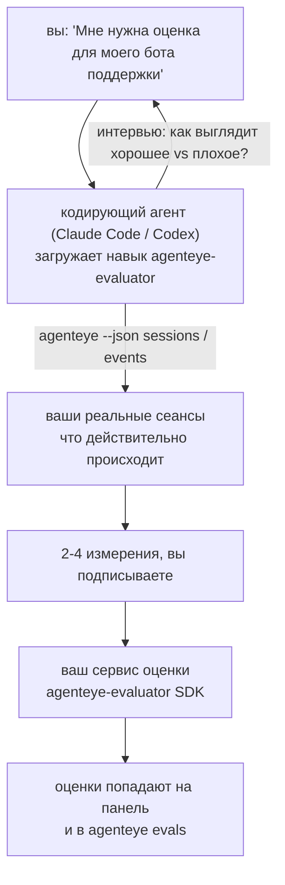

---
---
title: "Навык Failproof AI Observability Evaluator Agent"
description: "От «я думаю, что наш агент иногда работает плохо» к развёрнутому сервису оценки, где кодирующий агент сам принимает решения и строит решение."
---


От *«я думаю, что наш агент иногда работает плохо»* к развёрнутому сервису оценки, где кодирующий агент сам принимает решения и строит решение. **Навык Failproof AI Observability evaluator** (`agenteye-evaluator`) — это *Agent Skill*: небольшая папка с инструкциями, которые кодирующий агент, такой как Claude Code или Codex, загружает по требованию. Она учит агента определять, какие показатели качества стоит отслеживать для *вашего* агента, а затем писать, тестировать и развёртывать [сервис оценки](/ru/agenteye/evaluation-suite), который их оценивает.

Это **не** размещённый скорер, реестр для загрузки или система плагинов. Ваша оценка остаётся вашей собственной HTTP-службой на вашей инфраструктуре, точно так, как описано в руководстве [Evaluation suite](/ru/agenteye/evaluation-suite). Навык только учит вашего агента строить её правильно, поэтому всё, что она делает, вы могли бы сделать сами, написав тот же код.

---

## Сложная часть — решить, что оценивать

Поверхность SDK небольшая — декоратор и две модели — и агент может написать это просто по [контракту](/ru/agenteye/evaluation-suite#http-contract). В этом не проблема оценок. Они не работают, потому что оценивают неправильное, и оценка, которая оценивает неправильное, хуже, чем никакая: она создаёт панель управления, которую все учатся игнорировать.

Поэтому большая часть навыка — это часть до того, как существует код. Агент берёт у вас интервью (*«опишите сеанс, который прошёл хорошо; теперь один, который прошёл плохо»*), затем загружает ваши реальные сеансы через [`agenteye` CLI](/ru/agenteye/cli) и читает их от начала до конца. Эти две части обычно не совпадают, и разрыв — это именно то, что нужно: что вы намерены измерять против того, что ваши расшифровки могут реально поддерживать. Измерение выживает только если оно **вычислимо** из событий и **дискриминирующее** — если оно выставляет 0,9 как для вашего хорошего, так и для вашего плохого сеанса, оно ничему не учит и исключается.

То, что возвращается — предложение 2-4 измерений с приложенным обоснованием, которое вы подписываете перед тем, как будет написана строка кода.



---

## Как это относится к другим частям оценки

Четыре документа охватывают оценку и передают информацию друг другу по очереди:

| Страница | Что это | Используйте, когда |
|---|---|---|
| **[Evaluations](/ru/agenteye/evaluations)** | Функция: оценки на сетке сеансов, панели, переоценка | Вы хотите узнать, что вы получаете от автоматической оценки |
| **[Evaluation suite](/ru/agenteye/evaluation-suite)** | HTTP контракт, SDK, переменные окружения сервера | Вы реализуете или отлаживаете оценку самостоятельно |
| **Evaluator skill** (этот документ) | Естественный язык для проектирования *и* построения скорера | Вы хотите перейти от «мне нужна оценка» к работающему сервису |
| **[CLI skill](/ru/agenteye/cli-skill)** | Естественный язык для `agenteye` CLI | Вы хотите *читать* оценки, которые уже у вас есть |
| **[Python SDK skill](/ru/agenteye/python-sdk-skill)** | Естественный язык для инструментирования вашего агента | Ваш агент ещё не генерирует сеансы — нечего оценивать |

### vs. CLI skill: построение vs чтение

Два навыка намеренно неперекрывающиеся, и установка обоих — это обычная конфигурация — агент выбирает между ними в зависимости от того, что вы просите:

- **`agenteye-evaluator`** (этот документ) строит то, что *производит* оценки. Его работа заканчивается, когда оценки появляются в первый раз.
- **[`agenteye-cli`](/ru/agenteye/cli-skill)** читает оценки, которые уже существуют (`agenteye evals`). *«Качество упало на этой неделе?»* — это его вопрос, не этого навыка.

---

## Предварительные требования

1. **`agenteye` CLI установлен и подключён** (`pipx install agenteye`, затем `agenteye login`). Навык использует его дважды: для загрузки реальных сеансов, на которых он проектирует, и для подтверждения того, что ваши оценки появились в конце. Ваш логин нуждается в `events:read`, плюс `evaluations:read` для этой окончательной проверки. Как и в случае с CLI skill, он **не может** завершить отправленный по почте вход с одноразовым кодом за вас.
2. **Место для жизни оценки.** Она строится в образ и работает как долгоживущий сервис, поэтому ей нужно настоящее хранилище, а не временный файл. Оценки часто живут в собственном хранилище, отдельно от оцениваемого агента — навык ищет существующее и спрашивает перед построением нового.
3. **Колесо `agenteye-evaluator` SDK** — прочитайте следующий раздел перед тем, как ваш агент начнёт вводить команды `pip`.

---

## Где это получить

Навык опубликован в публичной коллекции навыков Failproof AI:

**[github.com/FailproofAI/skills](https://github.com/FailproofAI/skills)** → [`skills/agenteye-evaluator/`](https://github.com/FailproofAI/skills/tree/main/skills/agenteye-evaluator)

Хранилище публичное и навыку не нужно никаких собственных учётных данных — он только управляет `agenteye` CLI с сеансом, на который *вы* подключились, и пишет код в *ваше* хранилище. Обратите внимание, что он поставляется как собственная папка и **не** находится внутри пакета `pipx install agenteye`, поэтому не ищите его там.

## Установка навыка

Самый быстрый способ — это CLI [`skills`](https://skills.sh), которая загружает папку и помещает её туда, где ваш агент ищет:

```bash
# Claude Code, только этот проект
npx skills add FailproofAI/skills --skill agenteye-evaluator -a claude-code

# каждый проект (устанавливает в ~/.claude/skills/)
npx skills add FailproofAI/skills --skill agenteye-evaluator -a claude-code -g --copy

# вместо этого Codex
npx skills add FailproofAI/skills --skill agenteye-evaluator -a codex
```

Затем управляйте ею как любым другим навыком:

```bash
npx skills list -a claude-code           # что установлено
npx skills update agenteye-evaluator     # получить последнюю версию
npx skills remove agenteye-evaluator     # удалить
```

Предпочитаете установить вручную? Agent Skill — это просто папка, содержащая `SKILL.md` (плюс опциональные ссылки), поэтому копирование тоже работает:

- **Claude Code**: поместите папку `agenteye-evaluator/` в `~/.claude/skills/` (каждый проект) или `<your-repo>/.claude/skills/` (только это хранилище). Claude Code автоматически её обнаруживает — проверьте с помощью списка `/skills` или просто попросите оценки.
- **Codex (OpenAI)**: Codex читает тот же `SKILL.md`. Включённый `agents/openai.yaml` устанавливает `allow_implicit_invocation: true`, поэтому Codex автоматически выбирает навык при совпадении задачи; иначе вызовите его явно как `$agenteye-evaluator`.

---

## SDK не на публичном PyPI

> **Предупреждение:** прочитайте это перед тем, как позволить агенту установить SDK.

Навык публичный; SDK, который он управляет — нет. `agenteye-evaluator` поставляется только как приватный артефакт выпуска, и в отличие от `agenteye`, имя **не заявлено на публичном PyPI** — поэтому голый `pip install agenteye-evaluator` может загрузить пакет незнакомца в сервис, который читает ваши производственные расшифровки. Это проблема цепочки поставок, а не опечатка.

Навык знает это и работает по лестнице установки, останавливаясь на первой применимой ступени: исходный код монорепозитория, если вы внутри репозитория AgentEye, иначе приватное колесо выпуска из GitHub Releases (нужен доступ), и если ни одно не достижимо, он **останавливается и говорит вам попросить колесо у вашего контакта Failproof AI** вместо импровизации.

Поэтому если ваш агент предлагает голый `pip install agenteye-evaluator` с публичного PyPI, это признак того, что навык никогда не загружался. Остановитесь там и проверьте, что он установлен.

---

## Что вы можете просить

Настоящий полный цикл начинается с нечёткого запроса и заканчивается подписанным дизайном, а не кодом:

```text
вы   ▸ Мне нужна оценка для нашего бота поддержки. Я думаю, что
       иногда он работает плохо.

агент ▸ Перед тем, как писать: опишите сеанс, который прошёл
        хорошо, и один, который прошёл плохо.

вы   ▸ Хорошо: он отвечает из документов. Плохо: он выдумывает
       или сдаётся и говорит «свяжитесь с поддержкой».

агент ▸ Запуск: agenteye --json sessions --status error --since 7d
        Чтение 5 сеансов, включая два, которые вы назовёте плохими.

        Ваши слова говорят о точности фактов и отказах.
        Расшифровки согласны на отказы (2 из 5 заканчиваются
        переводом на поддержку, и это видно в model_response.content),
        но точность фактов нужна истина, которую ваши события не содержат.

        Поэтому я буду оценивать три вещи:
          - deflection      правила, дёшево, разделяет ваши два сеанса
          - tool_efficiency правила, ловят цикл переповтора в run-004
          - groundedness    судья LLM: каждое ли утверждение в загруженных
                            документах?

        «точность фактов» потребовала бы истину, которой у нас нет;
        groundedness — это ближайшее, что ваши расшифровки могут
        действительно поддержать. Хорошо с этими тремя названиями?
        Переименование позже разбивает историю.

вы   ▸ да

агент ▸ Нет оценки в этом хранилище. Мне построить здесь новую
        или у вас она есть где-то ещё?
```

Отсюда он пишет правила-измерения сначала (бесплатные, мгновенные, детерминированные), тестирует их против реального захваченного сеанса, включая пустые и никогда не завершённые, которые ломают наивные оценки, и только затем обращается к судье LLM для субъективного измерения. Он знает [ограничения диспетчера](/ru/agenteye/evaluation-suite#configuring-the-server) — 30-секундный таймаут запроса и 8 одновременных вызовов в развёртывании — поэтому если судья не поместится надёжно, он идёт асинхронно с `JobPending` вместо того, чтобы позволить вашему судье быть отменённым и переправленным пять раз в пять раз дороже.

Затем он развёртывает, устанавливает две переменные окружения сервера и подтверждает с помощью `agenteye --json evals --session-id <id>`, что оценки действительно появились. Появление оценок — единственное доказательство.

---

## На что обратить внимание

- **Названия измерений почти постоянны.** Ключи оценок — произвольные строки, и платформа тренирует всё, что вы отправляете, что означает, что ничто ниже не исправляет плохой выбор. Переименование позже и история разбивается: старые сеансы хранят старый ключ и тренд разбивается. Вот почему навык получает явное одобрение перед написанием кода — отнеситесь к этому приглашению серьёзно.
- **Фиксации — настоящие производственные расшифровки.** Проектирование против реальных сеансов означает их загрузку на диск, и они могут содержать данные клиентов. Навык спрашивает перед фиксацией в git; если сомневаетесь, держите `fixtures/` вне хранилища и попросите каждого разработчика загрузить свои собственные.
- **Агент пишет и развёртывает сервис, который читает каждую расшифровку.** Он действует от вашего имени, ограниченный разрешениями логина вашего CLI, но просмотрите оценку как любой другой код, который касается производственных данных.

---

## Следующие шаги

- **[Evaluation suite](/ru/agenteye/evaluation-suite)**: HTTP контракт, SDK и переменные окружения сервера, которые навык конфигурирует.
- **[Evaluations](/ru/agenteye/evaluations)**: где оценки показываются, когда они появляются.
- **[CLI skill](/ru/agenteye/cli-skill)**: родственный навык для чтения результатов вместо построения скорера.
- **[CLI](/ru/agenteye/cli)**: справочник команд за данными сеансов, против которых навык проектирует.