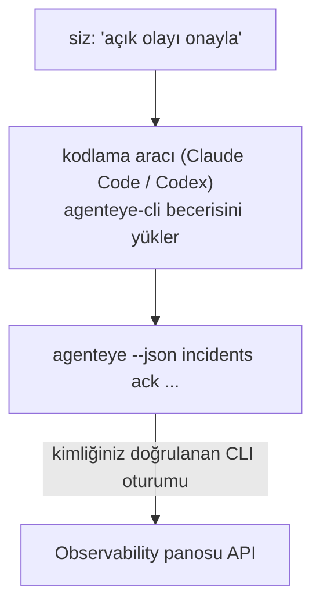

---
---
title: "Failproof AI Observability CLI Agent Skill"
description: "Kodlama aracınıza \"bugün bir şey bozuk mu?\" sorusu sorun ve Failproof AI Observability verilerinizden canlı yanıt alın — hiç komut ezberlemek zorunda değilsiniz."
---


Kodlama aracınıza *"bugün bir şey bozuk mu?"* sorusu sorun ve Failproof AI Observability canlı verilerinizden yanıt alın — hiç komut ezberlemek zorunda değilsiniz. **Failproof AI Observability CLI becerisi** (`agenteye-cli`), bir *Agent Becerisi*dir: kodlama aracı olarak Claude Code veya Codex'in isteğe bağlı olarak yükleyebileceği küçük bir talimat klasörü. Aracınızı, *"sadece etkinlik gönderebilecek CI için bir anahtar ver"* veya *"açık olayı onayla ve bana ata"* gibi basit İngilizce isteklerle [`agenteye` CLI](/tr/agenteye/cli) aracılığıyla Observability dağıtımınızı kullanmayı öğretir.

Bu **değildir** bir hizmet veya ayrı bir ikili dosya; dağıtılacak hiçbir şey yoktur. Zaten yüklemiş olduğunuz CLI'nin üzerinde çalışır: ajan `agenteye --json …` komutunu çalıştırır, temiz JSON'u ayrıştırır ve size cevapı düz metin şeklinde verir. Yapabileceği her şey, aynı komutları kendiniz yazarak da yapabilirsiniz.

---

## Diğer Failproof AI Observability arayüzleriyle ilişkisi

Failproof AI Observability aynı verilere ve kontrollere ulaşmanız için dört yol sunar. Birbirlerini tamamlarlar:

| Arayüz | Ne olduğu | Nerede çalışır | Şu durumlarda kullanın |
|---|---|---|---|
| **[CLI](/tr/agenteye/cli)** | `agenteye` için komut/bayrak başvurusu | Terminaliniz | Belirli bir komutu çalıştırmak veya betiklemek istediğinizde |
| **[CLI tarifleri](/tr/agenteye/cli-recipes)** | Kopyala-yapıştır `jq`/pipeline desenleri | Terminaliniz / betikleriniz | CLI'yi otomasyon içine bağlıyorsanız |
| **CLI becerisi** (bu belge) | CLI üzerinde doğal dil giriş kapısı | Kodlama aracınız, iş istasyonunuzda | Sadece sormak ve aracın komutu seçmesini bırakmak istediğinizde |
| **[Evaluator becerisi](/tr/agenteye/evaluator-skill)** | Puanlama hizmetinizi tasarlayan ve kuran kardeş beceri | Kodlama aracınız, iş istasyonunuzda | Puanlamayı *üretmek* istediğinizde, okumak değil |
| **[Python SDK becerisi](/tr/agenteye/python-sdk-skill)** | Aracınıza telemetri yayması için enstrüman takılan kardeş beceri | Kodlama aracınız, iş istasyonunuzda | Aracınızın bu becerinin okuduğu olayları *üretmesini* istediğinizde |
| **[Panodaki AI asistanı](/tr/agenteye/assistant)** | Panoya gömülü sohbet | Sunucu tarafı (panoda) | Verileriniz üzerinde pano içi soru-cevap istediğinizde |

Becerinin kendi imtiyazı yoktur; sadece sözlerinizi sizin olarak çalışan CLI çağrılarına dönüştürür:



### Panodaki AI asistanına karşı: önemli bir fark

Bunlar çok farklı etki alanlarına sahip iki farklı araçtır:

- **Panodaki AI asistanı** ([AI asistanı](/tr/agenteye/assistant)) panoya gömülü bir sohbet, ajan hizmeti tarafından desteklenir. **Yalnızca okunur artı onay gerektiren yazma**: kaydedilen sorguları ve panoları hazırlayabilir, ancak her yazma işlemi açık tıklamanızı bekler ve hiçbir zaman silmez. `agent:use` izni tarafından korunan ve yalnızca görüntülediğiniz kuruluşun verilerini görür.
- **CLI becerisi** *sizin* iş istasyonunuzda *sizin* kodlama aracınız içinde çalışır ve `agenteye` CLI'yi **sizin olarak** kullanır. CLI'nin **tam yüzeyini, değişiklikleri** (API anahtarları oluşturma/döndürme/devre dışı bırakma, kuruluş ayarlarını değiştirme, olayları çözme, kaydedilen sorguları silme) gerçekleştirebilir; bunlar yalnızca CLI oturumunuzun izinleriyle sınırlanır. Bunu tam olarak bu komutları elle çalıştırıyor gibi dikkatle kullanın.

---

## Ön koşullar

1. **`agenteye` CLI yüklü** ve `PATH` içinde (bkz. [CLI](/tr/agenteye/cli) başvurusu: `pipx install agenteye`).
2. **Pano URL'niz ayarlanmış** (`AGENTEYE_DASHBOARD_URL` veya ajan `--base-url` iletir).
3. **Oturum açmış bir oturum**: önce kendiniz `agenteye login` çalıştırın. Beceri **yapamaz** e-postayla gelen tek seferlik kod girişini sizin için tamamlamak; oturum eksikse veya süresi dolmuşsa (`CLI çıkış kodu 4`) size `agenteye login` çalıştırmasını söyler.

---

## Nerede bulabileceğiniz

Beceri, Failproof AI'nın genel beceri koleksiyonunda yayınlanır:

**[github.com/FailproofAI/skills](https://github.com/FailproofAI/skills)** → [`skills/agenteye-cli/`](https://github.com/FailproofAI/skills/tree/main/skills/agenteye-cli)

Hiçbir şey kilitli değildir — depo halka açıktır ve becerinin kendi kimlik bilgisine ihtiyacı yoktur, çünkü sadece **genel** `agenteye` CLI'yi *sizin* panonuza karşı, *sizin* oturum açtığınız oturumu kullanarak kullanır. Bunu almak için kimseye sormak zorunda değilsiniz.

`pipx install agenteye` paketi içinde kendi klasörü olarak gönderildiğine, **değil** içinde olduğunu, bu nedenle orada arama yapmayın.

## Beceriyi yükleme

En hızlı yol [`skills`](https://skills.sh) CLI'dir; bu klasörü getirir ve aracınızın aradığı yere koyar:

```bash
# Claude Code, yalnızca bu proje
npx skills add FailproofAI/skills --skill agenteye-cli -a claude-code

# her proje (~/.claude/skills/ dizinine yükler)
npx skills add FailproofAI/skills --skill agenteye-cli -a claude-code -g --copy

# Bunun yerine Codex
npx skills add FailproofAI/skills --skill agenteye-cli -a codex
```

Sonra bunu başka herhangi bir beceri gibi yönetin:

```bash
npx skills list -a claude-code      # yüklü olanlar
npx skills update agenteye-cli      # en son sürümü al
npx skills remove agenteye-cli      # kaldır
```

El ile yüklemeyi tercih ediyor musunuz? Bir Agent Becerisi sadece bir `SKILL.md` (artı isteğe bağlı referanslar) içeren bir klasördür; kopyalama da işe yarar:

- **Claude Code**: `agenteye-cli/` klasörünü `~/.claude/skills/` (her proje) veya `<your-repo>/.claude/skills/` (yalnızca o repo) içine koyun. Claude Code otomatik olarak keşfeder — `/skills` listinde doğrulayın veya açıklamasıyla eşleşen bir soru sorun.
- **Codex (OpenAI)**: Codex aynı `SKILL.md` dosyasını okur. Paketlenen `agents/openai.yaml`, `allow_implicit_invocation: true` olarak ayarlanmıştır; bu nedenle görev eşleştiğinde Codex beceriyi otomatik olarak seçer; aksi takdirde bunu açıkça `$agenteye-cli` olarak çağırın.

---

## Güvenlik: değişiklikler bir ajan CLI çalıştırdığında uyarı vermez

> **Uyarı:** Bir ajanın değişiklik yapmasına izin vermeden önce bunu okuyun.

`agenteye` CLI normalde yıkıcı bir eylemden önce *"emin misiniz?"* sorular. **Hiçbir zaman terminale bağlı olmadığında (tam olarak bir kodlama aracının onu çalıştırma şekli) ve `--json` de atlar onayı, bu onaylamayı otomatik olarak atlayın.** Bu nedenle güvenlik uyarısı ajan için **ateşlenmez**.

Beceri bunu telafi etmek için yazılmıştır: çalıştıracağı tam komutu belirtmesi ve herhangi bir durum değişikliğinden önce açık **OK** alması talimatı verilir. Bu disiplini koruyun. Failproof AI Observability'yi bir ajan aracılığıyla kullanırken, *siz* onaylama adımısınız. İzlenecek durum değiştiren komutlar:

- `keys create` / `update` / `disable` / `regenerate`
- `users create` / `update` / `disable` / `enable`
- `settings set`
- `alerts create` / `update` / `delete` / `test`
- yazma `incidents` alt komutları: `ack` / `assign` / `resolve` / `open` / `comment-add` / `comment-delete` / `subscribe` / `unsubscribe`
- `query create` / `update` / `delete`
- `agent rename` / `delete`
- `orgs switch`

**Gözlem** altındaki her şey (`events`, `sessions`, `evals`, `errors`, `list`, `whoami`, `orgs list/current/perms`) yalnızca okunur ve hiçbir şeyi değiştirmez.

Ajan **sizin olarak** davrandığı için, yalnızca oturum açmanızın izin verdiği işlemleri yapabilir; izinler **kuruluş başına** çözülür (bkz. [API anahtarları](/tr/agenteye/api-keys)). İzniniz olmayan bir komut, çıkış kodu `5` ile tam izin adı döndürür; bu sayede ajan hata alması yerine tam olarak ne isteyeceğini bir yöneticiden söyleyebilir.

---

## Ne sorabilirsiniz

İşte gerçek bir gidiş-dönüş; bir okuma, ardından sizin tamam vermesini bekleyen bir değişiklik:

```text
siz   ▸ Son gün içinde bir şey bozuk mu?

ajan ▸ Çalıştırılıyor: agenteye --json errors --since 24h --aggregate
       Son 24 saat içinde 3 hata türü. En büyüğü TimeoutError
       (18 isabet, tamamı checkout-agent üzerinde), ardından RateLimited (5).
       TimeoutError için başarısız oturumları görmek ister misiniz?

siz   ▸ CI'ye sadece etkinlik gönderebilecek bir anahtar ver.

ajan ▸ Bu bir API anahtarı oluşturur. Çalıştıracağım:
         agenteye keys create ci --add events:add
       Devam etmeye izin var mı?

siz   ▸ evet

ajan ▸ Bitti. "ci" anahtarı events:add ile oluşturuldu.
       Sır sadece bir kez gösterilir, bu nedenle şimdi kaydedin. 
       Yeniden yazdıramam.
```

Beceri her basit İngilizce niyeti doğru `agenteye` komutuna eşler; geçerli değerleri önceden keşfeder (`list <kind>`, `whoami`) böylece tahmin etmez ve herhangi bir değişiklikten önce tam komutu belirtir. Daha fazla örnek:

- *"Son gün içinde bir şey bozuk / başarısız mı?"* → `errors --since 24h --aggregate`, sonra bir döküm.
- *"Oturum `run-001` neden başarısız oldu?"* → `events --session-id run-001 --all` + `evals --session-id run-001`.
- *"Bu hafta kalite nasıl gidiyor?"* → `evals --aggregate --since 7d`, sonra düşük puanlamaya dalın.
- *"CI'ye sadece etkinlik gönderebilecek bir anahtar ver."* → `keys create ci --add events:add` (komutu belirtir, sonra oluşturur ve tek seferlik sırrı yakalar).
- *"Kimin erişimi var? Dana'yı salt okunur yap."* → `users list` → `users update dana@… --permission-set read-only` (sizinle onayladıktan sonra).
- *"Açık olayı onayla ve bana ata."* → `incidents list --state firing` → `incidents ack <id>` / `incidents assign <id> you@…`.

Bunların arkasındaki tam komutlar, bayraklar ve JSON şekilleri için bkz. [CLI](/tr/agenteye/cli) başvurusu ve [Ajanlar için CLI tarifleri](/tr/agenteye/cli-recipes).

---

## Sonraki adımlar

- **[CLI](/tr/agenteye/cli)**: `agenteye` için tam komut ve bayrak başvurusu.
- **[Ajanlar için CLI tarifleri](/tr/agenteye/cli-recipes)**: kopyala-yapıştır `jq` desenleri ve çıkış kodu işleme.
- **[Evaluator ajan becerisi](/tr/agenteye/evaluator-skill)**: kardeş beceri, `agenteye evals` içindeki puanları okuyan puanlayıcıyı kurmak için.
- **[Python SDK ajan becerisi](/tr/agenteye/python-sdk-skill)**: kardeş beceri, `agenteye` nin okuduğu telemetriyi yayması için aracı enstrüman takma için.
- **[AI asistanı](/tr/agenteye/assistant)**: pano içi asistan (bu terminal beceriyle karıştırılmamalıdır).
- **[API anahtarları](/tr/agenteye/api-keys)**: becerinin yapabileceklerini sınırlayan kuruluş başına izin modeli.