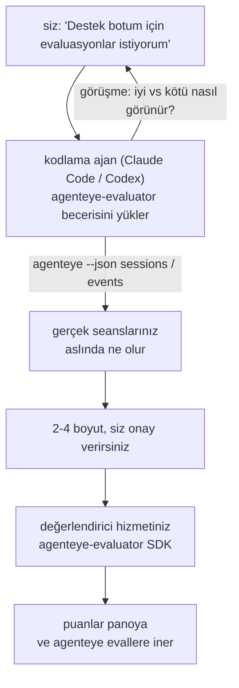

*"Ajanımız bazen kötü performans gösteriyor"* düşüncesinden dağıtılmış bir puanlama hizmetine geçin; kodlama ajanınız hem kararı hem de oluşturmayı yapsın. **Failproof AI Gözlemlenebilirlik değerlendirici becerisi** (`agenteye-evaluator`), bir *Ajan Becerisidir*: bir kodlama ajan (Claude Code veya Codex gibi) tarafından isteğe bağlı olarak yüklenen, bir klasör içinde barındırılan talimatlar. Ajanı, *sizin* ajan için izlenmeye değer olan kalite boyutlarını belirlemek, ardından [değerlendirici hizmetini](/tr/agenteye/evaluation-suite) yazıp, test edip ve dağıtmak öğretir.

Bu sistem **değildir**: barındırılan bir puanlayıcı, yüklendiğiniz bir kayıt defteri veya bir eklenti sistemi. Değerlendiricileriniz, [Değerlendirme paketi](/tr/agenteye/evaluation-suite) kılavuzunda açıklandığı gibi, kendi altyapınızda çalışan kendi HTTP hizmetiniz olarak kalır. Beceri, ajanınızı bunu iyi inşa etmeyi öğretir; bu nedenle yaptığı her şey, aynı kodu yazarak siz de yapabilirsiniz.

---

## Zor kısım neyi puanlamak gerektiğine karar vermek

SDK yüzeyi küçüktür — bir dekoratör ve iki model — ve bir ajan bunu [kontratı](/tr/agenteye/evaluation-suite#http-contract) tek başına yazabilir. Sorun burada değildir. Sorun, yanlış şeyi puanlamalarıdır; yanlış şeyi puanlayan bir değerlendirici hiç olmamasından daha kötüdür: herkesin görmezden gelmeyi öğrendiği bir pano üretir.

Bu nedenle becerinin çoğu, kod yazmadan önceki kısımdır. Ajanı sizi görüşmeye (*"iyi giden bir işlemi anlatın; şimdi kötü gideni"*), ardından [`agenteye` CLI](/tr/agenteye/cli) aracılığıyla gerçek seanslarınızı çekerek end-to-end okumaya alır. Bu iki yarı genellikle anlaşamaz ve arası fark önemlidir: ölçmeyi niyet ettiğiniz şey ile transkriplerinizin gerçekten destekleyebileceği şey arasındaki boşluk. Bir boyut ancak **olaylardan hesaplanabilir** ve **ayırıcı** ise hayatta kalır — eğer hem iyi çalışmanızda hem de kötü çalışmanızda 0.9 puan alırsa, hiçbir şey öğretmez ve kesilir.

Geri dönen şey, 2-4 boyutun bir teklifi ve ona ilişkin akıl yürütmedir; bir satır yazılmadan önce sizin onay vermeniz için.



---

## Diğer değerlendirme bileşenleriyle ilişkisi

Dört belge puanlamayı kapsar ve sırayla birbirini devreye sokar:

| Sayfa | Nedir | Ne zaman kullanın |
|---|---|---|
| **[Değerlendirmeler](/tr/agenteye/evaluations)** | Özellik: oturum ızgarasında puanlar, panolar, yeniden değerlendir | Otomatik puanlamanın ne getirdiğini bilmek istiyorsunuz |
| **[Değerlendirme paketi](/tr/agenteye/evaluation-suite)** | HTTP kontratı, SDK, sunucu ortam değişkenleri | Değerlendiricinin kendisini uygulıyor veya debug ediyor |
| **Değerlendirici becerisi** (bu belge) | Puanlaycı tasarlamada *ve* oluşturmada doğal dil giriş kapısı | "Evaluasyonlar istiyorum" ile çalışan bir hizmetin kapısında olmak istiyorsunuz |
| **[CLI becerisi](/tr/agenteye/cli-skill)** | `agenteye` CLI'de doğal dil giriş kapısı | Zaten sahip olduğunuz puanları *okumak* istiyorsunuz |
| **[Python SDK becerisi](/tr/agenteye/python-sdk-skill)** | Ajanınızı enstrümanter etmekte doğal dil giriş kapısı | Ajanınız henüz seanslar yaymıyor — puanlanacak hiçbir şey yok |

### CLI becerisi ile karşılaştırma: oluştur versus oku

İki beceri kasıtlı olarak örtüşmez ve her ikisini yüklemek normal kurulumudur — ajan ne sorduğunuza bağlı olarak aralarında seçim yapar:

- **`agenteye-evaluator`** (bu belge) puanları *üreten* şeyi oluşturur. İşi puanlar ilk kez inmesi sırasında biter.
- **[`agenteye-cli`](/tr/agenteye/cli-skill)** zaten var olan puanları okur (`agenteye evals`). *"Bu hafta kalite düştü mü?"* onun sorusudur, bu becerinin değil.

---

## Ön Koşullar

1. **`agenteye` CLI yüklü ve oturum açmış** (`pipx install agenteye`, ardından `agenteye login`). Beceri bunu iki kez kullanır: tasarladığı gerçek seansları çekmek için ve seansların sonunda puanlarınızın geldiğini doğrulamak için. Oturumunuzun `events:read` gereksinimi vardır, ayrıca bu son kontrol için `evaluations:read`. CLI becerisi ile birlikte, e-posta ile gönderilen tek kullanımlık kod girişini **tamamlayamaz**.
2. **Değerlendiricinin yaşayacağı bir yer.** Bir imaja yerleştirilir ve uzun süreli bir hizmet olarak çalıştırılır; bu nedenle gerçek bir repo'ya ihtiyaç vardır, geçici bir dosyaya değil. Değerlendiriciler sık sık kendi repo'sunda yaşar, puanlanan ajanından ayrı — beceri var olanı arar ve yeni bir tane oluşturmadan önce sorar.
3. **`agenteye-evaluator` SDK tekerleği** — ajanınız `pip` komutlarını yazmaya başlamadan sonraki bölümü okuyun.

---

## Nereden alınır

Beceri, Failproof AI'ın herkese açık beceri koleksiyonunda yayınlanır:

**[github.com/FailproofAI/skills](https://github.com/FailproofAI/skills)** → [`skills/agenteye-evaluator/`](https://github.com/FailproofAI/skills/tree/main/skills/agenteye-evaluator)

Depo herkese açıktır ve becerinin kendi kimlik bilgisine ihtiyacı yoktur — yalnızca `agenteye` CLI'yi oturum açtığınız seansla çalıştırır ve kodunuzu *kendi* repo'nuzda yazar. Kendi klasörü olarak gönderilir ve `pipx install agenteye` paketi içinde **değildir**; bu nedenle onu orada aramayın.

## Becerisini Kurma

En hızlı yol [`skills`](https://skills.sh) CLI'dir; bu klasörü getirir ve ajanınızın baktığı yere bırakır:

```bash
# Claude Code, yalnızca bu proje
npx skills add FailproofAI/skills --skill agenteye-evaluator -a claude-code

# her proje (~/.claude/skills/ dosyasına yükler)
npx skills add FailproofAI/skills --skill agenteye-evaluator -a claude-code -g --copy

# Yerine Codex
npx skills add FailproofAI/skills --skill agenteye-evaluator -a codex
```

Ardından diğer beceriler gibi yönetin:

```bash
npx skills list -a claude-code           # ne yüklü
npx skills update agenteye-evaluator     # en son sürümü çek
npx skills remove agenteye-evaluator     # kaldır
```

Elle yüklemek tercih misiniz? Bir Ajan Becerisi, `SKILL.md` içeren bir klasördür (artı isteğe bağlı referanslar); bu nedenle kopyalama işe yarar:

- **Claude Code**: `agenteye-evaluator/` klasörünü `~/.claude/skills/` (her proje) veya `<your-repo>/.claude/skills/` (yalnızca bu repo) içine koyun. Claude Code bunu otomatik olarak bulur — `/skills` listesi ile doğrulayın veya sadece evaluasyonlar isteyin.
- **Codex (OpenAI)**: Codex aynı `SKILL.md` dosyasını okur. Paketlenmiş `agents/openai.yaml`, `allow_implicit_invocation: true` ayarlar; bu nedenle bir görev eşleştiğinde Codex beceriyi otomatik seçer; aksi takdirde açıkça `$agenteye-evaluator` olarak çağırın.

---

## SDK genel PyPI'de değildir

> **Uyarı:** Bir ajanın SDK yüklemesine izin vermeden önce bunu okuyun.

Beceri herkese açıktır; onu çalıştırdığı SDK değildir. `agenteye-evaluator` yalnızca özel bir sürüm yapı olarak gönderilir ve `agenteye` gibi farklı olarak, ad **genel PyPI'de açıklanmadıdır** — bu nedenle basit `pip install agenteye-evaluator` komutu, üretim transkriplerinizi okuyan hizmete başka bir kişinin paketini çekebilir. Bu bir yazım hatası değil, bir tedarik zinciri sorunudur.

Beceri bunu bilir ve yerine bir yükleme merdiveninde aşağı doğru çalışır; ilk geçerli basamağında durur: AgentEye repo'sunun içindeyseniz monorepo kaynağı; aksi takdirde GitHub Releases'ten özel sürüm tekerleği (erişim gerekir); ikisi de erişilemezse **durur ve Failproof AI iletişim kişinizden tekerleği istemenizi söyler** uydurmak yerine.

Eğer ajanınız genel PyPI'den basit `pip install agenteye-evaluator` önerirse, bu becerinin hiç yüklenmediğini gösterir. Orada durun ve yüklendiğini kontrol edin.

---

## Ona ne sorabilirsiniz

Gerçek bir tur sonu, belirsiz bir sorudan imza faydalı bir tasarımla biter, kodla değil:

```text
siz   ▸ Destek botumuz için evaluasyonlar istiyorum. Bazen kötü 
        olduğunu düşünüyorum.

ajan  ▸ Herhangi bir şey yazmadan önce: iyi giden bir işlemi anlatın,
        ve kötü gideni.

siz   ▸ İyi: dokümanlardan cevaplar. Kötü: yok sayıyor,
        veya "destek ile iletişime geçin" diyor.

ajan  ▸ Çalışıyor: agenteye --json sessions --status error --since 7d
        5 seansı okuyorum, ikisini kötü olarak yazıyorsunuz.

        Söyledikleriniz gerçekçiliği ve sapıtmayı söylüyor. Transkripler
        sapıtmada anlaşıyor (5'in 2'si destek devredimiyle bitiyor,
        ve model_response.content'de açık), fakat gerçekçiliğin
        olaylarda taşımadığı bir yer gerçeğine ihtiyacı vardır.

        Yani üç şeyi puanlarım:
          - sapıtma        kurallar, ucuz, iki işlemi ayırır
          - araç_verimliği kurallar, işlemler arası döngüyü yakalar
          - temelcilik      LLM hakim: aldığı doklarda her iddia var mı?

        "gerçekçiliğin" olmayan yer gerçeğine ihtiyacı vardır; temelcilik
        transkriplerinizin fiilen destekleyebildiği en yakın şey.
        Bu üç adla iyi misiniz? Daha sonra yeniden adlandırma geçmişi böler.

siz   ▸ evet

ajan  ▸ Bu repo'da değerlendirici yok. Bir tane buraya kurmalı mıyım,
        yoksa başka yerde varsa?
```

Buradan kurallar tabanlı boyutları ilk yazar (bedava, anında, belirleyici), bunları kilitlenmeler ve asla bitmeyenler de dahil gerçek yakalanmış seanslar aracılığıyla test eder, ve yalnızca öznel boyut için LLM hakime ulaşır. [Gönderici sınırlarını](/tr/agenteye/evaluation-suite#configuring-the-server) bilir — 30s istek zaman aşımı ve 8 eşzamanlı çağrı dağıtım genelinde — yani hakim güvenilir şekilde sığmazsa, `JobPending` ile eşzamansız gider, hakim iptal edilmiş ve beş kez yeniden denenmiş olmasına izin vermez.

Daha sonra dağıtır, iki sunucu ortam değişkenini ayarlar, ve `agenteye --json evals --session-id <id>` ile doğrular ki puanlar gerçekten indi. Puanlar inmek tek kanıttır.

---

## Nelere dikkat edin

- **Boyut adları neredeyse kalıcıdır.** Puan anahtarları keyfi dizeler ve platform gönderdiğiniz şeyi eğilimlendirir; bu nedenle aşağı akış hiçbir şey kötü seçimi düzeltmez. Daha sonra yeniden adlandırın ve geçmiş bölünür: eski seanslar eski anahtarı tutar ve eğilim kırılır. Bu, becerinin kod yazmadan önce açık onay aldığı nedeni — bu istem ciddiye alın.
- **Sabitler gerçek üretim transkriplerileridir.** Gerçek seanslar aracılığıyla tasarlamak onları diske çekmek anlamına gelir ve müşteri verisi içerebilirler. Beceri git'e teslim etmeden önce sorar; şüphede, `fixtures/` repo dışında tutun ve her geliştirici kendi tarafını çeksin.
- **Ajan her transkripti okuyan bir hizmet yazar ve dağıtır.** Sizin olarak davranır, CLI oturumunuzun izinleriyle sınırlı; fakat üretim verisine dokunulan diğer kodlar gibi değerlendiriciye bakın.

---

## Sonraki adımlar

- **[Değerlendirme paketi](/tr/agenteye/evaluation-suite)**: HTTP kontratı, SDK ve becerinin yapılandırdığı sunucu ortam değişkenleri.
- **[Değerlendirmeler](/tr/agenteye/evaluations)**: puanlar indikten sonra nerede gösterildiği.
- **[CLI becerisi](/tr/agenteye/cli-skill)**: puan oluşturmak yerine sonuçları okuyan kardeş beceri.
- **[CLI](/tr/agenteye/cli)**: becerinin tasarladığı seanslar verilerinin arkasındaki komut referansı.