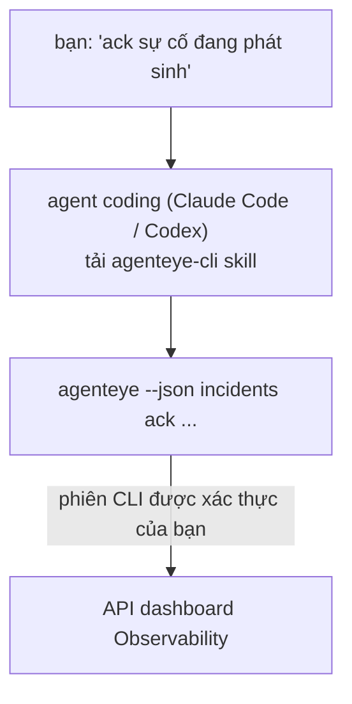

Hỏi agent coding của bạn *"có cái gì bị hỏng hôm nay không?"* và để nó trả lời từ dữ liệu Failproof AI Observability trực tiếp, không cần nhớ bất kỳ lệnh nào. **Failproof AI Observability CLI skill** (`agenteye-cli`) là một *Agent Skill*: một thư mục nhỏ chứa hướng dẫn mà một agent coding như Claude Code hoặc Codex có thể tải theo yêu cầu. Nó dạy agent cách vận hành deployment Observability của bạn thông qua [`agenteye` CLI](/vi/agenteye/cli) từ những yêu cầu bằng tiếng Anh thông thường như *"cấp cho CI một key chỉ có thể push events"* hoặc *"ack sự cố đang phát sinh và gán cho tôi."*

Nó **không phải** một dịch vụ hoặc một binary riêng; không có gì để deploy. Nó chạy trên CLI bạn đã cài đặt: agent shell out tới `agenteye --json …`, phân tích JSON sạch, và trả lời bạn bằng văn bản. Mọi thứ nó có thể làm, bạn cũng có thể làm bằng cách gõ các lệnh tương tự.

---

## Nó liên quan như thế nào đến các giao diện Failproof AI Observability khác

Failproof AI Observability cung cấp bốn cách để truy cập dữ liệu và điều khiển giống nhau. Chúng bổ sung cho nhau:

| Giao diện | Nó là gì | Chạy ở đâu | Dùng khi |
|---|---|---|---|
| **[CLI](/vi/agenteye/cli)** | Tham chiếu lệnh/flag cho `agenteye` | Terminal của bạn | Bạn muốn chạy hoặc viết script một lệnh cụ thể |
| **[CLI recipes](/vi/agenteye/cli-recipes)** | Các mẫu `jq`/pipeline sao chép được | Terminal/scripts của bạn | Bạn đang kết nối CLI vào tự động hóa |
| **CLI skill** (tài liệu này) | Cửa vào ngôn ngữ tự nhiên trên CLI | Agent coding của bạn, trên workstation | Bạn muốn *chỉ cần hỏi* và để agent chọn lệnh |
| **[Evaluator skill](/vi/agenteye/evaluator-skill)** | Một skill anh em thiết kế và xây dựng dịch vụ scoring của bạn | Agent coding của bạn, trên workstation | Bạn muốn *tạo* eval scores thay vì đọc chúng |
| **[Python SDK skill](/vi/agenteye/python-sdk-skill)** | Một skill anh em instrument agent của bạn để nó phát ra telemetry | Agent coding của bạn, trên workstation | Bạn muốn agent của bạn *tạo* các sự kiện mà skill này đọc |
| **[In-dashboard AI assistant](/vi/agenteye/assistant)** | Một chat nhúng trong dashboard | Phía server (trong dashboard) | Bạn muốn Q&A trong dashboard trên dữ liệu của bạn |

Bản thân skill không có đặc quyền riêng; nó chỉ biến lời nói của bạn thành các lệnh CLI chạy với tư cách của bạn:



### so với in-dashboard AI assistant: một phân biệt quan trọng

Đây là hai công cụ khác nhau với phạm vi ảnh hưởng rất khác nhau:

- **In-dashboard AI assistant** ([AI assistant](/vi/agenteye/assistant)) là một chat nhúng trong dashboard, được hỗ trợ bởi dịch vụ agent. Nó là **chỉ đọc cộng tác giả gated phê duyệt**: nó có thể soạn thảo các truy vấn đã lưu và dashboard, nhưng mọi ghi tạm dừng để chờ click phê duyệt rõ ràng của bạn, và nó không bao giờ xóa. Nó được gated bởi quyền `agent:use` và chỉ bao giờ nhìn thấy dữ liệu cho org bạn đang xem.
- **CLI skill** chạy trên *workstation* của bạn bên trong *agent* coding của bạn và điều khiển `agenteye` CLI với tư cách **bạn**. Nó có thể thực hiện **toàn bộ bề mặt của CLI, bao gồm cả mutations** (tạo/xoay/vô hiệu hóa API keys, thay đổi cài đặt org, giải quyết sự cố, xóa truy vấn đã lưu), được giới hạn chỉ bởi quyền của CLI login của bạn. Hãy coi nó chính xác như cách bạn sẽ chạy các lệnh đó bằng tay.

---

## Điều kiện tiên quyết

1. **`agenteye` CLI được cài đặt** và trên `PATH` (xem tham chiếu [CLI](/vi/agenteye/cli): `pipx install agenteye`).
2. **URL dashboard của bạn được đặt** (`AGENTEYE_DASHBOARD_URL`, hoặc agent truyền `--base-url`).
3. **Một phiên đã đăng nhập**: chạy `agenteye login` trước. Skill **không thể** hoàn thành login mã một lần được gửi qua email cho bạn; nó sẽ yêu cầu bạn chạy `agenteye login` nếu phiên bị mất hoặc hết hạn (mã thoát CLI `4`).

---

## Nơi để lấy nó

Skill được xuất bản trong bộ sưu tập skills công cộng của Failproof AI:

**[github.com/FailproofAI/skills](https://github.com/FailproofAI/skills)** → [`skills/agenteye-cli/`](https://github.com/FailproofAI/skills/tree/main/skills/agenteye-cli)

Không có gì về nó bị gated — kho lưu trữ là công cộng và skill không cần bất kỳ thông tin xác thực nào của riêng nó, vì nó chỉ điều khiển **công cộng** `agenteye` CLI chống lại *dashboard* của bạn, sử dụng phiên *bạn* đã đăng nhập. Bạn không cần phải yêu cầu ai để lấy nó.

Lưu ý nó được cung cấp dưới dạng thư mục riêng của nó và **không** nằm trong gói `pipx install agenteye`, vì vậy đừng tìm kiếm nó ở đó.

## Cài đặt skill

Con đường nhanh nhất là CLI [`skills`](https://skills.sh), nó tìm nạp thư mục và đặt nó vào nơi agent của bạn tìm kiếm:

```bash
# Claude Code, chỉ project này
npx skills add FailproofAI/skills --skill agenteye-cli -a claude-code

# mọi project (cài đặt vào ~/.claude/skills/)
npx skills add FailproofAI/skills --skill agenteye-cli -a claude-code -g --copy

# Codex thay thế
npx skills add FailproofAI/skills --skill agenteye-cli -a codex
```

Sau đó quản lý nó như bất kỳ skill nào khác:

```bash
npx skills list -a claude-code      # cái gì được cài đặt
npx skills update agenteye-cli      # kéo phiên bản mới nhất
npx skills remove agenteye-cli      # loại bỏ nó
```

Thích cài đặt bằng tay? Một Agent Skill chỉ là một thư mục chứa `SKILL.md` (cộng với tham chiếu tùy chọn), vì vậy sao chép nó cũng hoạt động:

- **Claude Code**: đặt thư mục `agenteye-cli/` trong `~/.claude/skills/` (mọi project) hoặc `<your-repo>/.claude/skills/` (chỉ repo đó). Claude Code tự động khám phá nó — xác minh bằng danh sách `/skills`, hoặc chỉ cần hỏi một câu hỏi phù hợp với mô tả của nó.
- **Codex (OpenAI)**: Codex đọc `SKILL.md` giống nhau. `agents/openai.yaml` đi kèm đặt `allow_implicit_invocation: true`, vì vậy Codex tự động chọn skill khi một tác vụ phù hợp; nếu không thì gọi nó rõ ràng là `$agenteye-cli`.

---

## Bảo mật: mutations KHÔNG nhắc khi agent chạy CLI

> **Cảnh báo:** Đọc điều này trước khi để agent thực hiện các thay đổi.

CLI `agenteye` thường hỏi *"bạn có chắc không?"* trước một hành động phá hoại. Nó **tự động bỏ qua xác nhận đó bất cứ khi nào nó không được gắn vào terminal (đó chính xác là cách một agent coding chạy nó), và `--json` cũng bỏ qua nó.** Vì vậy dấu nhắc bảo mật sẽ **không** kích hoạt cho agent.

Skill được viết để bù đắp: nó được hướng dẫn để phát biểu lệnh chính xác mà nó sẽ chạy và nhận được **OK rõ ràng của bạn trước bất kỳ thay đổi trạng thái**. Giữ kỷ luật đó. Khi bạn điều khiển Failproof AI Observability thông qua một agent, *bạn* là bước xác nhận. Các lệnh thay đổi trạng thái để xem:

- `keys create` / `update` / `disable` / `regenerate`
- `users create` / `update` / `disable` / `enable`
- `settings set`
- `alerts create` / `update` / `delete` / `test`
- các lệnh con `incidents` ghi: `ack` / `assign` / `resolve` / `open` / `comment-add` / `comment-delete` / `subscribe` / `unsubscribe`
- `query create` / `update` / `delete`
- `agent rename` / `delete`
- `orgs switch`

Mọi thứ dưới **Observe** (`events`, `sessions`, `evals`, `errors`, `list`, `whoami`, `orgs list/current/perms`) là chỉ đọc và không thay đổi gì.

Vì agent hoạt động với tư cách **bạn**, nó chỉ có thể làm những gì login của bạn được phép làm; quyền được phân giải **mỗi org** (xem [API keys](/vi/agenteye/api-keys)). Một lệnh bạn thiếu quyền cho nó trả về mã thoát `5` với quyền chính xác được đặt tên, vì vậy agent có thể cho bạn biết chính xác cần yêu cầu admin cái gì thay vì thất bại không rõ ràng.

---

## Bạn có thể hỏi nó gì

Đây là những gì một chuyến đi thực tế trông như thế nào, một lần đọc, sau đó là một thay đổi chờ OK của bạn:

```text
bạn   ▸ Có cái gì bị hỏng trong 24h qua không?

agent ▸ Chạy: agenteye --json errors --since 24h --aggregate
        3 loại lỗi trong 24h qua. Cái lớn nhất là TimeoutError
        (18 lần, đều trên checkout-agent), sau đó là RateLimited (5).
        Bạn muốn các phiên bị lỗi cho TimeoutError không?

bạn   ▸ Cấp cho CI một key chỉ có thể push events.

agent ▸ Điều này tạo một API key. Tôi sẽ chạy:
          agenteye keys create ci --add events:add
        OK để tiếp tục?

bạn   ▸ yes

agent ▸ Xong. Key "ci" được tạo với chỉ events:add.
        Secret chỉ được hiển thị một lần, vì vậy lưu trữ nó ngay bây giờ. Tôi không thể in lại nó.
```

Skill ánh xạ mỗi ý định ngôn ngữ tự nhiên thành lệnh `agenteye` đúng, khám phá các giá trị hợp lệ trước (`list <kind>`, `whoami`) để nó không đoán, và phát biểu lệnh chính xác trước bất kỳ thay đổi. Ví dụ thêm:

- *"Có cái gì bị hỏng / fail trong 24h qua không?"* → `errors --since 24h --aggregate`, sau đó là một phân tích.
- *"Tại sao phiên `run-001` lại fail?"* → `events --session-id run-001 --all` + `evals --session-id run-001`.
- *"Chất lượng đang xu hướng như thế nào tuần này?"* → `evals --aggregate --since 7d`, sau đó đi sâu vào các chạy có điểm thấp.
- *"Cấp cho CI một key chỉ có thể push events."* → `keys create ci --add events:add` (nó phát biểu lệnh, sau đó tạo nó và bắt secret một lần).
- *"Ai có quyền truy cập? Làm Dana chỉ đọc."* → `users list` → `users update dana@… --permission-set read-only` (sau khi xác nhận với bạn).
- *"Ack sự cố đang phát sinh và gán cho tôi."* → `incidents list --state firing` → `incidents ack <id>` / `incidents assign <id> you@…`.

Để xem các lệnh chính xác, flag, và hình dạng JSON đằng sau những thứ này, xem tham chiếu [CLI](/vi/agenteye/cli) và [CLI recipes cho agents](/vi/agenteye/cli-recipes).

---

## Bước tiếp theo

- **[CLI](/vi/agenteye/cli)**: tham chiếu lệnh và flag đầy đủ cho `agenteye`.
- **[CLI recipes cho agents](/vi/agenteye/cli-recipes)**: các mẫu `jq` sao chép được và xử lý mã thoát.
- **[Evaluator agent skill](/vi/agenteye/evaluator-skill)**: skill anh em, để xây dựng evaluator mà `agenteye evals` đọc.
- **[Python SDK agent skill](/vi/agenteye/python-sdk-skill)**: skill anh em, để instrument agent để nó phát ra telemetry mà `agenteye` đọc.
- **[AI assistant](/vi/agenteye/assistant)**: assistant trong dashboard (không nên nhầm lẫn với skill terminal này).
- **[API keys](/vi/agenteye/api-keys)**: mô hình quyền mỗi org bounding cái gì skill có thể làm.