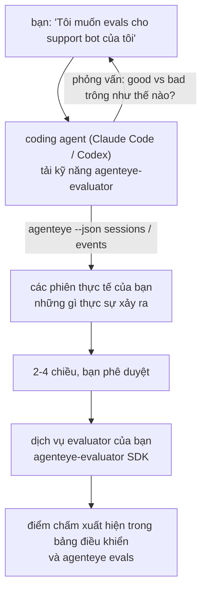

Từ *"Tôi nghĩ agent của chúng tôi đôi khi có vấn đề"* đến một dịch vụ scoring được triển khai, với coding agent của bạn vừa quyết định vừa xây dựng. **Kỹ năng Failproof AI Observability evaluator** (`agenteye-evaluator`) là một *Agent Skill*: một thư mục nhỏ chứa hướng dẫn mà một coding agent như Claude Code hay Codex có thể tải khi cần. Nó dạy agent cách xác định những chiều chất lượng nào đáng theo dõi cho *agent của bạn*, sau đó viết, kiểm thử và triển khai [dịch vụ evaluator](/vi/agenteye/evaluation-suite) để chấm điểm chúng.

Nó **không** phải là một scorer được lưu trữ, một registry bạn tải lên, hay một hệ thống plugin. Evaluator của bạn vẫn là dịch vụ HTTP riêng trên cơ sở hạ tầng riêng của bạn, chính xác như mô tả trong hướng dẫn [Evaluation suite](/vi/agenteye/evaluation-suite). Kỹ năng này chỉ dạy agent của bạn cách xây dựng nó tốt, vì vậy mọi thứ nó làm, bạn cũng có thể tự làm bằng cách viết cùng một đoạn mã.

---

## Phần khó là quyết định cái gì cần chấm điểm

Bề mặt SDK rất nhỏ — một decorator và hai model — và agent có thể viết từ [contract](/vi/agenteye/evaluation-suite#http-contract) một mình. Đó không phải là nơi evaluator thất bại. Chúng thất bại vì chúng chấm điểm những thứ sai, và một evaluator chấm những thứ sai thì còn tệ hơn không có gì: nó tạo ra một bảng điều khiển mà mọi người học cách bỏ qua.

Vì vậy, hầu hết kỹ năng là phần trước khi bất kỳ mã nào tồn tại. Nó có agent phỏng vấn bạn (*"mô tả một lần chạy diễn ra tốt; bây giờ mô tả một lần chạy diễn ra xấu"*), sau đó kéo các phiên thực tế của bạn qua [`agenteye` CLI](/vi/agenteye/cli) và đọc chúng từ đầu đến cuối. Hai nửa này thường không đồng ý, và khoảng cách chính là điểm: những gì bạn định đo so với những gì transcript của bạn thực sự có thể hỗ trợ. Một chiều chỉ tồn tại nếu nó **có thể tính toán** từ các sự kiện và **phân biệt** — nếu nó chấm 0.9 cho cả lần chạy tốt và lần chạy xấu của bạn, nó không dạy gì cả và sẽ bị loại.

Kết quả là một đề xuất 2-4 chiều kèm theo lý do, để bạn phê duyệt trước khi bất kỳ dòng nào được viết.



---

## Nó liên quan như thế nào với những phần evaluation khác

Bốn tài liệu đề cập đến scoring, và chúng trao quyền cho nhau theo thứ tự:

| Trang | Nó là gì | Tìm đến nó khi |
|---|---|---|
| **[Evaluations](/vi/agenteye/evaluations)** | Tính năng: điểm trên lưới phiên, bảng điều khiển, đánh giá lại | Bạn muốn biết automatic scoring mang lại gì |
| **[Evaluation suite](/vi/agenteye/evaluation-suite)** | HTTP contract, SDK, server env vars | Bạn đang triển khai hoặc gỡ lỗi evaluator |
| **Evaluator skill** (tài liệu này) | Một cửa ngôn ngữ tự nhiên để thiết kế *và* xây dựng scorer | Bạn muốn từ "Tôi muốn evals" đến dịch vụ chạy |
| **[CLI skill](/vi/agenteye/cli-skill)** | Một cửa ngôn ngữ tự nhiên cho `agenteye` CLI | Bạn muốn *đọc* điểm bạn đã có |
| **[Python SDK skill](/vi/agenteye/python-sdk-skill)** | Một cửa ngôn ngữ tự nhiên để instrument agent của bạn | Agent của bạn chưa phát hành phiên — không có gì để chấm điểm |

### so với CLI skill: xây dựng versus đọc

Hai kỹ năng có ý định không trùng lặp, và cài đặt cả hai là thiết lập bình thường — agent chọn giữa chúng dựa trên những gì bạn hỏi:

- **`agenteye-evaluator`** (tài liệu này) xây dựng thứ *tạo ra* điểm. Công việc của nó kết thúc khi điểm xuất hiện lần đầu tiên.
- **[`agenteye-cli`](/vi/agenteye/cli-skill)** đọc điểm đã tồn tại (`agenteye evals`). *"Chất lượng có giảm tuần này không?"* là câu hỏi của nó, không phải của kỹ năng này.

---

## Điều kiện tiên quyết

1. **`agenteye` CLI được cài đặt và đăng nhập** (`pipx install agenteye`, sau đó `agenteye login`). Kỹ năng dựa vào nó hai lần: để kéo các phiên thực tế nó thiết kế cho, và để xác nhận điểm của bạn xuất hiện ở cuối. Đăng nhập của bạn cần `events:read`, cộng với `evaluations:read` để kiểm tra cuối cùng đó. Giống như CLI skill, nó **không thể** hoàn thành đăng nhập mã một lần qua email cho bạn.
2. **Một nơi cho evaluator ở.** Nó được xây dựng thành một image và chạy như một dịch vụ chạy liên tục, vì vậy nó cần một repo thực, không phải một tệp tạm thời. Các evaluator thường sống trong repo riêng của chúng, tách biệt với agent đang được chấm điểm — kỹ năng tìm kiếm một cái hiện có và hỏi trước khi tạo cái mới.
3. **Wheel SDK `agenteye-evaluator`** — đọc phần tiếp theo trước khi agent của bạn bắt đầu gõ lệnh `pip`.

---

## Nơi lấy nó

Kỹ năng được công bố trong bộ sưu tập kỹ năng công khai của Failproof AI:

**[github.com/FailproofAI/skills](https://github.com/FailproofAI/skills)** → [`skills/agenteye-evaluator/`](https://github.com/FailproofAI/skills/tree/main/skills/agenteye-evaluator)

Kho lưu trữ là công khai và kỹ năng không cần bất kỳ thông tin xác thực riêng nào — nó chỉ điều khiển `agenteye` CLI với phiên *bạn* đã đăng nhập, và viết mã trong *repo của bạn*. Lưu ý nó được gửi như là một thư mục riêng và **không** nằm bên trong gói `pipx install agenteye`, vì vậy đừng tìm nó ở đó.

## Cài đặt kỹ năng

Cách nhanh nhất là CLI [`skills`](https://skills.sh), nó tìm nạp thư mục và đặt nó nơi agent của bạn tìm:

```bash
# Claude Code, dự án này chỉ
npx skills add FailproofAI/skills --skill agenteye-evaluator -a claude-code

# mọi dự án (cài đặt vào ~/.claude/skills/)
npx skills add FailproofAI/skills --skill agenteye-evaluator -a claude-code -g --copy

# Codex thay vào đó
npx skills add FailproofAI/skills --skill agenteye-evaluator -a codex
```

Sau đó quản lý nó như bất kỳ kỹ năng nào khác:

```bash
npx skills list -a claude-code           # cái gì được cài đặt
npx skills update agenteye-evaluator     # kéo phiên bản mới nhất
npx skills remove agenteye-evaluator     # xóa nó
```

Thích cài đặt bằng tay? An Agent Skill chỉ là một thư mục chứa một `SKILL.md` (cộng với các tham chiếu tuỳ chọn), vì vậy sao chép nó cũng hoạt động:

- **Claude Code**: đặt thư mục `agenteye-evaluator/` trong `~/.claude/skills/` (mọi dự án) hoặc `<your-repo>/.claude/skills/` (chỉ repo đó). Claude Code tự khám phá nó — xác minh bằng danh sách `/skills`, hoặc chỉ cần hỏi về evals.
- **Codex (OpenAI)**: Codex đọc cùng một `SKILL.md`. `agents/openai.yaml` được đi kèm đặt `allow_implicit_invocation: true`, vì vậy Codex tự chọn kỹ năng khi một tác vụ phù hợp; nếu không hãy gọi nó rõ ràng như `$agenteye-evaluator`.

---

## SDK không nằm trên public PyPI công khai

> **Cảnh báo:** Đọc điều này trước khi để agent cài đặt SDK.

Kỹ năng là công khai; SDK nó điều khiển thì không. `agenteye-evaluator` được gửi chỉ như một artifact phát hành riêng, và không giống như `agenteye`, tên **chưa được áp dụng trên public PyPI** — vì vậy một `pip install agenteye-evaluator` trần truồng có thể kéo gói của người lạ vào dịch vụ đọc transcript sản xuất của bạn. Đó là một vấn đề chuỗi cung ứng, không phải một lỗi đánh máy.

Kỹ năng biết điều này và thay vào đó hoạt động xuống một cầu thang cài đặt, dừng lại ở bậc đầu tiên áp dụng: nguồn monorepo nếu bạn ở trong repo AgentEye, nếu không là wheel phát hành riêng từ GitHub Releases (cần truy cập), và nếu cái nào không có sẵn nó **dừng lại và cho bạn biết hãy hỏi Failproof AI contact của bạn để lấy wheel** thay vì ứng phó.

Vì vậy nếu agent của bạn đề xuất một `pip install agenteye-evaluator` trần truồng từ public PyPI, đó là dấu hiệu kỹ năng không bao giờ được tải. Dừng ở đó và kiểm tra nó được cài đặt.

---

## Những gì bạn có thể hỏi nó

Một vòng chuyến thực tế bắt đầu với một yêu cầu mơ hồ và kết thúc bằng một thiết kế được ký duyệt, không phải mã:

```text
bạn   ▸ Tôi muốn evals cho support bot của chúng tôi. Tôi nghĩ
        nó đôi khi có vấn đề.

agent ▸ Trước khi tôi viết bất cứ thứ gì: mô tả một lần chạy
        diễn ra tốt, và một lần chạy diễn ra xấu.

bạn   ▸ Tốt: nó trả lời từ các tài liệu. Xấu: nó bịa chuyện,
        hoặc từ bỏ và nói "liên hệ hỗ trợ".

agent ▸ Chạy: agenteye --json sessions --status error --since 7d
        Đọc 5 phiên, bao gồm hai bạn gọi là xấu.

        Lời của bạn nói tính thực tế và sự chối từ. Các transcript
        đồng ý về sự chối từ (2 trong 5 kết thúc bằng một tay qua
        hỗ trợ, và nó rõ ràng trong model_response.content), nhưng
        tính thực tế cần một sự thật mặt đất mà sự kiện của bạn
        không mang theo.

        Vì vậy tôi sẽ chấm ba điều:
          - deflection      quy tắc, rẻ, tách hai lần chạy của bạn
          - tool_efficiency quy tắc, bắt vòng lặp lại trong run-004
          - groundedness    LLM judge: mỗi yêu cầu trong tài liệu
                            nó lấy lại đều có trong tài liệu?

        "factuality" sẽ cần một sự thật mặt đất mà chúng tôi
        không có; groundedness là thứ gần nhất mà transcript của
        bạn thực sự có thể hỗ trợ. OK với ba tên đó? Đổi tên
        sau này sẽ tách lịch sử.

bạn   ▸ có

agent ▸ Không có evaluator trong repo này. Tôi có nên tạo một ở
        đây, hay bạn có một ở nơi khác?
```

Từ đó nó viết các chiều dựa trên quy tắc trước tiên (miễn phí, tức thì, xác định), kiểm thử chúng với một phiên thực tế bao gồm những cái rỗng và không bao giờ hoàn thành mà làm hỏng các evaluator ngây thơ, và chỉ tìm đến một LLM judge cho chiều chủ quan. Nó biết [giới hạn của dispatcher](/vi/agenteye/evaluation-suite#configuring-the-server) — timeout yêu cầu 30 giây và 8 cuộc gọi đồng thời triển khai toàn diện — vì vậy nếu judge không vừa một cách đáng tin cậy, nó đi không đồng bộ với `JobPending` thay vì để judge của bạn bị hủy và thử lại năm lần với chi phí gấp năm lần.

Sau đó nó triển khai, đặt hai server env vars, và xác nhận bằng `agenteye --json evals --session-id <id>` rằng điểm thực sự xuất hiện. Điểm xuất hiện là bằng chứng duy nhất.

---

## Những gì cần chú ý

- **Tên chiều gần như vĩnh viễn.** Các khóa điểm là các chuỗi tuỳ ý và nền tảng xu hướng bất cứ thứ gì bạn gửi, có nghĩa là không có gì hạ lưu sửa một lựa chọn xấu. Đổi tên sau và lịch sử bị tách: các phiên cũ giữ khóa cũ và xu hướng bị ngắt. Đó là lý do tại sao kỹ năng nhận ký duyệt rõ ràng trước khi viết mã — hãy xem xét lời nhắc đó một cách nghiêm túc.
- **Fixture là các transcript sản xuất thực tế.** Thiết kế dựa trên các phiên thực tế có nghĩa là kéo chúng xuống đĩa, và chúng có thể chứa dữ liệu khách hàng. Kỹ năng hỏi trước khi commit chúng vào git; nếu không chắc chắn, giữ `fixtures/` ngoài repo và để mỗi nhà phát triển kéo riêng của họ.
- **Agent viết và triển khai một dịch vụ đọc mọi transcript.** Nó hoạt động như bạn, giới hạn bởi quyền hạn đăng nhập CLI của bạn, nhưng xem xét evaluator như bất kỳ mã nào khác chạm vào dữ liệu sản xuất.

---

## Bước tiếp theo

- **[Evaluation suite](/vi/agenteye/evaluation-suite)**: HTTP contract, SDK, và server env vars mà kỹ năng cấu hình.
- **[Evaluations](/vi/agenteye/evaluations)**: nơi các điểm xuất hiện sau khi chúng xuất hiện.
- **[CLI skill](/vi/agenteye/cli-skill)**: kỹ năng em gái, để đọc kết quả thay vì xây dựng scorer.
- **[CLI](/vi/agenteye/cli)**: tham chiếu lệnh đằng sau dữ liệu phiên mà kỹ năng thiết kế.