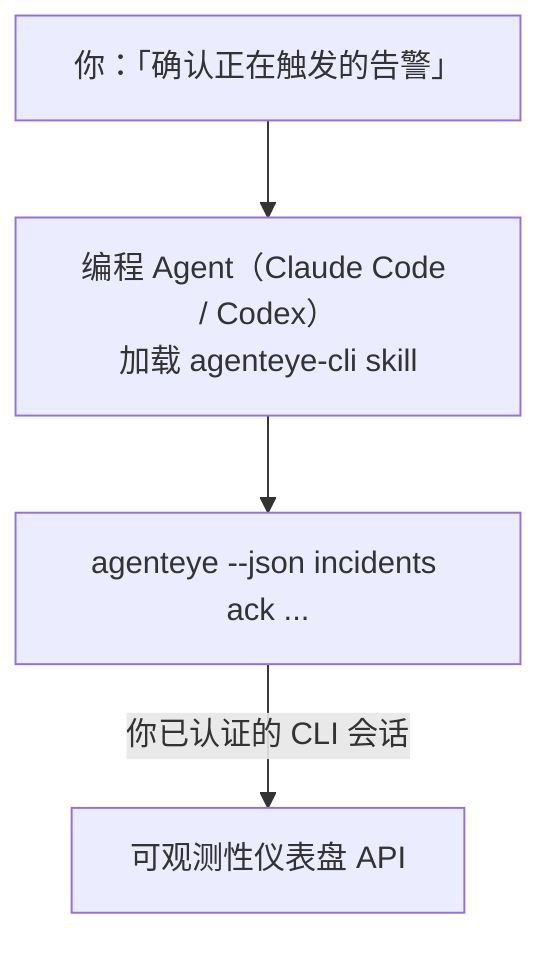

向你的编程 Agent 询问*「今天有什么问题吗？」*，让它直接从你的实时 Failproof AI 可观测性数据中给出答案，无需记忆任何命令。**Failproof AI 可观测性 CLI skill**（`agenteye-cli`）是一种 *Agent Skill*：一个包含说明文件的小型文件夹，供 Claude Code 或 Codex 等编程 Agent 按需加载。它使 Agent 能够通过 [`agenteye` CLI](/zh/agenteye/cli)，以自然语言请求（如*「给 CI 创建一个只能推送事件的密钥」*或*「确认正在触发的告警并将其分配给我」*）来操作你的可观测性部署。

它**不是**服务或独立的二进制文件，无需任何部署。它构建在你已安装的 CLI 之上：Agent 调用 `agenteye --json …`，解析干净的 JSON，然后用自然语言回答你。它能做的一切，你都可以自己输入相同的命令来完成。

---

## 与 Failproof AI 可观测性其他接口的关系

Failproof AI 可观测性提供四种方式访问相同的数据和控制功能，它们相互补充：

| 接口 | 说明 | 运行环境 | 适用场景 |
|---|---|---|---|
| **[CLI](/zh/agenteye/cli)** | `agenteye` 的命令与参数参考文档 | 你的终端 | 需要运行或脚本化某个具体命令时 |
| **[CLI 使用示例](/zh/agenteye/cli-recipes)** | 可直接复制的 `jq`/管道模式 | 你的终端 / 脚本 | 将 CLI 集成到自动化流程时 |
| **CLI skill**（本文档） | 基于 CLI 的自然语言入口 | 你工作站上的编程 Agent | 想要直接提问、让 Agent 选择命令时 |
| **[Evaluator skill](/zh/agenteye/evaluator-skill)** | 用于设计和构建评分服务的同类 skill | 你工作站上的编程 Agent | 想要*生成*评估分数而非读取时 |
| **[Python SDK skill](/zh/agenteye/python-sdk-skill)** | 为你的 Agent 添加遥测数据发送能力的同类 skill | 你工作站上的编程 Agent | 想让你的 Agent *生成*本 skill 所读取的事件时 |
| **[仪表盘内置 AI 助手](/zh/agenteye/assistant)** | 内嵌于仪表盘的聊天功能 | 服务端（仪表盘内） | 需要在仪表盘中对数据进行问答时 |

Skill 本身没有任何特权，它只是将你的语言转化为以你身份运行的 CLI 调用：



### 与仪表盘内置 AI 助手的重要区别

这是两个截然不同的工具，影响范围差异显著：

- **仪表盘内置 AI 助手**（[AI 助手](/zh/agenteye/assistant)）是嵌入仪表盘的聊天功能，由 Agent 服务提供支持。它**只读，且写入操作需要明确审批**：可以起草已保存的查询和仪表盘，但每次写入都会暂停并等待你的明确点击确认，且不会执行删除操作。它受 `agent:use` 权限限制，只能查看你当前所在组织的数据。
- **CLI skill** 在*你的*工作站上运行，在*你的*编程 Agent 内部以**你的身份**驱动 `agenteye` CLI。它可以执行 CLI 的**全部功能，包括变更操作**（创建/轮换/禁用 API 密钥、修改组织设置、解决告警、删除已保存的查询），仅受你的 CLI 登录权限约束。请像对待手动输入这些命令一样谨慎对待它。

---

## 前置条件

1. 已安装 **`agenteye` CLI** 并添加到 `PATH`（参见 [CLI](/zh/agenteye/cli) 参考文档：`pipx install agenteye`）。
2. 已设置**仪表盘 URL**（`AGENTEYE_DASHBOARD_URL`，或由 Agent 传入 `--base-url`）。
3. 已**登录会话**：需先自行运行 `agenteye login`。Skill **无法**代你完成邮件一次性验证码登录；若会话缺失或过期（CLI 退出码 `4`），它会提示你运行 `agenteye login`。

---

## 获取方式

Skill 发布于 Failproof AI 的公开 skill 集合中：

**[github.com/FailproofAI/skills](https://github.com/FailproofAI/skills)** → [`skills/agenteye-cli/`](https://github.com/FailproofAI/skills/tree/main/skills/agenteye-cli)

无任何访问限制——该仓库完全公开，skill 本身不需要任何凭证，因为它只是使用*你*登录的会话，通过**公开的** `agenteye` CLI 访问*你的*仪表盘。你无需向任何人申请。

请注意，它作为独立文件夹发布，**不包含**在 `pipx install agenteye` 包中，请勿在该包中查找。

## 安装 Skill

最快捷的方式是使用 [`skills`](https://skills.sh) CLI，它会自动获取文件夹并放置到 Agent 的查找路径中：

```bash
# Claude Code，仅限当前项目
npx skills add FailproofAI/skills --skill agenteye-cli -a claude-code

# 所有项目（安装至 ~/.claude/skills/）
npx skills add FailproofAI/skills --skill agenteye-cli -a claude-code -g --copy

# 使用 Codex
npx skills add FailproofAI/skills --skill agenteye-cli -a codex
```

管理方式与其他 skill 相同：

```bash
npx skills list -a claude-code      # 查看已安装的 skill
npx skills update agenteye-cli      # 拉取最新版本
npx skills remove agenteye-cli      # 移除 skill
```

prefer 手动安装？Agent Skill 本质上只是一个包含 `SKILL.md`（以及可选参考文件）的文件夹，直接复制即可：

- **Claude Code**：将 `agenteye-cli/` 文件夹放入 `~/.claude/skills/`（所有项目）或 `<你的仓库>/.claude/skills/`（仅该仓库）。Claude Code 会自动发现它——通过 `/skills` 列表验证，或直接提问一个与其描述匹配的问题。
- **Codex（OpenAI）**：Codex 读取相同的 `SKILL.md`。内置的 `agents/openai.yaml` 设置了 `allow_implicit_invocation: true`，因此当任务匹配时 Codex 会自动选择该 skill；否则可通过 `$agenteye-cli` 显式调用。

---

## 安全注意事项：Agent 运行 CLI 时变更操作不会出现确认提示

> **警告：** 在让 Agent 执行变更操作前，请先阅读本节。

`agenteye` CLI 通常会在执行破坏性操作前询问*「确定吗？」*。**当它未连接到终端时（这正是编程 Agent 的运行方式），该确认会被自动跳过；`--json` 参数也会跳过确认。** 因此，安全确认提示对 Agent **不会**触发。

Skill 的设计已对此进行补偿：它会在执行任何状态变更前，说明将要运行的确切命令，并等待你明确的**确认**。请保持这一规范。当你通过 Agent 操作 Failproof AI 可观测性时，*你*就是确认步骤。需要特别注意的变更类命令：

- `keys create` / `update` / `disable` / `regenerate`
- `users create` / `update` / `disable` / `enable`
- `settings set`
- `alerts create` / `update` / `delete` / `test`
- 写入类 `incidents` 子命令：`ack` / `assign` / `resolve` / `open` / `comment-add` / `comment-delete` / `subscribe` / `unsubscribe`
- `query create` / `update` / `delete`
- `agent rename` / `delete`
- `orgs switch`

**观测**类命令（`events`、`sessions`、`evals`、`errors`、`list`、`whoami`、`orgs list/current/perms`）均为只读，不会产生任何变更。

由于 Agent 以**你的身份**操作，它只能执行你的登录所允许的操作；权限按**组织**级别解析（参见 [API 密钥](/zh/agenteye/api-keys)）。若某个命令超出你的权限，会返回退出码 `5` 并精确说明所缺权限，Agent 可以告诉你需要向管理员申请什么权限，而不是模糊地报错。

---

## 你可以问它什么

以下是真实的交互示例——先是一次只读查询，然后是一次等待你确认的变更操作：

```text
you   ▸ 最近一天有什么问题吗？

agent ▸ 正在运行：agenteye --json errors --since 24h --aggregate
        过去 24 小时内有 3 种错误类型。最多的是 TimeoutError
        （18 次，全部发生在 checkout-agent），其次是 RateLimited（5 次）。
        需要查看 TimeoutError 的失败会话吗？

you   ▸ 给 CI 创建一个只能推送事件的密钥。

agent ▸ 这将创建一个 API 密钥。我将运行：
          agenteye keys create ci --add events:add
        确认继续吗？

you   ▸ 是的

agent ▸ 完成。密钥「ci」已创建，仅具有 events:add 权限。
        密钥只显示一次，请立即保存。我无法再次显示它。
```

Skill 将每种自然语言意图映射到正确的 `agenteye` 命令，会先查询有效值（`list <kind>`、`whoami`）而不是猜测，并在任何变更前说明确切命令。更多示例：

- *「最近 24 小时有什么问题/故障吗？」* → `errors --since 24h --aggregate`，然后给出明细。
- *「为什么会话 `run-001` 失败了？」* → `events --session-id run-001 --all` + `evals --session-id run-001`。
- *「本周质量趋势如何？」* → `evals --aggregate --since 7d`，然后深入查看低分运行。
- *「给 CI 创建一个只能推送事件的密钥。」* → `keys create ci --add events:add`（说明命令后创建，并捕获一次性密钥）。
- *「谁有访问权限？将 Dana 设为只读。」* → `users list` → `users update dana@… --permission-set read-only`（向你确认后执行）。
- *「确认正在触发的告警并分配给我。」* → `incidents list --state firing` → `incidents ack <id>` / `incidents assign <id> you@…`。

有关这些操作背后的确切命令、参数和 JSON 格式，请参见 [CLI](/zh/agenteye/cli) 参考文档和 [Agent 的 CLI 使用示例](/zh/agenteye/cli-recipes)。

---

## 下一步

- **[CLI](/zh/agenteye/cli)**：`agenteye` 完整命令与参数参考文档。
- **[Agent 的 CLI 使用示例](/zh/agenteye/cli-recipes)**：可直接复制的 `jq` 模式和退出码处理方法。
- **[Evaluator agent skill](/zh/agenteye/evaluator-skill)**：同类 skill，用于构建 `agenteye evals` 读取其分数的评估器。
- **[Python SDK agent skill](/zh/agenteye/python-sdk-skill)**：同类 skill，用于为 Agent 添加遥测数据发送能力，使 `agenteye` 能够读取相应数据。
- **[AI 助手](/zh/agenteye/assistant)**：仪表盘内置助手（与本终端 skill 不同）。
- **[API 密钥](/zh/agenteye/api-keys)**：限定 skill 可执行操作范围的按组织权限模型。