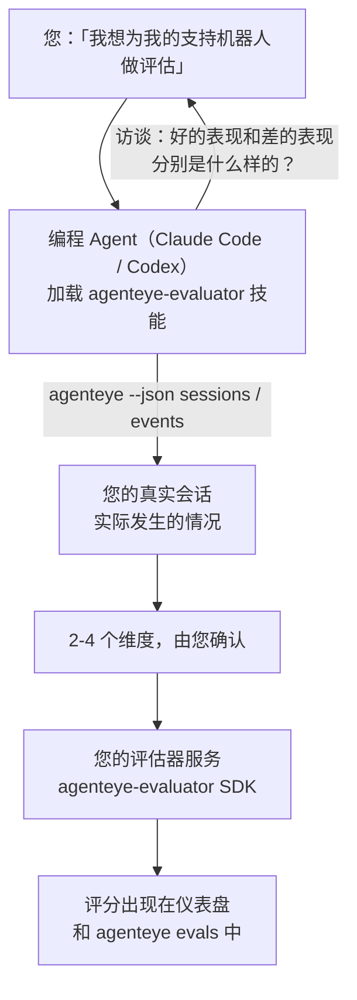

让您的编程 Agent 既负责决策又负责构建，从*「我觉得我们的 Agent 有时表现很差」*直接走向部署完毕的评分服务。**Failproof AI 可观测性评估器技能**（`agenteye-evaluator`）是一种 *Agent Skill*：一个小型指令文件夹，供 Claude Code 或 Codex 等编程 Agent 按需加载。它能引导 Agent 确定哪些质量维度值得为*您的* Agent 跟踪，然后编写、测试并部署对这些维度进行评分的[评估器服务](/zh/agenteye/evaluation-suite)。

它**不是**一个托管评分器、一个您上传到的注册表，也不是插件系统。您的评估器始终是运行在您自己基础设施上的 HTTP 服务，与[评估套件](/zh/agenteye/evaluation-suite)指南中所描述的完全一致。该技能只是教您的 Agent 如何把它构建好——它所做的一切，您完全可以自己动手写同样的代码来实现。

---

## 难点在于决定评分什么

SDK 接口很简洁——一个装饰器和两个模型——Agent 仅凭[契约](/zh/agenteye/evaluation-suite#http-contract)就能把代码写出来。评估器真正的失败之处不在这里。它们失败是因为评错了东西，而评错对象的评估器比没有还糟：它产出的仪表盘会让所有人习惯性地无视。

因此，该技能的大部分工作发生在任何代码存在之前。它让 Agent 对您进行访谈（*「描述一次进展顺利的运行；再描述一次进展糟糕的」*），然后通过 [`agenteye` CLI](/zh/agenteye/cli) 提取您的真实会话并从头到尾阅读。这两部分通常会出现分歧，而这个差距正是关键所在：您打算衡量什么，与您的对话记录实际上能支撑什么，往往并不一致。一个维度只有在**可从事件中计算**且**具有区分度**时才能保留——如果它在您的好运行和差运行上都打出 0.9 分，那什么也说明不了，直接剔除。

最终返回的是一份包含 2-4 个维度的提案，附带推理说明，供您在写下任何一行代码之前确认。



---

## 与其他评估组件的关系

共有四份文档涵盖评分相关内容，它们按顺序相互衔接：

| 页面 | 内容 | 适用场景 |
|---|---|---|
| **[评估（Evaluations）](/zh/agenteye/evaluations)** | 该功能：会话网格上的评分、仪表盘、重新评估 | 您想了解自动评分能带来什么 |
| **[评估套件（Evaluation suite）](/zh/agenteye/evaluation-suite)** | HTTP 契约、SDK、服务器环境变量 | 您正在自行实现或调试评估器 |
| **评估器技能**（本文档） | 设计*并*构建评分器的自然语言入口 | 您想从「我想要评估」走到一个正在运行的服务 |
| **[CLI 技能](/zh/agenteye/cli-skill)** | `agenteye` CLI 的自然语言入口 | 您想*读取*已有的评分结果 |
| **[Python SDK 技能](/zh/agenteye/python-sdk-skill)** | 为您的 Agent 添加埋点的自然语言入口 | 您的 Agent 尚未输出会话——还没有东西可以评分 |

### 与 CLI 技能的区别：构建 vs. 读取

这两个技能在职责上刻意不重叠，同时安装两者是常规配置——Agent 会根据您的提问在二者之间切换：

- **`agenteye-evaluator`**（本文档）构建*产生*评分的东西。它的任务在评分首次出现时结束。
- **[`agenteye-cli`](/zh/agenteye/cli-skill)** 读取已存在的评分（`agenteye evals`）。「本周质量下降了吗？」是它回答的问题，不是本技能的职责。

---

## 前提条件

1. **已安装并登录 `agenteye` CLI**（`pipx install agenteye`，然后 `agenteye login`）。该技能会用到它两次：拉取真实会话用于设计，以及在最后确认评分是否落地。您的登录账户需要 `events:read` 权限，以及用于最终检查的 `evaluations:read` 权限。与 CLI 技能一样，它**无法**替您完成邮件一次性验证码登录。
2. **一个放置评估器的地方。** 评估器会被构建成镜像并作为长期运行的服务运行，因此它需要一个真实的代码仓库，而不是临时文件。评估器通常独立存在于自己的仓库中，与被评分的 Agent 分开——该技能会寻找现有仓库，并在搭建新仓库之前征询您的意见。
3. **`agenteye-evaluator` SDK wheel**——在让您的 Agent 开始输入 `pip` 命令之前，请先阅读下一节。

---

## 获取方式

该技能发布于 Failproof AI 的公共技能集合中：

**[github.com/FailproofAI/skills](https://github.com/FailproofAI/skills)** → [`skills/agenteye-evaluator/`](https://github.com/FailproofAI/skills/tree/main/skills/agenteye-evaluator)

该仓库是公开的，技能本身不需要任何凭据——它只是用*您*登录时的会话驱动 `agenteye` CLI，并在*您的*仓库中写代码。请注意，它以独立文件夹的形式发布，**不在** `pipx install agenteye` 包内，请勿在那里寻找它。

## 安装技能

最快的方式是使用 [`skills`](https://skills.sh) CLI，它会拉取文件夹并放到您的 Agent 查找的位置：

```bash
# Claude Code，仅限当前项目
npx skills add FailproofAI/skills --skill agenteye-evaluator -a claude-code

# 所有项目（安装到 ~/.claude/skills/）
npx skills add FailproofAI/skills --skill agenteye-evaluator -a claude-code -g --copy

# 改用 Codex
npx skills add FailproofAI/skills --skill agenteye-evaluator -a codex
```

然后像管理其他技能一样管理它：

```bash
npx skills list -a claude-code           # 查看已安装的技能
npx skills update agenteye-evaluator     # 拉取最新版本
npx skills remove agenteye-evaluator     # 移除它
```

喜欢手动安装？Agent Skill 只是一个包含 `SKILL.md`（以及可选引用文件）的文件夹，直接复制也可以：

- **Claude Code**：将 `agenteye-evaluator/` 文件夹放入 `~/.claude/skills/`（所有项目）或 `<your-repo>/.claude/skills/`（仅该仓库）。Claude Code 会自动发现它——通过 `/skills` 列表验证，或者直接询问评估相关问题即可。
- **Codex（OpenAI）**：Codex 读取同一个 `SKILL.md`。捆绑的 `agents/openai.yaml` 设置了 `allow_implicit_invocation: true`，因此当任务匹配时 Codex 会自动选择该技能；否则可以通过 `$agenteye-evaluator` 显式调用它。

---

## SDK 不在公共 PyPI 上

> **警告：** 在让 Agent 安装 SDK 之前，请先阅读本节。

该技能是公开的；它所驱动的 SDK 则不是。`agenteye-evaluator` 仅作为私有发布产物发布，且与 `agenteye` 不同，该名称在**公共 PyPI 上尚未被注册**——因此直接执行 `pip install agenteye-evaluator` 可能会将陌生人的包安装到读取您生产对话记录的服务中。这是一个供应链问题，而不是笔误。

该技能了解这一点，因此会按照安装梯队依次尝试，在第一个适用的环节停下：如果您在 AgentEye 仓库内，则使用 monorepo 源码；否则使用 GitHub Releases 上的私有发布 wheel（需要访问权限）；如果两者都无法访问，它会**停止并告诉您联系 Failproof AI 联系人获取 wheel**，而不是自行发挥。

因此，如果您的 Agent 提议从公共 PyPI 直接执行 `pip install agenteye-evaluator`，这就说明该技能根本没有加载。请立即停止并检查技能是否已安装。

---

## 可以问它什么

一次真实的完整流程从模糊的需求开始，以一个经过确认的设计方案结束，而不是直接以代码开始：

```text
您    ▸ 我想为我们的支持机器人做评估。我觉得它有时表现很差。

Agent ▸ 在我写任何东西之前：描述一次进展顺利的运行，
        以及一次进展糟糕的。

您    ▸ 好的情况：它从文档中给出答案。差的情况：它胡编乱造，
        或者放弃并说「请联系支持」。

Agent ▸ 正在运行：agenteye --json sessions --status error --since 7d
        读取 5 个会话，包括您认为表现差的两个。

        您的描述说的是事实性和推诿。对话记录在推诿方面
        与描述吻合（5 个中有 2 个以转接支持结束，
        在 model_response.content 中清晰可见），但事实性
        需要您的事件中没有的基准真值。

        因此我会评分三件事：
          - deflection      基于规则，成本低，能区分您的两次运行
          - tool_efficiency 基于规则，能捕捉 run-004 中的重试循环
          - groundedness    LLM 评判：每个声明都在它检索的文档中吗？

        「事实性」需要我们没有的基准真值；groundedness
        是您的对话记录实际上能支撑的最接近的替代。
        这三个名称可以吗？之后重命名会导致历史记录断裂。

您    ▸ 好的

Agent ▸ 这个仓库中没有评估器。要在这里搭建一个，
        还是您在别处已经有了？
```

之后，它会先编写基于规则的维度（免费、即时、确定性），针对真实捕获的会话（包括那些会让朴素评估器崩溃的空会话和未完成会话）进行测试，只在主观维度上才会使用 LLM 评判器。它了解[调度器的限制](/zh/agenteye/evaluation-suite#configuring-the-server)——30 秒请求超时和全局 8 个并发调用——因此如果评判器不能可靠地在时限内完成，它会使用 `JobPending` 异步处理，而不是让您的评判器被取消并以五倍成本重试五次。

然后它进行部署，设置两个服务器环境变量，并通过 `agenteye --json evals --session-id <id>` 确认评分确实落地。评分落地是唯一的证明。

---

## 需要注意的事项

- **维度名称几乎是永久性的。** 评分键是任意字符串，平台会对您发送的任何内容进行趋势分析，这意味着下游没有任何东西能纠正一个错误的选择。之后重命名会导致历史记录断裂：旧会话保留旧键，趋势就此中断。这就是为什么该技能在写代码之前要明确征得您的同意——请认真对待那个提示。
- **测试夹具是真实的生产对话记录。** 针对真实会话进行设计意味着要将它们拉取到磁盘上，而它们可能包含客户数据。该技能会在将其提交到 git 之前征询您的意见；如有疑虑，请将 `fixtures/` 排除在仓库之外，让每位开发者自行拉取。
- **Agent 会编写并部署一个读取所有对话记录的服务。** 它以您的身份行事，受您的 CLI 登录权限约束，但请像审查其他接触生产数据的代码一样审查评估器。

---

## 后续步骤

- **[评估套件（Evaluation suite）](/zh/agenteye/evaluation-suite)**：HTTP 契约、SDK 以及该技能所配置的服务器环境变量。
- **[评估（Evaluations）](/zh/agenteye/evaluations)**：评分落地后出现的位置。
- **[CLI 技能](/zh/agenteye/cli-skill)**：与本技能配套的技能，用于读取结果而非构建评分器。
- **[CLI](/zh/agenteye/cli)**：该技能所依赖的会话数据背后的命令参考。