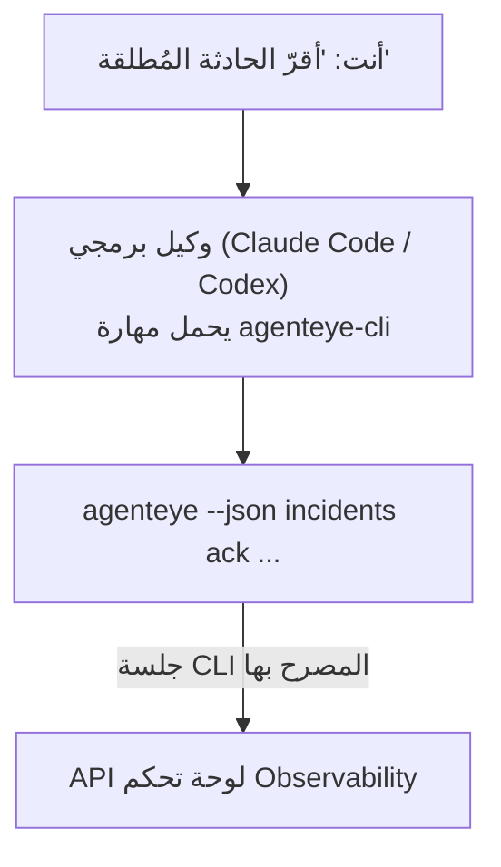

---
---
title: "مهارة عامل Failproof AI Observability CLI"
description: "اسأل وكيلك البرمجي \"هل هناك شيء مكسور اليوم؟\" واترك له الإجابة من بيانات Failproof AI Observability الحية، دون الحاجة إلى حفظ أي أوامر."
---


اسأل وكيلك البرمجي *"هل هناك شيء مكسور اليوم؟"* واترك له الإجابة من بيانات Failproof AI Observability الحية، دون الحاجة إلى حفظ أي أوامر. **مهارة Failproof AI Observability CLI** (`agenteye-cli`) هي *مهارة عامل*: مجلد صغير من التعليمات التي يحملها وكيل برمجي مثل Claude Code أو Codex عند الحاجة. تعلم الوكيل تشغيل نشر Observability الخاص بك من خلال [`agenteye` CLI](/ar/agenteye/cli) من طلبات باللغة الإنجليزية العادية مثل *"أعطِ CI مفتاحاً يمكنه فقط دفع الأحداث"* أو *"أقرّ الحادثة المُطلقة وسندها إليّ."*

وهي **ليست** خدمة أو ملف ثنائي منفصل؛ لا يوجد شيء للنشر. تعمل على أساس CLI الذي ثبّته بالفعل: يقوم الوكيل بتنفيذ `agenteye --json …`، ويحلل JSON النظيف، ويجيبك بشكل نصي. كل ما يمكنه القيام به، يمكنك أنت أن تفعله بنفسك بكتابة نفس الأوامر.

---

## كيفية ارتباطها بواجهات Failproof AI Observability الأخرى

تمنحك Failproof AI Observability أربع طرق للوصول إلى نفس البيانات والتحكم. فهي تكمل بعضها البعض:

| الواجهة | ما هي | حيث تعمل | استخدمها عندما |
|---|---|---|---|
| **[CLI](/ar/agenteye/cli)** | مرجع الأوامر والعلامات لـ `agenteye` | طرفيتك | تريد تشغيل أو تنفيذ أمر معين |
| **[وصفات CLI](/ar/agenteye/cli-recipes)** | أنماط `jq`/خط أنابيب جاهزة للنسخ | طرفيتك / البرامج النصية | تريد دمج CLI في الأتمتة |
| **مهارة CLI** (هذا المستند) | باب للغة الطبيعية على CLI | وكيلك البرمجي، على محطة عملك | تريد *فقط أن تسأل* والسماح للوكيل باختيار الأمر |
| **[مهارة المقيّم](/ar/agenteye/evaluator-skill)** | مهارة شقيقة تصمم وتبني خدمة التسجيل الخاصة بك | وكيلك البرمجي، على محطة عملك | تريد *إنتاج* درجات التقييم بدلاً من قراءتها |
| **[مهارة Python SDK](/ar/agenteye/python-sdk-skill)** | مهارة شقيقة تسمح لوكيلك بإصدار القياس عن بعد | وكيلك البرمجي، على محطة عملك | تريد من وكيلك *إنتاج* الأحداث التي تقرأها هذه المهارة |
| **[مساعد AI في لوحة التحكم](/ar/agenteye/assistant)** | دردشة مدمجة في لوحة التحكم | من جانب الخادم (في لوحة التحكم) | تريد أسئلة وأجوبة مدمجة في لوحة التحكم على بيانات الخاصة بك |

المهارة نفسها ليس لديها امتيازات خاصة بها؛ فهي تحول كلماتك فقط إلى استدعاءات CLI تعمل كما يلي:



### مقابل مساعد AI في لوحة التحكم: تمييز مهم

هذه أداتان مختلفان جداً بنطاقات تأثير مختلفة جداً:

- **مساعد AI في لوحة التحكم** ([مساعد AI](/ar/agenteye/assistant)) هو دردشة مدمجة في لوحة التحكم، مدعومة من خدمة الوكيل. وهو **للقراءة فقط بالإضافة إلى التأليف المُوافق عليه**: يمكنه صياغة الاستعلامات المحفوظة ولوحات المعلومات، لكن كل عملية كتابة توقف لتأكيدك الصريح، وهو لا يحذف أبداً. وهو محدود بإذن `agent:use` ولا يرى أبداً سوى البيانات للمنظمة التي تعرضها.
- **مهارة CLI** تعمل على *محطة عملك* داخل *وكيلك البرمجي* وتشغل `agenteye` CLI كـ **أنت**. يمكنها تنفيذ **السطح الكامل لـ CLI، بما فيه التغييرات** (إنشاء/تدوير/تعطيل مفاتيح API، تغيير إعدادات المنظمة، حل الحوادث، حذف الاستعلامات المحفوظة)، محدودة فقط بأذونات تسجيل دخول CLI الخاص بك. تعامل معها بنفس الحذر الذي تتعامل به مع تنفيذ تلك الأوامر يدوياً.

---

## المتطلبات الأساسية

1. **`agenteye` CLI مثبت** و**في `PATH`** (انظر مرجع [CLI](/ar/agenteye/cli): `pipx install agenteye`).
2. **عنوان لوحة التحكم الخاصة بك** محدد (`AGENTEYE_DASHBOARD_URL`، أو يمرر الوكيل `--base-url`).
3. **جلسة تسجيل دخول**: قم بتشغيل `agenteye login` بنفسك أولاً. المهارة **لا يمكنها** إكمال عملية تسجيل الدخول بالرمز لمرة واحدة عبر البريد الإلكتروني لك؛ ستخبرك بتشغيل `agenteye login` إذا كانت الجلسة مفقودة أو منتهية الصلاحية (رمز خروج CLI `4`).

---

## أين تحصل عليها

تُنشر المهارة في مجموعة المهارات العامة لـ Failproof AI:

**[github.com/FailproofAI/skills](https://github.com/FailproofAI/skills)** → [`skills/agenteye-cli/`](https://github.com/FailproofAI/skills/tree/main/skills/agenteye-cli)

لا شيء عنها محدود — المستودع عام والمهارة لا تحتاج إلى بيانات اعتماد خاصة بها، لأنها فقط تشغل `agenteye` CLI **العام** على لوحة التحكم *الخاصة بك*، باستخدام الجلسة *التي* قمت بتسجيل الدخول بها. لا تحتاج إلى طلب إذن من أي شخص للحصول عليها.

لاحظ أنها تُشحن كمجلد خاص بها وهي **ليست** داخل حزمة `pipx install agenteye`، لذا لا تبحث عنها هناك.

## تثبيت المهارة

الطريق الأسرع هو CLI [`skills`](https://skills.sh)، الذي يجلب المجلد وينقله إلى حيث يبحث وكيلك:

```bash
# Claude Code، هذا المشروع فقط
npx skills add FailproofAI/skills --skill agenteye-cli -a claude-code

# كل مشروع (التثبيت في ~/.claude/skills/)
npx skills add FailproofAI/skills --skill agenteye-cli -a claude-code -g --copy

# Codex بدلاً من ذلك
npx skills add FailproofAI/skills --skill agenteye-cli -a codex
```

ثم أدرها مثل أي مهارة أخرى:

```bash
npx skills list -a claude-code      # ما هو مثبت
npx skills update agenteye-cli      # اسحب أحدث إصدار
npx skills remove agenteye-cli      # أزلها
```

تفضل التثبيت يدوياً؟ مهارة العامل هي مجرد مجلد يحتوي على `SKILL.md` (بالإضافة إلى المراجع الاختيارية)، لذا النسخ يعمل أيضاً:

- **Claude Code**: ضع مجلد `agenteye-cli/` في `~/.claude/skills/` (كل مشروع) أو `<your-repo>/.claude/skills/` (هذا المستودع فقط). Claude Code يكتشفه تلقائياً — تحقق من قائمة `/skills`، أو ببساطة اطرح سؤالاً يطابق وصفه.
- **Codex (OpenAI)**: يقرأ Codex نفس `SKILL.md`. `agents/openai.yaml` المضمن يعيّن `allow_implicit_invocation: true`، لذا يختار Codex المهارة تلقائياً عند تطابق المهمة؛ وإلا استدعها صراحة كـ `$agenteye-cli`.

---

## السلامة: التغييرات لا تطلب تأكيداً عندما يشغل وكيل CLI

> **تحذير:** اقرأ هذا قبل السماح لوكيل بإجراء تغييرات.

يسأل `agenteye` CLI عادة *"هل أنت متأكد؟"* قبل إجراء تخريبي. وهو **يتخطى هذا التأكيد تلقائياً عندما لا يكون متصلاً بطرفية (وهو بالضبط كيف يشغله وكيل برمجي)، و`--json` يتخطاه أيضاً.** لذا فإن مطالبة السلامة **لن** تظهر للوكيل.

تمت كتابة المهارة للتعويض: تم توجيهها لتوضيح الأمر الدقيق الذي ستشغله والحصول على موافقتك الصريحة **قبل أي تغيير في الحالة**. حافظ على هذا النظام. عندما تشغل Failproof AI Observability من خلال وكيل، *أنت* هو خطوة التأكيد. أوامر تغيير الحالة التي يجب الانتباه لها:

- `keys create` / `update` / `disable` / `regenerate`
- `users create` / `update` / `disable` / `enable`
- `settings set`
- `alerts create` / `update` / `delete` / `test`
- أوامر `incidents` الكتابية: `ack` / `assign` / `resolve` / `open` / `comment-add` / `comment-delete` / `subscribe` / `unsubscribe`
- `query create` / `update` / `delete`
- `agent rename` / `delete`
- `orgs switch`

كل شيء تحت **Observe** (`events`, `sessions`, `evals`, `errors`, `list`, `whoami`, `orgs list/current/perms`) للقراءة فقط ولا يغير شيئاً.

لأن الوكيل يعمل كـ **أنت**، فإنه يمكنه فقط القيام بما يُسمح لتسجيل دخولك بالقيام به؛ يتم حل الأذونات **لكل منظمة** (انظر [مفاتيح API](/ar/agenteye/api-keys)). أمر تفتقد إذن له يُرجع رمز خروج `5` مع الإذن المحدد الدقيق، لذا يمكن للوكيل أن يخبرك بدقة بما يجب أن تطلبه من المسؤول بدلاً من الفشل بطريقة غامضة.

---

## ما يمكنك أن تسأله

إليك ما يبدو عليه جولة حقيقية، قراءة أولاً، ثم تغيير ينتظر موافقتك:

```text
أنت   ▸ هل هناك شيء مكسور في اليوم الأخير؟

الوكيل ▸ تشغيل: agenteye --json errors --since 24h --aggregate
         3 أنواع أخطاء في آخر 24 ساعة. الأكبر هو TimeoutError
         (18 إصابة، جميعها على checkout-agent)، ثم RateLimited (5).
         هل تريد الجلسات الفاشلة لـ TimeoutError؟

أنت   ▸ أعطِ CI مفتاحاً يمكنه فقط دفع الأحداث.

الوكيل ▸ هذا ينشئ مفتاح API. سأشغل:
          agenteye keys create ci --add events:add
         موافق على المتابعة؟

أنت   ▸ نعم

الوكيل ▸ تم. تم إنشاء المفتاح "ci" مع events:add فقط.
         السر يُعرض مرة واحدة فقط، لذا احفظه الآن. لا يمكنني إعادة طباعته.
```

تعيّن المهارة كل نية باللغة الطبيعية إلى أمر `agenteye` الصحيح، واكتشاف القيم الصحيحة أولاً (`list <kind>`, `whoami`) حتى لا تخمن، وتوضيح الأمر الدقيق قبل أي تغيير. أمثلة أكثر:

- *"هل هناك شيء مكسور / فاشل في آخر 24 ساعة؟"* → `errors --since 24h --aggregate`، ثم تفصيل.
- *"لماذا فشلت الجلسة `run-001`؟"* → `events --session-id run-001 --all` + `evals --session-id run-001`.
- *"كيف تتجه الجودة هذا الأسبوع؟"* → `evals --aggregate --since 7d`، ثم التعمق في الجريان منخفض التصنيف.
- *"أعطِ CI مفتاحاً يمكنه فقط دفع الأحداث."* → `keys create ci --add events:add` (يوضح الأمر، ثم ينشئه ويلتقط السر لمرة واحدة).
- *"من لديه وصول؟ اجعل Dana للقراءة فقط."* → `users list` → `users update dana@… --permission-set read-only` (بعد التأكيد معك).
- *"أقرّ الحادثة المُطلقة وسندها إليّ."* → `incidents list --state firing` → `incidents ack <id>` / `incidents assign <id> you@…`.

للأوامر والعلامات والأشكال JSON الدقيقة خلفها، انظر مرجع [CLI](/ar/agenteye/cli) و[وصفات CLI للوكلاء](/ar/agenteye/cli-recipes).

---

## الخطوات التالية

- **[CLI](/ar/agenteye/cli)**: مرجع الأوامر والعلامات الكامل لـ `agenteye`.
- **[وصفات CLI للوكلاء](/ar/agenteye/cli-recipes)**: أنماط `jq` جاهزة للنسخ والتعامل مع رموز الخروج.
- **[مهارة عامل المقيّم](/ar/agenteye/evaluator-skill)**: المهارة الشقيقة، لبناء المقيّم الذي تقرأ درجاته `agenteye evals`.
- **[مهارة عامل Python SDK](/ar/agenteye/python-sdk-skill)**: المهارة الشقيقة، لتسمية وكيل حتى يصدر القياس الذي يقرأه `agenteye`.
- **[مساعد AI](/ar/agenteye/assistant)**: مساعد لوحة التحكم المدمج (لا ينبغي الخلط بينه وبين مهارة الطرفية هذه).
- **[مفاتيح API](/ar/agenteye/api-keys)**: نموذج إذن لكل منظمة يحدد ما يمكن للمهارة القيام به.