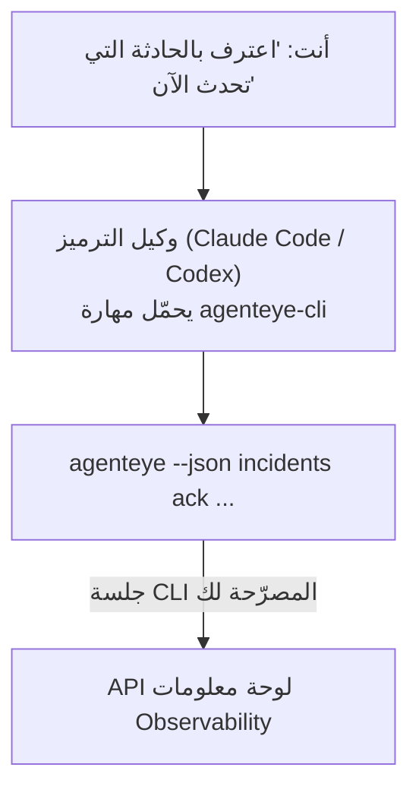

---
---
title: "مهارة Failproof AI Observability CLI Agent"
description: "اطلب من وكيل الترميز الخاص بك \"هل حدث شيء خاطئ اليوم؟\" واترك له الإجابة من بيانات Failproof AI Observability المباشرة، بدون الحاجة لحفظ أوامر."
---

اطلب من وكيل الترميز الخاص بك *"هل حدث شيء خاطئ اليوم؟"* واترك له الإجابة من بيانات Failproof AI Observability المباشرة، بدون الحاجة لحفظ أوامر. **مهارة Failproof AI Observability CLI** (`agenteye-cli`) هي *Agent Skill*: مجلد صغير يحتوي على تعليمات يحملها وكيل ترميز مثل Claude Code أو Codex عند الحاجة. تعلّم الوكيل كيفية تشغيل نشر Observability الخاص بك من خلال [`agenteye` CLI](/ar/agenteye/cli) بناءً على طلبات باللغة الطبيعية مثل *"أعطِ CI مفتاح يمكنه فقط دفع الأحداث"* أو *"اعترف بالحادثة التي تحدث الآن وأسندها إليّ."*

هي **ليست** خدمة أو برنامجًا ثنائيًا منفصلًا؛ لا يوجد شيء للنشر. تعتمد على CLI الذي قمت بتثبيته بالفعل: الوكيل ينفذ `agenteye --json …`، ويحلل JSON النظيف، ويجيبك بالنصوص. كل شيء يمكنه فعله، يمكنك فعله بنفسك بكتابة نفس الأوامر.

---

## كيفية ارتباطها بواجهات Failproof AI Observability الأخرى

يوفر لك Failproof AI Observability أربع طرق للوصول إلى نفس البيانات والتحكم. فهي تكمل بعضها:

| الواجهة | ما هي | حيث تعمل | استخدمها عندما |
|---|---|---|---|
| **[CLI](/ar/agenteye/cli)** | مرجع الأوامر والعلامات لـ `agenteye` | طرفيتك | تريد تشغيل أو إنشاء سكريبت لأمر معين |
| **[CLI recipes](/ar/agenteye/cli-recipes)** | أنماط `jq`/pipeline جاهزة للنسخ واللصق | طرفيتك / السكريبتات | تدمج CLI في الأتمتة |
| **مهارة CLI** (هذا المستند) | واجهة باللغة الطبيعية للـ CLI | وكيل الترميز الخاص بك، على محطة العمل | تريد فقط أن تسأل واترك الوكيل يختار الأمر |
| **[مهارة Evaluator](/ar/agenteye/evaluator-skill)** | مهارة شقيقة تصمم وتبني خدمة التسجيل | وكيل الترميز الخاص بك، على محطة العمل | تريد إنتاج درجات التقييم بدلاً من قراءتها |
| **[مهارة Python SDK](/ar/agenteye/python-sdk-skill)** | مهارة شقيقة تجعل وكيلك يصدر القياس عن بُعد | وكيل الترميز الخاص بك، على محطة العمل | تريد من وكيلك أن ينتج الأحداث التي تقرأها هذه المهارة |
| **[مساعد AI في لوحة المعلومات](/ar/agenteye/assistant)** | دردشة مدمجة في لوحة المعلومات | من جانب الخادم (في لوحة المعلومات) | تريد الأسئلة والأجوبة داخل لوحة المعلومات على بيانات |

المهارة نفسها لا تملك أي امتيازات خاصة بها؛ فهي فقط تحول كلماتك إلى استدعاءات CLI تعمل كأنت:



### مقابل مساعد AI في لوحة المعلومات: تمييز مهم

هذان أداتان مختلفتان تماماً برامج تأثير مختلفة جداً:

- **مساعد AI في لوحة المعلومات** ([مساعد AI](/ar/agenteye/assistant)) هو دردشة مدمجة في لوحة المعلومات، مدعوم من خدمة الوكيل. وهو **قراءة فقط بالإضافة إلى التأليف المعتمد على الموافقة**: يمكنه صياغة الاستعلامات والوحات المحفوظة، لكن كل عملية كتابة تتوقف لموافقتك الصريحة، ولا تحذف أبداً. يتم حظره بواسطة إذن `agent:use` ويرى فقط البيانات للمنظمة التي تعرضها.
- **مهارة CLI** تعمل على *محطة العمل الخاصة بك* داخل *وكيل الترميز الخاص بك* وتدير CLI `agenteye` كـ **أنت**. يمكنها تنفيذ **السطح الكامل للـ CLI، بما في ذلك التعديلات** (إنشاء/تدوير/تعطيل مفاتيح API، تغيير إعدادات المنظمة، حل الحوادث، حذف الاستعلامات المحفوظة)، محدودة فقط بأذونات تسجيل دخول CLI الخاص بك. تعاملها بنفس الحذر تماماً كما تتعامل مع تشغيل تلك الأوامر يدويًا.

---

## المتطلبات الأساسية

1. **`agenteye` CLI مثبت** وعلى `PATH` (انظر مرجع [CLI](/ar/agenteye/cli): `pipx install agenteye`).
2. **URL لوحة المعلومات الخاصة بك** محدد (`AGENTEYE_DASHBOARD_URL`، أو يمرر الوكيل `--base-url`).
3. **جلسة مسجّلة الدخول**: شغّل `agenteye login` بنفسك أولاً. المهارة **لا يمكنها** إكمال تسجيل الدخول بالرمز لمرة واحدة المرسل بالبريد الإلكتروني لك؛ ستخبرك بتشغيل `agenteye login` إذا كانت الجلسة مفقودة أو منتهية الصلاحية (كود خروج CLI `4`).

---

## أين تحصل عليها

تم نشر المهارة في مجموعة المهارات العامة لـ Failproof AI:

**[github.com/FailproofAI/skills](https://github.com/FailproofAI/skills)** → [`skills/agenteye-cli/`](https://github.com/FailproofAI/skills/tree/main/skills/agenteye-cli)

لا شيء فيها محظور — المستودع عام والمهارة لا تحتاج إلى أي بيانات اعتماد خاصة بها، لأنها فقط تدير CLI `agenteye` **العام** ضد لوحة معلومات *الخاص بك*، باستخدام الجلسة *التي سجلت الدخول بها*. أنت لا تحتاج لطلب الإذن من أحد.

لاحظ أنها تأتي كمجلد خاص بها وهي **ليست** داخل حزمة `pipx install agenteye`، لذا لا تبحث عنها هناك.

## تثبيت المهارة

الطريق الأسرع هو CLI [`skills`](https://skills.sh)، الذي يجلب المجلد ويسقطه حيث يبحث وكيلك:

```bash
# Claude Code، هذا المشروع فقط
npx skills add FailproofAI/skills --skill agenteye-cli -a claude-code

# كل مشروع (ينصب إلى ~/.claude/skills/)
npx skills add FailproofAI/skills --skill agenteye-cli -a claude-code -g --copy

# Codex بدلاً من ذلك
npx skills add FailproofAI/skills --skill agenteye-cli -a codex
```

ثم أدره مثل أي مهارة أخرى:

```bash
npx skills list -a claude-code      # ما هو مثبت
npx skills update agenteye-cli      # اسحب أحدث إصدار
npx skills remove agenteye-cli      # أزله
```

تفضل التثبيت يدويًا؟ Agent Skill هو فقط مجلد يحتوي على `SKILL.md` (بالإضافة إلى المراجع الاختيارية)، لذا يعمل النسخ أيضاً:

- **Claude Code**: ضع مجلد `agenteye-cli/` في `~/.claude/skills/` (كل مشروع) أو `<your-repo>/.claude/skills/` (هذا المستودع فقط). Claude Code يكتشفه تلقائياً — تحقق باستخدام قائمة `/skills`، أو اطرح ببساطة سؤالاً يطابق وصفه.
- **Codex (OpenAI)**: يقرأ Codex نفس `SKILL.md`. `agents/openai.yaml` المضمنة تعيين `allow_implicit_invocation: true`، لذا يختار Codex المهارة تلقائياً عندما تطابق المهمة؛ وإلا استدعها صراحة كـ `$agenteye-cli`.

---

## الأمان: التعديلات لا تطلب موافقة عندما يشغل الوكيل CLI

> **تحذير:** اقرأ هذا قبل السماح لوكيل بإجراء التغييرات.

CLI `agenteye` عادة يسأل *"هل أنت متأكد؟"* قبل إجراء مدمر. **يتخطاه تلقائياً عندما لا يكون متصلاً بطرفية (وهو بالضبط كيفية تشغيل وكيل الترميز له)، و `--json` يتخطاه أيضاً.** لذا فإن موجه الأمان **لن** ينطلق للوكيل.

المهارة مكتوبة للتعويض: تُعاد صياغتها لتوضيح الأمر الدقيق الذي ستشغله والحصول على موافقتك الصريحة **قبل أي تغيير للحالة**. احتفظ بهذا الانضباط. عندما تدير Failproof AI Observability من خلال وكيل، *أنت* خطوة التأكيد. أوامر تغيير الحالة التي يجب الانتباه لها:

- `keys create` / `update` / `disable` / `regenerate`
- `users create` / `update` / `disable` / `enable`
- `settings set`
- `alerts create` / `update` / `delete` / `test`
- أوامر `incidents` الكاتبة: `ack` / `assign` / `resolve` / `open` / `comment-add` / `comment-delete` / `subscribe` / `unsubscribe`
- `query create` / `update` / `delete`
- `agent rename` / `delete`
- `orgs switch`

كل شيء تحت **Observe** (`events`, `sessions`, `evals`, `errors`, `list`, `whoami`, `orgs list/current/perms`) للقراءة فقط ولا يغير شيء.

لأن الوكيل يتصرف كـ **أنت**، فيمكنه فقط فعل ما يُسمح تسجيل الدخول الخاص بك به؛ يتم حل الأذونات **لكل منظمة** (انظر [مفاتيح API](/ar/agenteye/api-keys)). أمر تفتقر إلى الإذن له يعيد رمز الخروج `5` مع الإذن المحدد بالضبط، لذا يمكن للوكيل أن يخبرك بالضبط ما تطلبه من مسؤول بدلاً من الفشل بطريقة غير واضحة.

---

## ما يمكنك أن تطلبه

هنا ما يبدو عليه جولة حقيقية، قراءة، ثم تغيير ينتظر موافقتك:

```text
أنت     ▸ هل حدث شيء خاطئ في اليوم الأخير؟

الوكيل   ▸ التشغيل: agenteye --json errors --since 24h --aggregate
        3 أنواع أخطاء في آخر 24 ساعة. الأكبر هو TimeoutError
        (18 ضربة، كلها على checkout-agent)، ثم RateLimited (5).
        هل تريد الجلسات الفاشلة لـ TimeoutError؟

أنت     ▸ أعطِ CI مفتاح يمكنه فقط دفع الأحداث.

الوكيل   ▸ هذا ينشئ مفتاح API. سأشغل:
          agenteye keys create ci --add events:add
        حسناً للمتابعة؟

أنت     ▸ نعم

الوكيل   ▸ تم. تم إنشاء المفتاح "ci" مع events:add فقط.
        السر يظهر مرة واحدة فقط، لذا احفظه الآن. لا يمكنني إعادة طباعته.
```

تخطط المهارة كل نية باللغة الطبيعية إلى أمر `agenteye` الصحيح، واكتشف القيم الصحيحة أولاً (`list <kind>`, `whoami`) حتى لا تخمن، وتوضح الأمر الدقيق قبل أي تغيير. المزيد من الأمثلة:

- *"هل حدث شيء خاطئ / يفشل في آخر 24 ساعة؟"* → `errors --since 24h --aggregate`، ثم تفصيل.
- *"لماذا فشلت الجلسة `run-001`؟"* → `events --session-id run-001 --all` + `evals --session-id run-001`.
- *"كيف يتجه الجودة هذا الأسبوع؟"* → `evals --aggregate --since 7d`، ثم احفر في الجري ذو الدرجة المنخفضة.
- *"أعطِ CI مفتاح يمكنه فقط دفع الأحداث."* → `keys create ci --add events:add` (يوضح الأمر، ثم ينشئه ويلتقط السر لمرة واحدة).
- *"من لديه الوصول؟ اجعل Dana للقراءة فقط."* → `users list` → `users update dana@… --permission-set read-only` (بعد تأكيدك).
- *"اعترف بالحادثة التي تحدث الآن وأسندها إليّ."* → `incidents list --state firing` → `incidents ack <id>` / `incidents assign <id> you@…`.

للأوامر والعلامات الدقيقة وأشكال JSON خلف هذه، انظر مرجع [CLI](/ar/agenteye/cli) و[وصفات CLI للوكلاء](/ar/agenteye/cli-recipes).

---

## الخطوات التالية

- **[CLI](/ar/agenteye/cli)**: مرجع الأوامر والعلامات الكامل لـ `agenteye`.
- **[وصفات CLI للوكلاء](/ar/agenteye/cli-recipes)**: أنماط `jq` جاهزة للنسخ واللصق ومعالجة رمز الخروج.
- **[مهارة وكيل Evaluator](/ar/agenteye/evaluator-skill)**: المهارة الشقيقة، لبناء Evaluator الذي تقرأه `agenteye evals`.
- **[مهارة وكيل Python SDK](/ar/agenteye/python-sdk-skill)**: المهارة الشقيقة، لتجهيز وكيل بحيث ينبعث من القياس الذي تقرأه `agenteye`.
- **[مساعد AI](/ar/agenteye/assistant)**: المساعد داخل لوحة المعلومات (لا تخلط بينه وبين هذه مهارة الطرفية).
- **[مفاتيح API](/ar/agenteye/api-keys)**: نموذج الإذن لكل منظمة الذي يحدد ما يمكن للمهارة القيام به.