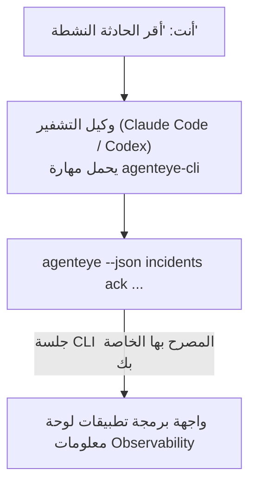

---
---
title: "مهارة وكيل Failproof AI Observability CLI"
description: "اسأل وكيل التشفير الخاص بك \"هل هناك أي شيء معطوب اليوم؟\" واسمح له بالإجابة من بيانات Failproof AI Observability المباشرة، بدون الحاجة لحفظ أي أوامر."
---


اسأل وكيل التشفير الخاص بك *"هل هناك أي شيء معطوب اليوم؟"* واسمح له بالإجابة من بيانات **Failproof AI Observability** المباشرة، بدون الحاجة لحفظ أي أوامر. **مهارة Failproof AI Observability CLI** (`agenteye-cli`) هي *مهارة وكيل*: مجلد صغير من التعليمات يحمّله وكيل تشفير مثل Claude Code أو Codex حسب الطلب. تعلّم الوكيل تشغيل نشر Observability الخاص بك عبر [`agenteye` CLI](/ar/agenteye/cli) من طلبات باللغة الإنجليزية العادية مثل *"أعط CI مفتاحًا يمكنه فقط دفع الأحداث"* أو *"أقر الحادثة النشطة وأسندها إليّ."*

إنه **ليس** خدمة أو ثنائي منفصل؛ لا توجد شيء لنشره. يعمل فوق CLI الذي قمت بتثبيته بالفعل: يقوم الوكيل بتنفيذ `agenteye --json …`، ويحلل JSON النظيف، ويجيبك بالنثر. كل شيء يمكنه فعله، يمكنك فعله بنفسك عن طريق كتابة نفس الأوامر.

---

## كيف يتعلق بواجهات Failproof AI Observability الأخرى

يوفر لك Failproof AI Observability أربع طرق للوصول إلى نفس البيانات والعناصر التحكم. تكمل بعضها البعض:

| الواجهة | ما هي | أين تعمل | استخدمها عندما |
|---|---|---|---|
| **[CLI](/ar/agenteye/cli)** | مرجع الأوامر والعلامات لـ `agenteye` | المحطة الطرفية | تريد تشغيل أو نص برنامج أمر معين |
| **[وصفات CLI](/ar/agenteye/cli-recipes)** | أنماط `jq` وأنابيب نسخ-لصق | المحطة الطرفية / النصوص | تقوم بدمج CLI في الأتمتة |
| **مهارة CLI** (هذا المستند) | بابٌ للغة طبيعية على CLI | وكيل التشفير، على محطة العمل الخاصة بك | تريد أن تسأل فقط واترك الوكيل يختار الأمر |
| **[مهارة المقيّم](/ar/agenteye/evaluator-skill)** | مهارة أخت تصمم وتبني خدمة التصحيح الخاصة بك | وكيل التشفير، على محطة العمل الخاصة بك | تريد إنتاج درجات التقييم بدلاً من قراءتها |
| **[مهارة Python SDK](/ar/agenteye/python-sdk-skill)** | مهارة أخت تقوم بقياس وكيلك بحيث ينبعث قياس في الجميع | وكيل التشفير، على محطة العمل الخاصة بك | تريد أن ينتج وكيلك الأحداث التي تقرأها هذه المهارة |
| **[مساعد AI في لوحة المعلومات](/ar/agenteye/assistant)** | دردشة مضمنة في لوحة المعلومات | جانب الخادم (في لوحة المعلومات) | تريد أسئلة وأجوبة في لوحة المعلومات على بياناتك |

المهارة نفسها لا تمتلك امتيازاتها الخاصة؛ إنها تحول كلماتك إلى استدعاءات CLI تعمل بصفتك:



### مقابل مساعد AI في لوحة المعلومات: تمييز مهم

هذان أداتان مختلفتان جداً مع نطاقات تأثير مختلفة جداً:

- **مساعد AI في لوحة المعلومات** ([مساعد AI](/ar/agenteye/assistant)) عبارة عن دردشة مضمنة في لوحة المعلومات، مدعومة بخدمة الوكيل. إنه **للقراءة فقط بالإضافة إلى التأليف المحمي بالموافقة**: يمكنه صياغة الاستعلامات والتحليلات المحفوظة، لكن كل عملية كتابة توقفها انتظار نقرتك الصريحة، وهو لا يحذف أبداً. يتم حمايتها بواسطة إذن `agent:use` وترى فقط البيانات الخاصة بالمنظمة التي تعرضها.
- **مهارة CLI** تعمل على *محطة العمل الخاصة بك* داخل *وكيل التشفير الخاص بك* وتشغل CLI `agenteye` كـ **أنت**. يمكنها تنفيذ **السطح الكامل للـ CLI، بما في ذلك الطفرات** (إنشاء/تدوير/تعطيل مفاتيح API، تغيير إعدادات المنظمة، حل الحوادث، حذف الاستعلامات المحفوظة)، محدودة فقط بأذونات تسجيل دخول CLI. تعامل معها بنفس الحذر الذي ستتعامل به عند تشغيل تلك الأوامر يدويًا.

---

## المتطلبات الأساسية

1. **`agenteye` CLI مثبت** وفي `PATH` (انظر مرجع [CLI](/ar/agenteye/cli): `pipx install agenteye`).
2. **عنوان URL لوحة المعلومات الخاصة بك** معين (`AGENTEYE_DASHBOARD_URL`، أو يمرر الوكيل `--base-url`).
3. **جلسة عمل مسجلة**: قم بتشغيل `agenteye login` بنفسك أولاً. المهارة **لا يمكنها** إكمال تسجيل الدخول برمز لمرة واحدة عبر البريد الإلكتروني نيابة عنك؛ ستخبرك بتشغيل `agenteye login` إذا كانت الجلسة مفقودة أو منتهية الصلاحية (كود خروج CLI `4`).

---

## أين تحصل عليها

تُنشر المهارة في مجموعة المهارات العامة لـ Failproof AI:

**[github.com/FailproofAI/skills](https://github.com/FailproofAI/skills)** → [`skills/agenteye-cli/`](https://github.com/FailproofAI/skills/tree/main/skills/agenteye-cli)

لا يوجد شيء محمي بها — المستودع عام والمهارة لا تحتاج إلى بيانات اعتماد خاصة بها، لأنها تشغل فقط CLI `agenteye` **العام** مقابل لوحة المعلومات الخاصة بك، باستخدام الجلسة *التي* سجلت الدخول إليها. لا تحتاج إلى طلب الإذن من أي شخص.

لاحظ أنها تأتي كمجلد خاص بها وهي **ليست** داخل حزمة `pipx install agenteye`، لذلك لا تبحث عنها هناك.

## تثبيت المهارة

الطريق الأسرع هو CLI [`skills`](https://skills.sh)، الذي يجلب المجلد ويضعه حيث ينظر وكيلك:

```bash
# Claude Code، هذا المشروع فقط
npx skills add FailproofAI/skills --skill agenteye-cli -a claude-code

# كل مشروع (يثبت إلى ~/.claude/skills/)
npx skills add FailproofAI/skills --skill agenteye-cli -a claude-code -g --copy

# Codex بدلاً من ذلك
npx skills add FailproofAI/skills --skill agenteye-cli -a codex
```

ثم أدره مثل أي مهارة أخرى:

```bash
npx skills list -a claude-code      # ما هو مثبت
npx skills update agenteye-cli      # اسحب أحدث إصدار
npx skills remove agenteye-cli      # احذفه
```

تفضل التثبيت يدويًا؟ مهارة الوكيل مجرد مجلد يحتوي على `SKILL.md` (بالإضافة إلى المراجع الاختيارية)، لذا يعمل النسخ أيضًا:

- **Claude Code**: ضع مجلد `agenteye-cli/` في `~/.claude/skills/` (كل مشروع) أو `<your-repo>/.claude/skills/` (هذا المستودع فقط). Claude Code يكتشفها تلقائياً — تحقق من خلال قائمة `/skills`، أو ببساطة اسأل سؤالاً يطابق وصفها.
- **Codex (OpenAI)**: يقرأ Codex نفس `SKILL.md`. يعيّن الملف `agents/openai.yaml` المرفق `allow_implicit_invocation: true`، لذا يختار Codex المهارة تلقائياً عند مطابقة مهمة؛ وإلا استدعها بوضوح كـ `$agenteye-cli`.

---

## الأمان: الطفرات لا تطالب عندما يشغل وكيل CLI

> **تحذير:** اقرأ هذا قبل السماح لوكيل بإجراء تغييرات.

يسأل CLI `agenteye` عادةً *"هل أنت متأكد؟"* قبل إجراء مدمّر. إنه **يتخطى تلك الموافقة تلقائياً كلما لم تكن مرتبطة بجهاز محطة (وهو بالضبط كيفية تشغيل وكيل لها)، و `--json` يتخطاها أيضاً.** لذا فإن موجه الأمان **لن** يُطلق للوكيل.

المهارة مكتوبة للتعويض: يتم تدريسها على ذكر الأمر الدقيق الذي ستشغله والحصول على موافقتك الصريحة **OK قبل أي تغيير الحالة**. حافظ على هذا النظام. عندما تشغل Failproof AI Observability من خلال وكيل، *أنت* هو خطوة التأكيد. أوامر تغيير الحالة التي يجب الانتباه لها:

- `keys create` / `update` / `disable` / `regenerate`
- `users create` / `update` / `disable` / `enable`
- `settings set`
- `alerts create` / `update` / `delete` / `test`
- أوامر الكتابة `incidents`: `ack` / `assign` / `resolve` / `open` / `comment-add` / `comment-delete` / `subscribe` / `unsubscribe`
- `query create` / `update` / `delete`
- `agent rename` / `delete`
- `orgs switch`

كل شيء تحت **Observe** (`events`, `sessions`, `evals`, `errors`, `list`, `whoami`, `orgs list/current/perms`) للقراءة فقط ولا يغير شيئاً.

لأن الوكيل يعمل كـ **أنت**، يمكنه فعل ما يسمح به تسجيل الدخول الخاص بك فقط؛ يتم حل الأذونات **لكل منظمة** (انظر [مفاتيح API](/ar/agenteye/api-keys)). أمر تفتقد إلى إذن له يُرجع كود خروج `5` مع الإذن المسمى تماماً، لذا يمكن للوكيل أن يخبرك بالضبط ما يجب أن تطلبه من المسؤول بدلاً من الفشل بشكل غامض.

---

## ما الذي يمكنك أن تسأله

إليك ما يبدو عليه رحلة حقيقية ذهاباً وإياباً، قراءة، ثم تغيير ينتظر موافقتك:

```text
أنت   ▸ هل هناك أي شيء معطوب في اليوم الماضي؟

وكيل ▸ تشغيل: agenteye --json errors --since 24h --aggregate
        3 أنواع أخطاء في آخر 24 ساعة. الأكبر هو TimeoutError
        (18 ضربة، جميعها على checkout-agent)، ثم RateLimited (5).
        تريد الجلسات الفاشلة لـ TimeoutError؟

أنت   ▸ أعط CI مفتاحًا يمكنه فقط دفع الأحداث.

وكيل ▸ هذا ينشئ مفتاح API. سأشغل:
          agenteye keys create ci --add events:add
        موافق على المتابعة؟

أنت   ▸ نعم

وكيل ▸ تم. تم إنشاء المفتاح "ci" بـ events:add فقط.
        يتم عرض السري مرة واحدة فقط، لذا احفظه الآن. لا يمكنني طباعته مرة أخرى.
```

تعيّن المهارة كل نية باللغة الطبيعية إلى أمر `agenteye` الصحيح، اكتشف القيم الصحيحة أولاً (`list <kind>`, `whoami`) حتى لا تخمّن، وحدد الأمر الدقيق قبل أي تغيير. المزيد من الأمثلة:

- *"هل هناك أي شيء معطوب / فاشل في آخر 24 ساعة؟"* → `errors --since 24h --aggregate`، ثم تفصيل.
- *"لماذا فشلت جلسة `run-001`؟"* → `events --session-id run-001 --all` + `evals --session-id run-001`.
- *"كيف تتجه الجودة هذا الأسبوع؟"* → `evals --aggregate --since 7d`، ثم تفصيل التشغيل منخفض التصنيف.
- *"أعط CI مفتاحًا يمكنه فقط دفع الأحداث."* → `keys create ci --add events:add` (ينص على الأمر، ثم ينشئه ويلتقط السر لمرة واحدة).
- *"من لديه وصول؟ اجعل Dana للقراءة فقط."* → `users list` → `users update dana@… --permission-set read-only` (بعد التأكيد معك).
- *"أقر الحادثة النشطة وأسندها إليّ."* → `incidents list --state firing` → `incidents ack <id>` / `incidents assign <id> you@…`.

للأوامر الدقيقة والعلامات وأشكال JSON وراء هذه، انظر مرجع [CLI](/ar/agenteye/cli) و [وصفات CLI للوكلاء](/ar/agenteye/cli-recipes).

---

## الخطوات التالية

- **[CLI](/ar/agenteye/cli)**: مرجع أوامر وعلامات كامل لـ `agenteye`.
- **[وصفات CLI للوكلاء](/ar/agenteye/cli-recipes)**: أنماط `jq` نسخ-لصق ومعالجة كود الخروج.
- **[مهارة وكيل المقيّم](/ar/agenteye/evaluator-skill)**: المهارة الأخت، لبناء المقيّم الذي تقرأه `agenteye evals` درجاتها.
- **[مهارة وكيل Python SDK](/ar/agenteye/python-sdk-skill)**: المهارة الأخت، لقياس وكيل بحيث ينبعث قياس `agenteye` يقرأه.
- **[مساعد AI](/ar/agenteye/assistant)**: مساعد لوحة المعلومات (لا تخلط بينه وبين مهارة المحطة الطرفية هذه).
- **[مفاتيح API](/ar/agenteye/api-keys)**: نموذج الأذونات لكل منظمة الذي يحدد ما يمكن للمهارة فعله.