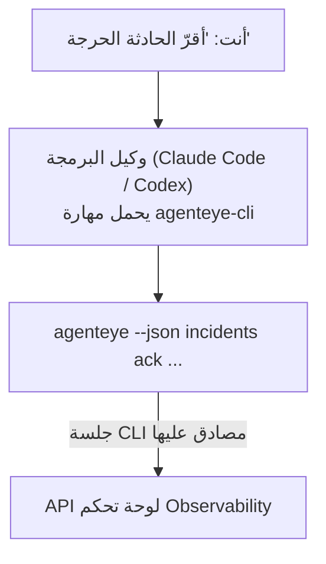

---
---
title: "مهارة عامل Failproof AI Observability CLI"
description: "اسأل وكيل البرمجة الخاص بك \"هل حدث شيء خاطئ اليوم؟\" واتركه يجيب من بيانات Failproof AI Observability المباشرة، بدون الحاجة لحفظ أوامر."
---


اسأل وكيل البرمجة الخاص بك *"هل حدث شيء خاطئ اليوم؟"* واتركه يجيب من بيانات Failproof AI Observability المباشرة، بدون الحاجة لحفظ أوامر. **مهارة Failproof AI Observability CLI** (`agenteye-cli`) هي *Agent Skill*: مجلد صغير من التعليمات يقوم وكيل البرمجة مثل Claude Code أو Codex بتحميله عند الحاجة. وهي تعلم الوكيل تشغيل نشر Observability الخاص بك من خلال [`agenteye` CLI](/ar/agenteye/cli) من طلبات باللغة الإنجليزية البسيطة مثل *"أعط CI مفتاحاً يمكنه فقط دفع الأحداث"* أو *"أقرّ الحادثة الحرجة وأسندها لي."*

هذا **ليس** خدمة أو ملف ثنائي منفصل؛ لا يوجد شيء لنشره. يعمل فوق CLI الذي قمت بتثبيته بالفعل: يقوم الوكيل بتشغيل `agenteye --json …`، يحلل JSON النظيف، ويجيب عليك بلغة طبيعية. كل ما يمكنه فعله، يمكنك أنت فعله بكتابة نفس الأوامر.

---

## كيف يرتبط بواجهات Failproof AI Observability الأخرى

يمنحك Failproof AI Observability أربع طرق للوصول إلى نفس البيانات والتحكم. تكمل بعضها البعض:

| الواجهة | ما هي | حيث تعمل | استخدمها عندما |
|---|---|---|---|
| **[CLI](/ar/agenteye/cli)** | مرجع الأوامر والعلامات لـ `agenteye` | المحطة الطرفية الخاصة بك | تريد تشغيل أو إنشاء سكريبت لأمر معين |
| **[CLI recipes](/ar/agenteye/cli-recipes)** | أنماط `jq`/pipeline جاهزة للنسخ | المحطة الطرفية / السكريبتات | تقوم بدمج CLI في التشغيل الآلي |
| **مهارة CLI** (هذا المستند) | واجهة لغة طبيعية للـ CLI | وكيل البرمجة، على محطة العمل الخاصة بك | تريد *فقط أن تسأل* واتركه للوكيل لاختيار الأمر |
| **[مهارة Evaluator](/ar/agenteye/evaluator-skill)** | مهارة شقيقة تصمم وتبني خدمة التقييم الخاصة بك | وكيل البرمجة، على محطة العمل الخاصة بك | تريد *إنتاج* درجات التقييم بدلاً من قراءتها |
| **[مهارة Python SDK](/ar/agenteye/python-sdk-skill)** | مهارة شقيقة توضح وكيلك بحيث يصدر البيانات الوصفية على الإطلاق | وكيل البرمجة، على محطة العمل الخاصة بك | تريد لوكيلك أن *ينتج* الأحداث التي تقرأها هذه المهارة |
| **[مساعد AI في لوحة التحكم](/ar/agenteye/assistant)** | دردشة مضمنة في لوحة التحكم | من جانب الخادم (في لوحة التحكم) | تريد أسئلة وأجوبة في لوحة التحكم على بياناتك |

المهارة نفسها ليس لديها أي صلاحيات خاصة بها؛ فهي تحول كلماتك إلى استدعاءات CLI تعمل بصفتك:



### مقابل مساعد AI في لوحة التحكم: تمييز مهم

هذان أداتان مختلفتان تماماً برطب نفوذ مختلفة جداً:

- **مساعد AI في لوحة التحكم** ([AI assistant](/ar/agenteye/assistant)) هو دردشة مضمنة في لوحة التحكم، مدعوم بخدمة الوكيل. هو **قراءة فقط بالإضافة إلى تأليف محمي بموافقة**: يمكنه صياغة الاستعلامات والعمليات المحفوظة، لكن كل عملية كتابة توقف للحصول على نقرة موافقة صريحة منك، وهو لا يحذف أبداً. يتم التحكم فيه بواسطة صلاحية `agent:use` وينظر فقط إلى البيانات الخاصة بالمنظمة التي تشاهدها.
- **مهارة CLI** تعمل على *محطة العمل الخاصة بك* داخل *وكيل البرمجة الخاص بك* وتشغل `agenteye` CLI بصفتك **أنت**. يمكنها تنفيذ **السطح الكامل للـ CLI، بما في ذلك التعديلات** (إنشاء/تدوير/تعطيل مفاتيح API، تغيير إعدادات المنظمة، حل الحوادث، حذف الاستعلامات المحفوظة)، محدودة فقط بصلاحيات تسجيل دخول CLI الخاص بك. تعامل معها بنفس الحذر الذي ستتعامل به عند تشغيل تلك الأوامر يدوياً.

---

## المتطلبات الأساسية

1. **`agenteye` CLI مثبت** وموجود في `PATH` (انظر مرجع [CLI](/ar/agenteye/cli): `pipx install agenteye`).
2. **عنوان لوحة التحكم الخاصة بك** محدد (`AGENTEYE_DASHBOARD_URL`، أو يمرر الوكيل `--base-url`).
3. **جلسة مسجلة دخول**: قم بتشغيل `agenteye login` بنفسك أولاً. المهارة **لا تستطيع** إكمال تسجيل الدخول برمز لمرة واحدة عبر البريد الإلكتروني لك؛ سيخبرك بتشغيل `agenteye login` إذا كانت الجلسة مفقودة أو انتهت صلاحيتها (رمز خروج CLI `4`).

---

## أين تحصل عليها

يتم نشر المهارة في مجموعة المهارات العامة لـ Failproof AI:

**[github.com/FailproofAI/skills](https://github.com/FailproofAI/skills)** → [`skills/agenteye-cli/`](https://github.com/FailproofAI/skills/tree/main/skills/agenteye-cli)

لا شيء عنها محظور — المستودع عام والمهارة لا تحتاج إلى بيانات اعتماد خاصة بها، لأنها فقط تشغل **عام** `agenteye` CLI ضد *لوحة التحكم الخاصة بك*، باستخدام الجلسة *التي قمت أنت* بتسجيل الدخول بها. لا تحتاج إلى طلب إذن من أحد.

لاحظ أنها تأتي كمجلد خاص بها وهي **ليست** داخل حزمة `pipx install agenteye`، لذا لا تبحث عنها هناك.

## تثبيت المهارة

الطريق الأسرع هي [`skills`](https://skills.sh) CLI، التي تجلب المجلد وتضعه حيث ينظر وكيلك:

```bash
# Claude Code، هذا المشروع فقط
npx skills add FailproofAI/skills --skill agenteye-cli -a claude-code

# كل مشروع (يثبت في ~/.claude/skills/)
npx skills add FailproofAI/skills --skill agenteye-cli -a claude-code -g --copy

# Codex بدلاً من ذلك
npx skills add FailproofAI/skills --skill agenteye-cli -a codex
```

ثم أدر المهارة مثل أي مهارة أخرى:

```bash
npx skills list -a claude-code      # ما هو مثبت
npx skills update agenteye-cli      # اسحب أحدث إصدار
npx skills remove agenteye-cli      # أزله
```

تفضل التثبيت يدوياً؟ Agent Skill هو مجرد مجلد يحتوي على `SKILL.md` (بالإضافة إلى مراجع اختيارية)، لذا يعمل النسخ أيضاً:

- **Claude Code**: ضع مجلد `agenteye-cli/` في `~/.claude/skills/` (كل مشروع) أو `<your-repo>/.claude/skills/` (ذلك المستودع فقط). Claude Code يكتشفه تلقائياً — تحقق بقائمة `/skills`، أو ببساطة اسأل سؤالاً يتطابق مع وصفه.
- **Codex (OpenAI)**: Codex يقرأ نفس `SKILL.md`. `agents/openai.yaml` المضمن يعين `allow_implicit_invocation: true`، لذا يختار Codex المهارة تلقائياً عندما تطابق مهمة؛ بخلاف ذلك استدعها صراحةً باسم `$agenteye-cli`.

---

## الأمان: التعديلات لا تطالب عندما يشغل الوكيل CLI

> **تحذير:** اقرأ هذا قبل السماح لوكيل بإجراء تغييرات.

يطلب `agenteye` CLI عادةً *"هل أنت متأكد؟"* قبل إجراء مدمر. وهو **يتخطى تلقائياً هذا التأكيد كلما لم يكن متصلاً بـ terminal (وهو بالضبط كيف يشغله وكيل البرمجة)، و `--json` يتخطاه أيضاً.** لذا فإن موجه الأمان **لن يعمل** للوكيل.

المهارة مكتوبة للتعويض: يتم تعليمها بذكر الأمر المضبوط الذي ستشغله والحصول على **موافقة صريحة منك قبل أي تغيير الحالة**. حافظ على هذا الانضباط. عندما تشغل Failproof AI Observability من خلال وكيل، *أنت* خطوة التأكيد. أوامر تغيير الحالة التي يجب مراقبتها:

- `keys create` / `update` / `disable` / `regenerate`
- `users create` / `update` / `disable` / `enable`
- `settings set`
- `alerts create` / `update` / `delete` / `test`
- أوامر `incidents` الكتابية: `ack` / `assign` / `resolve` / `open` / `comment-add` / `comment-delete` / `subscribe` / `unsubscribe`
- `query create` / `update` / `delete`
- `agent rename` / `delete`
- `orgs switch`

كل شيء تحت **Observe** (`events`, `sessions`, `evals`, `errors`, `list`, `whoami`, `orgs list/current/perms`) قراءة فقط ولا يغيّر شيء.

لأن الوكيل يتصرف بصفتك **أنت**، يمكنه فقط فعل ما يسمح به تسجيل دخول الخاص بك؛ يتم حل الصلاحيات **لكل منظمة** (انظر [API keys](/ar/agenteye/api-keys)). أمر تفتقد إذن له يعود برمز خروج `5` مع الصلاحية المحددة بالضبط، لذا يمكن للوكيل أن يخبرك بالضبط ما تطلبه من مسؤول بدلاً من الفشل بطريقة غامضة.

---

## ما يمكنك أن تسأله

إليك ما يبدو عليه رحلة ذهاب وإياب حقيقية، قراءة، ثم تغيير ينتظر موافقتك:

```text
أنت    ▸ هل حدث شيء خاطئ في آخر يوم؟

الوكيل ▸ التشغيل: agenteye --json errors --since 24h --aggregate
        3 أنواع أخطاء في آخر 24 ساعة. الأكبر هو TimeoutError
        (18 مرة، جميعها على checkout-agent)، ثم RateLimited (5).
        هل تريد الجلسات الفاشلة لـ TimeoutError؟

أنت    ▸ أعط CI مفتاحاً يمكنه فقط دفع الأحداث.

الوكيل ▸ هذا ينشئ مفتاح API. سأشغل:
          agenteye keys create ci --add events:add
        موافق على المتابعة؟

أنت    ▸ نعم

الوكيل ▸ تم. تم إنشاء مفتاح "ci" بـ events:add فقط.
        يتم عرض السر مرة واحدة فقط، لذا احفظه الآن. لا يمكنني إعادة طباعته.
```

المهارة تعين كل نية باللغة الطبيعية للأمر `agenteye` الصحيح، واكتشاف القيم الصحيحة أولاً (`list <kind>`, `whoami`) حتى لا تخمن، وبيان الأمر المضبوط قبل أي تغيير. أمثلة أخرى:

- *"هل حدث شيء خاطئ / فاشل في آخر 24 ساعة؟"* → `errors --since 24h --aggregate`، ثم تفصيل.
- *"لماذا فشلت جلسة `run-001`؟"* → `events --session-id run-001 --all` + `evals --session-id run-001`.
- *"كيف تتجه الجودة هذا الأسبوع؟"* → `evals --aggregate --since 7d`، ثم التنقيب في التشغيلات منخفضة النقاط.
- *"أعط CI مفتاحاً يمكنه فقط دفع الأحداث."* → `keys create ci --add events:add` (ينص الأمر، ثم ينشئه ويلتقط السر لمرة واحدة).
- *"من له إذن؟ اجعل Dana قراءة فقط."* → `users list` → `users update dana@… --permission-set read-only` (بعد تأكيد معك).
- *"أقرّ الحادثة الحرجة وأسندها لي."* → `incidents list --state firing` → `incidents ack <id>` / `incidents assign <id> you@…`.

للأوامر الدقيقة والعلامات وأشكال JSON خلف هذه، انظر مرجع [CLI](/ar/agenteye/cli) و [CLI recipes for agents](/ar/agenteye/cli-recipes).

---

## الخطوات التالية

- **[CLI](/ar/agenteye/cli)**: مرجع أوامر وعلامات كامل لـ `agenteye`.
- **[CLI recipes for agents](/ar/agenteye/cli-recipes)**: أنماط `jq` جاهزة للنسخ ومعالجة رموز الخروج.
- **[مهارة Evaluator agent](/ar/agenteye/evaluator-skill)**: المهارة الشقيقة، لبناء المقيّم الذي يقرأ `agenteye evals` درجاته.
- **[مهارة Python SDK agent](/ar/agenteye/python-sdk-skill)**: المهارة الشقيقة، لتوضيح وكيل بحيث يصدر البيانات الوصفية التي يقرأها `agenteye`.
- **[مساعد AI](/ar/agenteye/assistant)**: المساعد في لوحة التحكم (لا تخلط بينه وبين مهارة المحطة الطرفية هذه).
- **[API keys](/ar/agenteye/api-keys)**: نموذج الصلاحيات لكل منظمة الذي يحد من ما يمكن للمهارة فعله.