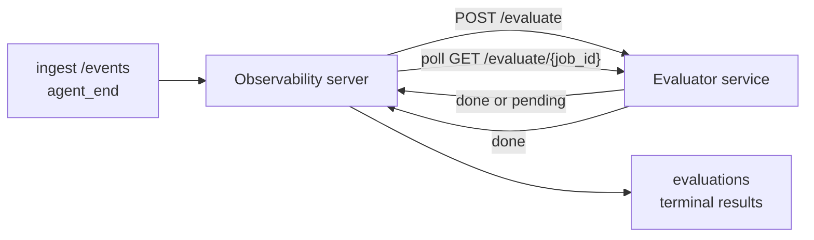

يمكن لـ Failproof AI Observability تسجيل كل تشغيل وكيل منتهي تلقائياً من حيث الجودة: تزود خدمة تسجيل صغيرة، و Observability يتولى الباقي. استخدمها لتتبع الأبعاد التي تهمك (المساعدة، كفاءة الأدوات، دقة المعلومات، السلامة؛ اختر ما تشاء)، اكتشف الانحدارات مبكراً، وقارن الوكلاء أو البيئات في لمحة واحدة. التسجيل اختياري: لا يفعل خط الأنابيب شيئاً إلى أن تعيين `EVALUATOR_ENDPOINT` على الخادم.

> **ملاحظة:** أنت تحدد أبعاد النقاط. يمكن لمقيمك إرجاع أي مفاتيح رقمية يشاء؛ Observability يخزن ويتجه ويعرض كل ما تعيده.

## نظرة عامة

1. **اكتب مسجل نقاط.** أنشئ خدمة HTTP صغيرة تقرأ نص جلسة وتعيد درجات. يأتي Observability مع مرجع عامل يمكنك نسخه. انظر [كتابة مقيّم مع SDK](#writing-an-evaluator-with-the-sdk).
2. **وجّه Observability إليها.** عيّن `EVALUATOR_ENDPOINT` (و`EVALUATOR_TOKEN` مشترك) على عملية الخادم.
3. **راقب وصول النقاط.** كل جلسة مكتملة يتم تسجيلها تلقائياً؛ تظهر النتائج على صفحة تفاصيل الجلسة وشبكة الجلسات ولوحات التحكم المحفوظة.


*بمجرد تكوين مقيّم، يتم تسجيل كل تشغيل مكتمل وتظهر النتائج في الشريط الأيمن للجلسة: الملخص في الأعلى، ثم أشرطة درجات لكل بعد مع التوضيح.*

---

## كيفية عمله



عندما يصدر Failproof AI Observability SDK حدث `agent_end` لجلسة، يجدول الخادم تقييماً. ثم يرسل نص الحدث الكامل عبر POST إلى خدمة المقيّم الخاصة بك، والتي يمكن أن تفعل أحد الأمرين:

- **إرجاع النتيجة مباشرة** مع `{"status":"done", "scores":{...}, "reasoning":{...}, "summary":"..."}`. تُلحق النتيجة بمخطط زمني لتقييم الجلسة. `reasoning` و `summary` اختيارية.
- **تأجيل** مع `{"status":"pending", "job_id":"abc-123"}`. ثم يستدعي Observability `GET {EVALUATOR_ENDPOINT}/evaluate/abc-123` حتى يعيد المقيّم الخاص بك `{"status":"done", ...}` أو `{"status":"error", "error":"..."}`.

  معدل الاستقصاء يكون لكل وظيفة: قد تتضمن استجابة `pending` `next_poll_secs` للتجاوز؛ وإلا فإن Observability يستخدم قيمة `default_poll_interval_secs` من `GET /config`؛ وإلا يعود الخادم إلى `EVALUATOR_POLLING_INTERVAL_SECS` (الافتراضي 10 ثانية). يتم تثبيت جميع القيم على [1 ثانية، 1 ساعة].

يمكن أيضاً التقاط الجلسات التي لم تصدر أبداً `agent_end` (على سبيل المثال، عملية وكيل متعطلة): قد يعيد `GET /config` الخاص بالمقيّم `{"inactivity_timeout_secs": 1800}`، وسيقيّم Observability أي جلسة خاملة لفترة طويلة. عيّن الحقل على `null` أو احذفه لتعطيل هذا البديل.

خط الأنابيب بدون عملية تماماً عند عدم تعيين `EVALUATOR_ENDPOINT`.

يمكن للجلسة تجميع **تقييمات نهائية متعددة بمرور الوقت**: كل حدث `agent_end` (وكل إعادة تقييم يدوية من لوحة التحكم) يلحق صف تقييم جديد. هذه هي الطريقة المدعومة لتقييم محادثة منتعشة: ينهي المستخدم وكيلاً، ويعود لاحقاً، ويرسل المزيد من الأحداث، وينهي الوكيل مرة أخرى، ويتم تشغيل تقييم ثان على النص المحدث الكامل. تعرض لوحة التحكم أحدث تقييم كعنوان رئيسي والتقييمات السابقة كمخطط زمني قابل للطي. أثناء تشغيل تقييم واحد لجلسة، يتم تجاهل أحداث `agent_end` الإضافية لتلك الجلسة؛ سيصطف التالي بعد اكتمال التقييم الذي يعمل بتقييم جديد كالمعتاد.

يعاود البديل الخامل الاشتباك في الجلسات المنتعشة أيضاً: إذا وصلت أحداث جديدة بعد تقييم نهائي سابق وذهبت الجلسة بعد ذلك خاملة بعد `inactivity_timeout_secs`، يتم وضع تقييم جديد في الطابور.

تتم إعادة محاولة الأعطال العابرة (5xx و429 وانتهاء المهلة الزمنية وأخطاء الشبكة) مع تراجع أسي حتى `EVALUATOR_MAX_ATTEMPTS`؛ استجابات 4xx نهائية. Observability آمن للتشغيل مع عدة عمليات خادم مقسمة أفقياً؛ يتم تقسيم العمل بحيث لا يتم أبداً تعيين نفس الجلسة مرتين في وقت واحد.

---

## عقد HTTP

كل مسار مصرح به يستخدم **مصادقة رمز الحامل**. يجب تعيين نفس القيمة على كلا الجانبين:

- خادم Observability: متغير البيئة `EVALUATOR_TOKEN`
- خدمة المقيّم: مكون بنفس الطريقة (SDK `agenteye-evaluator` يقرأ `EVALUATOR_TOKEN` بالاتفاقية)

إذا لم يتم تعيين `EVALUATOR_TOKEN`، فلن يرسل الخادم رأس `Authorization`؛ قد يقبل المقيّم بعد ذلك طلبات مجهولة، وهو آمن للشبكة الداخلية فقط ولكن غير موصى به على الإنترنت العام.

### المسارات التي يجب أن يخدمها المقيّم

| المسار | الهيئة / المعاملات | الاستجابة |
|---|---|---|
| `GET /health` | لا شيء | `{"status":"ok"}` (مفتوح، بدون مصادقة) |
| `GET /config` | لا شيء | `{"inactivity_timeout_secs": <int> \| null, "default_poll_interval_secs": <int> \| omitted}` |
| `POST /evaluate` | `EvalRequest` JSON | `{"status":"done", ...}` أو `{"status":"pending", "job_id":"..."}` |
| `GET /evaluate/{id}` | لا شيء | نفس شكل الاستجابة مثل `/evaluate` |

### هيئة `EvalRequest` المرسلة من الخادم

```json
{
  "schema_version": "1",
  "session_id":     "session-abc123",
  "agent_id":       "planner",
  "environment":    "production",
  "started_at":     "2026-05-10T12:00:00Z",
  "ended_at":       "2026-05-10T12:05:00Z",
  "events": [
    { "id": 1234, "ts": "...", "event_type": "agent_start", "payload": { ... } },
    ...
  ]
}
```

### أشكال الاستجابات

**متزامن (تم):**

```json
{
  "status": "done",
  "scores": { "helpfulness": 0.85, "tool_efficiency": 0.6 },
  "reasoning": {
    "helpfulness": "answered the question directly with citations",
    "tool_efficiency": "called list_files three times when one would have done"
  },
  "summary": "strong answer quality, weak tool selection"
}
```

`reasoning` (خريطة تبرير لكل نقطة) و `summary` (سرد واحد شامل) كلاهما اختياري. يجب أن تعكس المفاتيح في `reasoning` المفاتيح في `scores`؛ تعرض لوحة التحكم كل إدخال مضمناً تحت شريط نقطته. المقيّمون الأقدم الذين يعيدون فقط `scores` يستمرون في العمل دون تغيير؛ يقرأ `reasoning` و `summary` ببساطة على أنهما null والأدوات المقابلة في واجهة المستخدم محذوفة.

**غير متزامن (مؤجل):**

```json
{ "status": "pending", "job_id": "abc-123", "next_poll_secs": 30 }
```

`next_poll_secs` اختياري؛ إذا تم حذفه، يعود الخادم إلى `default_poll_interval_secs` للمقيّم من `/config`، ثم إلى متغير البيئة الخاص به `EVALUATOR_POLLING_INTERVAL_SECS`.

**خطأ نهائي من جانب المقيّم:**

```json
{ "status": "error", "error": "model service unavailable" }
```

يعامل الخادم أي هيئة 2xx أخرى كخطأ بروتوكول ويسجل `error` نهائي للجلسة.

---

## كتابة مقيّم مع SDK

لا تضطر لتنفيذ عقد HTTP يدوياً. تعطيك حزمة `agenteye-evaluator` Python غلاف FastAPI مكتوباً بشكل متقن يتولى المصادقة والتوجيه وأشكال الطلب/الاستجابة لك.

يأتي Failproof AI Observability أيضاً مع **مقيّم مرجع عامل** يسجل `helpfulness` و `tool_efficiency` و `factuality` من شكل النص. انسخه كنقطة انطلاق وبدّل منطقك الخاص: قاضٍ LLM أو محرك قواعد أو ما يناسب معيار الجودة الخاص بك.

الحد الأدنى من مقيّم قابل للعمل:

```python
import os
from agenteye_evaluator import Evaluator, EvalRequest, EvalResponse

app = Evaluator(token=os.environ["EVALUATOR_TOKEN"])

@app.evaluator
def run(req: EvalRequest) -> EvalResponse:
    # Inspect req.events (the full session transcript) and return scores.
    tool_calls = sum(1 for e in req.events if e.event_type == "tool_use")
    return EvalResponse(
        scores={"tool_calls": float(tool_calls)},
        reasoning={"tool_calls": f"{tool_calls} tool invocations in the transcript"},
        summary="tight tool loop" if tool_calls < 5 else "agent looped on tools",
    )
```

تعمل مثيل `app` تحت أي خادم ASGI، لذا يبدأ `uvicorn module:app` ذلك.

للمقيّمين الذين يحتاجون إلى تأجيل العمل المكلف، أعد `JobPending` بدلاً من ذلك وسجل معالج `@app.job_lookup`؛ يستقصي خادم Observability `GET /evaluate/{job_id}` حتى تعيد حالة نهائية أو تنقضي حد `EVALUATOR_MAX_POLL_DURATION_SECS` (الافتراضي 1 ساعة).

موثقة مرجعية API الكاملة والنمط غير المتزامن ومخطط الأحداث في README لـ SDK `agenteye-evaluator`.

---

## تشغيل مقيّمك

المقيّم هو **خدمتك** — لا يأتي Failproof AI Observability مع مقيّم افتراضي، لذا تبني وتشغله أينما تشغل خدماتك الخاصة. يعمل تحت أي خادم ASGI (على سبيل المثال `uvicorn my_evaluator:app`؛ اخدم مسارات `/health` و `/config` و `/evaluate` من [عقد HTTP](#http-contract)، ثم وجّه الخادم إليها (انظر [تكوين الخادم](#configuring-the-server)).

بمجرد أن يكون المقيّم في متناول اليد، يعيد `GET /health` القيمة `{"status":"ok"}`. بعد أن يعمل الوكيل من البداية إلى النهاية، يعيد `GET /evaluations` على الخادم صفاً مع `status: "done"` والنقاط التي أنتجها مقيّمك.

---

## تكوين الخادم

عيّن على عملية الخادم:

| متغير البيئة | المعنى |
|---|---|
| `EVALUATOR_ENDPOINT` | URL الأساسي للمقيّم الخاص بك (`http://evaluator:9000`). لم يتم التعيين = خط الأنابيب معطّل. |
| `EVALUATOR_TOKEN` | رمز الحامل. يجب أن يساوي القيمة التي تم تكوين خدمة المقيّم بها. |
| `EVALUATOR_WORKERS` | مهام العامل لكل مثيل خادم (الافتراضي 2). |
| `EVALUATOR_CLAIM_BATCH` | الصفوف المطالب بها لكل دقة عامل (الافتراضي 4). تتم معالجة الدفعات **في المتزامنة**؛ التزامن الفعلي على نقطة نهاية المقيّم الخاص بك هو `EVALUATOR_WORKERS × EVALUATOR_CLAIM_BATCH`. |
| `EVALUATOR_POLL_IDLE_SECS` | مدة نوم العامل بين محاولات الإرسال عند عدم استحقاق أي تقييم (الافتراضي 2 ثانية). |
| `EVALUATOR_POLLING_INTERVAL_SECS` | الاحتياطي النهائي لإيقاع `GET /evaluate/{id}` عند عدم تعيين `next_poll_secs` كل استجابة أو `default_poll_interval_secs` للمقيّم (الافتراضي 10 ثانية). |
| `EVALUATOR_REQUEST_TIMEOUT_MS` | انتهاء مهلة كل طلب (الافتراضي 30000). |
| `EVALUATOR_MAX_ATTEMPTS` | بعد هذا العدد من الأعطال العابرة يتم تسجيل النتيجة كـ `error` نهائي (الافتراضي 5). |
| `EVALUATOR_CONFIG_REFRESH_SECS` | `GET /config` cadence (الافتراضي 300). |
| `EVALUATOR_MAX_POLL_DURATION_SECS` | أقصى وقت جداري قد تبقى فيه جلسة في طابور الاستقصاء قبل أن يتم إنهاؤها كـ `timeout` (الافتراضي 3600 ثانية). يحمي من مقيّم يستمر في إرجاع `pending` إلى الأبد. |

لتفعيل التسجيل التلقائي، عيّن كلاً من `EVALUATOR_ENDPOINT` و `EVALUATOR_TOKEN` على الخادم، ثم أعد تشغيله لالتقاط التغيير. مع عدم تعيين `EVALUATOR_ENDPOINT` يبقى خط الأنابيب بدون عملية.

أزرار الضبط أعلاه اختيارية؛ عيّن متغيرات البيئة المقابلة على الخادم فقط إذا كنت بحاجة لتجاوز الإعدادات الافتراضية.

---

## مرجع API

| الطريقة | المسار | الإذن المطلوب | الغرض |
|---|---|---|---|
| `GET` | `/evaluations` | `evaluations:read` | نتائج نهائية للاستعلام. يدعم `session_id` و `agent_id` و `environment` و `status` (`done`/`error`/`timeout`) و `ts_from` و `ts_to` و `cursor` و `limit` و `score_filters` و `latest_per_session`. الافتراضي `limit` هو 50 والحد الأقصى 200 (لاحظ أن هذا يختلف عن `/events` الذي يحد عند 1000). يقبل `environment` قائمة مفصولة بفواصل (على سبيل المثال `environment=prod,staging`)؛ القيم الفردية تعمل أيضاً. مع `latest_per_session=true` تحتوي الاستجابة على صف واحد على الأكثر لكل `session_id` (الأحدث بواسطة `completed_at`) مستخدم من قبل صفحة قائمة الجلسات لطي مخطط زمني لتقييم الجلسة إلى عنوانها الحالي. الافتراضي false (يعيد السجل الكامل). |
| `GET` | `/evaluations/aggregate` | `evaluations:read` | صحة تقييم ملخصة لشريحة مفلترة: إجمالي العدد وتقسيم done/error/timeout وإحصائيات لكل مفتاح نقطة (count/avg/min/max/p50 على مفاتيح `scores` التعسفية) ومخطط زمني مجمع حسب الفترة الزمنية. يقبل **نفس معاملات الفلتر مثل `/evaluations`** بالإضافة إلى `featured_keys` (CSV من مفاتيح النقاط للاتجاه) و `latest_per_session`. يشغل ميزة الدعامات؛ المقاييس دقيقة على مجموعة المطابقة بأكملها وليست مأخوذة بعينات. |
| `GET` | `/evaluations/environments` | `evaluations:read` | قيم البيئة المميزة من جدول `evaluations`. المستخدم لملء منسدلات الفلتر ذات النطاق إلى البيانات القابلة للقراءة من التقييمات. |
| `GET` | `/evaluation-jobs` | `evaluations:read` | رؤية التقييمات الجارية. فلتر حسب `status` (`pending`/`polling`). |
| `GET` | `/events` | `events:read` | دفق أحداث خام الجلسة. يدعم `session_id` و `agent_id` و `event_type` (CSV) و `environment` (CSV) و `ts_from` و `ts_to` و `cursor` و `limit` و `order`. `order` هو `desc` (الأحدث أولاً، الافتراضي) أو `asc` (الأقدم أولاً)؛ القيمة غير المعترف بها تعود إلى `desc`. استقصاء المؤشر عبر `next_cursor` الاستجابة (معرف حدث): مرره مرة أخرى كـ `cursor` للحصول على الصفحة التالية؛ مع `asc` الصفحة التالية هي الأحداث بعد هذا المعرف، مع `desc` الأحداث قبلها. الافتراضي `limit` هو 50 والحد الأقصى 1000. |
| `GET` | `/sessions/:session_id/export` | `events:read` | يعيد هيئة JSON الدقيقة التي سيستقبلها المقيّم لهذه الجلسة، مقدم كمرفق قابل للتحميل باسم `session-<id>.json`. مفيد لإعادة تشغيل جلسات الإنتاج من خلال `agenteye-evaluator` للاختبار غير المتصل. البايتات متطابقة البايتات مع ما يرسله خط أنابيب المقيّم. |
| `POST` | `/sessions/:session_id/re-evaluate` | `evaluations:trigger` | اصطف تقييماً جديداً لجلسة؛ يعمل سواء كان هناك تقييم سابق أم لا. يتم **إلحاق** النتيجة الجديدة بمخطط زمني لتقييم الجلسة بدلاً من الكتابة فوق النتيجة السابقة، لذا تبقى النقاط السابقة مرئية كسجل. يعيد `202` عند الاصطفاف و `404` للجلسة غير المعروفة و `409` إذا كان التقييم بالفعل قيد الطيران. استخدم هذا بعد نشر مقيّم جديد أو للجلسات التي لم تصدر أبداً `agent_end`. |

### فلترة حسب نطاق النقاط: `score_filters`

يقبل `GET /evaluations` معامل اختياري `score_filters` يضيق النتائج حسب القيم الرقمية داخل كائن `scores`. المعامل هو قائمة مفصولة بفواصل من إدخالات `key:min..max`؛ يمكن حذف أي منهما مرتبط. يتم دمج إدخالات متعددة بـ AND منطقية. يتم استبعاد الصفوف حيث لم يتم العثور على المفتاح المسمى أو غير رقمي. قد يحمل الطلب الواحد 20 إدخال فلتر على الأكثر؛ تجاوز هذا يعيد HTTP 400.

أمثلة:
```text
# helpfulness in [0.5, 0.8]
GET /evaluations?score_filters=helpfulness:0.5..0.8

# tool_efficiency at most 0.3 (no lower bound)
GET /evaluations?score_filters=tool_efficiency:..0.3

# helpfulness >= 0.5 AND factuality >= 0.9
GET /evaluations?score_filters=helpfulness:0.5..,factuality:0.9..
```

لكل كائن استجابة `/evaluations` هذه الحقول:

| الحقل | النوع | الملاحظات |
|---|---|---|
| `evaluation_id` | string (UUID) | معرف قانوني لهذا التقييم النهائي. يحصل كل تقييم نهائي على UUID جديد؛ يمكن للجلسة الواحدة أن تحتوي على عدة. |
| `id` | string (UUID) | اسم مستعار للتوافقية العكسية يحمل نفس قيمة `evaluation_id`. |
| `session_id` | string | الجلسة التي تم تشغيل التقييم ضدها. يمكن للجلسة الواحدة أن تحتوي على تقييمات متعددة في المخطط الزمني. |
| `agent_id` | string | يحدد الوكيل الذي أنتج الجلسة. |
| `environment` | string | تسمية البيئة المنسوخة من الجلسة. |
| `status` | enum | واحد من `"done"` أو `"error"` أو `"timeout"`. |
| `scores` | object \| null | النقاط المعادة من قبل مقيّمك. |
| `reasoning` | object \| null | خريطة تبرير اختيارية لكل نقطة معادة من قبل مقيّمك. عادة ما تعكس المفاتيح تلك الموجودة في `scores`. تعرض لوحة التحكم كل إدخال تحت شريط نقطته. |
| `summary` | string \| null | سرد واحد شامل اختياري معاد من قبل مقيّمك. تعرض لوحة التحكم هذا فوق تقسيم النقاط لكل بعد كعنوان التقييم. |
| `error` | string \| null | مأهول على `"error"` / `"timeout"` فقط. |
| `attempt_count` | integer | عدد محاولات الإرسال (≥ 1). |
| `duration_ms` | integer \| null | مدة المحاولة النهائية. |
| `completed_at` | string (ISO 8601 UTC) | عندما تم تسجيل النتيجة النهائية. يتم ترتيب النتائج حسب `completed_at` (الأحدث أولاً). |
| `created_at` | string (ISO 8601 UTC) | ينقل نفس الطابع الزمني مثل `completed_at` (دلالات الكتابة مرة واحدة). |

---

## الأذونات

| الإذن | المنح |
|---|---|
| `evaluations:read` | قائمة نتائج التقييم وعرض النقاط في لوحة التحكم وتحميل مقاييس صحة لوحة التحكم. |
| `evaluations:trigger` | اصطفف تقييماً يدويّاً لجلسة عبر `POST /sessions/:session_id/re-evaluate` أو زر إعادة التقييم في لوحة التحكم. |
| `dashboards:read` | عرض لوحات التحكم المحفوظة (يحتاج أيضاً إلى `evaluations:read` لتحميل مقاييسها). |
| `dashboards:write` | إنشاء وتحرير لوحات التحكم. |
| `dashboards:delete` | حذف لوحات التحكم. |

يتلقى مسؤول bootstrap (`ADMIN_KEY` و `ADMIN_EMAIL`) هذه تلقائياً.

---

## عرض النتائج

- **`/sessions/<id>`**: مخطط زمني للأحداث + شريط أيمن يعرض نقاط الجلسة وأي خطأ من محاولة الإرسال. إذا كان المفتاح الخاص بك لديه `evaluations:trigger`، يظهر زر **إعادة تقييم** بجانب زر التصدير، مفيد للجلسات التي لم تصدر أبداً `agent_end`، أو لتحديث النقاط بعد نشر مقيّم جديد. تستقصي لوحة التحكم النتيجة الجديدة وتحدث الشريط الأيمن عندما تصل.
- **`/sessions`**: شبكة جلسات قابلة للفلترة؛ عمود النقاط يعرض حالة التقييم والنقاط لكل جلسة في لمحة واحدة.
- **`/dashboards`**: مناظر صحة تقييم محفوظة (انظر [لوحات التحكم](#dashboards) أدناه).


*تعرض شبكة الجلسات حالة التقييم والنقاط لكل تشغيل في لمحة واحدة؛ تجعل الشارات الحمراء/العنبرية/الخضراء الدرجات المنخفضة تظهر.*

---

## لوحات التحكم

تتيح صفحة **لوحات التحكم** (`/dashboards`) حفظ مزيج من فلاتر التقييم كعرض مسمى وقابل لإعادة الاستخدام والمراقبة في لمحة واحدة كيف تسير تلك الشريحة من التقييمات. **تُشارك لوحات التحكم عبر منظمتك بأكملها**؛ الجميع لديهم `dashboards:read` يرى نفس المجموعة.

تثبت كل لوحة تحكم:

- **الفلاتر**: نفس عناصر التحكم مثل صفحة الجلسات: البيئة والحالة والوكيل ونافذة زمنية متجددة وفلاتر نطاق النقاط (`key:min..max`).
- **تكوين عرض**: أي مفاتيح نقاط لتمييزها وحدود صحة أخضر/عنبري/أحمر واللوحات المراد عرضها وما إذا كان يتم طيها إلى أحدث تقييم لكل جلسة.

تعرض كل بطاقة عدد الجلسات المطابقة وتقسيم done/error/timeout ومتوسط كل نقطة مميزة وخط بياني اتجاه صغير. فتح لوحة تحكم يعرض اللوحات كاملة الحجم؛ **فتح في الجلسات** ينقلك إلى صفحة الجلسات بفلترة مسبقة لتلك الشريحة بالضبط. تُحسب المقاييس من جانب الخادم على مجموعة المطابقة بأكملها (عبر `GET /evaluations/aggregate`)، لذا الأرقام دقيقة بدلاً من أن تكون عينات.


**الأذونات:** الضرورية للعرض `dashboards:read` و `evaluations:read`؛ الإنشاء والتحرير بحاجة إلى `dashboards:write`؛ الحذف بحاجة إلى `dashboards:delete`. يتلقى مسؤول bootstrap جميع هذه تلقائياً.

---

## استكشاف الأخطاء

**الجلسات موجودة لكن لا يتم إنشاء تقييمات.** تأكد من تعيين `EVALUATOR_ENDPOINT` على عملية الخادم وأن الخادم والمقيّم يشاركان نفس قيمة `EVALUATOR_TOKEN` وأن نقطة نهاية `/health` للمقيّم يمكن الوصول إليها من الخادم. مع عدم تعيين `EVALUATOR_ENDPOINT` يكون خط الأنابيب بدون عملية.

**تقييمات جارية متراكمة.** استعلم `GET /evaluation-jobs` لمشاهدة طابور الطيران. تفتش `attempt_count` و `next_attempt_at` و `last_error` على كل صف. الأسباب الشائعة: خدمة المقيّم غير قابلة للوصول أو تعيد 5xx (أعيدت المحاولة مع تراجع)، `EVALUATOR_TOKEN` خاطئ (401 نهائي)، أو مقيّم غير متزامن يعيد `pending` إلى الأبد (انظر أدناه).

**اكتملت الجلسات لكن لا تقييم نهائي.** استعلم `GET /evaluation-jobs?status=polling`؛ قد تكون النتيجة لا تزال قيد الطيران. إذا كانت وظيفة عالقة في `pending`، يواجه الخادم مشكلة في الوصول إلى المقيّم؛ تحقق من أن المقيّم يعمل وأن `EVALUATOR_TOKEN` يطابق.

**`HTTP 401 from evaluator: invalid bearer token`.** `EVALUATOR_TOKEN` على الخادم لا يطابق القيمة التي تم تكوين خدمة المقيّم بها. يجب أن تكون متطابقة.

**المقيّم غير المتزامن يعيد `pending` للأبد.** يستقصي الخادم `GET /evaluate/{job_id}` حتى يعيد المقيّم `done` أو `error` أو حتى ينقضي `EVALUATOR_MAX_POLL_DURATION_SECS` (الافتراضي 1 ساعة). بعد الحد يتم تسجيل التقييم كـ `timeout` وإزالته من طابور الطيران. ارفع `EVALUATOR_MAX_POLL_DURATION_SECS` إذا احتاج المقيّم الخاص بك شرعياً إلى أطول من الافتراضي.

---

## الخطوات التالية

- [مهارة وكيل المقيّم](/ar/agenteye/evaluator-skill): اجعل وكيل ترميز يصمم أبعادك مقابل جلسات حقيقية وينشئ هذه الخدمة لك.
- [Python SDK](/ar/agenteye/python-sdk): أصدر أحداث `agent_end` التي تشغل التسجيل.
- [مفاتيح API](/ar/agenteye/api-keys): الأذونات `evaluations:read` و `evaluations:trigger`.
- [عمليات التدقيق](/ar/agenteye/audits): ميزة الجودة الآلية الأخرى في Observability، لمراجعة قائمة على السياسة.