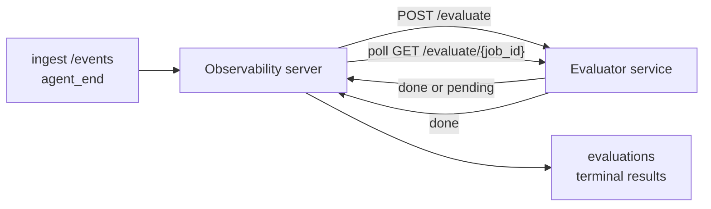

---
---
title: "مجموعة التقييم"
description: "يمكن لنظام Failproof AI Observability تقييم جودة كل تشغيل وكيل مكتمل تلقائياً: أنت توفر خدمة تقييم صغيرة، والنظام يتعامل مع الباقي."
---

يمكن لنظام Failproof AI Observability تقييم جودة كل تشغيل وكيل مكتمل تلقائياً: أنت توفر خدمة تقييم صغيرة، والنظام يتعامل مع الباقي. استخدمه لتتبع الأبعاد التي تهمك (المساعدة، كفاءة الأدوات، الدقة، الأمان؛ أنت تختار)، واكتشف الانحدارات مبكراً، وقارن الوكلاء أو البيئات بلمحة سريعة. التقييم اختياري: لا يفعل خط الأنابيب شيئاً حتى تعين `EVALUATOR_ENDPOINT` على الخادم.

> **ملاحظة:** أنت تحدد أبعاد النقاط. يمكن لمقيمك أن يرجع أي مفاتيح رقمية يريدها؛ يخزن النظام ويتابع ويعرض ما تعيده.

## نظرة عامة

1. **اكتب مسجل نقاط.** قم بإنشاء خدمة HTTP صغيرة تقرأ نسخة جلسة عمل وتعيد النقاط. يأتي نظام Observability مع مرجع عملي يمكنك نسخه. انظر [كتابة محيّم باستخدام SDK](#writing-an-evaluator-with-the-sdk).
2. **وجّه Observability إليه.** عين `EVALUATOR_ENDPOINT` (و`EVALUATOR_TOKEN` مشترك) على عملية الخادم.
3. **راقب النقاط تصل.** يتم تقييم كل جلسة مكتملة تلقائياً؛ تظهر النتائج على صفحة تفاصيل الجلسة وشبكة الجلسات ولوحات المعلومات المحفوظة.


*بمجرد تكوين المقيّم، يتم تقييم كل تشغيل مكتمل وتظهر النتائج في الشريط الأيمن للجلسة: الملخص في الأعلى، ثم أشرطة النقاط حسب البعد مع الاستدلال.*

---

## كيف يعمل



عندما يصدر Failproof AI Observability SDK حدث `agent_end` لجلسة، يجدول الخادم تقييماً. ثم يرسل نسخة الحدث الكاملة إلى خدمة التقييم الخاصة بك، والتي يمكنها إما:

- **إعادة النتيجة مباشرة** مع `{"status":"done", "scores":{...}, "reasoning":{...}, "summary":"..."}`. تُلحق النتيجة بجدول تقييم الجلسة. `reasoning` و`summary` اختيارية.
- **تأجيل** مع `{"status":"pending", "job_id":"abc-123"}`. ثم يستدعي Observability `GET {EVALUATOR_ENDPOINT}/evaluate/abc-123` حتى يعيد المقيّم `{"status":"done", ...}` أو `{"status":"error", "error":"..."}`.

  وتيرة الاستطلاع حسب الوظيفة: قد تتضمن استجابة `pending` `next_poll_secs` للتجاوز؛ وإلا يستخدم Observability قيمة `default_poll_interval_secs` من `GET /config`؛ أو قد يعود الخادم إلى `EVALUATOR_POLLING_INTERVAL_SECS` (الافتراضي 10s). جميع القيم مثبتة في [1s، 1h].

يمكن أيضاً التقاط الجلسات التي لا تصدر أبداً `agent_end` (على سبيل المثال، عملية وكيل معطلة): قد يعيد `GET /config` الخاص بالمقيّم `{"inactivity_timeout_secs": 1800}`، وسيقيّم Observability أي جلسة كانت خاملة لهذه المدة. اضبط الحقل على `null` أو حذفه لتعطيل هذا الخيار الاحتياطي.

خط الأنابيب لا يفعل شيئاً تماماً عندما لا يكون `EVALUATOR_ENDPOINT` معيناً.

يمكن لجلسة واحدة تجميع **تقييمات نهائية متعددة بمرور الوقت**: كل حدث `agent_end` (وكل إعادة تقييم يدوية من لوحة المعلومات) يُلحق صف تقييم طازج. هذه هي الطريقة المدعومة لتقييم محادثة مستأنفة: ينهي المستخدم وكيلاً، ويعود لاحقاً، يرسل مزيد من الأحداث، ينهي الوكيل مرة أخرى، ويتم تشغيل تقييم ثانٍ ضد نسخة محدثة كاملة. تعرض لوحة المعلومات أحدث تقييم كعنوان رئيسي والتقييمات السابقة كجدول زمني قابل للطي. بينما يعمل تقييم واحد لجلسة، يتم تجاهل أحداث `agent_end` الإضافية لتلك الجلسة؛ سيضع التالي بعد اكتمال التقييم الجاري في قائمة انتظار تقييم طازج كالمعتاد.

ينشط خيار الخمول الاحتياطي مرة أخرى على الجلسات المستأنفة أيضاً: إذا وصلت أحداث جديدة بعد تقييم نهائي سابق وذهبت الجلسة بعدها للخمول بعد `inactivity_timeout_secs`، يتم وضع تقييم طازج في قائمة الانتظار.

تتم إعادة محاولة الأعطال العابرة (5xx، 429، انتهاء الوقت، أخطاء الشبكة) مع التراجع الأسي حتى `EVALUATOR_MAX_ATTEMPTS`؛ استجابات 4xx نهائية. Failproof AI Observability آمن للتشغيل مع عدة مثيلات خادم موسعة أفقياً؛ يتم تقسيم العمل بحيث لا تُرسل نفس الجلسة مرتين في وقت واحد.

---

## العقد HTTP

يستخدم كل مسار مصرح به **مصادقة رمز Bearer**. يجب أن تكون نفس القيمة معينة على الجانبين:

- خادم Observability: متغير البيئة `EVALUATOR_TOKEN`
- خدمة المقيّم: معينة بنفس الطريقة (قراءات SDK `agenteye-evaluator` `EVALUATOR_TOKEN` بالاتفاقية)

إذا كان `EVALUATOR_TOKEN` غير معين، لا يرسل الخادم رأس `Authorization`؛ قد يقبل المقيّم بعد ذلك طلبات مجهولة، وهو أمر جيد لشبكة داخلية فقط ولكن لا يُنصح به على الإنترنت العام.

### المسارات التي يجب أن يخدمها المقيّم

| المسار | الجسم / المعاملات | الاستجابة |
|---|---|---|
| `GET /health` | لا شيء | `{"status":"ok"}` (مفتوح، بدون مصادقة) |
| `GET /config` | لا شيء | `{"inactivity_timeout_secs": <int> \| null, "default_poll_interval_secs": <int> \| omitted}` |
| `POST /evaluate` | JSON `EvalRequest` | `{"status":"done", ...}` أو `{"status":"pending", "job_id":"..."}` |
| `GET /evaluate/{id}` | لا شيء | نفس شكل الاستجابة مثل `/evaluate` |

### جسم `EvalRequest` الذي يرسله الخادم

```json
{
  "schema_version": "1",
  "session_id":     "session-abc123",
  "agent_id":       "planner",
  "environment":    "production",
  "started_at":     "2026-05-10T12:00:00Z",
  "ended_at":       "2026-05-10T12:05:00Z",
  "events": [
    { "id": 1234, "ts": "...", "event_type": "agent_start", "payload": { ... } },
    ...
  ]
}
```

### أشكال الاستجابة

**متزامن (منتهي):**

```json
{
  "status": "done",
  "scores": { "helpfulness": 0.85, "tool_efficiency": 0.6 },
  "reasoning": {
    "helpfulness": "answered the question directly with citations",
    "tool_efficiency": "called list_files three times when one would have done"
  },
  "summary": "strong answer quality, weak tool selection"
}
```

`reasoning` (خريطة تبرير لكل نقطة) و`summary` (سرد شامل) كلاهما اختياري. يجب أن تعكس المفاتيح في `reasoning` المفاتيح في `scores`؛ تعرض لوحة المعلومات كل إدخال مدمجاً تحت شريط نقاطه. المقيمون الأقدم الذين يعيدون `scores` فقط يستمرون في العمل بدون تغيير؛ ببساطة تقرأ `reasoning` و`summary` كـ null ويتم حذف أدوات واجهة المستخدم المقابلة.

**غير متزامن (مؤجل):**

```json
{ "status": "pending", "job_id": "abc-123", "next_poll_secs": 30 }
```

`next_poll_secs` اختياري؛ إذا تم حذفه يعود الخادم إلى `default_poll_interval_secs` الخاص بالمقيّم من `/config`، ثم إلى متغير البيئة `EVALUATOR_POLLING_INTERVAL_SECS` الخاص به.

**خطأ نهائي من جانب المقيّم:**

```json
{ "status": "error", "error": "model service unavailable" }
```

يتعامل الخادم مع أي جسم 2xx آخر كخطأ بروتوكول ويسجل `error` نهائي للجلسة.

---

## كتابة محيّم باستخدام SDK

لا يتعين عليك تطبيق العقد HTTP بيدك. توفر حزمة Python `agenteye-evaluator` غلاف FastAPI مكتوب يتعامل مع المصادقة والتوجيه وأشكال الطلب/الاستجابة لك.

يأتي Failproof AI Observability أيضاً مع **مقيّم مرجع عملي** يقيّم `helpfulness` و`tool_efficiency` و`factuality` من شكل النسخة. انسخه كنقطة بداية وبدّل بمنطقك الخاص: حكم LLM، محرك قواعد، أي شيء يناسب معيار الجودة الخاص بك.

الحد الأدنى من محيّم قابل للتطبيق:

```python
import os
from agenteye_evaluator import Evaluator, EvalRequest, EvalResponse

app = Evaluator(token=os.environ["EVALUATOR_TOKEN"])

@app.evaluator
def run(req: EvalRequest) -> EvalResponse:
    # Inspect req.events (the full session transcript) and return scores.
    tool_calls = sum(1 for e in req.events if e.event_type == "tool_use")
    return EvalResponse(
        scores={"tool_calls": float(tool_calls)},
        reasoning={"tool_calls": f"{tool_calls} tool invocations in the transcript"},
        summary="tight tool loop" if tool_calls < 5 else "agent looped on tools",
    )
```

يعمل مثيل `app` ضمن أي خادم ASGI، لذا `uvicorn module:app` يبدأها.

للمقيمين الذين يحتاجون لتأجيل العمل الثقيل، أعد `JobPending` بدلاً من ذلك وسجّل معالج `@app.job_lookup`؛ يستطلع خادم Observability `GET /evaluate/{job_id}` حتى تعيد حالة نهائية أو يمر غطاء `EVALUATOR_MAX_POLL_DURATION_SECS` (الافتراضي 1 ساعة).

يتم توثيق مرجع API الكامل والنمط غير المتزامن وخطة الحدث في ملف README الخاص بـ SDK `agenteye-evaluator`.

---

## تشغيل المقيّم الخاص بك

المقيّم هو **خدمتك** — لا يشحن Failproof AI Observability مقيّماً افتراضياً، لذا تبني وتشغيل حيث تشغيل خدماتك الخاصة. يعمل ضمن أي خادم ASGI (على سبيل المثال `uvicorn my_evaluator:app`؛ قدّم مسارات `/health` و`/config` و`/evaluate` من [العقد HTTP](#http-contract)، ثم وجّه الخادم إليه (انظر [تكوين الخادم](#configuring-the-server)).

بمجرد وصول المقيّم، يعيد `GET /health` `{"status":"ok"}`. بعد تشغيل وكيل من البداية إلى النهاية، يعيد `GET /evaluations` على الخادم صف مع `status: "done"` والنقاط التي أنتجها المقيّم.

---

## تكوين الخادم

اضبط على عملية الخادم:

| متغير البيئة | المعنى |
|---|---|
| `EVALUATOR_ENDPOINT` | عنوان URL الأساسي للمقيّم (`http://evaluator:9000`). غير معين = خط الأنابيب معطل. |
| `EVALUATOR_TOKEN` | رمز Bearer. يجب أن يساوي القيمة التي تم تكوين خدمة المقيّم بها. |
| `EVALUATOR_WORKERS` | مهام العامل لكل مثيل خادم (الافتراضي 2). |
| `EVALUATOR_CLAIM_BATCH` | الصفوف المطالب بها لكل تقدم عامل (الافتراضي 4). تتم معالجة الدفعات **بشكل متزامن**؛ التزامن الفعلي على نقطة نهاية المقيّم الخاصة بك هو `EVALUATOR_WORKERS × EVALUATOR_CLAIM_BATCH`. |
| `EVALUATOR_POLL_IDLE_SECS` | كم من الوقت ينام العامل بين محاولات الإرسال عندما لا يكون هناك تقييم مستحق (الافتراضي 2s). |
| `EVALUATOR_POLLING_INTERVAL_SECS` | الخيار الاحتياطي النهائي لوتيرة `GET /evaluate/{id}` عندما لا يكون `next_poll_secs` في الاستجابة ولا `default_poll_interval_secs` الخاص بالمقيّم معيناً (الافتراضي 10s). |
| `EVALUATOR_REQUEST_TIMEOUT_MS` | انتهاء الوقت لكل طلب (الافتراضي 30000). |
| `EVALUATOR_MAX_ATTEMPTS` | بعد هذا العدد من الأعطال العابرة يتم تسجيل النتيجة كـ `error` نهائي (الافتراضي 5). |
| `EVALUATOR_CONFIG_REFRESH_SECS` | وتيرة `GET /config` (الافتراضي 300). |
| `EVALUATOR_MAX_POLL_DURATION_SECS` | أقصى وقت جداري قد تبقى فيه الجلسة في قائمة الاستطلاع قبل إنهاؤها كـ `timeout` (الافتراضي 3600s). يحمي ضد مقيّم يستمر في إعادة `pending` للأبد. |

لتشغيل التقييم التلقائي، عيّن `EVALUATOR_ENDPOINT` و`EVALUATOR_TOKEN` على الخادم، ثم أعد تشغيله لالتقاط التغيير. مع عدم تعيين `EVALUATOR_ENDPOINT` يبقى خط الأنابيب بدون عملية.

أزرار التوليف أعلاه اختيارية؛ اضبط متغيرات البيئة المقابلة على الخادم فقط إذا كنت بحاجة لتجاوز الافتراضيات.

---

## مرجع API

| الطريقة | المسار | الإذن المطلوب | الغرض |
|---|---|---|---|
| `GET` | `/evaluations` | `evaluations:read` | النتائج النهائية للاستعلام. يدعم `session_id` و`agent_id` و`environment` و`status` (`done`/`error`/`timeout`) و`ts_from` و`ts_to` و`cursor` و`limit` و`score_filters` و`latest_per_session`. يكون `limit` افتراضياً 50 وهو محدود بـ 200 (لاحظ أن هذا يختلف عن `/events` الذي يحد 1000). يقبل `environment` قائمة مفصولة بفواصل (مثل `environment=prod,staging`); القيم المفردة تعمل أيضاً. مع `latest_per_session=true` تحتوي الاستجابة على صف واحد على الأكثر لكل `session_id` (الأحدث حسب `completed_at`) يستخدمه صفحة قائمة الجلسات لطي جدول الزمني لتقييم الجلسة إلى عنوانها الحالي. الافتراضي false (يعيد السجل الكامل). |
| `GET` | `/evaluations/aggregate` | `evaluations:read` | صحة التقييم المتراكمة لشريحة مفلترة: العدد الإجمالي وانهيار done/error/timeout وإحصائيات لكل مفتاح نقاط (count/avg/min/max/p50 على مفاتيح `scores` التعسفية) وجدول زمني موضوع زمنياً. يقبل **نفس معاملات الفلتر مثل `/evaluations`** بالإضافة إلى `featured_keys` (CSV من مفاتيح النقاط للمتابعة) و`latest_per_session`. يشغل ميزة لوحات المعلومات؛ المقاييس دقيقة على المجموعة المطابقة بالكامل وليست عينة. |
| `GET` | `/evaluations/environments` | `evaluations:read` | قيم البيئة المميزة من جدول `evaluations`. يستخدم لملء منخفضات الفلتر المحدودة لقراءة البيانات المتقيمة. |
| `GET` | `/evaluation-jobs` | `evaluations:read` | الرؤية إلى التقييمات قيد التشغيل. فلتر حسب `status` (`pending`/`polling`). |
| `GET` | `/events` | `events:read` | دفق أحداث الجلسة الخام. يدعم `session_id` و`agent_id` و`event_type` (CSV) و`environment` (CSV) و`ts_from` و`ts_to` و`cursor` و`limit` و`order`. `order` هو `desc` (الأحدث أولاً، الافتراضي) أو `asc` (الأقدم أولاً)؛ تعود القيمة غير المعروفة إلى `desc`. صفحة بمؤشر عبر `next_cursor` الاستجابة (معرف حدث): أعده كـ `cursor` للحصول على الصفحة التالية؛ مع `asc` الصفحة التالية هي الأحداث بعد ذلك المعرف، مع `desc` الأحداث قبله. يكون `limit` افتراضياً 50 وهو محدود بـ 1000. |
| `GET` | `/sessions/:session_id/export` | `events:read` | يعيد جسم JSON الدقيق الذي سيتلقاه المقيّم لهذه الجلسة، يُقدّم كمرفق قابل للتحميل باسم `session-<id>.json`. مفيد لإعادة تشغيل جلسات الإنتاج من خلال `agenteye-evaluator` للاختبار دون الاتصال. البايتات متطابقة بايت بما يرسله خط أنابيب المقيّم. |
| `POST` | `/sessions/:session_id/re-evaluate` | `evaluations:trigger` | ضع تقييماً طازجاً في قائمة انتظار الجلسة؛ يعمل سواء كان هناك تقييم سابق أم لا. يتم **إلحاق** النتيجة الجديدة بجدول الزمني لتقييم الجلسة بدلاً من الكتابة فوق النتيجة السابقة، لذا تبقى النقاط السابقة مرئية كسجل. يعيد `202` عند الوضع في قائمة الانتظار و`404` لجلسة غير معروفة و`409` إذا كان التقييم قيد التشغيل بالفعل. استخدم هذا بعد نشر مقيّم جديد أو للجلسات التي لم تصدر أبداً `agent_end`. |

### الفلترة حسب نطاق النقاط: `score_filters`

يقبل `GET /evaluations` معامل اختياري `score_filters` ينضق النتائج حسب القيم الرقمية داخل كائن `scores`. المعامل هو قائمة مفصولة بفواصل من إدخالات `key:min..max`؛ قد يتم حذف أي حد. تجمع إدخالات متعددة مع AND المنطقي. تُستبعد الصفوف حيث يكون المفتاح المسمى غائباً أو غير رقمي. قد يحمل الطلب 20 إدخال فلتر على الأكثر؛ تجاوز ذلك يعيد HTTP 400.

أمثلة:
```text
# helpfulness in [0.5, 0.8]
GET /evaluations?score_filters=helpfulness:0.5..0.8

# tool_efficiency at most 0.3 (no lower bound)
GET /evaluations?score_filters=tool_efficiency:..0.3

# helpfulness >= 0.5 AND factuality >= 0.9
GET /evaluations?score_filters=helpfulness:0.5..,factuality:0.9..
```

يحتوي كل كائن استجابة `/evaluations` على هذه الحقول:

| الحقل | النوع | الملاحظات |
|---|---|---|
| `evaluation_id` | string (UUID) | المعرف الأساسي لهذا التقييم النهائي. كل تقييم نهائي يحصل على UUID جديد؛ يمكن لجلسة واحدة أن تحتوي على عدة. |
| `id` | string (UUID) | اسم مستعار للتوافقية العكسية يحمل نفس القيمة مثل `evaluation_id`. |
| `session_id` | string | الجلسة التي تم تشغيل التقييم ضدها. يمكن لجلسة واحدة أن تحتوي على عدة تقييمات في الجدول الزمني. |
| `agent_id` | string | يعرّف الوكيل الذي أنتج الجلسة. |
| `environment` | string | تسمية البيئة المنسوخة من الجلسة. |
| `status` | enum | واحد من `"done"` و`"error"` و`"timeout"`. |
| `scores` | object \| null | النقاط المعادة بواسطة المقيّم. |
| `reasoning` | object \| null | خريطة تبرير اختيارية لكل نقطة معادة بواسطة المقيّم. عادة ما تعكس المفاتيح تلك في `scores`. تعرض لوحة المعلومات كل إدخال تحت شريط نقاطه. |
| `summary` | string \| null | سرد شامل اختياري من فقرة واحدة معاد بواسطة المقيّم. تعرض لوحة المعلومات هذا فوق انهيار النقاط كعنوان التقييم. |
| `error` | string \| null | معمول فقط على `"error"` / `"timeout"`. |
| `attempt_count` | integer | عدد محاولات الإرسال (≥ 1). |
| `duration_ms` | integer \| null | مدة المحاولة النهائية. |
| `completed_at` | string (ISO 8601 UTC) | عندما تم تسجيل النتيجة النهائية. يتم طلب النتائج حسب `completed_at` (الأحدث أولاً). |
| `created_at` | string (ISO 8601 UTC) | يحمل نفس الطابع الزمني مثل `completed_at` (دلالات الكتابة مرة واحدة). |

---

## الأذونات

| الإذن | يمنح |
|---|---|
| `evaluations:read` | قائمة نتائج التقييم وعرض النقاط في لوحة المعلومات وتحميل مقاييس صحة لوحة المعلومات. |
| `evaluations:trigger` | يدويات قائمة انتظار التقييم لجلسة عبر `POST /sessions/:session_id/re-evaluate` أو زر إعادة التقييم في لوحة المعلومات. |
| `dashboards:read` | عرض لوحات المعلومات المحفوظة (تحتاج أيضاً إلى `evaluations:read` لتحميل مقاييسها). |
| `dashboards:write` | إنشاء وتحرير لوحات المعلومات. |
| `dashboards:delete` | حذف لوحات المعلومات. |

يتلقى مسؤول التشغيل (`ADMIN_KEY` و`ADMIN_EMAIL`) تلقائياً هذه.

---

## عرض النتائج

- **`/sessions/<id>`**: جدول زمني الأحداث + شريط أيمن يعرض نقاط الجلسة وأي خطأ من محاولة الإرسال. إذا كان مفتاحك يحتوي على `evaluations:trigger`، تظهر زر **re-evaluate** بجانب زر التصدير، مفيد للجلسات التي لم تصدر أبداً `agent_end`، أو لتحديث النقاط بعد نشر مقيّم جديد. تستطلع لوحة المعلومات النتيجة الجديدة وتحدث الشريط الأيمن عند وصولها.
- **`/sessions`**: شبكة جلسة قابلة للفلترة؛ عمود النقاط يعرض حالة التقييم والنقاط لكل جلسة بلمحة سريعة.
- **`/dashboards`**: عروض صحة التقييم المحفوظة (انظر [لوحات المعلومات](#dashboards) أدناه).


*تعرض شبكة الجلسات حالة التقييم والنقاط لكل تشغيل بلمحة سريعة؛ تجعل الشارات الحمراء/الكهرمان/الخضراء النقاط المنخفضة تبرز.*

---

## لوحات المعلومات

تتيح صفحة **Dashboards** (`/dashboards`) حفظ مزيج من فلاتر التقييم كعرض مسمى وقابل لإعادة الاستخدام ومراقبة كيفية عمل تلك الشريحة من التقييمات بلمحة سريعة. يتم **مشاركة لوحات المعلومات عبر منظمتك بالكامل**؛ يرى الجميع الذين لديهم `dashboards:read` نفس المجموعة.

كل لوحة تدبّس:

- **Filters**: نفس التحكم مثل صفحة الجلسات: البيئة والحالة والوكيل وإطار زمني متدحرج وفلاتر نطاق النقاط (`key:min..max`).
- **تكوين عرض**: مفاتيح النقاط المراد عرضها وعتبات الصحة الخضراء/الكهرمان/الحمراء وألواح الاعتماد وما إذا كان يجب الطي إلى أحدث تقييم لكل جلسة.

يعرض كل بطاقة عدد الجلسات المطابقة وانهيار done/error/timeout ومتوسط كل نقطة مميزة وشريط اتجاه صغير. فتح لوحة المعلومات يعرض الألواح بحجم كامل؛ **"open in sessions"** ينقلك إلى صفحة الجلسات مع تصفية مسبقة لتلك الشريحة بالضبط. تُحسب المقاييس على جانب الخادم على المجموعة المطابقة بالكامل (عبر `GET /evaluations/aggregate`)، لذا تكون الأرقام دقيقة بدلاً من أخذ عينات.


**الأذونات:** العرض يحتاج إلى `dashboards:read` و`evaluations:read` معاً؛ الإنشاء والتحرير يحتاج إلى `dashboards:write`؛ الحذف يحتاج إلى `dashboards:delete`. يتلقى مسؤول التشغيل كل هذا تلقائياً.

---

## استكشاف الأخطاء والإصلاح

**الجلسات موجودة لكن لا تُنشأ تقييمات.** أكد أن `EVALUATOR_ENDPOINT` معين على عملية الخادم وأن الخادم والمقيّم يشاركان نفس قيمة `EVALUATOR_TOKEN` وأن نقطة نهاية `/health` الخاصة بالمقيّم قابلة للوصول من الخادم. مع عدم تعيين `EVALUATOR_ENDPOINT` خط الأنابيب بدون عملية.

**تراكم التقييمات قيد التشغيل.** استعلم `GET /evaluation-jobs` لرؤية قائمة الانتظار قيد التشغيل. افحص `attempt_count` و`next_attempt_at` و`last_error` على كل صف. الأسباب الشائعة: خدمة المقيّم غير قابلة للوصول أو ترجع 5xx (إعادة محاولة مع التراجع) و`EVALUATOR_TOKEN` خاطئ (401 نهائي) أو مقيّم غير متزامن يعيد `pending` إلى الأبد (انظر أدناه).

**جلسات مكتملة لكن لا تقييم نهائي.** استعلم `GET /evaluation-jobs?status=polling`؛ قد تكون النتيجة لا تزال قيد التشغيل. إذا توقفت وظيفة في `pending`، يواجه الخادم مشكلة في الوصول إلى المقيّم؛ تحقق من أن المقيّم مشغل وأن `EVALUATOR_TOKEN` يطابق.

**`HTTP 401 from evaluator: invalid bearer token`.** لا يتطابق `EVALUATOR_TOKEN` على الخادم مع القيمة التي يتم تكوين خدمة المقيّم بها. يجب أن تكون متطابقة.

**المقيّم غير المتزامن يعيد `pending` للأبد.** يستطلع الخادم `GET /evaluate/{job_id}` حتى يعيد المقيّم `done` أو `error`، أو حتى يمر غطاء `EVALUATOR_MAX_POLL_DURATION_SECS` (الافتراضي 1 ساعة). بعد الغطاء يتم تسجيل التقييم كـ `timeout` وإزالته من قائمة التشغيل. ارفع `EVALUATOR_MAX_POLL_DURATION_SECS` إذا كان المقيّم الخاص بك يحتاج بشكل شرعي إلى أطول من الافتراضي.

---

## الخطوات التالية

- [مهارة وكيل المحيّم](/ar/agenteye/evaluator-skill): اجعل وكيل الترميز يصمم أبعادك ضد جلسات حقيقية وينشئ هذه الخدمة لك.
- [Python SDK](/ar/agenteye/python-sdk): صدّر أحداث `agent_end` التي تشغل التقييم.
- [مفاتيح API](/ar/agenteye/api-keys): الأذونات `evaluations:read` و`evaluations:trigger`.
- [التدقيقات](/ar/agenteye/audits): ميزة جودة Failproof AI Observability الأخرى المؤتمتة لمراجعة قائمة على السياسات.