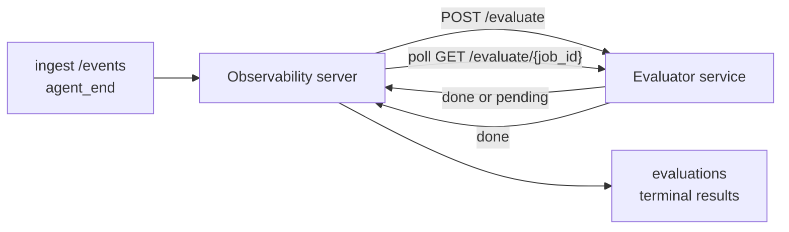

يمكن لـ Failproof AI Observability تسجيل كل عملية تشغيل وكيل منتهية تلقائياً من حيث الجودة: أنت توفر خدمة تسجيل صغيرة، والمراقبة تتولى الباقي. استخدمها لتتبع الأبعاد التي تهمك (الفائدة، كفاءة الأداة، الدقة، الأمان؛ اختيارك)، اكتشف الانحدارات مبكراً، وقارن الوكلاء أو البيئات في لمحة واحدة. التسجيل اختياري: لا يفعل خط الأنابيب شيئاً حتى تعين `EVALUATOR_ENDPOINT` على الخادم.

> **ملاحظة:** أنت تحدد أبعاد التسجيل. يمكن لمُقيِّمك أن يعيد أي مفاتيح رقمية يريدها؛ تخزن المراقبة وتتابع وتعرض أي شيء ترسله.

## في لمحة

1. **اكتب مُسجّل.** قم بإعداد خدمة HTTP صغيرة تقرأ نص جلسة وتعيد تسجيلات. تأتي Observability مع مرجع عملي يمكنك نسخه. انظر [كتابة مُقيِّم باستخدام SDK](#كتابة-مُقيِّم-باستخدام-sdk).
2. **وجّه Observability إليه.** عيّن `EVALUATOR_ENDPOINT` (و`EVALUATOR_TOKEN` مشترك) على عملية الخادم.
3. **راقب التسجيلات تصل.** كل جلسة منتهية يتم تسجيلها تلقائياً؛ النتائج تظهر على صفحة تفاصيل الجلسة، شبكة الجلسات، وصحف المعلومات المحفوظة.


*بمجرد تكوين مُقيِّم، كل تشغيل منتهى يتم تسجيله والنتائج تظهر في العارضة اليمنى للجلسة: الملخص في الأعلى، ثم أشرطة النقاط حسب البعد مع الاستدلال.*

---

## كيفية العمل



عندما تصدر Failproof AI Observability SDK حدث `agent_end` لجلسة، يجدول الخادم تقييماً. ثم يرسل نص الحدث الكامل إلى خدمة المُقيِّم الخاصة بك، والتي يمكنها إما:

- **إرجاع النتيجة مباشرة** مع `{"status":"done", "scores":{...}, "reasoning":{...}, "summary":"..."}`. تُلحق النتيجة بجدول زمني التقييم للجلسة. `reasoning` و`summary` اختياريان.
- **تأجيل** مع `{"status":"pending", "job_id":"abc-123"}`. ثم تستدعي Observability `GET {EVALUATOR_ENDPOINT}/evaluate/abc-123` حتى يعيد المُقيِّم الخاص بك `{"status":"done", ...}` أو `{"status":"error", "error":"..."}`.

  الإيقاع الاستقصائي لكل وظيفة: قد تتضمن استجابة `pending` 
  `next_poll_secs` للتجاوز؛ وإلا فإن Observability تستخدم قيمة 
  `default_poll_interval_secs` من `GET /config`؛ وإلا يعود الخادم إلى 
  `EVALUATOR_POLLING_INTERVAL_SECS` (الافتراضي 10 ثانية). جميع القيم 
  مضبوطة على [1 ثانية، 1 ساعة].

الجلسات التي لا تصدر أبداً `agent_end` (على سبيل المثال، عملية وكيل محطمة) يمكن أيضاً التقاطها: قد يعيد `GET /config` للمُقيِّم `{"inactivity_timeout_secs": 1800}`، وستقيّم Observability أي جلسة ظلت في وضع الخمول لتلك المدة. عيّن الحقل إلى `null` أو احذفه لتعطيل هذا البديل.

خط الأنابيب بالكامل لا عملية عندما يكون `EVALUATOR_ENDPOINT` غير معين.

يمكن للجلسة تجميع **تقييمات محطات متعددة عبر الوقت**: كل حدث `agent_end` (وكل إعادة تقييم يدوية من لوحة المعلومات) يلحق صف تقييم جديد. هذه هي الطريقة المدعومة لتقييم محادثة مستأنفة: ينهي المستخدم وكيلاً، يعود لاحقاً، يرسل المزيد من الأحداث، ينهي الوكيل مرة أخرى، وينفذ تقييم ثانٍ ضد النص المحدّث الكامل. تعرض لوحة المعلومات أحدث تقييم كعنوان رئيسي والتقييمات السابقة كجدول زمني قابل للطي. بينما تعمل تقييم واحد لجلسة، يتم تجاهل أحداث `agent_end` الإضافية لتلك الجلسة؛ الحدث التالي بعد انتهاء التقييم الجاري سيصف تقييماً جديداً كالمعتاد.

يعاود الاختيار الاحتياطي للخمول الاشتراك أيضاً في الجلسات المستأنفة: إذا وصلت أحداث جديدة بعد تقييم محطة سابق وذهبت الجلسة بعد ذلك في وضع الخمول الماضي `inactivity_timeout_secs`، يتم صفوف تقييم جديد.

تُعاد محاولة الإخفاقات العابرة (5xx، 429، انتهاء المهلة الزمنية، أخطاء الشبكة) مع التراجع الأسي حتى `EVALUATOR_MAX_ATTEMPTS`؛ استجابات 4xx محطة. Observability آمنة للتشغيل مع عدة حالات خادم مقسمة أفقياً؛ يتم تقسيم العمل بحيث لا يتم أبداً إرسال الجلسة نفسها مرتين في وقت واحد.

---

## عقد HTTP

كل مسار موثق يستخدم **مصادقة رمز الحامل**. يجب أن تكون نفس القيمة مُكوّنة على كلا الجانبين:

- خادم Observability: متغير البيئة `EVALUATOR_TOKEN`
- خدمة المُقيِّم: مُكوّنة بنفس الطريقة (يقرأ SDK `agenteye-evaluator` `EVALUATOR_TOKEN` بالاتفاقية)

إذا كان `EVALUATOR_TOKEN` غير معين، الخادم لا يرسل رأس `Authorization`؛ المُقيِّم قد يقبل بعد ذلك طلبات مجهولة، وهو جيد لشبكة داخلية فقط ولكن غير مشجع على الإنترنت العام.

### المسارات التي يجب على المُقيِّم تقديمها

| المسار | الجسم / المعاملات | الاستجابة |
|---|---|---|
| `GET /health` | لا أحد | `{"status":"ok"}` (مفتوح، بدون مصادقة) |
| `GET /config` | لا أحد | `{"inactivity_timeout_secs": <int> \| null, "default_poll_interval_secs": <int> \| omitted}` |
| `POST /evaluate` | JSON `EvalRequest` | `{"status":"done", ...}` أو `{"status":"pending", "job_id":"..."}` |
| `GET /evaluate/{id}` | لا أحد | نفس شكل الاستجابة مثل `/evaluate` |

### جسم `EvalRequest` الذي يرسله الخادم

```json
{
  "schema_version": "1",
  "session_id":     "session-abc123",
  "agent_id":       "planner",
  "environment":    "production",
  "started_at":     "2026-05-10T12:00:00Z",
  "ended_at":       "2026-05-10T12:05:00Z",
  "events": [
    { "id": 1234, "ts": "...", "event_type": "agent_start", "payload": { ... } },
    ...
  ]
}
```

### أشكال الاستجابة

**متزامن (منتهي):**

```json
{
  "status": "done",
  "scores": { "helpfulness": 0.85, "tool_efficiency": 0.6 },
  "reasoning": {
    "helpfulness": "answered the question directly with citations",
    "tool_efficiency": "called list_files three times when one would have done"
  },
  "summary": "strong answer quality, weak tool selection"
}
```

`reasoning` (خريطة تبرير لكل نقطة) و`summary` (سرد عام في فقرة واحدة) كلاهما اختياري. يجب أن تعكس المفاتيح في `reasoning` المفاتيح في `scores`؛ تعرض لوحة المعلومات كل إدخال مضمناً تحت شريط النقاط الخاص به. المُقيِّمون الأقدم الذين يعيدون فقط `scores` يستمرون في العمل دون تغيير؛ `reasoning` و`summary` ببساطة يقرآن كـ null والقدرات المتطابقة من واجهة المستخدم محذوفة.

**غير متزامن (مؤجل):**

```json
{ "status": "pending", "job_id": "abc-123", "next_poll_secs": 30 }
```

`next_poll_secs` اختياري؛ إذا كان محذوفاً يعود الخادم إلى `default_poll_interval_secs` للمُقيِّم من `/config`، ثم إلى متغير البيئة `EVALUATOR_POLLING_INTERVAL_SECS` الخاص به.

**خطأ محطة من جانب المُقيِّم:**

```json
{ "status": "error", "error": "model service unavailable" }
```

يعامل الخادم أي جسم 2xx آخر كخطأ بروتوكول ويسجل `error` محطة للجلسة.

---

## كتابة مُقيِّم باستخدام SDK

لا تضطر إلى تنفيذ عقد HTTP بيدك. حزمة Python `agenteye-evaluator` توفر لك غلافاً FastAPI مُكتبة بأنواع يتعامل مع المصادقة والتوجيه وأشكال الطلب/الاستجابة لك.

Failproof AI Observability أيضاً تأتي مع **مُقيِّم مرجعي عملي** يسجل `helpfulness` و`tool_efficiency` و`factuality` من شكل النص. انسخها كنقطة بداية وبدّل في منطقك الخاص: قاضٍ LLM، محرك قواعد، أي شيء يناسب معايير جودتك.

أدنى حد من مُقيِّم قابل للتطبيق:

```python
import os
from agenteye_evaluator import Evaluator, EvalRequest, EvalResponse

app = Evaluator(token=os.environ["EVALUATOR_TOKEN"])

@app.evaluator
def run(req: EvalRequest) -> EvalResponse:
    # Inspect req.events (the full session transcript) and return scores.
    tool_calls = sum(1 for e in req.events if e.event_type == "tool_use")
    return EvalResponse(
        scores={"tool_calls": float(tool_calls)},
        reasoning={"tool_calls": f"{tool_calls} tool invocations in the transcript"},
        summary="tight tool loop" if tool_calls < 5 else "agent looped on tools",
    )
```

تعمل الحالة `app` تحت أي خادم ASGI، لذلك `uvicorn module:app` يبدأها.

بالنسبة للمُقيِّمين الذين يحتاجون إلى تأجيل عمل مكلف، أعِد `JobPending` بدلاً من ذلك وسجل معالج `@app.job_lookup`؛ خادم Observability يستقصي `GET /evaluate/{job_id}` حتى تعيد حالة محطة أو تنقضي سقف `EVALUATOR_MAX_POLL_DURATION_SECS` (الافتراضي 1 ساعة).

المرجع الكامل للـ API والنمط غير المتزامن ومخطط الحدث موثقة في README SDK `agenteye-evaluator`.

---

## تشغيل المُقيِّم الخاص بك

المُقيِّم هو **خدمتك** — Failproof AI Observability لا تأتي بمُقيِّم افتراضي، لذلك تبنيه وتشغله حيث تشغل خدماتك الخاصة. يعمل تحت أي خادم ASGI (على سبيل المثال `uvicorn my_evaluator:app`؛ قدّم المسارات `/health` و`/config` و`/evaluate` من [عقد HTTP](#عقد-http)، ثم وجّه الخادم إليه (انظر [تكوين الخادم](#تكوين-الخادم)).

بمجرد أن يكون المُقيِّم قابلاً للوصول، `GET /health` يعيد `{"status":"ok"}`. بعد أن يعمل وكيل من البداية إلى النهاية، `GET /evaluations` على الخادم يعيد صفاً مع `status: "done"` والنقاط التي أنتجها المُقيِّم الخاص بك.

---

## تكوين الخادم

عيّن على عملية الخادم:

| متغير البيئة | المعنى |
|---|---|
| `EVALUATOR_ENDPOINT` | URL الأساسي للمُقيِّم (`http://evaluator:9000`). غير معين = خط الأنابيب معطّل. |
| `EVALUATOR_TOKEN` | رمز الحامل. يجب أن تساوي القيمة التي مُكوّن بها خدمة المُقيِّم. |
| `EVALUATOR_WORKERS` | مهام العامل لكل مثيل خادم (الافتراضي 2). |
| `EVALUATOR_CLAIM_BATCH` | الصفوف المطالب بها لكل تكة عامل (الافتراضي 4). تعالج الدفعات **بالتزامن**؛ التزامن الفعلي على نقطة نهاية المُقيِّم الخاصة بك هو `EVALUATOR_WORKERS × EVALUATOR_CLAIM_BATCH`. |
| `EVALUATOR_POLL_IDLE_SECS` | كم من الوقت ينام العامل بين محاولات التوزيع عندما لا يكون أي تقييم مستحقاً (الافتراضي 2 ثانية). |
| `EVALUATOR_POLLING_INTERVAL_SECS` | الرجوع النهائي لإيقاع `GET /evaluate/{id}` عندما لا يكون `next_poll_secs` لكل استجابة ولا `default_poll_interval_secs` للمُقيِّم معيناً (الافتراضي 10 ثواني). |
| `EVALUATOR_REQUEST_TIMEOUT_MS` | انتهاء المهلة الزمنية لكل طلب (الافتراضي 30000). |
| `EVALUATOR_MAX_ATTEMPTS` | بعد هذا العديد من الإخفاقات العابرة يتم تسجيل النتيجة كـ `error` محطة (الافتراضي 5). |
| `EVALUATOR_CONFIG_REFRESH_SECS` | إيقاع `GET /config` (الافتراضي 300). |
| `EVALUATOR_MAX_POLL_DURATION_SECS` | الحد الأقصى من وقت الجدار الحقيقي قد تبقى جلسة في طابور الاستقصاء قبل أن تُنهى كـ `timeout` (الافتراضي 3600 ثانية). يحرس ضد مُقيِّم يستمر في إعادة `pending` إلى الأبد. |

لتشغيل التسجيل التلقائي، عيّن كلاً من `EVALUATOR_ENDPOINT` و`EVALUATOR_TOKEN` على الخادم، ثم أعِد تشغيله لالتقاط التغيير. مع `EVALUATOR_ENDPOINT` غير معين يبقى خط الأنابيب لا عملية.

أزرار الضبط أعلاه اختيارية؛ عيّن متغيرات البيئة المطابقة على الخادم فقط إذا كنت بحاجة إلى تجاوز الافتراضيات.

---

## مرجع API

| الطريقة | المسار | الإذن المطلوب | الغرض |
|---|---|---|---|
| `GET` | `/evaluations` | `evaluations:read` | نتائج محطة الاستعلام. يدعم `session_id` و`agent_id` و`environment` و`status` (`done`/`error`/`timeout`) و`ts_from` و`ts_to` و`cursor` و`limit` و`score_filters` و`latest_per_session`. `limit` الافتراضي 50 ومحدود عند 200 (لاحظ أن هذا يختلف عن `/events` الذي يحدد عند 1000). `environment` يقبل قائمة مفصولة بفاصلة (مثل `environment=prod,staging`)؛ القيم الفردية تعمل أيضاً. مع `latest_per_session=true` تحتوي الاستجابة على صف واحد على الأكثر لكل `session_id` (الأحدث بواسطة `completed_at`) يستخدمه صفحة قائمة الجلسات لطي جدول زمني التقييم للجلسة إلى عنوانها الحالي. الافتراضي false (يعيد السجل الكامل). |
| `GET` | `/evaluations/aggregate` | `evaluations:read` | صحة تقييم مجموعة لشريحة مُصفاة: العدد الإجمالي، انقسام done/error/timeout، إحصائيات لكل مفتاح نقطة (عدد/متوسط/دقيقة/أقصى/p50 على مفاتيح `scores` التعسفية)، وجدول زمني مقسم حسب الوقت. يقبل **نفس معاملات الفلتر مثل `/evaluations`** بالإضافة إلى `featured_keys` (CSV لمفاتيح النقاط للتتبع) و`latest_per_session`. تشغيل ميزة لوحات المعلومات؛ المقاييس دقيقة على المجموعة المطابقة بأكملها، غير مأخوذة عينات. |
| `GET` | `/evaluations/environments` | `evaluations:read` | قيم البيئة المتميزة من جدول `evaluations`. تُستخدم لملء القوائم المنسدلة للفلتر ذات الحدود للبيانات القابلة للقراءة بالتقييمات. |
| `GET` | `/evaluation-jobs` | `evaluations:read` | الرؤية إلى التقييمات قيد الرحلة. الفلتر بواسطة `status` (`pending`/`polling`). |
| `GET` | `/events` | `events:read` | جدول أحداث الجلسة الخام. يدعم `session_id` و`agent_id` و`event_type` (CSV) و`environment` (CSV) و`ts_from` و`ts_to` و`cursor` و`limit` و`order`. `order` هو `desc` (الأحدث أولاً، الافتراضي) أو `asc` (الأقدم أولاً)؛ قيمة غير معروفة تعود إلى `desc`. استقصِ عبر `next_cursor` الاستجابة (معرّف حدث): مرّره كـ `cursor` للحصول على الصفحة التالية؛ مع `asc` الصفحة التالية هي الأحداث بعد هذا المعرّف، مع `desc` الأحداث قبله. `limit` الافتراضي 50 ومحدود عند 1000. |
| `GET` | `/sessions/:session_id/export` | `events:read` | يعيد جسم JSON الدقيق الذي سيستقبله المُقيِّم لهذه الجلسة، مُقدم كمرفق قابل للتنزيل باسم `session-<id>.json`. مفيد لإعادة تشغيل جلسات الإنتاج عبر `agenteye-evaluator` لاختبار بلا اتصال. البايتات متطابقة البايتات مع ما يرسله خط أنابيب المُقيِّم. |
| `POST` | `/sessions/:session_id/re-evaluate` | `evaluations:trigger` | صفوف تقييم جديد لجلسة؛ يعمل سواء كان التقييم السابق موجوداً أم لا. النتيجة الجديدة **ملحقة** بجدول زمني التقييم للجلسة بدلاً من الكتابة فوق السابق، لذلك تبقى النقاط السابقة مرئية كسجل. يعيد `202` عند الصفوف، `404` لجلسة غير معروفة، `409` إذا كان التقييم قيد الرحلة بالفعل. استخدم هذا بعد نشر مُقيِّم جديد، أو للجلسات التي لم تصدر أبداً `agent_end`. |

### الفلتر حسب نطاق النقاط: `score_filters`

`GET /evaluations` يقبل معامل `score_filters` اختياري يضيّق النتائج حسب القيم الرقمية داخل كائن `scores`. المعامل قائمة مفصولة بفاصلة من إدخالات `key:min..max`؛ قد يُحذف كلا الحدين. تجمع الإدخالات المتعددة مع AND منطقي. يتم استثناء الصفوف حيث يكون المفتاح المسمى غائباً أو غير رقمي. قد تحمل الطلب على الأكثر 20 إدخال فلتر؛ تجاوز ذلك يعيد HTTP 400.

أمثلة:
```text
# helpfulness in [0.5, 0.8]
GET /evaluations?score_filters=helpfulness:0.5..0.8

# tool_efficiency at most 0.3 (no lower bound)
GET /evaluations?score_filters=tool_efficiency:..0.3

# helpfulness >= 0.5 AND factuality >= 0.9
GET /evaluations?score_filters=helpfulness:0.5..,factuality:0.9..
```

كل كائن استجابة `/evaluations` له هذه الحقول:

| الحقل | النوع | الملاحظات |
|---|---|---|
| `evaluation_id` | string (UUID) | المعرّف القياسي لهذا التقييم المحطة. يحصل كل تقييم محطة على UUID جديد؛ جلسة واحدة يمكن أن تحمل تقييمات متعددة. |
| `id` | string (UUID) | اسم مستعار للتوافقية للخلف يحمل نفس القيمة مثل `evaluation_id`. |
| `session_id` | string | الجلسة التي أُجري عليها هذا التقييم. جلسة واحدة قد تحتوي على تقييمات متعددة في الجدول الزمني. |
| `agent_id` | string | يحدد الوكيل الذي أنتج الجلسة. |
| `environment` | string | تسمية البيئة المنسوخة من الجلسة. |
| `status` | enum | واحد من `"done"` و`"error"` و`"timeout"`. |
| `scores` | object \| null | النقاط التي أعادها المُقيِّم الخاص بك. |
| `reasoning` | object \| null | خريطة تبرير اختيارية لكل نقطة أعادها المُقيِّم الخاص بك. المفاتيح عادة تعكس تلك في `scores`. تعرض لوحة المعلومات كل إدخال تحت شريط النقاط الخاص به. |
| `summary` | string \| null | سرد عام اختياري في فقرة واحدة أعاده المُقيِّم الخاص بك. تعرض لوحة المعلومات هذا فوق انقسام النقاط المتفردة كعنوان التقييم. |
| `error` | string \| null | مأهول على `"error"` / `"timeout"` فقط. |
| `attempt_count` | integer | عدد محاولات التوزيع (≥ 1). |
| `duration_ms` | integer \| null | مدة المحاولة النهائية. |
| `completed_at` | string (ISO 8601 UTC) | عندما تم تسجيل النتيجة المحطة. يتم الطلب على النتائج بواسطة `completed_at` (الأحدث أولاً). |
| `created_at` | string (ISO 8601 UTC) | يحمل نفس الطابع الزمني مثل `completed_at` (دلالة الكتابة مرة واحدة). |

---

## الأذونات

| الإذن | المنح |
|---|---|
| `evaluations:read` | قائمة نتائج التقييم، عرض النقاط في لوحة المعلومات، وتحميل مقاييس صحة لوحة المعلومات. |
| `evaluations:trigger` | صفوف تقييم يدوي لجلسة عبر `POST /sessions/:session_id/re-evaluate` أو زر إعادة التقييم في لوحة المعلومات. |
| `dashboards:read` | عرض لوحات المعلومات المحفوظة (يحتاج أيضاً إلى `evaluations:read` لتحميل مقاييسها). |
| `dashboards:write` | إنشاء وتحرير لوحات المعلومات. |
| `dashboards:delete` | حذف لوحات المعلومات. |

يحصل المشرف الأولي (`ADMIN_KEY` و`ADMIN_EMAIL`) تلقائياً على هذه.

---

## عرض النتائج

- **`/sessions/<id>`**: جدول زمني الأحداث + عارضة يمنى تعرض نقاط الجلسة وأي خطأ من محاولة التوزيع. إذا كان مفتاحك يحتوي على `evaluations:trigger`، يظهر زر **إعادة تقييم** بجانب زر التصدير، مفيد للجلسات التي لم تصدر أبداً `agent_end`، أو لتحديث النقاط بعد نشر مُقيِّم جديد. تستقصي لوحة المعلومات النتيجة الجديدة وتحدث العارضة اليمنى عند وصولها.
- **`/sessions`**: شبكة جلسة مُصفاة؛ عمود النقاط يعرض حالة تقييم كل جلسة والنقاط في لمحة واحدة.
- **`/dashboards`**: آراء صحة تقييم محفوظة (انظر [لوحات المعلومات](#لوحات-المعلومات) أدناه).


*تعرض شبكة الجلسات حالة تقييم كل جلسة والنقاط في لمحة واحدة؛ تجعل الأوسمة الحمراء/البرتقالية/الخضراء النقاط المنخفضة تبرز.*

---

## لوحات المعلومات

صفحة **لوحات المعلومات** (`/dashboards`) تسمح لك بحفظ مزيج من فلاتر التقييم كعرض مسمى وقابل لإعادة الاستخدام والمراقبة كيفية قيام تلك الشريحة من التقييمات في لمحة واحدة. لوحات المعلومات **مشتركة عبر منظمتك الكاملة**؛ يرى الجميع مع `dashboards:read` نفس المجموعة.

كل لوحة معلومات تثبت:

- **الفلاتر**: نفس التحكم مثل صفحة الجلسات: البيئة والحالة والوكيل ونافذة زمنية متداول وفلاتر نطاق النقاط (`key:min..max`).
- **تكوين العرض**: مفاتيح النقاط للعمل، عتبات الصحة الأخضر/البرتقالي/الأحمر، الألواح المراد عرضها، وما إذا كان يجب الطي إلى أحدث تقييم لكل جلسة.

كل بطاقة تعرض عدد الجلسات المطابقة وانقسام done/error/timeout ومتوسط كل نقطة عمل وخط بياني صغير للاتجاهات. فتح لوحة معلومات تعرض الألواح كاملة الحجم؛ **افتح في الجلسات** يسقطك في صفحة الجلسات مُصفاة مسبقاً إلى تلك الشريحة بالضبط. يتم حساب المقاييس من جانب الخادم على المجموعة المطابقة بأكملها (عبر `GET /evaluations/aggregate`)، لذلك الأرقام دقيقة بدلاً من مأخوذة عينات.


**الأذونات:** العرض يحتاج إلى كل من `dashboards:read` و`evaluations:read`؛ الإنشاء والتحرير يحتاج إلى `dashboards:write`؛ الحذف يحتاج إلى `dashboards:delete`. يحصل المشرف الأولي على كل هذه تلقائياً.

---

## استكشاف الأخطاء

**الجلسات موجودة لكن لا يتم إنشاء تقييمات.** أكّد أن `EVALUATOR_ENDPOINT` معين على عملية الخادم، وأن الخادم والمُقيِّم يتشاركان نفس قيمة `EVALUATOR_TOKEN`، وأن نقطة نهاية `/health` للمُقيِّم قابلة للوصول من الخادم. مع `EVALUATOR_ENDPOINT` غير معين خط الأنابيب لا عملية.

**التقييمات قيد الرحلة تتراكم.** استعلم `GET /evaluation-jobs` لترى قائمة الانتظار قيد الرحلة. افحص `attempt_count` و`next_attempt_at` و`last_error` على كل صف. الأسباب الشائعة: خدمة المُقيِّم غير قابلة للوصول أو إرجاع 5xx (أعيدت محاولتها مع التراجع)، `EVALUATOR_TOKEN` خاطئ (401 محطة)، أو مُقيِّم غير متزامن يعيد `pending` إلى الأبد (انظر أدناه).

**الجلسات اكتملت لكن لا تقييم محطة.** استعلم `GET /evaluation-jobs?status=polling`؛ قد تظل النتيجة قيد الرحلة. إذا كانت وظيفة عالقة في `pending`، يواجه الخادم مشاكل في الوصول إلى المُقيِّم؛ تحقق من أن المُقيِّم مُشغّل وأن `EVALUATOR_TOKEN` يطابق.

**`HTTP 401 من المُقيِّم: رمز حامل غير صالح`.** `EVALUATOR_TOKEN` على الخادم لا يطابق القيمة التي مُكوّن بها خدمة المُقيِّم. يجب أن تكون متطابقة.

**المُقيِّم غير المتزامن يعيد `pending` إلى الأبد.** يستقصي الخادم `GET /evaluate/{job_id}` حتى يعيد المُقيِّم `done` أو `error`، أو حتى تنقضي `EVALUATOR_MAX_POLL_DURATION_SECS` (الافتراضي 1 ساعة). بعد السقف يتم تسجيل التقييم كـ `timeout` وإزالته من قائمة الانتظار قيد الرحلة. ارفع `EVALUATOR_MAX_POLL_DURATION_SECS` إذا كان مُقيِّمك بحاجة شرعية إلى أطول من الافتراضي.

---

## الخطوات التالية

- [مهارة وكيل المُقيِّم](/ar/agenteye/evaluator-skill): اجعل وكيل ترميز يصمم أبعادك ضد جلسات حقيقية ويبني هذه الخدمة لك.
- [SDK Python](/ar/agenteye/python-sdk): أصدر أحداث `agent_end` التي تُطلق التسجيل.
- [مفاتيح API](/ar/agenteye/api-keys): أذونات `evaluations:read` و`evaluations:trigger`.
- [التدقيقات](/ar/agenteye/audits): ميزة جودة مؤتمتة أخرى لـ Observability، لمراجعة مستندة على السياسة.