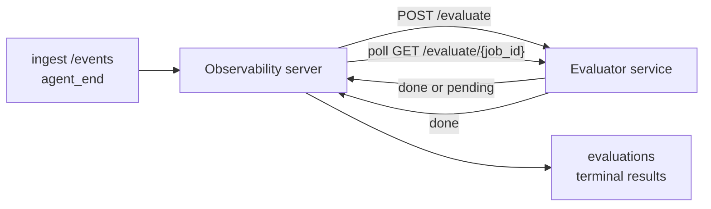

يمكن لـ Failproof AI Observability تسجيل كل تشغيل وكيل منتهٍ تلقائياً من حيث الجودة: أنت توفر خدمة تسجيل صغيرة، و Observability يتعامل مع الباقي. استخدمها لتتبع الأبعاد التي تهمك (الفائدة، كفاءة الأدوات، دقة الحقائق، الأمان؛ أنت من تختار)، التقط الانحدارات مبكراً، وقارن بين الوكلاء أو البيئات بنظرة واحدة. التسجيل اختياري: لا يفعل المسار شيئاً حتى تعين `EVALUATOR_ENDPOINT` على الخادم.

> **ملاحظة:** أنت تحدد أبعاد التسجيل. يمكن لمقيّمك إرجاع أي مفاتيح رقمية يفضلها؛ يخزن Observability ويرسم البيانات ويعرض كل ما تعيده.

## نظرة عامة

1. **اكتب محقق الجودة.** أنشئ خدمة HTTP صغيرة تقرأ نص جلسة وترجع التقييمات. يأتي Observability مع مرجع عملي يمكنك نسخه. انظر [كتابة مقيّم باستخدام SDK](#writing-an-evaluator-with-the-sdk).
2. **وجّه Observability إليه.** عيّن `EVALUATOR_ENDPOINT` (و`EVALUATOR_TOKEN` مشترك) على عملية الخادم.
3. **راقب التقييمات.** يتم تقييم كل جلسة مكتملة تلقائياً؛ تظهر النتائج على صفحة تفاصيل الجلسة، شبكة الجلسات، والملاحظات المحفوظة.


*بمجرد تكوين مقيّم، يتم تقييم كل تشغيل مكتمل وتظهر النتائج في الشريط الأيمن للجلسة: الملخص في الأعلى، ثم أشرطة النتائج حسب البعد مع التفكير.*

---

## كيفية العمل



عندما يصدر SDK Observability حدث `agent_end` لجلسة، يجدول الخادم تقييماً. ثم يرسل نص الحدث الكامل إلى خدمة المقيّم، التي يمكنها إما:

- **إرجاع النتيجة مباشرة** باستخدام `{"status":"done", "scores":{...}, "reasoning":{...}, "summary":"..."}`. تُضاف النتيجة إلى جدول زمني التقييم للجلسة. `reasoning` و `summary` اختياريان.
- **تأجيل** باستخدام `{"status":"pending", "job_id":"abc-123"}`. ثم يستدعي Observability `GET {EVALUATOR_ENDPOINT}/evaluate/abc-123` حتى يعيد المقيّم `{"status":"done", ...}` أو `{"status":"error", "error":"..."}`.

  تكرار الاستطلاع يكون لكل وظيفة: قد تتضمن استجابة `pending` `next_poll_secs` للتجاوز؛ وإلا يستخدم Observability قيمة `default_poll_interval_secs` من `GET /config`؛ وإلا يعود الخادم إلى `EVALUATOR_POLLING_INTERVAL_SECS` (افتراضي 10 ثوانٍ). جميع القيم محصورة في [1 ثانية، 1 ساعة].

يمكن التقاط الجلسات التي لم تصدر أبداً `agent_end` (على سبيل المثال، عملية وكيل متعطلة) أيضاً: قد يعيد `GET /config` للمقيّم `{"inactivity_timeout_secs": 1800}`، و Observability سيقيّم أي جلسة لم تنشط لفترة طويلة. اضبط الحقل على `null` أو حذفه لتعطيل هذا الخيار.

المسار بالكامل عدم تشغيلي عندما لا يكون `EVALUATOR_ENDPOINT` معيناً.

يمكن لجلسة تراكم **تقييمات نهائية متعددة عبر الوقت**: كل حدث `agent_end` (وكل إعادة تقييم يدوية من لوحة التحكم) تضيف صف تقييم جديد. هذه هي الطريقة المدعومة لتقييم محادثة مستأنفة: ينهي المستخدم وكيلاً، يعود لاحقاً، يرسل المزيد من الأحداث، ينهي الوكيل مرة أخرى، وينفذ التقييم الثاني ضد النص المحدث الكامل. تعرض لوحة التحكم آخر تقييم كعنوان رئيسي والتقييمات السابقة كجدول زمني قابل للطي. بينما يعمل تقييم واحد لجلسة ما، يتم تجاهل أحداث `agent_end` الإضافية لتلك الجلسة؛ سيؤدي الحدث التالي بعد انتهاء التقييم قيد التشغيل إلى إدراج تقييم جديد كالمعتاد.

يعاود التفاعل الخيار الاحتياطي للخمول في الجلسات المستأنفة أيضاً: إذا وصلت أحداث جديدة بعد تقييم نهائي سابق وذهبت الجلسة بعد ذلك خامدة بعد `inactivity_timeout_secs`، يتم إدراج تقييم جديد.

يتم إعادة محاولة الأعطال العابرة (5xx، 429، انتهاء المهلة الزمنية، أخطاء الشبكة) مع تراجع أسي يصل إلى `EVALUATOR_MAX_ATTEMPTS`؛ استجابات 4xx نهائية. من الآمن تشغيل Observability مع عدة خوادم مقيّمة بشكل أفقي؛ يتم تقسيم العمل بحيث لا تُرسل نفس الجلسة مرتين بالتزامن.

---

## عقد HTTP

كل مسار مصرح عليه يستخدم **مصادقة رمز حامل**. يجب أن تكون نفس القيمة معيّنة على كلا الجانبين:

- خادم Observability: متغير البيئة `EVALUATOR_TOKEN`
- خدمة المقيّم: معيّن بنفس الطريقة (يقرأ SDK `agenteye-evaluator` `EVALUATOR_TOKEN` بالاتفاقية)

إذا لم يكن `EVALUATOR_TOKEN` معيناً، لا يرسل الخادم رأس `Authorization`؛ قد يقبل المقيّم طلبات مجهولة، وهي بخير لشبكة داخلية فقط لكن غير موصى بها على الإنترنت العام.

### الطرق التي يجب أن يخدمها المقيّم

| المسار | الجسم / المعاملات | الاستجابة |
|---|---|---|
| `GET /health` | لا شيء | `{"status":"ok"}` (مفتوح، بدون مصادقة) |
| `GET /config` | لا شيء | `{"inactivity_timeout_secs": <int> \| null, "default_poll_interval_secs": <int> \| omitted}` |
| `POST /evaluate` | JSON `EvalRequest` | `{"status":"done", ...}` أو `{"status":"pending", "job_id":"..."}` |
| `GET /evaluate/{id}` | لا شيء | نفس شكل الاستجابة مثل `/evaluate` |

### جسم `EvalRequest` الذي يرسله الخادم

```json
{
  "schema_version": "1",
  "session_id":     "session-abc123",
  "agent_id":       "planner",
  "environment":    "production",
  "started_at":     "2026-05-10T12:00:00Z",
  "ended_at":       "2026-05-10T12:05:00Z",
  "events": [
    { "id": 1234, "ts": "...", "event_type": "agent_start", "payload": { ... } },
    ...
  ]
}
```

### أشكال الاستجابة

**متزامن (تم):**

```json
{
  "status": "done",
  "scores": { "helpfulness": 0.85, "tool_efficiency": 0.6 },
  "reasoning": {
    "helpfulness": "answered the question directly with citations",
    "tool_efficiency": "called list_files three times when one would have done"
  },
  "summary": "strong answer quality, weak tool selection"
}
```

`reasoning` (خريطة تبرير لكل نقطة) و `summary` (رواية شاملة لفقرة واحدة) كلاهما اختياري. يجب أن تعكس المفاتيح في `reasoning` المفاتيح في `scores`؛ تعرض لوحة التحكم كل إدخال مدمجاً تحت شريط النقاط الخاص به. تستمر المقيّمات الأقدم التي ترجع فقط `scores` في العمل دون تغيير؛ ببساطة قراءة `reasoning` و `summary` كـ null وحذف التأثيرات المقابلة للواجهة.

**غير متزامن (مؤجل):**

```json
{ "status": "pending", "job_id": "abc-123", "next_poll_secs": 30 }
```

`next_poll_secs` اختياري؛ إذا تم حذفه يعود الخادم إلى `default_poll_interval_secs` للمقيّم من `/config`، ثم إلى متغير البيئة `EVALUATOR_POLLING_INTERVAL_SECS` الخاص به.

**خطأ نهائي من جانب المقيّم:**

```json
{ "status": "error", "error": "model service unavailable" }
```

يعامل الخادم أي جسم 2xx آخر كخطأ في البروتوكول ويسجل `error` نهائي للجلسة.

---

## كتابة مقيّم باستخدام SDK

لا تضطر إلى تنفيذ عقد HTTP يدوياً. تعطيك حزمة `agenteye-evaluator` Python غلافاً FastAPI مكتوباً بأنواع يتعامل مع المصادقة والتوجيه وأشكال الطلب/الاستجابة نيابة عنك.

يأتي Failproof AI Observability أيضاً مع **مقيّم مرجعي عملي** يسجل `helpfulness` و `tool_efficiency` و `factuality` من شكل النص. انسخه كنقطة بداية واستبدل بمنطقك الخاص: حكم LLM، محرك قواعد، أي شيء يناسب معيار جودتك.

الحد الأدنى المقيّم القابل للحياة:

```python
import os
from agenteye_evaluator import Evaluator, EvalRequest, EvalResponse

app = Evaluator(token=os.environ["EVALUATOR_TOKEN"])

@app.evaluator
def run(req: EvalRequest) -> EvalResponse:
    # Inspect req.events (the full session transcript) and return scores.
    tool_calls = sum(1 for e in req.events if e.event_type == "tool_use")
    return EvalResponse(
        scores={"tool_calls": float(tool_calls)},
        reasoning={"tool_calls": f"{tool_calls} tool invocations in the transcript"},
        summary="tight tool loop" if tool_calls < 5 else "agent looped on tools",
    )
```

تعمل نسخة `app` تحت أي خادم ASGI، لذا `uvicorn module:app` يبدأها.

بالنسبة للمقيّمين الذين يحتاجون إلى تأجيل العمل المكلف، أرجع `JobPending` بدلاً من ذلك وسجل معالج `@app.job_lookup`؛ يستطلع خادم Observability `GET /evaluate/{job_id}` حتى تعيد حالة نهائية أو حتى ينقضي حد `EVALUATOR_MAX_POLL_DURATION_SECS` (افتراضي 1 ساعة).

توثق مرجعية API الكاملة والنمط غير المتزامن ومخطط الحدث في ملف README SDK `agenteye-evaluator`.

---

## تشغيل المقيّم

المقيّم هو **خدمتك** — Failproof AI Observability لا يأتي مع مقيّم افتراضي، لذا تبنيه وتشغله أينما تشغل خدماتك الخاصة. يعمل تحت أي خادم ASGI (على سبيل المثال `uvicorn my_evaluator:app`؛ قدّم مسارات `/health` و `/config` و `/evaluate` من [عقد HTTP](#http-contract)، ثم وجّه الخادم إليه (انظر [تكوين الخادم](#configuring-the-server)).

بمجرد وصول المقيّم، `GET /health` يعيد `{"status":"ok"}`. بعد انتهاء تشغيل وكيل من النهاية إلى النهاية، `GET /evaluations` على الخادم يعيد صفاً مع `status: "done"` والتقييمات التي أنتجها المقيّم.

---

## تكوين الخادم

اضبط على عملية الخادم:

| متغير البيئة | المعنى |
|---|---|
| `EVALUATOR_ENDPOINT` | عنوان URL الأساسي للمقيّم (`http://evaluator:9000`). غير معيّن = خط أنابيب معطل. |
| `EVALUATOR_TOKEN` | رمز حامل. يجب أن تساوي القيمة التي تم تكوين خدمة المقيّم بها. |
| `EVALUATOR_WORKERS` | مهام العاملين لكل نسخة خادم (افتراضي 2). |
| `EVALUATOR_CLAIM_BATCH` | الصفوف المطالب بها لكل تكرار عامل (افتراضي 4). يتم معالجة الدفعات **بالتزامن**؛ المزامنة الفعلية على نقطة نهاية المقيّم هي `EVALUATOR_WORKERS × EVALUATOR_CLAIM_BATCH`. |
| `EVALUATOR_POLL_IDLE_SECS` | كم من الوقت ينام العامل بين محاولات الإرسال عندما لا يكون التقييم مستحقاً (افتراضي 2 ثانية). |
| `EVALUATOR_POLLING_INTERVAL_SECS` | الخيار الاحتياطي النهائي لتكرار `GET /evaluate/{id}` عندما لا يكون `next_poll_secs` للاستجابة ولا `default_poll_interval_secs` للمقيّم معيناً (افتراضي 10 ثوانٍ). |
| `EVALUATOR_REQUEST_TIMEOUT_MS` | انتهاء مهلة لكل طلب (افتراضي 30000). |
| `EVALUATOR_MAX_ATTEMPTS` | بعد هذا العدد من الأعطال العابرة تُسجل النتيجة كخطأ نهائي (افتراضي 5). |
| `EVALUATOR_CONFIG_REFRESH_SECS` | تكرار `GET /config` (افتراضي 300). |
| `EVALUATOR_MAX_POLL_DURATION_SECS` | أقصى وقت حائط لبقاء جلسة في قائمة الاستطلاع قبل إنهاؤها كـ `timeout` (افتراضي 3600 ثانية). يحمي من مقيّم يستمر في إرجاع `pending` إلى الأبد. |

لتشغيل التسجيل التلقائي، عيّن كلاً من `EVALUATOR_ENDPOINT` و `EVALUATOR_TOKEN` على الخادم، ثم أعد تشغيله لالتقاط التغيير. مع عدم تعيين `EVALUATOR_ENDPOINT` يبقى المسار عدم تشغيلي.

أزرار الضبط أعلاه اختيارية؛ عيّن متغيرات البيئة المقابلة على الخادم فقط إذا كنت بحاجة إلى تجاوز الافتراضيات.

---

## مرجع API

| الطريقة | المسار | الإذن المطلوب | الغرض |
|---|---|---|---|
| `GET` | `/evaluations` | `evaluations:read` | نتائج نهائية. يدعم `session_id` و `agent_id` و `environment` و `status` (`done`/`error`/`timeout`) و `ts_from` و `ts_to` و `cursor` و `limit` و `score_filters` و `latest_per_session`. الافتراضي `limit` 50 ومحدود بـ 200 (لاحظ أن هذا يختلف عن `/events`، الذي يحد بـ 1000). يقبل `environment` قائمة مفصولة بفواصل (مثل `environment=prod,staging`؛ القيم الفردية لا تزال تعمل. مع `latest_per_session=true` تحتوي الاستجابة على صف واحد على الأكثر لكل `session_id` (الأحدث حسب `completed_at`) يستخدمه صفحة قائمة الجلسات لطي جدول زمني تقييم الجلسة إلى عنوانها الحالي. الافتراضي خطأ (يعيد السجل الكامل). |
| `GET` | `/evaluations/aggregate` | `evaluations:read` | صحة التقييم المدرجة لشريحة مفلترة: إجمالي العدد وتفصيل done/error/timeout وإحصائيات لكل مفتاح نقطة (العدد/المتوسط/الحد الأدنى/الحد الأقصى/p50 عبر مفاتيح `scores` العشوائية)، وجدول زمني مقسم إلى وقت. يقبل **نفس معاملات التصفية مثل `/evaluations`** بالإضافة إلى `featured_keys` (CSV من مفاتيح النقاط للاتجاه) و `latest_per_session`. يشغّل ميزة الملاحظات؛ المقاييس دقيقة على مجموعة المطابقة الكاملة وليست مأخوذة عينات. |
| `GET` | `/evaluations/environments` | `evaluations:read` | قيم environment متميزة من جدول `evaluations`. يستخدم لملء قوائم تصفية مسحوبة من البيانات القابلة للقراءة التقييمية. |
| `GET` | `/evaluation-jobs` | `evaluations:read` | الرؤية في التقييمات أثناء التنفيذ. تصفية حسب `status` (`pending`/`polling`). |
| `GET` | `/events` | `events:read` | تدفق أحداث جلسة خام. يدعم `session_id` و `agent_id` و `event_type` (CSV) و `environment` (CSV) و `ts_from` و `ts_to` و `cursor` و `limit` و `order`. `order` هو `desc` (الأحدث أولاً، الافتراضي) أو `asc` (الأقدم أولاً)؛ قيمة غير معروفة تعود إلى `desc`. استطلاع Cursor عبر `next_cursor` للاستجابة (معرف حدث): مرره مرة أخرى كـ `cursor` للحصول على الصفحة التالية؛ مع `asc` الصفحة التالية هي الأحداث بعد هذا المعرف، مع `desc` الأحداث قبله. الافتراضي `limit` 50 ومحدود بـ 1000. |
| `GET` | `/sessions/:session_id/export` | `events:read` | يعيد جسم JSON الدقيق الذي سيستقبله المقيّم لهذه الجلسة، مقدم كمرفق قابل للتحميل باسم `session-<id>.json`. مفيد لإعادة تشغيل جلسات الإنتاج من خلال `agenteye-evaluator` للاختبار غير المتصل. البايتات هي نفس ما يرسله خط أنابيب المقيّم. |
| `POST` | `/sessions/:session_id/re-evaluate` | `evaluations:trigger` | إدراج تقييم جديد لجلسة؛ ينفذ سواء كان هناك تقييم سابق أم لا. تُضاف النتيجة الجديدة **إلى** جدول زمني تقييم الجلسة بدلاً من استبدال النتيجة السابقة، لذا تبقى النقاط السابقة مرئية كسجل. يعيد `202` عند الإدراج و `404` لجلسة غير معروفة و `409` إذا كان تقييم قيد التنفيذ بالفعل. استخدم هذا بعد نشر مقيّم جديد أو للجلسات التي لم تصدر `agent_end` أبداً. |

### تصفية حسب نطاق النقاط: `score_filters`

`GET /evaluations` يقبل معامل `score_filters` اختياري يضيق النتائج بقيم رقمية داخل كائن `scores`. المعامل هو قائمة مفصولة بفواصل من إدخالات `key:min..max`؛ قد يكون حد ما محذوفاً. تجتمع إدخالات متعددة مع AND منطقي. يتم استبعاد الصفوف حيث المفتاح المسمى غائب أو غير رقمي. قد يحمل الطلب 20 إدخال تصفية على الأكثر؛ يعيد تجاوز هذا HTTP 400.

أمثلة:
```text
# helpfulness in [0.5, 0.8]
GET /evaluations?score_filters=helpfulness:0.5..0.8

# tool_efficiency at most 0.3 (no lower bound)
GET /evaluations?score_filters=tool_efficiency:..0.3

# helpfulness >= 0.5 AND factuality >= 0.9
GET /evaluations?score_filters=helpfulness:0.5..,factuality:0.9..
```

لكل كائن استجابة `/evaluations` هذه الحقول:

| الحقل | النوع | ملاحظات |
|---|---|---|
| `evaluation_id` | string (UUID) | المعرّف الأساسي لهذا التقييم النهائي. يحصل كل تقييم نهائي على UUID جديد؛ يمكن لجلسة واحدة أن تحتفظ بتقييمات متعددة. |
| `id` | string (UUID) | اسم مستعار للتوافقية العكسية يحمل نفس قيمة `evaluation_id`. |
| `session_id` | string | الجلسة التي أجري عليها التقييم. يمكن لجلسة أن تحتوي على تقييمات متعددة في الجدول الزمني. |
| `agent_id` | string | يحدد الوكيل الذي أنتج الجلسة. |
| `environment` | string | تسمية البيئة المنسوخة من الجلسة. |
| `status` | enum | واحد من `"done"` و `"error"` و `"timeout"`. |
| `scores` | object \| null | النقاط التي عاد بها المقيّم. |
| `reasoning` | object \| null | خريطة تبرير اختيارية لكل نقطة يعيدها المقيّم. عادة ما تعكس المفاتيح تلك في `scores`. تعرض لوحة التحكم كل إدخال تحت شريط نقاطه. |
| `summary` | string \| null | سرد اختياري شامل لفقرة واحدة يعيده المقيّم. تعرض لوحة التحكم هذا فوق تفصيل النقاط لكل عنصر كعنوان التقييم. |
| `error` | string \| null | يُملأ على `"error"` / `"timeout"` فقط. |
| `attempt_count` | integer | عدد محاولات الإرسال (≥ 1). |
| `duration_ms` | integer \| null | مدة المحاولة النهائية. |
| `completed_at` | string (ISO 8601 UTC) | عندما تم تسجيل النتيجة النهائية. يتم ترتيب النتائج حسب `completed_at` (الأحدث أولاً). |
| `created_at` | string (ISO 8601 UTC) | يحمل نفس الطابع الزمني مثل `completed_at` (دلالات الكتابة مرة واحدة). |

---

## الأذونات

| الإذن | الامتيازات |
|---|---|
| `evaluations:read` | قائمة نتائج التقييم وعرض النقاط في لوحة التحكم وتحميل مقاييس صحة لوحة التحكم. |
| `evaluations:trigger` | إدراج تقييم يدوي لجلسة عبر `POST /sessions/:session_id/re-evaluate` أو زر إعادة التقييم بلوحة التحكم. |
| `dashboards:read` | عرض الملاحظات المحفوظة (يحتاج أيضاً إلى `evaluations:read` لتحميل مقاييسها). |
| `dashboards:write` | إنشاء وتحرير الملاحظات. |
| `dashboards:delete` | حذف الملاحظات. |

يستقبل المسؤول التمهيدي (`ADMIN_KEY` و `ADMIN_EMAIL`) هذه تلقائياً.

---

## عرض النتائج

- **`/sessions/<id>`**: جدول زمني للأحداث + شريط أيمن يعرض نقاط الجلسة وأي خطأ من محاولة الإرسال. إذا كان مفتاحك يحتوي على `evaluations:trigger`، يظهر زر **إعادة تقييم** بجانب زر التصدير، مفيد للجلسات التي لم تصدر `agent_end` أبداً أو لتحديث النقاط بعد نشر مقيّم جديد. تستطلع لوحة التحكم النتيجة الجديدة وتحدث الشريط الأيمن عند وصولها.
- **`/sessions`**: شبكة جلسة قابلة للتصفية؛ عمود النقاط يعرض حالة التقييم والنقاط لكل جلسة بنظرة واحدة.
- **`/dashboards`**: طرق صحة التقييم المحفوظة (انظر [الملاحظات](#dashboards) أدناه).


*تعرض شبكة الجلسات حالة التقييم والنقاط لكل تشغيل بنظرة واحدة؛ شارات حمراء/برتقالية/خضراء تجعل النقاط المنخفضة تبرز.*

---

## الملاحظات

توفر صفحة **الملاحظات** (`/dashboards`) مجموعة محفوظة من مرشحات التقييم كعرض مسمى وقابل لإعادة الاستخدام ومراقبة أداء تلك الشريحة من التقييمات بنظرة واحدة. **الملاحظات مشتركة عبر منظمتك بالكاملة**؛ الجميع الذين لديهم `dashboards:read` يرى نفس المجموعة.

تثبت كل ملاحظة:

- **المرشحات**: نفس عناصر التحكم كصفحة الجلسات: البيئة والحالة والوكيل نافذة زمنية متدحرجة ومرشحات نطاق النقاط (`key:min..max`).
- **تكوين العرض**: مفاتيح النقاط المميزة وعتبات الصحة الخضراء/برتقالية/الحمراء والألواح المراد عرضها وما إذا كان يجب الطي لآخر تقييم لكل جلسة.

تعرض كل بطاقة عدد الجلسات المطابقة وتفصيل done/error/timeout ومتوسط كل نقطة مميزة وخط اتجاه صغير. يؤدي فتح ملاحظة إلى عرض الألواح بحجم كامل؛ **افتح في الجلسات** يأخذك إلى صفحة الجلسات مع تصفية دقيقة لتلك الشريحة بالضبط. يتم حساب المقاييس من جانب الخادم على مجموعة المطابقة الكاملة (عبر `GET /evaluations/aggregate`)، لذا الأرقام دقيقة وليست مأخوذة عينات.


**الأذونات:** العرض يحتاج إلى كل من `dashboards:read` و `evaluations:read`؛ الإنشاء والتحرير يحتاج `dashboards:write`؛ الحذف يحتاج `dashboards:delete`. يستقبل المسؤول التمهيدي كل هذه تلقائياً.

---

## استكشاف الأخطاء

**جلسات موجودة لكن لا توجد تقييمات منشأة.** تأكد من تعيين `EVALUATOR_ENDPOINT` على عملية الخادم وأن الخادم والمقيّم يشتركان في نفس قيمة `EVALUATOR_TOKEN` وأن نقطة نهاية `/health` للمقيّم يمكن الوصول إليها من الخادم. مع عدم تعيين `EVALUATOR_ENDPOINT` يكون المسار عدم تشغيلي.

**التقييمات أثناء التنفيذ تتراكم.** استعلم `GET /evaluation-jobs` لرؤية قائمة الانتظار. افحص `attempt_count` و `next_attempt_at` و `last_error` على كل صف. الأسباب الشائعة: خدمة المقيّم غير قابلة للوصول أو إرجاع 5xx (إعادة محاولة مع تراجع)، `EVALUATOR_TOKEN` خاطئ (401 نهائي)، أو مقيّم غير متزامن يعيد `pending` إلى الأبد (انظر أدناه).

**جلسات مكتملة لكن لا توجد تقييمات نهائية.** استعلم `GET /evaluation-jobs?status=polling`؛ قد تكون النتيجة لا تزال قيد التنفيذ. إذا كانت وظيفة عالقة في `pending`، يواجه الخادم مشكلة في الوصول إلى المقيّم؛ تحقق من أن المقيّم يعمل وأن `EVALUATOR_TOKEN` يطابق.

**`HTTP 401 من المقيّم: رمز حامل غير صالح`.** لا يطابق `EVALUATOR_TOKEN` على الخادم القيمة التي تم تكوين خدمة المقيّم بها. يجب أن تكون متطابقة.

**مقيّم غير متزامن يعيد `pending` إلى الأبد.** يستطلع الخادم `GET /evaluate/{job_id}` حتى يعيد المقيّم `done` أو `error`، أو حتى ينقضي حد `EVALUATOR_MAX_POLL_DURATION_SECS` (افتراضي 1 ساعة). بعد الحد يتم تسجيل التقييم كـ `timeout` وإزالته من قائمة الانتظار أثناء التنفيذ. ارفع `EVALUATOR_MAX_POLL_DURATION_SECS` إذا كان المقيّم بحاجة بشكل فعلي إلى وقت أطول من الافتراضي.

---

## الخطوات التالية

- [مهارة الوكيل المقيّم](/ar/agenteye/evaluator-skill): اجعل وكيل الترميز يصمم أبعادك ضد جلسات حقيقية وينشئ هذه الخدمة لك.
- [Python SDK](/ar/agenteye/python-sdk): أرسل أحداث `agent_end` التي تشغّل التسجيل.
- [مفاتيح API](/ar/agenteye/api-keys): أذونات `evaluations:read` و `evaluations:trigger`.
- [التدقيقات](/ar/agenteye/audits): ميزة الجودة الآلية الأخرى بـ Observability، للمراجعة القائمة على السياسة.