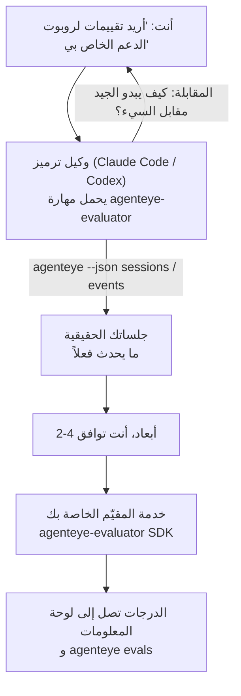

---
---
title: "مهارة وكيل Failproof AI Observability Evaluator"
description: "انتقل من \"أعتقد أن وكيلنا سيء أحياناً\" إلى خدمة تسجيل نشر، حيث يقوم وكيل الترميز الخاص بك بكل من القرار والبناء."
---

انتقل من *"أعتقد أن وكيلنا سيء أحياناً"* إلى خدمة تسجيل نشر، حيث يقوم وكيل الترميز الخاص بك بكل من القرار والبناء. **مهارة Failproof AI Observability evaluator** (`agenteye-evaluator`) هي *Agent Skill*: مجلد صغير من التعليمات يحمله وكيل ترميز مثل Claude Code أو Codex عند الحاجة. تعلم الوكيل كيفية تحديد أبعاد الجودة التي تستحق التتبع لـ *وكيلك*، ثم كتابة واختبار ونشر [خدمة المقيّم](/ar/agenteye/evaluation-suite) التي تسجل درجاتها.

إنها **ليست** محقق استضافة أو سجل تحمل فيه أو نظام المكونات الإضافية. يبقى المقيّم الخاص بك خدمة HTTP خاصة بك على بنيتك التحتية الخاصة، تماماً كما هو موضح في دليل [Evaluation suite](/ar/agenteye/evaluation-suite). تعلم المهارة وكيلك فقط لبنائها بشكل جيد، لذا كل ما تفعله يمكنك أن تفعله بنفسك بكتابة نفس الكود.

---

## الجزء الصعب هو تحديد ما يجب تسجيله

سطح SDK صغير — مزخرف واثنان من النماذج — والوكيل يمكنه كتابة ذلك من [العقد](/ar/agenteye/evaluation-suite#http-contract) وحده. هذا ليس حيث يفشل المقيّمون. يفشلون لأنهم يسجلون الشيء الخاطئ، والمقيّم الذي يسجل الشيء الخاطئ أسوأ من لا شيء: فهو ينتج لوحة معلومات يتعلم الجميع تجاهلها.

لذا معظم المهارة هي الجزء قبل وجود أي كود. لديها الوكيل يقابلك (*"صف عملية سارت بشكل جيد؛ الآن واحدة سارت بشكل سيء"*)، ثم اسحب جلساتك الحقيقية من خلال [`agenteye` CLI](/ar/agenteye/cli) واقرأها من البداية إلى النهاية. عادة ما يختلف هاتان النصفان، والفجوة هي النقطة: ما تقصد قياسه مقابل ما يمكن لنصوصك فعلاً دعمه. البُعد ينجو فقط إذا كان **قابل للحساب** من الأحداث و**متمايز** — إذا كان يسجل 0.9 على كل من عملتك الجيدة والسيئة، فهو لا يعلم شيئاً ويتم حذفه.

ما يعود هو اقتراح من 2-4 أبعاد مع التفكير المرفق، لموافقتك قبل كتابة أي سطر.



---

## كيف ترتبط بأجزاء التقييم الأخرى

أربعة مستندات تغطي التسجيل، وهي تسلمها لبعضها البعض بالترتيب:

| الصفحة | ما هي | استخدمها عندما |
|---|---|---|
| **[التقييمات](/ar/agenteye/evaluations)** | الميزة: درجات على شبكة الجلسات ولوحات المعلومات وإعادة التقييم | تريد معرفة ما يحصل عليه التسجيل التلقائي |
| **[Evaluation suite](/ar/agenteye/evaluation-suite)** | عقد HTTP والـ SDK وعوامل بيئة الخادم | أنت تطبق أو تصحح المقيّم بنفسك |
| **مهارة المقيّم** (هذا المستند) | باب طبيعي اللغة لتصميم *و* بناء المسجّل | تريد الانتقال من "أريد تقييمات" إلى خدمة تعمل |
| **[مهارة CLI](/ar/agenteye/cli-skill)** | باب طبيعي اللغة لـ `agenteye` CLI | تريد *قراءة* الدرجات التي لديك بالفعل |
| **[مهارة Python SDK](/ar/agenteye/python-sdk-skill)** | باب طبيعي اللغة لأداة وكيلك | وكيلك لا يصدر جلسات بعد — لا يوجد شيء يسجل |

### مقابل مهارة CLI: البناء مقابل القراءة

المهاران مختلفتان بشكل مقصود، والتثبيت معاً هو الإعداد الطبيعي — يختار الوكيل بينهما بناءً على ما تطلبه:

- **`agenteye-evaluator`** (هذا المستند) يبني الشيء الذي *ينتج* الدرجات. وظيفته تنتهي عندما تصل الدرجات لأول مرة.
- **[`agenteye-cli`](/ar/agenteye/cli-skill)** تقرأ درجات موجودة بالفعل (`agenteye evals`). *"هل انخفضت الجودة هذا الأسبوع؟"* هو سؤالها وليس سؤال هذه المهارة.

---

## المتطلبات الأساسية

1. **`agenteye` CLI مثبت وقيد الدخول** (`pipx install agenteye`، ثم `agenteye login`). تعتمد المهارة عليه مرتين: لسحب الجلسات الحقيقية التي تصمم بناءً عليها، والتأكيد من أن درجاتك وصلت في النهاية. يحتاج تسجيل الدخول الخاص بك إلى `events:read`، بالإضافة إلى `evaluations:read` للتحقق النهائي. كما هو الحال مع مهارة CLI، فإنه **لا يستطيع** إكمال تسجيل دخول الرمز لمرة واحدة عبر البريد الإلكتروني لك.
2. **مكان للمقيّم للعيش فيه.** يتم بناؤه في صورة وتشغيله كخدمة طويلة الأجل، لذا يحتاج إلى مستودع حقيقي، وليس ملف خدوش. غالباً ما يعيش المقيّمون في مستودعهم الخاص، منفصل عن الوكيل الذي يتم تسجيله — تبحث المهارة عن مستودع موجود وتطلب قبل بناء واحد جديد.
3. **عجلة `agenteye-evaluator` SDK** — اقرأ القسم التالي قبل أن يبدأ وكيلك في كتابة أوامر `pip`.

---

## أين تحصل عليه

تُنشر المهارة في مجموعة المهارات العامة الخاصة بـ Failproof AI:

**[github.com/FailproofAI/skills](https://github.com/FailproofAI/skills)** → [`skills/agenteye-evaluator/`](https://github.com/FailproofAI/skills/tree/main/skills/agenteye-evaluator)

المستودع عام والمهارة لا تحتاج إلى بيانات اعتماد خاصة بها — فهي تقود `agenteye` CLI فقط بالجلسة *التي* سجلت دخولك بها، وتكتب الكود في *مستودعك*. لاحظ أنها تُشحن كمجلد خاص بها و **ليست** داخل حزمة `pipx install agenteye`، لذا لا تبحث عنها هناك.

## تثبيت المهارة

الطريق الأسرع هو [`skills`](https://skills.sh) CLI، الذي يجلب المجلد وينقله إلى حيث ينظر وكيلك:

```bash
# Claude Code، هذا المشروع فقط
npx skills add FailproofAI/skills --skill agenteye-evaluator -a claude-code

# كل مشروع (التثبيت إلى ~/.claude/skills/)
npx skills add FailproofAI/skills --skill agenteye-evaluator -a claude-code -g --copy

# Codex بدلاً من ذلك
npx skills add FailproofAI/skills --skill agenteye-evaluator -a codex
```

ثم أدِره مثل أي مهارة أخرى:

```bash
npx skills list -a claude-code           # ما هو مثبت
npx skills update agenteye-evaluator     # اسحب أحدث إصدار
npx skills remove agenteye-evaluator     # أزله
```

تفضل التثبيت يدوياً؟ مهارة الوكيل هي مجرد مجلد يحتوي على `SKILL.md` (بالإضافة إلى مراجع اختيارية)، لذا ينجح النسخ أيضاً:

- **Claude Code**: ضع مجلد `agenteye-evaluator/` في `~/.claude/skills/` (كل مشروع) أو `<your-repo>/.claude/skills/` (هذا المستودع فقط). يكتشفه Claude Code تلقائياً — تحقق من قائمة `/skills`، أو ببساطة اطلب التقييمات.
- **Codex (OpenAI)**: يقرأ Codex نفس `SKILL.md`. البيان `agents/openai.yaml` المجمع يعين `allow_implicit_invocation: true`، لذا يختار Codex المهارة تلقائياً عندما تطابق مهمة؛ خلاف ذلك استدعِها بشكل صريح كـ `$agenteye-evaluator`.

---

## SDK ليس على PyPI العام

> **تحذير:** اقرأ هذا قبل السماح لوكيل بتثبيت SDK.

المهارة عامة؛ SDK الذي تقوده ليس كذلك. تُشحن `agenteye-evaluator` فقط كأثر إطلاق خاص، وعلى عكس `agenteye`، الاسم **غير مطالب به على PyPI العام** — لذا قد يسحب `pip install agenteye-evaluator` مباشرة حزمة غريب إلى الخدمة التي تقرأ نصوص الإنتاج الخاصة بك. هذه مشكلة سلسلة التوريد، وليست خطأ في الكتابة.

تعرف المهارة هذا وتعمل بسلم التثبيت بدلاً من ذلك، توقف عند أول درجة تنطبق: مصدر المستودع أحادي الاستخدام إذا كنت داخل مستودع AgentEye، وإلا فإن عجلة الإطلاق الخاصة من GitHub Releases (تحتاج الوصول)، وإذا لم يكن أي منهما قابلاً للوصول فإنه **يتوقف ويخبرك بطلب العجلة من جهة الاتصال Failproof AI الخاصة بك** بدلاً من الارتجال.

لذا إذا اقترح وكيلك `pip install agenteye-evaluator` مباشرة من PyPI العام، فهذا هو الدليل على أن المهارة لم تُحمّل قط. توقف هناك وتحقق من تثبيته.

---

## ما يمكنك أن تطلبه

يبدأ السفر الحقيقي ذهاباً وإياباً بطلب غامض وينتهي بتصميم موافق عليه، وليس بالكود:

```text
أنت   ▸ أريد تقييمات لروبوت الدعم الخاص بنا. أعتقد أنه سيء أحياناً.

الوكيل ▸ قبل أن أكتب أي شيء: صف عملية سارت بشكل جيد،
        وواحدة سارت بشكل سيء.

أنت   ▸ جيد: يجيب من المستندات. سيء: يختلق الأشياء،
        أو يستسلم ويقول "تواصل مع الدعم".

الوكيل ▸ التشغيل: agenteye --json sessions --status error --since 7d
        قراءة 5 جلسات، بما فيها اثنتان تعتبرهما سيئة.

        كلماتك تقول دقة الحقائق والانكماش. النصوص توافق على
        الانكماش (2 من 5 تنتهي بتحويل دعم، وهو واضح في
        model_response.content)، لكن دقة الحقائق تحتاج
        حقيقة أساسية لا تحملها أحداثك.

        إذاً سأسجل ثلاثة أشياء:
          - الانكماش      القوانين، رخيصة، تفصل بين عمليتيك
          - كفاءة_الأداة  القوانين، تقبض على حلقة إعادة المحاولة في العملية-004
          - التأصيل      حكم LLM: هل كل مطالبة في المستندات التي استرجعتها؟

        "دقة الحقائق" ستحتاج إلى حقيقة أساسية ليس لدينا؛ التأصيل
        هو أقرب شيء يمكن لنصوصك فعلاً دعمه.
        حسناً مع هذه الأسماء الثلاثة؟ إعادة التسمية لاحقاً تقسم التاريخ.

أنت   ▸ نعم

الوكيل ▸ لا يوجد مقيّم في هذا المستودع. هل يجب أن أبني واحداً هنا، أم
        لديك واحد في مكان آخر؟
```

من هناك يكتب الأبعاد القائمة على القوانين أولاً (مجاني وفوري وحتمي)، واختبرهما مقابل جلسة حقيقية مشفوطة بما فيها الفارغة والتي لم تنته أبداً التي تصطدم بالمقيّمين البسيطين، وفقط يصل للحكم LLM على البُعد الذاتي. يعرف حدود [المُرسِل](/ar/agenteye/evaluation-suite#configuring-the-server) — انتظار 30 ثانية وحد أقصى 8 استدعاءات متزامنة في جميع النشر — إذا لم يناسب الحكم بشكل موثوق، يذهب بشكل غير متزامن مع `JobPending` بدلاً من السماح لحكمك بالإلغاء وإعادة المحاولة خمس مرات بخمسة أضعاف التكلفة.

ثم ينشر ويعين متغيري بيئة الخادم ويؤكد مع `agenteye --json evals --session-id <id>` أن الدرجات وصلت فعلاً. وصول الدرجات هو الدليل الوحيد.

---

## ما يجب الانتباه له

- **أسماء الأبعاد قريبة من الدائمة.** مفاتيح الدرجات سلاسل تعسفية والمنصة تتجه إلى أي شيء تُرسله، مما يعني أن لا شيء في المتجر يصحح الخيار السيء. أعد التسمية لاحقاً وينقسم التاريخ: الجلسات القديمة تبقي المفتاح القديم وينقطع الاتجاه. هذا هو السبب في حصول المهارة على موافقة صريحة قبل كتابة الكود — خذ هذا الفحص على محمل الجد.
- **التركيبات هي نصوص إنتاج حقيقية.** التصميم مقابل جلسات حقيقية يعني سحبها إلى القرص، ويمكن أن تحتوي على بيانات العملاء. تطلب المهارة قبل التزام بـ git؛ في حالة الشك، احفظ `fixtures/` خارج المستودع واطلب من كل مطور سحب نسخته الخاصة.
- **الوكيل يكتب وينشر خدمة تقرأ كل نص.** يعمل كأنت، محدود بصلاحيات تسجيل دخول CLI الخاصة بك، لكن راجع المقيّم مثل أي كود آخر يلمس بيانات الإنتاج.

---

## الخطوات التالية

- **[Evaluation suite](/ar/agenteye/evaluation-suite)**: عقد HTTP والـ SDK وعوامل بيئة الخادم التي تشكل المهارة.
- **[التقييمات](/ar/agenteye/evaluations)**: حيث تظهر الدرجات بمجرد وصولها.
- **[مهارة CLI](/ar/agenteye/cli-skill)**: المهارة الشقيقة لقراءة النتائج بدلاً من بناء المسجّل.
- **[CLI](/ar/agenteye/cli)**: مرجع الأوامر خلف بيانات الجلسة التي تصمم المهارة بناءً عليها.