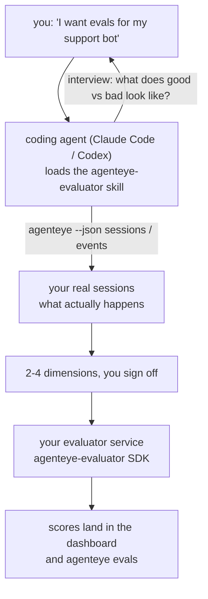

---
---
title: "مهارة وكيل تقييم Failproof AI للمراقبة"
description: "انتقل من \"أعتقد أن وكيلنا سيء أحياناً\" إلى خدمة تسجيل نشرة، مع قيام وكيل الترميز الخاص بك بكل من القرار والبناء."
---


انتقل من *\"أعتقد أن وكيلنا سيء أحياناً\"* إلى خدمة تسجيل نشرة، مع قيام وكيل الترميز الخاص بك بكل من القرار والبناء. **مهارة وكيل تقييم Failproof AI للمراقبة** (`agenteye-evaluator`) هي *مهارة وكيل*: مجلد صغير من التعليمات يحمله وكيل ترميز مثل Claude Code أو Codex عند الطلب. تعلّم الوكيل تحديد أبعاد الجودة التي تستحق التتبع ل*وكيلك*، ثم كتابة واختبار ونشر [خدمة المقيِّم](/ar/agenteye/evaluation-suite) التي تصنفها.

إنها **ليست** محرك تسجيل مستضاف، أو سجل تحمل إليه، أو نظام إضافات. المقيِّم الخاص بك يبقى خدمة HTTP خاصة بك على البنية التحتية الخاصة بك، تماماً كما هو موضح في دليل [مجموعة التقييم](/ar/agenteye/evaluation-suite). تعلم المهارة وكيلك فقط لبنائها بشكل جيد، لذلك كل ما تفعله، يمكنك أن تفعله بنفسك بكتابة نفس الكود.

---

## الجزء الصعب هو تحديد ما تريد تسجيله

سطح SDK صغير — محدّد وموديلان — ويمكن للوكيل كتابة ذلك من [العقد](/ar/agenteye/evaluation-suite#http-contract) وحده. هذا ليس المكان الذي يفشل فيه المقيِّمون. يفشلون لأنهم يسجلون الشيء الخاطئ، والمقيِّم الذي يسجل الشيء الخاطئ أسوأ من لا شيء: فهو ينتج لوحة معلومات يتعلم الجميع تجاهلها.

لذا معظم المهارة هي الجزء قبل أي كود موجود. يجعل الوكيل يجري مقابلة معك (*\"وصف عملية سارت بشكل جيد؛ والآن واحدة سارت بشكل سيء\"*)، ثم يسحب جلساتك الحقيقية عبر [واجهة سطر أوامر `agenteye`](/ar/agenteye/cli) ويقرأها من البداية إلى النهاية. عادة ما يختلف النصفان، والفجوة هي النقطة: ما تنوي قياسه مقابل ما يمكن لنسختك فعلاً دعمه. لا يبقى البعد إلا إذا كان **قابلاً للحساب** من الأحداث و**تمييزياً** — إذا كان يسجل 0.9 على كل من تشغيلك الجيد والسيء، فهو لا يعلم شيئاً وسيتم حذفه.

ما يعود هو اقتراح من 2-4 أبعاد مع المنطق المرفق، لكي توافق عليه قبل كتابة أي سطر.



---

## كيف يتعلق بأجزاء التقييم الأخرى

تغطي أربعة مستندات التسجيل، وتنقل بعضها البعض بالترتيب:

| الصفحة | ما هي | استخدمها عندما |
|---|---|---|
| **[التقييمات](/ar/agenteye/evaluations)** | الميزة: درجات على شبكة الجلسات، لوحات المعلومات، إعادة التقييم | تريد معرفة ما يحصل عليه التسجيل الآلي |
| **[مجموعة التقييم](/ar/agenteye/evaluation-suite)** | العقد HTTP، SDK، متغيرات بيئة الخادم | تقوم بتنفيذ أو تصحيح أخطاء المقيِّم بنفسك |
| **مهارة المقيِّم** (هذا المستند) | باب أمامي باللغة الطبيعية لتصميم و*بناء* المحقق | تريد الانتقال من "أريد تقييمات" إلى خدمة قيد التشغيل |
| **[مهارة واجهة سطر الأوامر](/ar/agenteye/cli-skill)** | باب أمامي باللغة الطبيعية على واجهة سطر أوامر `agenteye` | تريد *قراءة* الدرجات التي لديك بالفعل |
| **[مهارة Python SDK](/ar/agenteye/python-sdk-skill)** | باب أمامي باللغة الطبيعية على آلية وكيلك | وكيلك لا يصدر جلسات بعد — لا يوجد شيء لتسجيله |

### مقابل مهارة واجهة سطر الأوامر: البناء مقابل القراءة

المهارتان متعمدة غير متداخلة، والتثبيت لكليهما هو الإعداد الطبيعي — يختار الوكيل بينهما بناءً على ما تطلبه:

- **`agenteye-evaluator`** (هذا المستند) يبني الشيء الذي *ينتج* النقاط. وظيفتها تنتهي عندما تصل النقاط للمرة الأولى.
- **[`agenteye-cli`](/ar/agenteye/cli-skill)** يقرأ الدرجات التي تكون موجودة بالفعل (`agenteye evals`). *\"هل انخفضت الجودة هذا الأسبوع؟\"* هو سؤالها، وليس سؤال هذه المهارة.

---

## المتطلبات الأساسية

1. **واجهة سطر أوامر `agenteye` مثبتة وتم تسجيل الدخول** (`pipx install agenteye`، ثم `agenteye login`). تعتمد المهارة عليها مرتين: لسحب الجلسات الحقيقية التي تصمم ضدها، وللتأكد من أن نقاطك وصلت في النهاية. يحتاج تسجيل الدخول الخاص بك إلى `events:read`، بالإضافة إلى `evaluations:read` للتحقق النهائي. كما هو الحال مع مهارة واجهة سطر الأوامر، فإنها **لا تستطيع** إكمال تسجيل الدخول برمز لمرة واحدة عبر البريد الإلكتروني نيابة عنك.
2. **مكان لإقامة المقيِّم.** يتم بناؤه في صورة ويعمل كخدمة طويلة الأجل، لذلك يحتاج إلى مستودع حقيقي، وليس ملف مسودة. غالباً ما يعيش المقيِّمون في مستودعهم الخاص، منفصل عن الوكيل الذي يتم تسجيله — تبحث المهارة عن واحد موجود وتسأل قبل بناء واحد جديد.
3. **عجلة SDK `agenteye-evaluator`** — اقرأ القسم التالي قبل أن يبدأ وكيلك في كتابة أوامر `pip`.

---

## أين تحصل عليه

تُنشر المهارة في مجموعة المهارات العامة من Failproof AI:

**[github.com/FailproofAI/skills](https://github.com/FailproofAI/skills)** → [`skills/agenteye-evaluator/`](https://github.com/FailproofAI/skills/tree/main/skills/agenteye-evaluator)

المستودع عام والمهارة لا تحتاج إلى بيانات اعتماد خاصة بها — فهي فقط تقود واجهة سطر أوامر `agenteye` بالجلسة *التي سجلت الدخول بها*، وتكتب الكود في *مستودعك*. لاحظ أنها تشحن كمجلد خاص بها وهي **ليست** داخل حزمة `pipx install agenteye`، لذلك لا تبحث عنها هناك.

## تثبيت المهارة

أسرع طريق هي واجهة سطر أوامر [`skills`](https://skills.sh)، التي تجلب المجلد وتضعه حيث يبحث وكيلك:

```bash
# Claude Code، هذا المشروع فقط
npx skills add FailproofAI/skills --skill agenteye-evaluator -a claude-code

# كل مشروع (تثبيت إلى ~/.claude/skills/)
npx skills add FailproofAI/skills --skill agenteye-evaluator -a claude-code -g --copy

# بدلاً من ذلك Codex
npx skills add FailproofAI/skills --skill agenteye-evaluator -a codex
```

ثم أدره مثل أي مهارة أخرى:

```bash
npx skills list -a claude-code           # ما هو مثبت
npx skills update agenteye-evaluator     # اسحب أحدث إصدار
npx skills remove agenteye-evaluator     # أزله
```

تفضل التثبيت يدوياً؟ مهارة الوكيل هي مجرد مجلد يحتوي على `SKILL.md` (بالإضافة إلى مراجع اختيارية)، لذا نسخه يعمل أيضاً:

- **Claude Code**: ضع مجلد `agenteye-evaluator/` في `~/.claude/skills/` (كل مشروع) أو `<your-repo>/.claude/skills/` (هذا المستودع فقط). Claude Code يكتشفها تلقائياً — تحقق مع قائمة `/skills`، أو اطلب ببساطة التقييمات.
- **Codex (OpenAI)**: يقرأ Codex نفس `SKILL.md`. يعيّن `agents/openai.yaml` المرفق `allow_implicit_invocation: true`، لذا يختار Codex المهارة تلقائياً عندما تطابق المهمة؛ وإلا استدعها بشكل صريح كـ `$agenteye-evaluator`.

---

## SDK ليس على PyPI العام

> **تحذير:** اقرأ هذا قبل السماح للوكيل بتثبيت SDK.

المهارة عامة؛ SDK التي تقودها ليست كذلك. `agenteye-evaluator` تشحن فقط كقطعة إصدار خاصة، وبخلاف `agenteye`، الاسم **غير مطالب به على PyPI العام** — لذا يمكن لـ `pip install agenteye-evaluator` مباشر أن يسحب حزمة شخص ما إلى الخدمة التي تقرأ نصوصك الإنتاجية. هذه مشكلة سلسلة التوريد، وليست خطأ إملائي.

المهارة تعرف هذا وتعمل لأسفل سلم التثبيت بدلاً من ذلك، توقف عند الدرجة الأولى التي تنطبق: مصدر المونوريبو إذا كنت داخل مستودع AgentEye، وإلا عجلة الإصدار الخاصة من GitHub Releases (تحتاج إلى وصول)، وإذا لم يكن أي من المتاح، **توقف وأخبرك أن تطلب من جهة اتصال Failproof AI الخاصة بك الحصول على العجلة** بدلاً من الارتجال.

لذا إذا اقترح وكيلك `pip install agenteye-evaluator` مباشرة من PyPI العام، هذا هو الدليل على أن المهارة لم تحمل. توقف هناك وتحقق من تثبيتها.

---

## ما يمكنك طلبه

جولة حقيقية ذهاباً وإياباً تبدأ بطلب غامض وتنتهي بتصميم موقّع، وليس برمز:

```text
you   ▸ أريد تقييمات لوكيل دعم العملاء الخاص بنا. أعتقد أنه سيء أحياناً.

agent ▸ قبل أن أكتب أي شيء: وصف عملية سارت بشكل جيد،
        وواحدة سارت بشكل سيء.

you   ▸ جيدة: يجيب من الوثائق. سيئة: تكون أشياء، أو تستسلم وتقول "اتصل بنا".

agent ▸ التشغيل: agenteye --json sessions --status error --since 7d
        قراءة 5 جلسات، بما في ذلك اثنتان تعتبرهما سيئتان.

        كلماتك تقول الواقعية والانحراف. النصوص توافق على الانحراف (نهاية جلستين من أصل 5
        مع تسليم الدعم، وهو واضح في model_response.content)، لكن الواقعية
        تحتاج إلى حقيقة أساسية لا تحملها أحداثك.

        إذن سأسجل ثلاثة أشياء:
          - deflection      قواعد، رخيصة، تفصل بين جلستيك
          - tool_efficiency قواعد، تمسك حلقة إعادة المحاولة في run-004
          - groundedness    قاضي LLM: هل كل ادعاء في الوثائق التي استرجعتها؟

        "factuality" ستحتاج إلى حقيقة أساسية لا نملكها؛ groundedness
        هو أقرب شيء يمكن لنصوصك فعلاً دعمه.
        حسن بهذه الأسماء الثلاثة؟ إعادة التسمية لاحقاً تقسم السجل.

you   ▸ نعم

agent ▸ لا يوجد مقيِّم في هذا المستودع. هل يجب أن أبني واحداً هنا، أم أن
        لديك واحد في مكان آخر؟
```

من هناك تكتب الأبعاد المستندة إلى القواعد أولاً (حرة، فورية، حتمية)، واختبرها ضد جلسة حقيقية مسجلة بما في ذلك الفارغة والتي لم تنته أبداً التي تحطم المقيِّمات الساذجة، وتصل فقط للقاضي LLM على البعد الذاتي. تعرف [حدود المرسل](/ar/agenteye/evaluation-suite#configuring-the-server) — انتظار 30 ثانية وتنشيط 8 متزامن — لذا إذا لم يناسب القاضي بشكل موثوق، تذهب للقراءة غير المتزامنة مع `JobPending` بدلاً من السماح للقاضي بالإلغاء والمحاولة مرة أخرى خمس مرات بخمسة أضعاف التكلفة.

ثم تنشر، وتعيّن متغيرات البيئة للخادم، وتؤكد مع `agenteye --json evals --session-id <id>` أن الدرجات هبطت فعلاً. الدرجات الهبوط هي الإثبات الوحيد.

---

## ما الذي يجب الانتباه له

- **أسماء الأبعاد قريبة من الدوام.** مفاتيح الدرجات عبارات عشوائية والمنصة تتجه إلى أي شيء ترسله، مما يعني أن لا شيء في المصب يصحح الاختيار السيء. أعد التسمية لاحقاً وينقسم السجل: الجلسات القديمة تحتفظ بالمفتاح القديم والاتجاه ينقطع. هذا هو السبب في أن المهارة تحصل على موافقة صريحة قبل كتابة الكود — خذ هذا الفحص على محمل الجد.
- **التركيبات هي نصوص إنتاج حقيقية.** التصميم ضد الجلسات الحقيقية يعني سحبها إلى القرص، ويمكنها أن تحتوي على بيانات العملاء. تسأل المهارة قبل الالتزام بها بـ git؛ إذا كنت في شك، أبقِ `fixtures/` خارج المستودع واطلب من كل مطور سحب ملكهم.
- **الوكيل يكتب وينشر خدمة تقرأ كل نص.** يعمل بصفتك، محدود بأذونات تسجيل الدخول إلى واجهة سطر الأوامر، لكن راجع المقيِّم مثل أي كود آخر يلمس بيانات الإنتاج.

---

## الخطوات التالية

- **[مجموعة التقييم](/ar/agenteye/evaluation-suite)**: العقد HTTP، وSDK، ومتغيرات بيئة الخادم التي تعد المهارة.
- **[التقييمات](/ar/agenteye/evaluations)**: حيث تظهر النقاط بمجرد وصولها.
- **[مهارة واجهة سطر الأوامر](/ar/agenteye/cli-skill)**: المهارة الشقيقة، لقراءة النتائج بدلاً من بناء المحقق.
- **[واجهة سطر الأوامر](/ar/agenteye/cli)**: مرجع الأوامر خلف بيانات الجلسة التي تصمم المهارة ضدها.