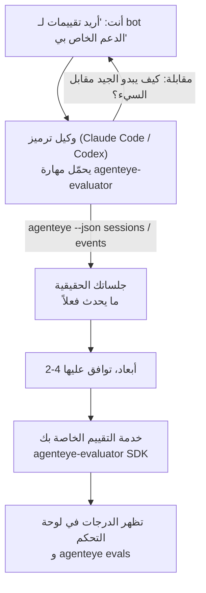

---
---
title: "مهارة عامل تقييم القابلية للملاحظة في Failproof AI"
description: "انتقل من \"أعتقد أن وكيلنا سيء أحيانًا\" إلى خدمة تسجيل منتشرة، حيث يقوم وكيل الترميز الخاص بك بكل من القرار والبناء."
---


انتقل من *"أعتقد أن وكيلنا سيء أحيانًا"* إلى خدمة تسجيل مُنتشرة، حيث يقوم وكيل الترميز الخاص بك بكل من القرار والبناء. **مهارة تقييم قابلية الملاحظة في Failproof AI** (`agenteye-evaluator`) هي *مهارة وكيل*: مجلد صغير من التعليمات يحمّله وكيل ترميز مثل Claude Code أو Codex عند الحاجة. تعلّم الوكيل تحديد أبعاد الجودة التي تستحق التتبع لـ *وكيلك*، ثم كتابة واختبار ونشر [خدمة التقييم](/ar/agenteye/evaluation-suite) التي تسجلها.

إنها **ليست** محقق درجات مستضاف، ولا سجل تحمّل عليه، ولا نظام إضافي. يبقى المُقيِّم الخاص بك خدمة HTTP خاصة به على البنية التحتية الخاصة بك، تماماً كما هو موضح في دليل [مجموعة التقييم](/ar/agenteye/evaluation-suite). تعلّم المهارة وكيلك فقط ليبنيها جيداً، لذلك كل شيء تفعله، يمكنك أن تفعله بنفسك بكتابة نفس الكود.

---

## الجزء الصعب هو تحديد ما يجب تسجيله

سطح SDK صغير — مزخرف ونموذجان — ويمكن لوكيل أن يكتبه من [العقد](/ar/agenteye/evaluation-suite#http-contract) وحده. هذا ليس حيث يفشل المقيّمون. يفشلون لأنهم يسجلون الشيء الخاطئ، والمُقيِّم الذي يسجل الشيء الخاطئ أسوأ من لا شيء: ينتج لوحة تحكم يتعلم الجميع تجاهلها.

لذا معظم المهارة هو الجزء قبل أن يكون أي كود موجود. يجعل الوكيل يجريك مقابلة (*"اوصف جلسة سارت بشكل جيد؛ الآن واحدة ساءت"*)، ثم يسحب جلساتك الحقيقية عبر [`agenteye` CLI](/ar/agenteye/cli) ويقرأها من البداية للنهاية. عادة ما تختلف النصفان، والفجوة هي النقطة: ما تقصد قياسه مقابل ما يمكن لنصوصك أن تدعمه فعلاً. يبقى البعد فقط إذا كان **قابلاً للحساب** من الأحداث و**تمييزي** — إذا سجل 0.9 على جلستك الجيدة والسيئة، فإنه لا يعلم شيئاً ويتم حذفه.

ما يعود هو اقتراح 2-4 أبعاد مع المنطق المرفق، لتوافق عليه قبل كتابة سطر واحد.



---

## كيف يرتبط بأجزاء التقييم الأخرى

تغطي أربع مستندات التسجيل، وتسلم لبعضها البعض بالترتيب:

| الصفحة | ما هي | استخدمها عندما |
|---|---|---|
| **[التقييمات](/ar/agenteye/evaluations)** | الميزة: درجات على شبكة الجلسات، لوحات التحكم، إعادة تقييم | تريد معرفة ما الذي يحصل عليه التسجيل التلقائي |
| **[مجموعة التقييم](/ar/agenteye/evaluation-suite)** | عقد HTTP، SDK، متغيرات بيئة الخادم | أنت تطبق أو تصحح أخطاء المقيِّم بنفسك |
| **مهارة المقيِّم** (هذا المستند) | باب أمامي باللغة الطبيعية للتصميم *و* بناء المسجِّل | تريد الذهاب من "أريد تقييمات" إلى خدمة قيد التشغيل |
| **[مهارة CLI](/ar/agenteye/cli-skill)** | باب أمامي باللغة الطبيعية على `agenteye` CLI | تريد *قراءة* الدرجات التي لديك بالفعل |
| **[مهارة Python SDK](/ar/agenteye/python-sdk-skill)** | باب أمامي باللغة الطبيعية على تجهيز وكيلك | وكيلك لا يصدر جلسات حتى الآن — لا يوجد شيء لتسجيله |

### مقابل مهارة CLI: البناء مقابل القراءة

المهارتان متعمد أن تكونا غير متداخلة، والتثبيت معاً هو الإعداد الطبيعي — يختار الوكيل بينهما بناءً على ما تطلبه:

- **`agenteye-evaluator`** (هذا المستند) يبني الشيء الذي *ينتج* الدرجات. تنتهي مهمته عندما تظهر الدرجات للمرة الأولى.
- **[`agenteye-cli`](/ar/agenteye/cli-skill)** تقرأ الدرجات التي موجودة بالفعل (`agenteye evals`). *"هل انخفضت الجودة هذا الأسبوع؟"* سؤالها، وليس سؤال هذه المهارة.

---

## المتطلبات الأساسية

1. **تم تثبيت `agenteye` CLI وتسجيل الدخول** (`pipx install agenteye`، ثم `agenteye login`). تعتمد المهارة عليه مرتين: لسحب الجلسات الحقيقية التي تصمم ضدها، والتأكيد من أن درجاتك وصلت في النهاية. يحتاج تسجيل الدخول إلى `events:read`، بالإضافة إلى `evaluations:read` لهذا الفحص النهائي. كما هو الحال مع مهارة CLI، فإنها **لا تستطيع** إكمال تسجيل الدخول برمز لمرة واحدة عبر البريد الإلكتروني لك.
2. **مكان لعيش المقيِّم فيه.** يتم بناؤه في صورة وتشغيله كخدمة طويلة الأمد، لذا يحتاج إلى repo حقيقي، وليس ملف مؤقت. غالباً ما يعيش المقيّمون في repo خاص بهم، منفصل عن الوكيل الجاري تسجيله — تبحث المهارة عن واحد موجود وتسأل قبل بناء واحد جديد.
3. **عجلة `agenteye-evaluator` SDK** — اقرأ القسم التالي قبل أن يبدأ وكيلك بكتابة أوامر `pip`.

---

## أين تحصل عليها

تُنشر المهارة في مجموعة المهارات العام في Failproof AI:

**[github.com/FailproofAI/skills](https://github.com/FailproofAI/skills)** → [`skills/agenteye-evaluator/`](https://github.com/FailproofAI/skills/tree/main/skills/agenteye-evaluator)

المستودع عام والمهارة لا تحتاج إلى بيانات اعتماد خاصة بها — فقط تشغل `agenteye` CLI بالجلسة *التي سجلت الدخول بها*، وتكتب الكود في *repo الخاص بك*. لاحظ أنها تأتي كمجلد خاص بها وهي **ليست** داخل حزمة `pipx install agenteye`، لذا لا تبحث عنها هناك.

## تثبيت المهارة

أسرع طريق هي CLI [`skills`](https://skills.sh)، التي تجلب المجلد وتضعه حيث ينظر وكيلك:

```bash
# Claude Code، هذا المشروع فقط
npx skills add FailproofAI/skills --skill agenteye-evaluator -a claude-code

# كل مشروع (يثبت إلى ~/.claude/skills/)
npx skills add FailproofAI/skills --skill agenteye-evaluator -a claude-code -g --copy

# Codex بدلاً من ذلك
npx skills add FailproofAI/skills --skill agenteye-evaluator -a codex
```

ثم أدرها مثل أي مهارة أخرى:

```bash
npx skills list -a claude-code           # ما هو مثبت
npx skills update agenteye-evaluator     # اسحب أحدث إصدار
npx skills remove agenteye-evaluator     # أزله
```

تفضل التثبيت يدوياً؟ مهارة الوكيل هي فقط مجلد يحتوي على `SKILL.md` (بالإضافة إلى مراجع اختيارية)، لذا ينجح النسخ أيضاً:

- **Claude Code**: ضع مجلد `agenteye-evaluator/` في `~/.claude/skills/` (كل مشروع) أو `<your-repo>/.claude/skills/` (ذلك repo فقط). يكتشفه Claude Code تلقائياً — تحقق من خلال قائمة `/skills`، أو فقط اطلب تقييمات.
- **Codex (OpenAI)**: يقرأ Codex نفس `SKILL.md`. يعيّن الملف المرفق `agents/openai.yaml` `allow_implicit_invocation: true`، لذا يختار Codex المهارة تلقائياً عندما تطابق المهمة؛ وإلا استدعها صراحة كـ `$agenteye-evaluator`.

---

## SDK ليس على PyPI العام

> **تحذير:** اقرأ هذا قبل السماح لوكيل بتثبيت SDK.

المهارة عامة؛ SDK التي تشغّلها ليست كذلك. يأتي `agenteye-evaluator` فقط كعيّنة إصدار خاصة، وبخلاف `agenteye`، الاسم **غير مطالب به على PyPI العام** — لذا قد يسحب `pip install agenteye-evaluator` عارياً حزمة شخص آخر إلى الخدمة التي تقرأ نصوصك الإنتاجية. هذه مشكلة سلسلة التوريد، وليست خطأ مطبعي.

تعرف المهارة هذا وتعمل بسلم تثبيت بدلاً من ذلك، توقف عند أول درجة تنطبق: مصدر monorepo إذا كنت داخل repo AgentEye، وإلا عجلة الإصدار الخاصة من GitHub Releases (تحتاج إلى وصول)، وإذا لم يكن أي منهما قابلاً للوصول فإنها **توقفت وتخبرك بطلب عجلة من جهة اتصال Failproof AI الخاصة بك** بدلاً من الارتجال.

لذا إذا اقترح وكيلك `pip install agenteye-evaluator` عارياً من PyPI العام، فهذا هو المؤشر على أن المهارة لم تحمّل أبداً. توقف هناك وتحقق من تثبيتها.

---

## ما يمكنك أن تطلبه

يبدأ جولة حقيقية ذهاباً وإياباً بطلب غامض وينتهي بتصميم موقّع، وليس بكود:

```text
أنت   ▸ أريد تقييمات لـ support bot الخاص بنا. أعتقد أنه سيء أحيانًا.

الوكيل ▸ قبل أن أكتب أي شيء: صف جلسة سارت بشكل جيد،
        وواحدة ساءت.

أنت   ▸ جيد: يجيب من المستندات. سيء: يخترع الأشياء،
        أو يستسلم ويقول "اتصل بالدعم".

الوكيل ▸ التشغيل: agenteye --json sessions --status error --since 7d
        قراءة 5 جلسات، بما في ذلك اثنتان كنت ستسميهما سيئة.

        كلماتك تقول الحقيقية والتحويل. النصوص متفقة على التحويل
        (نهاية جلستين من 5 مع تسليم دعم، وهو واضح في
        model_response.content)، لكن الحقيقية تحتاج إلى أرضية
        الحقيقة التي لا تحملها أحداثك.

        إذاً كنت سأسجل ثلاثة أشياء:
          - تحويل      قواعد، رخيص، يفصل جلساتك
          - كفاءة_الأداة قواعد، يمسك حلقة الإعادة في run-004
          - التأسيس   حاكم LLM: هل كل ادعاء في المستندات التي استرجعتها؟

        كانت "الحقيقية" بحاجة إلى أرض حقيقة ليس لدينا؛ التأسيس
        هو أقرب شيء يمكن لنصوصك أن تدعمه فعلاً. موافق على
        تلك الأسماء الثلاثة؟ إعادة التسمية لاحقاً تقسم السجل.

أنت   ▸ نعم

الوكيل ▸ لا يوجد مقيِّم في هذا repo. هل يجب أن أبني واحداً هنا، أم
        لديك واحد في مكان آخر؟
```

من هناك تكتب الأبعاد المستندة إلى القواعد أولاً (مجاني، فوري، محدد)، تختبرها ضد جلسة حقيقية تم التقاطها بما في ذلك الجلسات الفارغة والتي لم تنته أبداً التي تحطم المقيّمين الساذجين، وتصل فقط لحاكم LLM على البعد الذاتي. تعرف حدود [المرسل](/ar/agenteye/evaluation-suite#configuring-the-server) — انتظار 30 ثانية وثمانية استدعاءات متزامنة على مستوى النشر — لذا إذا لم يناسب الحاكم بشكل موثوق، يذهب غير متزامن مع `JobPending` بدلاً من السماح للحاكم بالإلغاء والمحاولة خمس مرات بخمسة أضعاف التكلفة.

ثم ينشر، يعيّن متغيرات البيئة للخادم، ويؤكد مع `agenteye --json evals --session-id <id>` أن الدرجات هبطت فعلاً. هبوط الدرجات هو الإثبات الوحيد.

---

## ما يجب الانتباه له

- **أسماء الأبعاد قريبة جداً من الدائمة.** مفاتيح الدرجات نصوص عشوائية والنظام الأساسي يتجه كل ما تُرسله، مما يعني لا شيء في المصب يصحح الاختيار السيء. أعد التسمية لاحقاً والسجل ينقسم: تحتفظ الجلسات القديمة بالمفتاح القديم والاتجاه ينقطع. هذا هو السبب في أن المهارة تحصل على موافقة صريحة قبل كتابة الكود — خذ هذا الفحص بجدية.
- **المراجع هي نصوص إنتاجية حقيقية.** يعني التصميم مقابل جلسات حقيقية سحبها إلى القرص، ويمكن أن تحتوي على بيانات العملاء. تسأل المهارة قبل التزامها بـ git؛ إذا كنت غير متأكد، أبقِ `fixtures/` خارج repo وأتح لكل مطور سحب خاصتهم.
- **يكتب الوكيل وينشر خدمة تقرأ كل نص.** إنها تتصرف كأنت، محدودة بأذونات تسجيل دخول CLI الخاصة بك، لكن راجع المقيِّم مثل أي كود آخر يلمس بيانات الإنتاج.

---

## الخطوات التالية

- **[مجموعة التقييم](/ar/agenteye/evaluation-suite)**: عقد HTTP، SDK، ومتغيرات بيئة الخادم التي تعيّنها المهارة.
- **[التقييمات](/ar/agenteye/evaluations)**: حيث تظهر الدرجات بمجرد هبوطها.
- **[مهارة CLI](/ar/agenteye/cli-skill)**: مهارة شقيقة، لقراءة النتائج بدلاً من بناء المسجِّل.
- **[CLI](/ar/agenteye/cli)**: مرجع الأوامر خلف بيانات الجلسة التي تصمم المهارة ضدها.