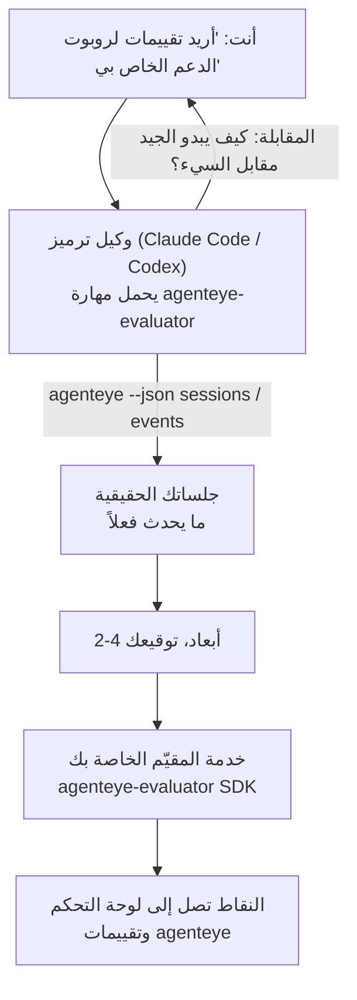

---
---
title: "مهارة وكيل تقييم قابلية الملاحظة في Failproof AI"
description: "انتقل من \"أعتقد أن وكيلنا سيء أحياناً\" إلى خدمة تصنيف منتشرة، حيث يقوم وكيل الترميز الخاص بك بكل من اتخاذ القرار والبناء."
---

انتقل من *"أعتقد أن وكيلنا سيء أحياناً"* إلى خدمة تصنيف منتشرة، حيث يقوم وكيل الترميز الخاص بك بكل من اتخاذ القرار والبناء. **مهارة وكيل تقييم قابلية الملاحظة في Failproof AI** (`agenteye-evaluator`) هي *مهارة وكيل*: مجلد صغير من التعليمات يحمله وكيل ترميز مثل Claude Code أو Codex عند الحاجة. تعلّم الوكيل تحديد أي أبعاد جودة تستحق التتبع لـ *وكيلك*، ثم كتابة واختبار ونشر [خدمة التقييم](/ar/agenteye/evaluation-suite) التي تصنفها.

**ليس** محقق مستضاف أو سجل تحمّل إليه أو نظام إضافات. يبقى المقيّم الخاص بك خدمة HTTP خاصة بك على بنيتك التحتية الخاصة، تماماً كما هو موصوف في دليل [جناح التقييم](/ar/agenteye/evaluation-suite). تعلم المهارة وكيلك فقط لبناؤها بشكل جيد، لذا كل ما تفعله، يمكنك فعله بنفسك بكتابة نفس الكود.

---

## الجزء الصعب هو تقرير ما يتم تصنيفه

سطح SDK صغير — مزخرف واثنان من النماذج — ويمكن لوكيل كتابة ذلك من [العقد](/ar/agenteye/evaluation-suite#http-contract) وحده. هذا ليس حيث يفشل المقيّمون. يفشلون لأنهم يصنفون الشيء الخطأ، والمقيّم الذي يصنف الشيء الخطأ أسوأ من لا شيء: ينتج لوحة تحكم يتعلم الجميع تجاهلها.

لذا معظم المهارة هي الجزء قبل أن يكون أي كود موجوداً. لديها الوكيل يجري مقابلة معك (*"صِف عملية سارت بشكل جيد؛ الآن واحدة سارت بشكل سيء"*)، ثم يسحب جلساتك الحقيقية من خلال [`agenteye` CLI](/ar/agenteye/cli) ويقرأها من النهاية إلى النهاية. يختلف النصفان عادة، والفجوة هي النقطة: ما تقصد قياسه مقابل ما يمكن لنصوصك فعلياً دعمه. يبقى البعد فقط إذا كان **قابلاً للحساب** من الأحداث و**مميزاً** — إذا حصل على 0.9 على عمليتك الجيدة وعمليتك السيئة، فهو لا يعلم شيئاً ويتم حذفه.

ما يعود عليه هو اقتراح بـ 2-4 أبعاد مع التفكير المرفق، لتوقعك عليها قبل كتابة سطر واحد.



---

## كيف يرتبط بأجزاء التقييم الأخرى

تغطي أربع وثائق التصنيف، وتسلم بعضها إلى بعض بالترتيب:

| الصفحة | ما هي | استخدمها عندما |
|---|---|---|
| **[التقييمات](/ar/agenteye/evaluations)** | الميزة: نقاط على شبكة الجلسات، لوحات التحكم، إعادة تقييم | تريد معرفة ما يحصل عليه التصنيف التلقائي |
| **[جناح التقييم](/ar/agenteye/evaluation-suite)** | عقد HTTP، SDK، متغيرات بيئة الخادم | أنت تطبق أو تصحح المقيّم بنفسك |
| **مهارة المقيّم** (هذه الوثيقة) | باب أمامي بلغة طبيعية لتصميم *وبناء* المصنف | تريد الانتقال من "أريد تقييمات" إلى خدمة تعمل |
| **[مهارة CLI](/ar/agenteye/cli-skill)** | باب أمامي بلغة طبيعية على `agenteye` CLI | تريد *قراءة* النقاط التي لديك بالفعل |
| **[مهارة Python SDK](/ar/agenteye/python-sdk-skill)** | باب أمامي بلغة طبيعية على توصيل وكيلك | وكيلك لا يصدر جلسات حتى الآن — لا يوجد شيء لتصنيفه |

### مقابل مهارة CLI: بناء مقابل قراءة

المهارتان متعارضتان بقصد، والتثبيت لكليهما هو الإعداد الطبيعي — يختار الوكيل بينهما بناءً على ما تطلبه:

- **`agenteye-evaluator`** (هذه الوثيقة) بناء الشيء الذي *ينتج* النقاط. تنتهي وظيفتها عندما تصل النقاط للمرة الأولى.
- **[`agenteye-cli`](/ar/agenteye/cli-skill)** قراءة النقاط الموجودة بالفعل (`agenteye evals`). *"هل انخفضت الجودة هذا الأسبوع؟"* هي سؤالها، ليس سؤال هذه المهارة.

---

## المتطلبات الأساسية

1. **`agenteye` CLI مثبتة وقيد التسجيل** (`pipx install agenteye`، ثم `agenteye login`). تعتمد المهارة عليها مرتين: لسحب الجلسات الحقيقية التي تصممها، وللتأكد من وصول نقاطك في النهاية. يحتاج تسجيلك إلى `events:read`، بالإضافة إلى `evaluations:read` لهذا الفحص الأخير. كما هو الحال مع مهارة CLI، **لا يمكنها** إكمال تسجيل الدخول بكود لمرة واحدة المُرسل بالبريد الإلكتروني لك.
2. **مكان لعيش المقيّم.** يتم بناؤه في صورة ويعمل كخدمة طويلة الأمد، لذا يحتاج إلى مستودع حقيقي، وليس ملف مؤقت. غالباً ما يعيش المقيّمون في مستودعهم الخاص، منفصل عن الوكيل الذي يتم تصنيفه — تبحث المهارة عن واحد موجود وتسأل قبل بناء واحد جديد.
3. **عجلة `agenteye-evaluator` SDK** — اقرأ القسم التالي قبل أن يبدأ وكيلك بكتابة أوامر `pip`.

---

## أين تحصل عليها

تُنشر المهارة في مجموعة المهارات العامة في Failproof AI:

**[github.com/FailproofAI/skills](https://github.com/FailproofAI/skills)** → [`skills/agenteye-evaluator/`](https://github.com/FailproofAI/skills/tree/main/skills/agenteye-evaluator)

المستودع عام والمهارة لا تحتاج إلى بيانات اعتماد خاصة بها — إنها فقط تقود `agenteye` CLI مع الجلسة *التي سجلت فيها*، وتكتب الكود في *مستودعك*. لاحظ أنها تُشحن كمجلد خاص بها و**ليست** داخل حزمة `pipx install agenteye`، لذا لا تبحث عنها هناك.

## تثبيت المهارة

أسرع طريق هي [`skills`](https://skills.sh) CLI، التي تجلب المجلد وتضعه حيث ينظر وكيلك:

```bash
# Claude Code، هذا المشروع فقط
npx skills add FailproofAI/skills --skill agenteye-evaluator -a claude-code

# كل مشروع (يثبت إلى ~/.claude/skills/)
npx skills add FailproofAI/skills --skill agenteye-evaluator -a claude-code -g --copy

# Codex بدلاً من ذلك
npx skills add FailproofAI/skills --skill agenteye-evaluator -a codex
```

ثم أدره كأي مهارة أخرى:

```bash
npx skills list -a claude-code           # ما هو مثبت
npx skills update agenteye-evaluator     # اسحب أحدث نسخة
npx skills remove agenteye-evaluator     # أزله
```

تفضل التثبيت اليدوي؟ مهارة الوكيل هي مجرد مجلد يحتوي على `SKILL.md` (بالإضافة إلى مراجع اختيارية)، لذا نسخه يعمل أيضاً:

- **Claude Code**: ضع مجلد `agenteye-evaluator/` في `~/.claude/skills/` (كل مشروع) أو `<your-repo>/.claude/skills/` (هذا المستودع فقط). Claude Code يكتشفه تلقائياً — تحقق مع قائمة `/skills`، أو ببساطة اطلب تقييمات.
- **Codex (OpenAI)**: يقرأ Codex نفس `SKILL.md`. ملف `agents/openai.yaml` المجموع يعيّن `allow_implicit_invocation: true`، لذا يختار Codex المهارة تلقائياً عند تطابق المهمة؛ وإلا استدعِها صراحة كـ `$agenteye-evaluator`.

---

## SDK ليس على PyPI العام

> **تحذير:** اقرأ هذا قبل السماح لوكيل بتثبيت SDK.

المهارة عامة؛ SDK التي تقودها ليست. `agenteye-evaluator` تُشحن فقط كقطعة إصدار خاصة، وبخلاف `agenteye`، الاسم **غير مطالب عليه على PyPI العام** — لذا يمكن لـ `pip install agenteye-evaluator` المباشر أن يسحب حزمة من غريب إلى الخدمة التي تقرأ نصوصك الإنتاجية. هذه مشكلة سلسلة التوريد، وليست خطأ مطبعي.

تعرف المهارة هذا وتعمل بسلم تثبيت بدلاً من ذلك، توقفاً عند أول درجة تنطبق: مصدر المونوريبو إذا كنت داخل مستودع AgentEye، وإلا عجلة الإصدار الخاصة من GitHub Releases (تحتاج إلى وصول)، وإذا لم يكن أي منهما متاحاً فإنها **توقفاً وتخبرك أن تطلب من جهة الاتصال Failproof AI الخاصة بك العجلة** بدلاً من الارتجال.

لذا إذا اقترح وكيلك `pip install agenteye-evaluator` المباشر من PyPI العام، فهذا دليل على أن المهارة لم تحمّل أبداً. توقف هناك وتحقق من تثبيتها.

---

## ما يمكنك أن تطلبه

جولة حقيقية ذهاباً وإياباً تبدأ برغبة غامضة وتنتهي بتصميم موقع، وليس بكود:

```text
أنت   ▸ أريد تقييمات لروبوت الدعم الخاص بنا. أعتقد أنه سيء أحياناً.

وكيل ▸ قبل أن أكتب أي شيء: صِف عملية سارت بشكل جيد،
        وواحدة سارت بشكل سيء.

أنت   ▸ جيد: يجيب من الوثائق. سيء: يختلق أشياء،
        أو يستسلم ويقول "اتصل بالدعم".

وكيل ▸ تشغيل: agenteye --json sessions --status error --since 7d
        قراءة 5 جلسات، بما فيها اثنتان تعتبرهما سيئة.

        كلماتك تقول الحقيقة والتراجع. الوثائق تتفق على التراجع
        (2 من 5 ينتهيان بتسليم دعم، وهو واضح في
        model_response.content)، لكن الحقيقة تحتاج إلى أساس
        الحقيقة الذي لا تحمله أحداثك.

        إذاً سأصنف ثلاثة أشياء:
          - deflection      قواعد، رخيصة، تفصل بين عمليتيك
          - tool_efficiency قواعد، تمسك حلقة إعادة المحاولة في run-004
          - groundedness    حكم LLM: هل كل ادعاء في الوثائق التي استرجعتها؟

        "factuality" ستحتاج إلى أساس حقيقة لا نملكه؛ groundedness
        هو أقرب شيء يمكن لنصوصك فعلياً دعمه.
        موافق على هذه الأسماء الثلاثة؟ إعادة تسمية لاحقة تقسم التاريخ.

أنت   ▸ نعم

وكيل ▸ لا يوجد مقيّم في هذا المستودع. هل يجب أن أبني واحداً هنا، أم
        لديك واحد في مكان آخر؟
```

من هناك يكتب الأبعاد المستندة إلى القواعد أولاً (مجانية، فورية، حتمية)، يختبرها على جلسة حقيقية مسجلة تشمل الفارغة والمكتملة أبداً التي تحطم المقيّمين السذج، وتصل فقط للحكم LLM على البعد الذاتي. يعرف حدود [المُرسل](/ar/agenteye/evaluation-suite#configuring-the-server) — انتظار 30 ثانية وحد 8 استدعاءات متزامنة على مستوى النشر — لذا إذا لم يناسب الحكم بشكل موثوق، ينتقل بشكل غير متزامن مع `JobPending` بدلاً من السماح لحكمك بإلغائه وإعادة محاولته خمس مرات بخمسة أضعاف التكلفة.

ثم ينشره، يضبط متغيري بيئة الخادم، ويؤكد مع `agenteye --json evals --session-id <id>` أن النقاط فعلاً وصلت. وصول النقاط هو الدليل الوحيد.

---

## ما يجب الانتباه له

- **أسماء الأبعاد قريبة من الدائمة.** مفاتيح النقاط أسماء عشوائية والمنصة تتجه لأي شيء تُرسله، مما يعني لا شيء في اتجاه مجري يصحح خياراً سيئاً. أعد تسمية لاحقاً وينقسم التاريخ: الجلسات القديمة تحتفظ بالمفتاح القديم والاتجاه ينكسر. هذا هو السبب في أن المهارة تحصل على توقيع صريح قبل كتابة الكود — اعتبر هذا الطلب بجدية.
- **التركيبات هي نصوص إنتاجية حقيقية.** التصميم مقابل جلسات حقيقية يعني سحبها إلى القرص، ويمكنها أن تحتوي على بيانات العملاء. تسأل المهارة قبل التزامها بـ git؛ إذا كنت في شك، أبقِ `fixtures/` خارج المستودع واجعل كل مطور يسحب خاصه.
- **الوكيل يكتب وينشر خدمة تقرأ كل نص.** يتصرف كأنت، محدود بأذونات تسجيل دخول CLI الخاص بك، لكن راجع المقيّم كأي كود آخر يلمس بيانات الإنتاج.

---

## الخطوات التالية

- **[جناح التقييم](/ar/agenteye/evaluation-suite)**: عقد HTTP، SDK، ومتغيرات بيئة الخادم التي تضبطها المهارة.
- **[التقييمات](/ar/agenteye/evaluations)**: حيث تظهر النقاط بمجرد وصولها.
- **[مهارة CLI](/ar/agenteye/cli-skill)**: المهارة الشقيقة، لقراءة النتائج بدلاً من بناء المصنف.
- **[CLI](/ar/agenteye/cli)**: مرجع الأوامر خلف بيانات الجلسة التي تصممها المهارة.