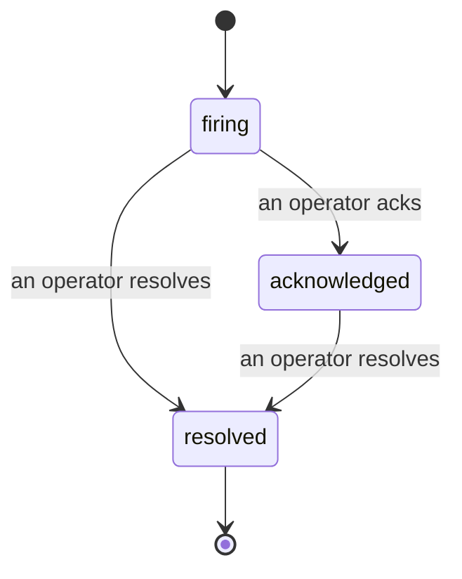

---
---
title: "الحوادث"
description: "عندما تُطلق التنبيه، يمكن للجميع رؤية أن الحادثة مفتوحة، ومن يمتلكها، وما حدث حتى الآن — على خط زمني واحد منسوب."
---

عندما يُطلق التنبيه، السؤال الأول هو دائماً "من يتعامل معها؟" الحوادث تجيب عليه: في اللحظة التي يحدث فيها انتهاك، يمكن للجميع رؤية أن الحادثة مفتوحة، ومن يمتلكها، وبالضبط ما حدث حتى الآن، مع سجل نظيف منسوب يمكنك تسليمه مباشرة إلى تقرير ما بعد الحادث.

*يجمع الصندوق الحوادث المفتوحة حسب الحالة ويفلترها حسب الخطورة والمسؤول، حتى ترى ما يحتاج إلى تدخل بشري الآن.*

## اعرف من يمتلكها، بنظرة واحدة

لا مزيد من "هل أحد ما ينظر إلى هذا؟" في سلسلة محادثة. ينتهاك يفتح حادثة تلقائياً ويضعها في صندوق وارد مشترك، مجمعة حسب الحالة. اعترف بها واسمك سيكون عليها، حتى يعرف بقية الفريق أنها يتم التعامل معها. الاعتراف مشترك: يمكن لعدة مشغلين الاعتراف بنفس الحادثة وكل واحد يتم تسجيله بشكل منفصل، لذا تظهر غرفة الحرب الكاملة بالأسماء بدلاً من التداخل مع بعضها. عيّن مالك واحد للفحص الأولي، والفلتر الصندوق حسب الخطورة أو المسؤول للتقليل إلى ما هو خاص بك.

## القصة كاملة، في خط زمني واحد

عندما تنتهي الحادثة، لديك بالفعل التقرير. افتح أي حادثة وستحصل على دليل الانتهاك، ومسؤولوها والمشتركون فيها، وسلسلة تعليقات للتنسيق في المكان، وخط زمني للنشاط منسوب وإضافة فقط.

*كل ما حدث، بالترتيب، كل سطر موقّع من قبل من فعله.*

كل إجراء (مفتوح، معترف به، محلول، وما إلى ذلك) يُكتب إلى هذا الخط الزمني ولا يتم تعديله أبداً. كل إدخال منسوب: إلى المشغل الذي اتخذه، بواسطة البريد الإلكتروني، أو إلى **automated** لأي شيء يفعله Failproof AI Observability بنفسه، مثل فتح الحادثة عند الانتهاك. لا شيء مجهول ولا شيء يُفقد، لذا فإن تقرير ما بعد الحادث يكتب نفسه بشكل أساسي.

## كيف تتحرك الحادثة

- **مفتوح (firing):** الانتهاك يفتح الحادثة وينبه قنواتك مرة واحدة. الانتهاكات المتكررة تُدمج في نفس الحادثة وتحدّث أدلتها بدلاً من إنبهارك مراراً وتكراراً.
- **معترف به (acknowledged):** مشغل يلتقطها. تبقى مفتوحة، والانتهاكات اللاحقة تحدّث الأدلة بصمت.
- **محلول (resolved):** مشغل يغلقها. الحل الآلي عند زوال الشرط مخطط له لكن لم يتم تفعيله بعد، لذا تبقى الحادثة مفتوحة حتى يحلها إنسان، مما يحافظ على الجميع على ما تم حله بالفعل. يمكن فتح حادثة جديدة على نفس التنبيه لاحقاً.

تحتفظ التنبيه الواحد بحادثة واحدة مفتوحة كحد أقصى في المرة الواحدة، لذا لا يمكن لقاعدة متذبذبة أن تدفنك في النسخ المكررة. يمكنك أيضاً فتح حادثة يدويًا: واحدة مستقلة لشيء لم يمسكه أي تنبيه، أو واحدة مرتبطة بتنبيه موجود، إذا كان لديك `incidents:write`.

## حيث تجدها

تعيش الحوادث في `/<org-slug>/incidents`. العرض يحتاج إلى **`incidents:read`**؛ فتح حادثة يدويية يحتاج إلى **`incidents:write`**؛ الاعتراف والتعيين والتعليق والحل يحتاج إلى **`incidents:ack`**. المفاتيح الأقدم التي منحت `alerts:ack` المتقاعد تبقى تعمل، لأنها يتم الاعتراف بها كـ `incidents:ack`، لذا لا تحتاج دورة الاستدعاء على الاتصال إلى إعادة إصدار.

## ذات صلة

- [التنبيهات](/ar/agenteye/alerts): القواعد التي تفتح هذه الحوادث عند انتهاك الحد.
- [تتبع الأخطاء](/ar/agenteye/error-tracking): شاهد كل فشل في مكان واحد وارفع واحد إلى تنبيه.
- [التدقيق](/ar/agenteye/audits): المحلل المجدول الذي يجد الأخطاء التي لم تكن أي قاعدة تراقبها.