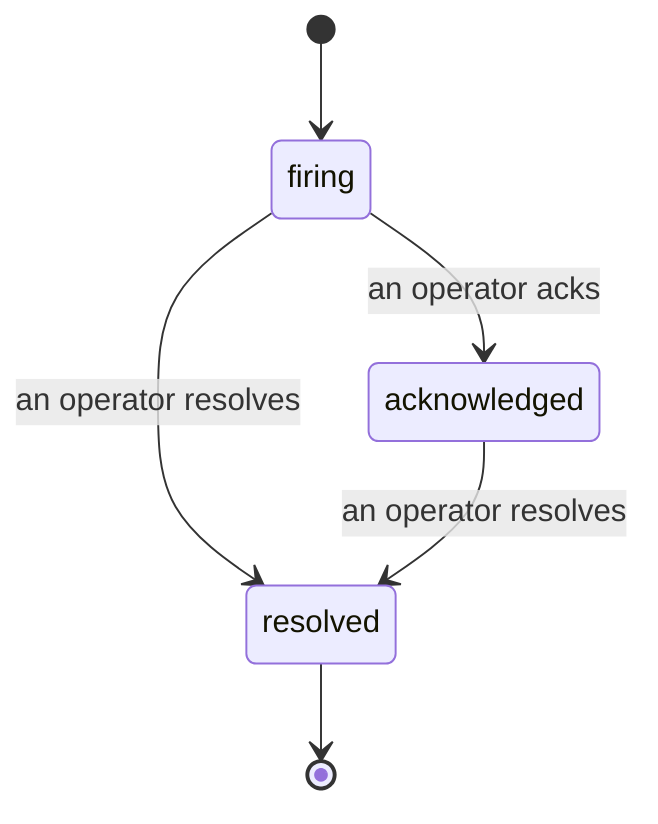

عندما ينطلق تنبيه، السؤال الأول دائماً هو "من يتعامل معها؟" الحوادث تجيب عليه: في اللحظة التي يحدث اختراق ما، يمكن للجميع رؤية أن الحادثة مفتوحة، ومن يمتلكها، وبالضبط ما حدث حتى الآن، مع سجل نظيف وموحد النسب يمكنك تسليمه مباشرة إلى جلسة ما بعد الحادثة.

*يجمع صندوق الوارد الحوادث المفتوحة حسب الحالة ويفلترها حسب الخطورة والمسؤول، لذا ترى ما يحتاج إلى تدخل بشري الآن.*

## اعرف من لديها، بنظرة واحدة

لا مزيد من "هل أحد ينظر إلى هذه؟" في سلسلة محادثة. يفتح الاختراق حادثة تلقائياً وينقلها إلى صندوق وارد مشترك، مجمع حسب الحالة. قم بالاعتراف بها واسمك عليها، لذا يعرف باقي الفريق أنها مُتعامَل معها. الاعتراف مشترك: عدة مشغّلين يمكنهم الاعتراف بنفس الحادثة وكل واحد يُسجّل على حدة، لذا تظهر غرفة الحرب بالكامل باسم بدلاً من التداخل. أسند مسؤول واحد للفرز، وفلتر صندوق الوارد حسب الخطورة أو المسؤول لتقليله إلى ما يخصك.

## القصة كاملة، في جدول زمني واحد

عندما تنتهي الحادثة، تكون لديك بالفعل التقرير. افتح أي حادثة وستحصل على دليل الاختراق، والمسؤولين والمشتركين فيها، وسلسلة تعليقات للتنسيق في المكان، وجدول زمني للنشاط موحد النسب.

*كل شيء حدث، بالترتيب، كل سطر وقّعه من فعله.*

كل إجراء (مفتوح، معترف به، محل، وغيره) يُكتب إلى هذا الجدول الزمني ولا يُحرر أبداً. كل إدخال موحو النسب: إلى المشغّل الذي اتخذه، بالبريد الإلكتروني، أو إلى **مؤتمت** لأي شيء قام به Failproof AI Observability بمفرده، مثل فتح الحادثة عند الاختراق. لا شيء مجهول والا شيء مفقود، لذا تكتب جلسة ما بعد الحادثة نفسها في الأساس.

## كيف تتحرك الحادثة

- **مفتوحة (نشطة):** يفتح الاختراق الحادثة ويصدر تنبيهاً عبر قنواتك مرة واحدة. الاختراقات المتكررة تندمج في نفس الحادثة وتحدّث دليلها بدلاً من إصدار تنبيهات متكررة.
- **معترف بها:** يلتقطها مشغّل. تبقى مفتوحة، والاختراقات اللاحقة تحدّث الدليل بصمت.
- **محلولة:** يغلقها مشغّل. الحل التلقائي عند زوال الحالة مخطط له لكنه لم يُفعّل بعد، لذا تبقى الحادثة مفتوحة حتى يحلها إنسان، مما يبقي الجميع صادقين حول ما حل فعلاً. يمكن لحادثة جديدة أن تفتح على نفس التنبيه لاحقاً.

تحتفظ التنبيهات بحادثة مفتوحة واحدة على الأكثر في المرة، لذا لا يمكن لقاعدة ترجرج أن تغمرك بالنسخ المكررة. يمكنك أيضاً فتح حادثة يدوياً: واحدة منفصلة لشيء لم يمسكه أي تنبيه، أو واحدة مرتبطة بتنبيه موجود، إذا كان لديك `incidents:write`.

## حيث تجدها

تعيش الحوادث في `/<org-slug>/incidents`. العرض يحتاج **`incidents:read`**؛ فتح حادثة يدوية يحتاج **`incidents:write`**؛ الاعتراف والإسناد والتعليق والحل يحتاج **`incidents:ack`**. المفاتيح الأقدم التي منحت `alerts:ack` المتقاعدة تبقى تعمل، لأنها تُحترم كـ `incidents:ack`، لذا لا تحتاج دورة على الاتصال الخاصة بك إلى إعادة إصدار.

## ذات الصلة

- [التنبيهات](/ar/agenteye/alerts): القواعد التي تفتح هذه الحوادث عند خرق حد ما.
- [تتبع الأخطاء](/ar/agenteye/error-tracking): انظر كل فشل في مكان واحد وعزز واحداً إلى تنبيه.
- [التدقيقات](/ar/agenteye/audits): المحلل المجدول الذي يجد الأخطاء التي لم تكن أي قاعدة تراقبها.