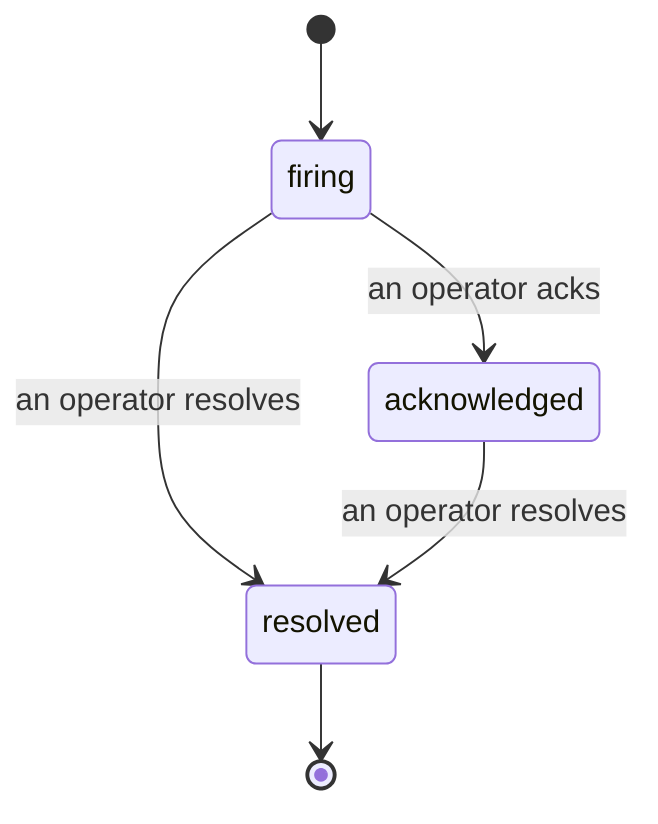

عندما يطلق تنبيه، السؤال الأول هو دائماً "من يتولى الأمر؟" الحوادث تجيب عليه: في اللحظة التي يحدث فيها انتهاك، يمكن للجميع رؤية أن الحادثة مفتوحة، ومن المسؤول عنها، وبالضبط ما حدث حتى الآن، مع سجل نظيف وموثق يمكنك تسليمه مباشرة إلى تقرير ما بعد الحادثة.

*يجمع الصندوق الحوادث المفتوحة حسب الحالة ويرشحها حسب الخطورة واسم المسؤول، بحيث ترى ما يتطلب اهتمام الآن.*

## تعرف من يتولى الأمر، بنظرة واحدة

لا مزيد من "هل أحد ينظر إلى هذا؟" في سلسلة محادثة. يفتح الانتهاك حادثة تلقائياً وينقلها إلى صندوق وارد مشترك، مجمعة حسب الحالة. قم بتأكيد الاستقبال واسمك سيظهر عليها، بحيث يعرف باقي الفريق أنها قيد المعالجة. التأكيد مشترك: عدة مشغلين يمكنهم تأكيد الاستقبال للحادثة ذاتها ويتم تسجيل كل منهم بشكل منفصل، بحيث يظهر غرفة الحرب الكاملة بالأسماء بدلاً من تضارب التصرفات. عيّن مسؤولاً واحداً لفرز الأولويات، واستخدم مرشح الصندوق حسب الخطورة أو المسؤول لتقليله إلى ما يخصك.

## القصة كاملة، في سجل زمني واحد

عندما تنتهي الحادثة، يكون لديك بالفعل التقرير. افتح أي حادثة وستحصل على دليل الانتهاك وملخص الخرق، المسؤولون والمشتركون، سلسلة تعليقات للتنسيق، وسجل نشاط زمني محفوظ بشكل كامل.

*كل ما حدث، بالترتيب، كل سطر موقع من قبل من قام به.*

كل إجراء (فتح، تأكيد، حل، وما إلى ذلك) يُكتب إلى هذا السجل الزمني ولا يُحذف أبداً. كل إدخال موثق: من قبل المشغل الذي قام به، بالبريد الإلكتروني، أو إلى **automated** لأي شيء قامت به Failproof AI Observability من تلقاء نفسها، مثل فتح الحادثة عند الخرق. لا شيء مجهول ولا شيء مفقود، لذا تقرير ما بعد الحادثة يكتب نفسه بنفسه تقريباً.

## كيفية تطور الحادثة

- **مفتوح (في الحالة النشطة):** الخرق يفتح الحادثة وينبه قنواتك مرة واحدة. الخروقات المتكررة تندمج في الحادثة ذاتها وتحدّث أدلتها بدلاً من إخطارك مراراً وتكراراً.
- **مؤكد الاستقبال:** مشغل يتولى الأمر. تبقى مفتوحة، والخروقات اللاحقة تحدّث الأدلة بصمت.
- **محل:** مشغل يغلقها. الحل التلقائي عندما تنتهي الحالة مخطط له لكن لم يُفعّل بعد، لذا تبقى الحادثة مفتوحة حتى يحلها الإنسان، مما يحافظ على المصداقية حول ما انتهى فعلاً. يمكن فتح حادثة جديدة على نفس التنبيه لاحقاً.

تنبيه واحد يحمل على الأكثر حادثة مفتوحة واحدة في كل مرة، لذا قاعدة متقلبة لا يمكنها أن تغمرك بالنسخ المكررة. يمكنك أيضاً فتح حادثة يدويًا: واحدة مستقلة لشيء لم يتقطها أي تنبيه، أو واحدة مرتبطة بتنبيه موجود، إذا كان لديك `incidents:write`.

## أين تجدها

الحوادث تقع في `/<org-slug>/incidents`. العرض يحتاج **`incidents:read`**؛ فتح حادثة يدوية يحتاج **`incidents:write`**؛ تأكيد الاستقبال والتعيين والتعليق والحل يحتاجون **`incidents:ack`**. المفاتيح الأقدم التي منحت `alerts:ack` المتقاعدة تبقى تعمل، لأنه يُعترف بها كـ `incidents:ack`، بحيث لا تحتاج دورة على الاتصال إلى إعادة إصدار.

## ذات صلة

- [التنبيهات](/ar/agenteye/alerts): القواعد التي تفتح هذه الحوادث عند انتهاك الحد.
- [تتبع الأخطاء](/ar/agenteye/error-tracking): اعرض كل فشل في مكان واحد وارتقِ بواحد إلى تنبيه.
- [التدقيقات](/ar/agenteye/audits): محلل مجدول يجد الأخطاء التي لم تكن أي قاعدة تراقبها.