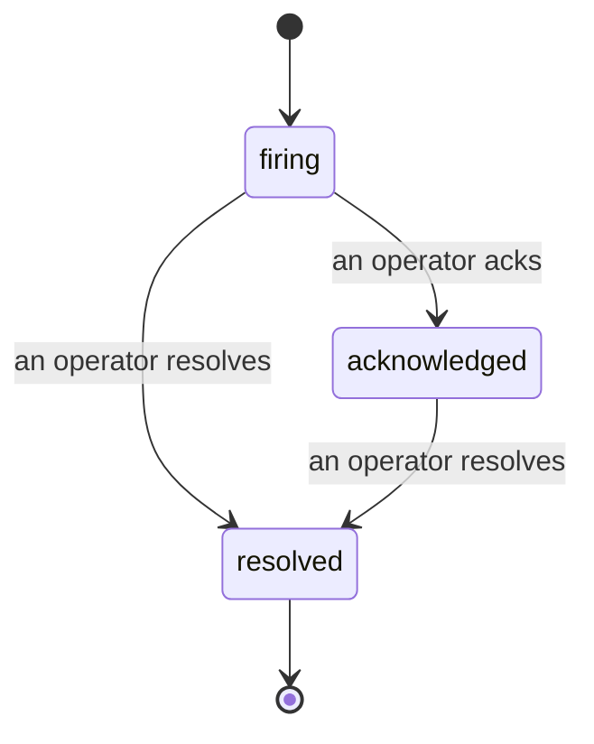

عندما ينطلق تنبيه، السؤال الأول دائماً هو "من يتعامل معها؟" الحوادث تجيب عليه: في اللحظة التي يحدث فيها اختراق، يمكن للجميع رؤية أن الحادثة مفتوحة، ومن المسؤول عنها، وبالضبط ما حدث حتى الآن، مع سجل نظيف وموثق يمكنك تسليمه مباشرة لاجتماع تحليل ما بعد الحادث.

*يجمّع صندوق الوارد الحوادث المفتوحة حسب الحالة ويفلترها حسب الخطورة والمسؤول، لذا ترى ما يحتاج تدخلاً بشريًا الآن.*

## اعرف من المسؤول، في لمحة

لا مزيد من "هل هناك أحد يتابع هذا؟" في سلسلة محادثة. يفتح الاختراق حادثة تلقائياً ويضعها في صندوق وارد مشترك، مجمعة حسب الحالة. أقرّ بها وسيظهر اسمك عليها، لذا يعرف باقي الفريق أنها تحت السيطرة. الإقرار مشترك: عدة مشغلين يمكنهم الإقرار بنفس الحادثة وكل واحد يُسجل بشكل منفصل، لذا غرفة الأزمات الكاملة تظهر بالأسماء بدلاً من التداخل. عيّن مسؤول واحد للفحص الأولي، وفلتر صندوق الوارد حسب الخطورة أو المسؤول لتقليله إلى ما هو خاص بك.

## القصة الكاملة، في خط زمني واحد

عندما تنتهي الحادثة، تكون لديك بالفعل التقرير. افتح أي حادثة وستحصل على أدلة الاختراق، والمسؤولين والمشتركين فيها، وسلسلة تعليقات للتنسيق في المكان، وخط زمني للنشاط الإضافي الموثق.

*كل شيء حدث، بالترتيب، كل سطر موقع من قبل من فعله.*

كل إجراء (مفتوح، مقرّ، محل، وما إلى ذلك) يُكتب على هذا الخط الزمني ولا يُعدّل مطلقاً. كل إدخال موثق: للمشغل الذي اتخذه، بالبريد الإلكتروني، أو **automated** لأي شيء قام به Failproof AI Observability بمفرده، مثل فتح الحادثة عند الاختراق. لا شيء مجهول ولا شيء مفقود، لذا تحليل ما بعد الحادث يكتب نفسه بنفسه تقريباً.

## كيف تتحرك الحادثة

- **مفتوح (نشط):** يفتح الاختراق الحادثة ويرسل صفحة إلى قنواتك مرة واحدة. الاختراقات المتكررة تندمج في نفس الحادثة وتحدّث أدلتها بدلاً من إرسال صفحات متكررة.
- **مقرّ:** التقط المشغل عليها. تبقى مفتوحة، والاختراقات اللاحقة تحدّث الأدلة بهدوء.
- **محل:** أغلقها المشغل. الحل التلقائي عند زوال الشرط مخطط له لكن لم يتم تفعيله بعد، لذا تبقى الحادثة مفتوحة حتى يحلها إنسان، مما يبقي الجميع صادقين حول ما تم حله فعلاً. يمكن فتح حادثة جديدة على نفس التنبيه لاحقاً.

تحمل تنبيه واحد حادثة واحدة مفتوحة فقط في المرة، لذا لا يمكن لقاعدة متذبذبة أن تدفنك بنسخ مكررة. يمكنك أيضاً فتح حادثة يدويًا: واحدة مستقلة لشيء لم يلتقطه أي تنبيه، أو واحدة مرتبطة بتنبيه موجود، إذا كان لديك `incidents:write`.

## أين تجدها

تعيش الحوادث في `/<org-slug>/incidents`. المشاهدة تحتاج **`incidents:read`**؛ فتح حادثة يدوية تحتاج **`incidents:write`**؛ الإقرار والتعيين والتعليق والحل يحتاجون **`incidents:ack`**. المفاتيح الأقدم التي منحت `alerts:ack` المتقاعد تبقى تعمل، حيث يتم احترامها كـ `incidents:ack`، لذا فريق الاستعداد على مدار الساعة لا يحتاج لإعادة إصدار.

## ذات صلة

- [التنبيهات](/ar/agenteye/alerts): القواعد التي تفتح هذه الحوادث عند اختراق عتبة.
- [تتبع الأخطاء](/ar/agenteye/error-tracking): شاهد كل فشل في مكان واحد وارفع واحد إلى تنبيه.
- [المراجعات](/ar/agenteye/audits): المحلل المجدول الذي يجد الفشل الذي لم تكن أي قاعدة تراقبه.