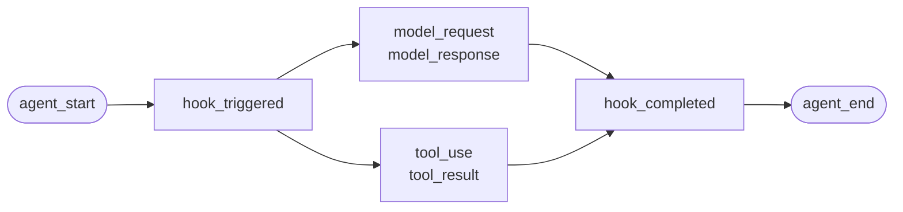
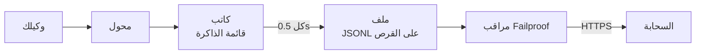

لوكيل كتبته بنفسك، أو إطار عمل لا يوجد له محول في Failproof AI. لا شيء يجب إدراجه: أنت تصدر الأحداث.

هذا هو نفس API الذي يستدعيه محولات الأطر الأربعة. وهي جداول ترجمة فوقه.

## التثبيت

```bash
pip install failproofai-sdk
```

بدون إضافات، وبدون تبعيات.

## الإدراج

```python
import failproofai_sdk

failproofai_sdk.configure(environment="production")

with failproofai_sdk.session():                 # one run
    with failproofai_sdk.agent("planner"):      # one unit of work
        with failproofai_sdk.tool_call("search", input={"q": q}) as t:
            t.output = search(q)                # one tool call
```

اقرأه من الأعلى إلى الأسفل وسيخبرك بما يعنيه:

| غلف فيه | للقول |
| --- | --- |
| `session()` | هذه الأحداث تنتمي إلى نفس التشغيل |
| `agent()` | شيء ما يقوم بالعمل — أعطه اسماً ستتعرف عليه في القائمة |
| `tool_call()` | هذه أداة واحدة، وإليك ما أرجعته |

وما يصدره كل واحد فعلياً:

| النطاق | يصدر | الغرض |
| --- | --- | --- |
| `session()` | لا شيء | يربط معرف الجلسة، مجموعة تشغيل واحدة |
| `agent()` | `agent_start`, `agent_end` | يحيط بوحدة عمل واحدة |
| `tool_call()` | `tool_use`, `tool_result` | يحيط بأداة واحدة ويقيسها |

كل شيء بالداخل يمكن أن يحذف `session_id` و `agent_id`. تربط النطاقات الهوية على متغيرات السياق وكل نداء حدث يقرأها مرة أخرى، لذلك لا تمرر أبداً المعرفات من خلال وظائفك.

تعمل الثلاثة جميعاً مع `async with` وكذلك مع `with`.

يبني التداخل للوكلاء الشجرة. يتم حساب `parent_id` والعمق من المكدس:

```python
with failproofai_sdk.session():
    with failproofai_sdk.agent("supervisor"):
        with failproofai_sdk.agent("researcher"):    # parent_id = "supervisor"
            ...
```

## كيف يغلق النطاق

`agent()` يتعامل مع الاستثناءات لك:

| ما حدث | الأحداث | النتيجة |
| --- | --- | --- |
| لم يحدث شيء | `agent_end` | `success` |
| `Exception` | `error`، ثم `agent_end` | `failed` |
| `KeyboardInterrupt`, `SystemExit` | `error`، ثم `agent_end` | `failed` |
| `CancelledError`, `GeneratorExit` | `agent_end` فقط | `cancelled` |

يتم إصدار الخطأ قبل `agent_end`، لأن لوحة التحكم تغلق الامتداد في `agent_end` وأي شيء بعده يُنسب إلى لا شيء. الإلغاء ليس فشلاً، لذلك لا تلوث التشغيلات الملغاة سطح الأخطاء. يتم إعادة رفع الاستثناء دائماً: النطاق لا يبتلعه أبداً.

## طرق الحدث

خمسة عشر طريقة في ست عائلات. معظمها يأتي في أزواج — تصدر الفاتحة، ثم الأغلق، و SDK يقيس الامتداد بينهما.

| العائلة | فتح | إغلاق | مستقل |
| --- | --- | --- | --- |
| **الوكلاء** | `agent_start` | `agent_end` | — |
| | `agent_pause` | `agent_resume` | — |
| **النماذج** | `model_request` | `model_response` | — |
| **الأدوات** | `tool_use` | `tool_result` | — |
| **الخطافات** | `hook_triggered` | `hook_completed` | — |
| **البشر** | `human_wait` | `human_input` | `human_pause`, `human_interrupt` |
| **الأعطال** | — | — | `error` |

<Tip>
  فضّل النطاقات — `agent()` و `tool_call()` — أينما كانت مناسبة. إنها تضمن حدث الإغلاق حتى عندما يرفع الجسم. تصل إلى هذه الطرق مباشرة عندما لا يتداخل تدفق التحكم، مثل نداء نموذج داخل مساعد.
</Tip>

<CodeGroup>
```python الوكلاء
failproofai_sdk.event.agent_start(agent_id="planner", goal="find the cheapest flight")
failproofai_sdk.event.agent_end(agent_id="planner", outcome="success", summary="...")
failproofai_sdk.event.agent_pause(pause_id="p1", reason="awaiting approval")
failproofai_sdk.event.agent_resume(pause_id="p1")
```

```python النماذج
failproofai_sdk.event.model_request(
    model="gpt-4o-mini",
    messages=[{"role": "user", "content": "..."}],
    request_id="req-1",
)
failproofai_sdk.event.model_response(
    model="gpt-4o-mini",
    content="...",
    input_tokens=139,
    output_tokens=21,
    request_id="req-1",
    duration_ms=5202,
)
```

```python الأدوات
failproofai_sdk.event.tool_use(tool_name="search", tool_call_id="c1", input={"q": "..."})
failproofai_sdk.event.tool_result(tool_name="search", tool_call_id="c1", output="...")
```

```python الخطافات
failproofai_sdk.event.hook_triggered(hook_name="retrieve", hook_id="h1", trigger_event="node")
failproofai_sdk.event.hook_completed(hook_name="retrieve", hook_id="h1", outcome="success")
```

```python البشر
failproofai_sdk.event.human_wait(input_id="i1", prompt="Approve?", options=["yes", "no"])
failproofai_sdk.event.human_input(input_id="i1", response="yes")
failproofai_sdk.event.human_pause(reason="operator paused the run", user_id="dana")
failproofai_sdk.event.human_interrupt(reason="operator stopped the run", at_step="step_3")
```

```python الأعطال
failproofai_sdk.event.error(
    error_type="TimeoutError",
    message="provider timed out after 30s",
    traceback="...",
)
```
</CodeGroup>

<Note>
  **العائلتان البشريتان تشير في اتجاهين متعاكسين.**

  | الطرق | المعنى |
  | --- | --- |
  | `human_wait` / `human_input` | **الوكيل طلب من شخص** — بوابة موافقة، سؤال توضيحي |
  | `human_pause` / `human_interrupt` | **شخص تصرف على الوكيل** — زر إيقاف، توقف المشغل |

  لا يشير أي إطار عمل إلى الزوج الثاني، لذا فهو دائماً لك لإصداره.
</Note>

<Warning>
  **مرر `request_id` عندما تعمل نداءات النموذج بالتزامن.** بدونه، تتزاوج طلبات الاستجابات بترتيب الوصول لكل وكيل — والنداءات المتزامنة تتزاوج بشكل خاطئ، مرفقة كل استجابة بالطلب الخاطئ.
</Warning>

## مثال

حلقة استدعاء الأداة مقابل OpenAI API، بدون إطار عمل وكيل:

```python
import json

import failproofai_sdk
from openai import OpenAI

failproofai_sdk.configure(environment="production")
client = OpenAI()
MODEL = "gpt-4o-mini"


def turn(messages: list):
    """One model call, bracketed by the pair."""
    failproofai_sdk.event.model_request(model=MODEL, messages=messages)
    reply = client.chat.completions.create(model=MODEL, messages=messages, tools=TOOLS)
    usage = reply.usage
    failproofai_sdk.event.model_response(
        model=MODEL,
        content=reply.choices[0].message.content or "",
        input_tokens=usage.prompt_tokens,
        output_tokens=usage.completion_tokens,
    )
    return reply.choices[0].message


with failproofai_sdk.session():
    with failproofai_sdk.agent("inventory", goal="price report"):
        for _ in range(4):          # bounded; an unbounded agent loop is its own bug
            message = turn(messages)
            if not message.tool_calls:
                break
            messages.append(message.model_dump(exclude_none=True))
            for call in message.tool_calls:
                args = json.loads(call.function.arguments or "{}")
                with failproofai_sdk.tool_call(
                    call.function.name, tool_call_id=call.id, input=args
                ) as handle:
                    handle.output = run_tool(call.function.name, args)
                messages.append({
                    "role": "tool",
                    "tool_call_id": call.id,
                    "content": str(handle.output),
                })
```

ينتج عن هذا نفس أنواع الأحداث الستة التي سيعطيك المحول. الإصدار الكامل القابل للتشغيل، مع تعريفات الأداة، يأتي في مستودع SDK تحت `docs/manual/examples/`.

## الخيوط و async

تنتشر متغيرات السياق في مهام asyncio تلقائياً. لا تنتشر في خيوط جديدة، لأن الخيط يبدأ بسياق فارغ.

```python
# asyncio: nothing to do
async with failproofai_sdk.session():
    await asyncio.gather(worker(1), worker(2))

# threads: wrap the callable
pool.submit(failproofai_sdk.propagate(work), x)
threading.Thread(target=failproofai_sdk.propagate(work)).start()
loop.run_in_executor(None, failproofai_sdk.propagate(work), x)
```

بدون `propagate()`، تثير أحداث العامل `TypeError` تسمي الإصلاح بدلاً من الهبوط على جلسة لا شيء. هذا متعمد: حدث بدون جلسة يتم تخطيه بواسطة ingest والإجابة `200`، وهو الفشل الصامت الذي توجد طبقة الهوية لمنعه.

## أدرج إطار عمل بدون محول

كل إطار عمل وكيل يعطيك نفس الفتحات الثلاثة. اربطها وسيكون لديك تتبع كامل — المحولات الأربعة المشحونة لا تفعل أكثر من هذا.

| الفتحة | ما تكتبه | ما يهبط |
| --- | --- | --- |
| التشغيل | `session()` + `agent()` | `agent_start`, `agent_end` |
| كل أداة | `tool_call()` | `tool_use`, `tool_result` |
| كل نداء نموذج | زوج `model_*` | `model_request`, `model_response` |

<Steps>
  <Step title="احيط التشغيل">
    ```python
    with failproofai_sdk.session():
        with failproofai_sdk.agent(agent_name, goal=task):
            result = framework.run(task)
    ```
  </Step>
  <Step title="احيط كل أداة">
    في أي مكان يستدعيه الإطار غلاف أداة أو برنامج وسيط.

    ```python
    with failproofai_sdk.tool_call(name, input=args) as call:
        call.output = original(**args)
    ```
  </Step>
  <Step title="زاوج كل نداء نموذج">
    ```python
    failproofai_sdk.event.model_request(model=model, messages=messages)
    reply = provider.complete(...)
    failproofai_sdk.event.model_response(
        model=model,
        content=text,
        input_tokens=usage.prompt_tokens,
        output_tokens=usage.completion_tokens,
    )
    ```
  </Step>
</Steps>

<Tip>
  **لديك عقدة أو خطوة أو حدود برنامج وسيط تستحق الرؤية؟** غلفها في زوج خطاف — `hook_triggered` / `hook_completed` — وليس `agent()` متداخل. `agent_id` هو جانب cardinality منخفض، وإدخال واحد لكل عقدة يغرقه. تُعرض امتدادات الخطاف بنفس الطريقة وتمنحك زمن الكمون لكل عقدة.
</Tip>

<Note>
  **اليدوي والتلقائي يتكونان.** يدخل محول يعمل داخل نطاق مكتوب يدوياً تلك الجلسة والآباء إلى ذلك الوكيل، حتى تحصل على شجرة واحدة بدلاً من شجرتين — مفيد عندما تدرج إطار عمل بنفسك إلى جانب واحد مدعوم.
</Note>

<Accordion title="لماذا لا يوجد محول AutoGen">
  سببان، والفتحات الثلاثة أعلاه هي الإجابة على كليهما:

  - `autogen-core` لم يتم صيانته منذ سبتمبر 2025.
  - AG2 لا يعرض نقطة تسجيل على مستوى العملية تعادل خطافات أطر العمل الأخرى، لذا فإن إدراجها يعني تغليف كل وكيل في كل موقع البناء.

  يسجل رسم الفتحات يدوياً نفس الأحداث، بنفس الدقة، كما سيفعل محول مشحون.
</Accordion>

## الذهاب أعمق

كيف يعمل التسجيل فعلياً. لا شيء من هذا مطلوب للبدء.

<AccordionGroup>

<Accordion title="كيف يبدو التسجيل، لكل إطار عمل" icon="eye">

كل تسجيل له نفس الشكل: يفتح امتداد، يتداخل العمل بداخله، وكل حدث افتتاحي يحصل على حدث إغلاق.



**الزوج** هو الوحدة. كل حدث إغلاق يحمل مدة يقيسها SDK من الحدث الافتتاحي الخاص به.

فيما يلي تشغيل واحد حقيقي لكل إطار عمل — مأخوذ من الأمثلة المشحونة مع SDK، اسم النموذج معياري. لاحظ كم يعود من نداء واحد.

<Tabs>
  <Tab title="LangGraph">
    ```text 14 events
     1  +0.000s  agent_start       LangGraph
     2  +0.001s    hook_triggered  agent
     3  +0.002s      model_request   gpt-4o-mini
     4  +3.023s      model_response  gpt-4o-mini · 21 out-tok
     5  +3.024s    hook_completed  agent
     6  +3.024s    hook_triggered  tools
     7  +3.025s      tool_use      word_count
     8  +3.025s      tool_result   word_count · ok
     9  +3.025s    hook_completed  tools
    10  +3.026s    hook_triggered  agent
    11  +3.027s      model_request   gpt-4o-mini
    12  +5.717s      model_response  gpt-4o-mini · 5 out-tok
    13  +5.720s    hook_completed  agent
    14  +5.721s  agent_end         LangGraph · success
    ```

    تصبح العقد أزواج خطاف، لذا تحصل على زمن الكمون لكل عقدة بدون أن تزحمها قائمة الوكيل.
  </Tab>

  <Tab title="CrewAI">
    ```text 10 events
     1  +0.000s  agent_start       crew
     2  +0.050s    agent_start     analyst · under crew
     3  +0.057s      model_request   gpt-4o-mini
     4  +3.475s      model_response  gpt-4o-mini · 19 out-tok
     5  +3.478s      tool_use      lookup_metric
     6  +3.478s      tool_result   lookup_metric · ok
     7  +3.486s      model_request   gpt-4o-mini
     8  +5.694s      model_response  gpt-4o-mini · 9 out-tok
     9  +5.727s    agent_end       analyst · success
    10  +5.739s  agent_end         crew · success
    ```

    يصبح `role` لكل وكيل اسم امتداده، لذا ينقسم زمن الكمون ومصروف الرمز حسب الدور.
  </Tab>

  <Tab title="LlamaIndex">
    ```text 26 events
     1  +0.000s  agent_start       Agent
     2  +0.001s    hook_triggered  init_run
     4  +0.501s    hook_triggered  setup_agent
     6  +0.503s    hook_triggered  run_agent_step
     7  +0.505s      model_request   gpt-4o-mini
     8  +3.083s      model_response  gpt-4o-mini · 18 out-tok
    10  +3.197s    hook_triggered  parse_agent_output
    12  +3.355s    hook_triggered  call_tool
    13  +3.355s      tool_use      city_population
    14  +3.355s      tool_result   city_population · ok
    16  +3.356s    hook_triggered  aggregate_tool_results
       ...                        second iteration
    26  +7.038s  agent_end         Agent · success
    ```

    حلقة الوكيل نفسها مرئية، ليس فقط نداءاته النموذجية.
  </Tab>

  <Tab title="Pydantic AI">
    ```text 8 events
    1  +0.000s  agent_start       agent
    2  +0.001s    model_request   gpt-4o-mini
    3  +4.413s    model_response  gpt-4o-mini · 17 out-tok
    4  +4.415s    tool_use        population
    5  +4.415s    tool_result     population · ok
    6  +4.416s    model_request   gpt-4o-mini
    7  +8.118s    model_response  gpt-4o-mini · 6 out-tok
    8  +8.119s  agent_end         agent · success
    ```

    لا توجد أزواج خطاف: Pydantic AI لا يملك حد عقدة أو خطوة للإحاطة به.
  </Tab>

  <Tab title="الوكلاء المخصصون">
    ```text 6 events
    1  +0.000s  agent_start       main
    2  +0.000s    tool_use        population
    3  +0.000s    tool_result     population · ok
    4  +0.000s    model_request   gpt-4o-mini
    5  +0.000s    model_response  gpt-4o-mini · 3 out-tok
    6  +0.000s  agent_end         main · success
    ```

    أنت تصدر هذه بنفسك. نفس أنواع الأحداث، نفس الدقة — إنه يكلفك مواقع الاستدعاء.
  </Tab>
</Tabs>

</Accordion>

<Accordion title="كيف تبدأ الجلسة وتنتهي" icon="circle-play">

**لا توجد حدث نهاية الجلسة.** الجلسة ليست شيء تغلقه — إنها مجموعة من الأحداث تشترك في `session_id`.

يتم استخلاص الحالة من شكل التتبع:

| الحالة | متى |
| --- | --- |
| `ongoing` | لا يزال امتداد واحد على الأقل مفتوحاً |
| `paused` | `agent_pause` بدون `agent_resume` مطابقة |
| `error` | لا شيء مفتوح، وحدث واحد على الأقل فشل |
| `done` | لا شيء مفتوح، وشيء فشل |

لذلك تنتهي الجلسة عندما يتم إغلاق كل زوج. يصدر المحولات `agent_end` لك، وعند الهدم يغلقون أي شيء لا يزال مفتوحاً ويوقعونه كغير كامل — يستقر التشغيل المتعطل كـ `done` بفجوة مرئية بدلاً من التعليق.

<Note>
  هذا هو السبب في أن الجلسة يمكن أن تمتد على نداءين. يوقف `interrupt()` في LangGraph التشغيل، يبقى الامتداد الجذري مفتوحاً عن قصد، والنداء المستأنف يغلقه. كلا النداءين جلسة واحدة.
</Note>

</Accordion>

<Accordion title="الهوية: session_id و agent_id ومن يضربهم" icon="fingerprint">

`session_id` و `agent_id` اختياريان في كل طريقة حدث. محذوفاً، يحلان من النطاق المرفق:

```python
with failproofai_sdk.session():
    with failproofai_sdk.agent("planner"):
        failproofai_sdk.event.tool_use(tool_name="search", tool_call_id="c1")
```

تمريرهما بشكل صريح يعمل بعد ذلك ويأخذ الأسبقية. بدون شيء مرتبط وبدون شيء تم تمريره، يرفع الاستدعاء `TypeError` تسمية الإصلاح بدلاً من إصدار حدث بدون جلسة، والتي ستقفزها ingest مع الإجابة `200`.

تربط النطاقات الهوية على متغيرات السياق. تلك تنتشر في مهام asyncio تلقائياً لكن ليس في خيوط جديدة — غلف عامل في `failproofai_sdk.propagate()`.

#### من يضرب أي معرف

| المعرف | تم ضربه بواسطة | ملاحظات |
| --- | --- | --- |
| `session_id` | أنت، أو SDK | `session("chat-42")` يُستخدم حرفياً؛ محذوفاً، ينشئ SDK `uuid4().hex` |
| `agent_id` | أنت، أو الإطار | من `agent("analyst")`، `role` في CrewAI، `FunctionAgent.name`. يتم رفض قيمة تبدو مثل UUID واستبدالها |
| `tool_call_id`, `hook_id`, `request_id` | أنت، أو الإطار | تعيد المحولات استخدام معرفات التشغيل الخاصة بالإطار، وهذا هو السبب في أن الأزواج تبقى نقافز الخيط |
| **معرف الحدث** | **السحابة، عند الاستقبال** | SDK لا ينبعث أي |
| **`dedup_key`** | **السحابة، عند الاستقبال** | تجزئة org و session و timestamp و type و payload. هذه هي الهوية الحقيقية — إنها تجعل دفعة أعيد محاولتها تنهار بدلاً من التكرار |

#### كيف تحل المحولات `session_id`

أول تطابق يفوز:

1. `session_id` خيار صريح
2. البيانات الوصفية لكل نداء
3. نطاق `session()` المرفق
4. بيانات إطار العمل الوصفية
5. معرف التشغيل الخاص بإطار العمل

لا يتم اختراعه أبداً مع وجود أحد تلك — معرف مركب سيقسم تشغيل واحد عبر عدة جلسات.

#### حافظ على `agent_id` على cardinality منخفضة

إنه الجانب الأساسي على كل سطح لوحة تحكم، وعمود `LowCardinality(String)`. تقلل القيمة لكل تشغيل العمود وتملأ قائمة القائمة المنسدلة بإدخال واحد لكل تشغيل.

تحافظ المحولات على هذا العمود لك:

| يسلم الإطار | مسجل باسم | لماذا |
| --- | --- | --- |
| `3f9a1c2b-…` (معرف فريد) | `main` | لا شيء يمكن قراءته للاحتفاظ به |
| سلسلة سادسة عشرية طويلة عارية | `main` | نفس |
| `agent-3f9a1c2b-…` | `agent` | تم تجريد معرف لكل تشغيل، تم الاحتفاظ بالجزء القابل للقراءة |
| `agent-v2` | `agent-v2` | تُترك الأجزاء القصيرة وحدها |
| `step-3` | `step-3` | نفس |

المعرف الحقيقي يبقى على `fw_agent_id` / `fw_run_id`، حيث يبقى قابلاً للاستعلام بدون أن يكون جانباً.

<Warning>
  **هذا الحراس يلمس فقط التسميات التي اختارها *الإطار*.** `agent_id` تمرره بنفسك — إلى `event.*`، أو إلى `failproofai_sdk.agent(...)` — مسجل تماماً كما هو محدد. إعادة كتابة صريحة لحجة صريحة ستكون أسوأ من cardinality التي تمنعها، لذا سمِّ امتدادات خاصة بك وفقاً لذلك.
</Warning>

</Accordion>

<Accordion title="أنواع الأحداث، مجمعة — وأي إطار عمل يسجل ماذا" icon="table">

| المجموعة | الأحداث |
| --- | --- |
| الوكلاء | `agent_start`, `agent_end`, `agent_pause`, `agent_resume` |
| النماذج | `model_request`, `model_response` |
| الأدوات | `tool_use`, `tool_result` |
| الخطافات | `hook_triggered`, `hook_completed` |
| البشر | `human_wait`, `human_input`, `human_pause`, `human_interrupt` |
| الأعطال | `error` |

أي إطار عمل يسجل ماذا، مقاس من التشغيلات أعلاه:

| الحدث | LangGraph | CrewAI | LlamaIndex | Pydantic AI | مخصص |
| --- | :--: | :--: | :--: | :--: | :--: |
| بداية الوكيل والنهاية | نعم | نعم | نعم | نعم | أنت |
| نموذج الطلب والاستجابة | نعم | نعم | نعم | نعم | أنت |
| استخدام الأداة والنتيجة | نعم | نعم | نعم | نعم | أنت |
| تم تشغيل الخطاف واكتمل | عقدة | مهمة | خطوة | — | أنت |
| خطأ | نعم | نعم | نعم | نعم | تلقائي |
| الانتظار البشري والمدخلات | نعم | نعم | نعم | — | أنت |
| الوكيل يوقف ويستأنف | نعم | نعم | نعم | — | أنت |

الشرطة تعني أن الإطار ليس لديه مثل هذا المفهوم. `human_pause` و `human_interrupt` تصف *شخص* يتصرف على الوكيل، الذي لا يشير إليه أي إطار — انبعث بنفسك.

</Accordion>

<Accordion title="الأزواج والارتباط والمدة" icon="link">

حدث لا يصل وحده أبداً. يفتح أحدهما امتداد، يغلقه الآخر، والحدث الإغلاق يحمل مدة يقيسها SDK من الحدث الافتتاحي.

| يفتح | يغلق | الحدث الإغلاق يحمل |
| --- | --- | --- |
| `agent_start` | `agent_end` | `outcome`, `summary` |
| `model_request` | `model_response` | الرموز، `stop_reason`، زمن الكمون |
| `tool_use` | `tool_result` | `output` أو `error`، المدة |
| `hook_triggered` | `hook_completed` | `outcome`، المدة |
| `agent_pause` | `agent_resume` | كم دامت الوقفة |
| `human_wait` | `human_input` | الإجابة، وكم استغرق الشخص |

<Warning>
  حدث افتتاحي بدون حدث إغلاق هو امتداد لا ينتهي أبداً. تُرسّم الجلسة كما لا تزال قيد التشغيل، إلى الأبد، ومدتها النشطة تستمر في النمو. هذا هو فشل العرض الذي يجب مراقبته عند الإدراج يدوياً.
</Warning>

#### قواعد الارتباط

- أعد استخدام نفس `tool_call_id` أو `hook_id` أو `pause_id` أو `input_id` لحدث الإكمال المطابق.
- حسابات SDK `duration_ms` لـ `tool_result` و `hook_completed` و `agent_resume` و `human_input`. تمريره إلى تلك الطرق يرفع `ValueError`.
- `duration_ms` **يُقبل** على `model_response`، لأن فقط المتصل يعرف زمن المزود الحقيقي. يجب أن يكون عدداً صحيحاً — عدد عشري يرفع `ValueError` في موقع الاستدعاء، لأن الخادم يقرأ العمود كعدد صحيح بدون إشارة 32 بت ويخزن NULL لأي شيء آخر.
- مفاتيح الارتباط مجالها حسب النوع والجلسة، لذا يمكن لاستدعاء أداة وخطاف مشاركة معرف بأمان، ويمكن لجلستين متزامنتين إعادة استخدام نفس المعرفات بدون تصادم. لا تكون مجالاً بواسطة وكيل: زوج مفتوح تحت وكيل واحد ومغلق تحت آخر لا يزال يرتبط، وهي الحالة العادية في الأطر متعددة الوكلاء.
- `request_id` يزاوج `model_request` مع `model_response`. بدونه، أحداث النموذج تتزاوج بالترتيب لكل وكيل، لذا تتزاوج النداءات المتزامنة بشكل خاطئ.
- زوج مقسم عبر العمليات لا يزال يرتبط في المصب، لكن SDK لا يمكنه حساب مدته في العملية.
- تمسك الخريطة المعلقة بـ 10,000 ابدأ كحد أقصى وتطرد الإدخال الأقدم عندما تكون ممتلئة.

</Accordion>

<Accordion title="ما هو في الحزمة، وكيف يجد instrument() إطار العمل الخاص بك" icon="box">

تثبيت `failproofai-sdk` يثبت كل شيء، كل المحولات الأربعة مضمونة. تسحب الإضافات **الإطار**، وليس المحول.

```python
import failproofai_sdk        # loads nothing outside the standard library
failproofai_sdk.instrument()  # imports only the adapters you actually need
```

`import failproofai_sdk` هو بدون تبعيات بموجب العقد، مفروض بواسطة اختبار يثبت العجلة المدمجة بـ `--no-deps` وآخر يثبت عدم وصول أي إطار إلى `sys.modules`.

<Warning>
  لا يوجد `failproofai_sdk.crewai` تصريح. المحولات مقصودة عن قصد ألا تُعرّض على حزمة المستوى الأعلى: لمس أحدها سيستورد الإطار كتأثير جانبي لوصول السمة، مما يكسر وعد عدم التبعيات. استخدم `instrument()`.
</Warning>

```python
failproofai_sdk.instrument()              # every framework already imported
failproofai_sdk.instrument("crewai")      # exactly one, by name
failproofai_sdk.uninstrument("crewai")    # put it back
```

| الاسم | يقبل أيضاً |
| --- | --- |
| `langchain` | `langgraph`, `langchain_core` |
| `crewai` | — |
| `llama_index` | `llamaindex`, `llama-index` |
| `pydantic_ai` | `pydantic-ai`, `pydanticai` |

قراءة الكشف التلقائي `sys.modules`، وليس قائمة الحزمة المثبتة، لذا فإن إطار عمل لديك مثبت لكن لم تستورده أبداً لا يتم إدراجه ولا يتم استيراده نيابة عنك. لرؤية ما هو موصول:

```python
from failproofai_sdk.integrations import active, available

available()   # ('crewai', 'langchain', 'llama_index', 'pydantic_ai')
active()      # ('langchain',)
```

<Note>
  **`instrument("crewai")` على جهاز بدون CrewAI لا يرفع.** يسجل تحذيراً ويرجع `()`، حتى أحد إطر العمل المفقودة لا تأخذ عملية تدرج أيضاً آخرين.

  التحذير يحمل `ImportError` الأساسي، وتلك الرسالة تسمي أمر التثبيت الدقيق — لذا الإصلاح يكون في سجلاتك، ليس مختبئاً.

  ```text
  ImportError: failproofai_sdk: cannot instrument 'crewai' because 'crewai.events'
  is not importable. Install it with:  pip install 'failproofai_sdk[crewai]'
  ```

  اضبط `FAILPROOFAI_SDK_STRICT=1` لإرفاعه بدلاً من ذلك. تُقرأ تلك العلم **مرة واحدة وتُخزن مؤقتاً**، لذا يصدرها قبل بدء العملية بدلاً من تعيينها في منتصف التشغيل.
</Note>

<Warning>
  **`instrument()` يجب أن يأتي *بعد* استيراد إطار العمل الخاص بك.** قراءة الكشف التلقائي `sys.modules`، لذا نداء عارٍ فوق الاستيراد يجد لا شيء، يثبت لا شيء، ويرجع `()`.
</Warning>

<CodeGroup>
```python خطأ
import failproofai_sdk
failproofai_sdk.instrument()   # sys.modules has no langchain yet -> ()

import langchain               # too late, nothing is wired
```

```python صحيح
import langchain               # import the framework first
import failproofai_sdk

failproofai_sdk.instrument()   # finds it -> ('langchain',)
```

```python صحيح، مستقل الترتيب
import failproofai_sdk

# Naming it imports the adapter on request, so this works from anywhere.
failproofai_sdk.instrument("langchain")
```
</CodeGroup>

احصل على هذا خطأ والعملية تعمل مع SDK مستوردة، المحول يبدو مثبتاً، و **حدث واحد لم يُصدر**. يسجل تحذيراً يقول بالضبط ذلك — لذا تحقق من السجلات أولاً عندما لا يسجل التشغيل شيئاً.

</Accordion>

<Accordion title="كيف تصل الأحداث إلى السحابة" icon="cloud-upload">



| المرحلة | الوظيفة | يعمل في |
| --- | --- | --- |
| محول | ترجمة رد اتصال الإطار إلى أحد أنواع الأحداث 15 | عمليتك |
| كاتب | طوابير، دفعات، كتابة JSONL ذرية | عمليتك، خيط الخلفية |
| ملف | نقل دائم، ينجو من خروج عملية | القرص المحلي |
| مراقب | يراقب الملف، سفن دفعات، حذف ما ينقله | آلتك |
| استقبال | يعين معرف صف و dedup key، يرقي أعمدة قابلة للاستعلام | السحابة |

الملف هو ما يجعل هذا آمناً: وكيلك لا يسد أبداً على الشبكة، وانقطاع السحابة يعني دليل ينمو بدلاً من فقدان الأحداث.

كل تنظيف يكتب ملف دفعة واحدة، `.tmp` أولاً، ثم `fsync`، ثم إعادة تسمية ذرية:

```text
~/.failproofai/custom-agents/events/
  event-2026-08-20T10-15-00-123Z-48213-0.jsonl
```

يختار المراقب فقط `.jsonl`، لذا لا يمكن أبداً قراءة ملف نصف مكتوب. الجذع يحمل طابع زمني، معرف العملية ورقم التسلسل، لذا لا يمكن لعمليتين تنظيف في نفس الميلي ثانية أن تصطدما. تُغطى القائمة بـ 10,000 حدث؛ بعد ذلك تسقط الأقدم وتسجل.

<Warning>
  **`collector.redact` لا ينطبق على أحداث SDK الخاصة بك.** لا يراها أبداً.
</Warning>

المراقب **ينقل** دفعاتك. إنه لا يفتحها أو يعيد كتابتها.

| الأحداث | مكتوب بواسطة | معاد بواسطة `collector.redact`؟ |
| --- | --- | --- |
| نصوص جلسة CLI | المراقب | نعم |
| نشاط الخطاف | المراقب | نعم |
| **كل ما يصدره SDK** | **عمليتك** | **لا** |

التعديل يعمل حيث **يكتب** المراقب أحداثه الخاصة — وليس حيث تُنقل الدفعات. لذا طلب أو حجة أداة تحمل مفتاح API لا تزال تحمله عند الوصول.

هذا مقصود. هذه هي نداءات الإدراج الخاصة بك، وإعادة الكتابة في الحركة ستعني أن الأحداث التي تستقبلها ليست الأحداث التي أصدرتها.

<Tip>
  **أنت تتحكم في الحمولات من المصدر، في مكانين:**

  - أوقف التقاط المحتوى على المحول. **اسم الخيار يختلف، ومحول واحد لا يملك أي** — هذا ليس مفتاح عام واحد:
    - LangChain / LangGraph, Pydantic AI — `capture_content=False`
    - LlamaIndex — `capture_messages=False`
    - CrewAI — **لا مفتاح محتوى على الإطلاق**؛ `session_id` هو الخيار الوحيد الذي يقرأه، لذا يتم تسجيل الطلبات والإكمالات دائماً.

    `instrument()` يسقط الخيارات التي لا يقرأها محول، لذا تمرير الاسم الخاطئ لا يرفع شيء ولا يغير شيء.
  - لا تسلم السر إلى `input=` في المقام الأول.

  `collector.redact` ليس بديلاً عن أي منهما.
</Tip>

<Warning>
  **دليل ملف فارغ هو الحالة الصحية.** لا تستخدمه للتحقق من التسليم.
</Warning>

يحذف المراقب كل دفعة في غضون ميلي ثانية من نقلها، لذا فإن `ls` يتسابق المجمع ويظهر جزء من ما أصدرته — لا يمكن تمييزه عن SDK لم يسجل شيء.

للتأكد من أن الأحداث هبطت فعلاً، تحقق من لوحة التحكم. لمراقبة امتلاء الملف، توقف المراقب أولاً.

</Accordion>

<Accordion title="عند فشل الإدراج" icon="triangle-alert">

كل رد اتصال يعمل داخل غلاف وظيفته الوحيدة هي إعادة الرفع، لذا استدعاؤك يجلس في `try` واحدة بالضبط وكل شيء SDK يحدث خارجها.

| ما يحدث | النتيجة |
| --- | --- |
| خطاف يرفع | مسجل مرة واحدة مع traceback الخاص به. استدعاؤك غير متأثر |
| نفس الخطاف يرفع ثلاث مرات | يتم تعطيل ذاك الخطاف للعملية المتبقية، مع سطر خطأ واحد |
| `FAILPROOFAI_SDK_STRICT=1` معين | يتم إعادة رفع الاستثناء بدلاً من ذلك |
| إصدار إطار عمل خارج النطاق المختبر | يحذر مرة واحدة، يدرج على أي حال |
| قدرة واحدة مفقودة | يتم تعطيل ذاك الخطاف فقط، لا أبداً محول كامل |

الافتراضي صحيح في الإنتاج وخاطئ أثناء التصحيح، لأنه لا يمكن أبداً إثبات أنه لم يتعطل. اضبط `FAILPROOFAI_SDK_STRICT=1` لإسكات الفشل المبتلع.

</Accordion>

</AccordionGroup>

## مشاكل شائعة

<AccordionGroup>
  <Accordion title="لا ينتهي الامتداد أبداً">
    حدث افتتاحي بدون حدث إغلاق: `model_request` بدون `model_response`، أو `tool_use` بدون `tool_result`. استخدم النطاقات، التي تضمن الزوج حتى عندما يرفع الجسم. إذا استدعيت طرق الحدث مباشرة، استخدم `try` و `finally`.
  </Accordion>

  <Accordion title="تمرير duration_ms يرفع ValueError">
    يتم قياسه من حدث الافتتاح المطابق، لذا يتم رفضه على `tool_result` و `hook_completed` و `agent_resume` و `human_input`. يتم قبوله على `model_response`، لأن فقط أنت تعرف زمن المزود الحقيقي، ويجب أن يكون عدداً صحيحاً.
  </Accordion>

  <Accordion title="أحداث من خيط عامل ترفع TypeError">
    الخيط لم يرث السياق أبداً. غلف الدالة في `failproofai_sdk.propagate()`. انظر [الخيوط و async](#threads-and-async).
  </Accordion>

  <Accordion title="اختفى حقل إضافي أو كتب فوق شيء">
    الحقول الإضافية تدمج آخراً، لذا أحد باسم مثل حقل حقيقي مثل `model` أو `outcome` سيكتب فوقه ويغير عمود مخزن. مساحة أسماء لك؛ المحولات تستخدم بادئة `fw_`.
  </Accordion>

  <Accordion title="لدى مرشح الوكيل آلاف المدخلات">
    `agent_id` هو جانب cardinality منخفض وأنت وضعت معرف تشغيل فيه. استخدم دوراً أو اسم عقدة وضع المعرف الحقيقي في حقل الحمولة.
  </Accordion>
</AccordionGroup>

## التالي

<Columns cols={3}>
  <Card title="كيف يعمل" icon="workflow" href="/ar/reference/custom-agents">
    الأزواج والمعرفات ودورة حياة الجلسة والتسليم.
  </Card>
  <Card title="اقرأ تتبع" icon="route" href="/ar/sessions/read-a-trace">
    اتبع السببية عبر الجلسة التي التقطتها للتو.
  </Card>
  <Card title="محولات الإطار" icon="plug" href="/ar/start/integrations">
    LangGraph و CrewAI و LlamaIndex و Pydantic AI.
  </Card>
</Columns>