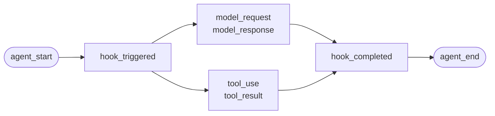

---
---
title: "الوكلاء المخصصون"
sidebarTitle: "الوكلاء المخصصون"
description: "أدرج وكيلًا كتبته بنفسك، أو إطار عمل لا يتوفر له محول."
icon: "code"
---

لوكيل كتبته بنفسك، أو إطار عمل لا يتوفر له محول من Failproof AI. لا يوجد شيء لإدراجه: أنت تُصدر الأحداث.

هذا هو نفس الواجهة البرمجية التي تستدعيها محولات الإطارات الأربعة. وهي جداول ترجمة فوقها.

## التثبيت

```bash
pip install failproofai-sdk
```

بدون إضافات، وبدون تبعيات.

## الإدراج

```python
import failproofai_sdk

failproofai_sdk.configure(environment="production")

with failproofai_sdk.session():                 # one run
    with failproofai_sdk.agent("planner"):      # one unit of work
        with failproofai_sdk.tool_call("search", input={"q": q}) as t:
            t.output = search(q)                # one tool call
```

اقرأه من الأعلى إلى الأسفل وسيخبرك بما يعنيه:

| لف فيه | لتقول |
| --- | --- |
| `session()` | هذه الأحداث تنتمي إلى نفس التشغيل |
| `agent()` | شيء ما يقوم بعمل — أعطه اسمًا ستتعرف عليه في القائمة |
| `tool_call()` | هذه أداة واحدة، وإليك ما أرجعته |

وما يصدره كل واحد بالفعل:

| النطاق | يصدر | الغرض |
| --- | --- | --- |
| `session()` | لا شيء | يربط معرف الجلسة، ويجمع تشغيلًا واحدًا |
| `agent()` | `agent_start`, `agent_end` | يحيط بوحدة عمل |
| `tool_call()` | `tool_use`, `tool_result` | يحيط بأداة واحدة ويقيسها |

كل شيء بداخله يمكن حذف `session_id` و `agent_id`. تربط النطاقات الهوية على متغيرات السياق وكل استدعاء حدث يقرأها مرة أخرى، لذا لا تمرر المعرفات عبر وظائفك أبدًا.

جميعها تعمل تحت `async with` وكذلك `with`.

وضع الوكلاء المتداخل يبني الشجرة. يتم حساب `parent_id` والعمق من المكدس:

```python
with failproofai_sdk.session():
    with failproofai_sdk.agent("supervisor"):
        with failproofai_sdk.agent("researcher"):    # parent_id = "supervisor"
            ...
```

## كيف يغلق النطاق

`agent()` يتعامل مع الاستثناءات نيابة عنك:

| ما حدث | الأحداث | النتيجة |
| --- | --- | --- |
| لا شيء تم رفعه | `agent_end` | `success` |
| `Exception` | `error`، ثم `agent_end` | `failed` |
| `KeyboardInterrupt`, `SystemExit` | `error`، ثم `agent_end` | `failed` |
| `CancelledError`, `GeneratorExit` | `agent_end` فقط | `cancelled` |

يتم إصدار الخطأ قبل `agent_end`، لأن لوحة المعلومات تغلق الامتداد في `agent_end` وأي شيء بعده ينسب إلى لا شيء. الإلغاء ليس فشلًا، لذا لا تلوث عمليات التشغيل الملغاة سطح الأخطاء. يتم إعادة رفع الاستثناء دائمًا: لا يبتلع نطاق أبدًا.

## طرق الأحداث

خمسة عشر طريقة في ست عائلات. معظمها يأتي على شكل أزواج — تصدر الفتاحة، ثم الأغلقة، وتقيس SDK الامتداد بينهما.

| العائلة | يفتح | يغلق | مستقل |
| --- | --- | --- | --- |
| **الوكلاء** | `agent_start` | `agent_end` | — |
| | `agent_pause` | `agent_resume` | — |
| **النماذج** | `model_request` | `model_response` | — |
| **الأدوات** | `tool_use` | `tool_result` | — |
| **الخطاطيف** | `hook_triggered` | `hook_completed` | — |
| **البشر** | `human_wait` | `human_input` | `human_pause`, `human_interrupt` |
| **الأخطاء** | — | — | `error` |

<Tip>
  فضّل النطاقات — `agent()` و `tool_call()` — حيثما تناسب. تضمن حدث الإغلاق حتى عندما يرفع الجسم استثناءً. وصل إلى هذه الطرق مباشرة عندما لا يتداخل تدفق التحكم، مثل استدعاء نموذج داخل دالة مساعدة.
</Tip>

<CodeGroup>
```python Agents
failproofai_sdk.event.agent_start(agent_id="planner", goal="find the cheapest flight")
failproofai_sdk.event.agent_end(agent_id="planner", outcome="success", summary="...")
failproofai_sdk.event.agent_pause(pause_id="p1", reason="awaiting approval")
failproofai_sdk.event.agent_resume(pause_id="p1")
```

```python Models
failproofai_sdk.event.model_request(
    model="gpt-4o-mini",
    messages=[{"role": "user", "content": "..."}],
    request_id="req-1",
)
failproofai_sdk.event.model_response(
    model="gpt-4o-mini",
    content="...",
    input_tokens=139,
    output_tokens=21,
    request_id="req-1",
    duration_ms=5202,
)
```

```python Tools
failproofai_sdk.event.tool_use(tool_name="search", tool_call_id="c1", input={"q": "..."})
failproofai_sdk.event.tool_result(tool_name="search", tool_call_id="c1", output="...")
```

```python Hooks
failproofai_sdk.event.hook_triggered(hook_name="retrieve", hook_id="h1", trigger_event="node")
failproofai_sdk.event.hook_completed(hook_name="retrieve", hook_id="h1", outcome="success")
```

```python Humans
failproofai_sdk.event.human_wait(input_id="i1", prompt="Approve?", options=["yes", "no"])
failproofai_sdk.event.human_input(input_id="i1", response="yes")
failproofai_sdk.event.human_pause(reason="operator paused the run", user_id="dana")
failproofai_sdk.event.human_interrupt(reason="operator stopped the run", at_step="step_3")
```

```python Failures
failproofai_sdk.event.error(
    error_type="TimeoutError",
    message="provider timed out after 30s",
    traceback="...",
)
```
</CodeGroup>

<Note>
  **عائلتا البشر تشيران في الاتجاهات المعاكسة.**

  | الطرق | المعنى |
  | --- | --- |
  | `human_wait` / `human_input` | **طلب الوكيل من شخص** — بوابة موافقة، سؤال توضيحي |
  | `human_pause` / `human_interrupt` | **شخص تصرف على الوكيل** — زر إيقاف، إيقاف مؤقت من المشغل |

  لا يشير أي إطار عمل الزوج الثاني، لذا فهو دائمًا لك لإصداره.
</Note>

<Warning>
  **مرر `request_id` عندما تعمل استدعاءات النموذج بالتزامن.** بدونه، يتم إقران الطلبات والردود بترتيب الوصول لكل وكيل — والمكالمات المتزامنة تقترن بشكل خاطئ، وتوصل كل رد إلى الطلب الخاطئ.
</Warning>

## مثال

حلقة استدعاء أدوات ضد OpenAI API، بدون إطار عمل للوكيل:

```python
import json

import failproofai_sdk
from openai import OpenAI

failproofai_sdk.configure(environment="production")
client = OpenAI()
MODEL = "gpt-4o-mini"


def turn(messages: list):
    """One model call, bracketed by the pair."""
    failproofai_sdk.event.model_request(model=MODEL, messages=messages)
    reply = client.chat.completions.create(model=MODEL, messages=messages, tools=TOOLS)
    usage = reply.usage
    failproofai_sdk.event.model_response(
        model=MODEL,
        content=reply.choices[0].message.content or "",
        input_tokens=usage.prompt_tokens,
        output_tokens=usage.completion_tokens,
    )
    return reply.choices[0].message


with failproofai_sdk.session():
    with failproofai_sdk.agent("inventory", goal="price report"):
        for _ in range(4):          # bounded; an unbounded agent loop is its own bug
            message = turn(messages)
            if not message.tool_calls:
                break
            messages.append(message.model_dump(exclude_none=True))
            for call in message.tool_calls:
                args = json.loads(call.function.arguments or "{}")
                with failproofai_sdk.tool_call(
                    call.function.name, tool_call_id=call.id, input=args
                ) as handle:
                    handle.output = run_tool(call.function.name, args)
                messages.append({
                    "role": "tool",
                    "tool_call_id": call.id,
                    "content": str(handle.output),
                })
```

ينتج عن هذا نفس أنواع الأحداث الستة التي يعطيك محول. تشحن النسخة الكاملة القابلة للتشغيل، مع تعريفات الأداة، في مستودع SDK تحت `docs/manual/examples/`.

## الخيوط والعمليات غير المتزامنة

تنتشر متغيرات السياق في مهام asyncio تلقائيًا. لا تنتشر في الخيوط الجديدة، لأن الخيط يبدأ بسياق فارغ.

```python
# asyncio: nothing to do
async with failproofai_sdk.session():
    await asyncio.gather(worker(1), worker(2))

# threads: wrap the callable
pool.submit(failproofai_sdk.propagate(work), x)
threading.Thread(target=failproofai_sdk.propagate(work)).start()
loop.run_in_executor(None, failproofai_sdk.propagate(work), x)
```

بدون `propagate()`، تثير أحداث العامل `TypeError` تسمي الإصلاح بدلاً من الهبوط بدون جلسة. هذا مقصود: حدث بدون جلسة يتم تخطيه بواسطة الاستيعاب والإجابة `200`، وهو الفشل الصامت الذي تم تصميم طبقة الهوية لمنعه.

## أدرج إطار عمل بدون محول

يعطيك كل إطار عمل للوكيل نفس ثلاثة طبقات. مرّرها ولديك تتبع كامل — لا تفعل المحولات الأربعة المشحونة أكثر من هذا.

| الطبقة | ما تكتبه | ما يصل |
| --- | --- | --- |
| التشغيل | `session()` + `agent()` | `agent_start`, `agent_end` |
| كل أداة | `tool_call()` | `tool_use`, `tool_result` |
| كل استدعاء نموذج | زوج `model_*` | `model_request`, `model_response` |

<Steps>
  <Step title="حيط التشغيل">
    ```python
    with failproofai_sdk.session():
        with failproofai_sdk.agent(agent_name, goal=task):
            result = framework.run(task)
    ```
  </Step>
  <Step title="حيط كل أداة">
    في أياً كان ما يسميه الإطار غلافًا للأداة أو وسيطًا.

    ```python
    with failproofai_sdk.tool_call(name, input=args) as call:
        call.output = original(**args)
    ```
  </Step>
  <Step title="زوّج كل استدعاء نموذج">
    ```python
    failproofai_sdk.event.model_request(model=model, messages=messages)
    reply = provider.complete(...)
    failproofai_sdk.event.model_response(
        model=model,
        content=text,
        input_tokens=usage.prompt_tokens,
        output_tokens=usage.completion_tokens,
    )
    ```
  </Step>
</Steps>

<Tip>
  **هل لديك عقدة أو حدود خطوة أو وسيط يستحق الرؤية؟** لفّه في زوج خطاطيف — `hook_triggered` / `hook_completed` — وليس وكيل `agent()` متداخل. `agent_id` هو جانب منخفض الأساسية، وإدخال واحد لكل عقدة يغرقه. تُعرض امتدادات الخطاطيف بنفس الطريقة وتعطيك كمون لكل عقدة.
</Tip>

<Note>
  **اليدوي والتلقائي يتكونان.** محول يعمل داخل نطاق مكتوب يدويًا ينضم إلى تلك الجلسة والآباء لهذا الوكيل، لذا تحصل على شجرة واحدة بدلاً من اثنتين — مفيد عندما تدرج إطار عمل واحد بنفسك إلى جانب واحد مدعوم.
</Note>

<Accordion title="لماذا لا يوجد محول AutoGen">
  سببان، والطبقات الثلاث أعلاه هي الإجابة على كليهما:

  - `autogen-core` لم يتم صيانته منذ سبتمبر 2025.
  - لا تفضح AG2 نقطة تسجيل على مستوى العملية معادلة لخطاطيف أطر العمل الأخرى، لذا فإن إدراجها يعني لف كل وكيل في كل موقع بناء.

  يسجل تخطيط الطبقات اليدوية نفس الأحداث، بنفس الدقة، كما سيفعل محول مشحون.
</Accordion>

## الذهاب أعمق

كيف يعمل التسجيل بالفعل. لا شيء من هذا مطلوب للبدء.

<AccordionGroup>

<Accordion title="ما يبدو عليه التسجيل، لكل إطار عمل" icon="eye">

كل تسجيل له نفس الشكل: يفتح امتداد، يتداخل العمل داخله، وكل حدث فتح يحصل على حدث إغلاق.



**الزوج** هو الوحدة. كل حدث إغلاق يحمل مدة تقيسها SDK من حدثها الافتتاحي.

فيما يلي تشغيل حقيقي واحد لكل إطار عمل — تم التقاطه من الأمثلة التي تشحن مع SDK، اسم النموذج معياري. لاحظ كم يعود من استدعاء واحد.

<Tabs>
  <Tab title="LangGraph">
    ```text 14 events
     1  +0.000s  agent_start       LangGraph
     2  +0.001s    hook_triggered  agent
     3  +0.002s      model_request   gpt-4o-mini
     4  +3.023s      model_response  gpt-4o-mini · 21 out-tok
     5  +3.024s    hook_completed  agent
     6  +3.024s    hook_triggered  tools
     7  +3.025s      tool_use      word_count
     8  +3.025s      tool_result   word_count · ok
     9  +3.025s    hook_completed  tools
    10  +3.026s    hook_triggered  agent
    11  +3.027s      model_request   gpt-4o-mini
    12  +5.717s      model_response  gpt-4o-mini · 5 out-tok
    13  +5.720s    hook_completed  agent
    14  +5.721s  agent_end         LangGraph · success
    ```

    تصبح العقد أزواج خطاطيف، لذا تحصل على كمون لكل عقدة دون أن تملأ قائمة الوكيل.
  </Tab>

  <Tab title="CrewAI">
    ```text 10 events
     1  +0.000s  agent_start       crew
     2  +0.050s    agent_start     analyst · under crew
     3  +0.057s      model_request   gpt-4o-mini
     4  +3.475s      model_response  gpt-4o-mini · 19 out-tok
     5  +3.478s      tool_use      lookup_metric
     6  +3.478s      tool_result   lookup_metric · ok
     7  +3.486s      model_request   gpt-4o-mini
     8  +5.694s      model_response  gpt-4o-mini · 9 out-tok
     9  +5.727s    agent_end       analyst · success
    10  +5.739s  agent_end         crew · success
    ```

    يصبح `role` لكل وكيل اسم امتداده، لذا ينقسم الكمون ومصروف التوكن حسب الدور.
  </Tab>

  <Tab title="LlamaIndex">
    ```text 26 events
     1  +0.000s  agent_start       Agent
     2  +0.001s    hook_triggered  init_run
     4  +0.501s    hook_triggered  setup_agent
     6  +0.503s    hook_triggered  run_agent_step
     7  +0.505s      model_request   gpt-4o-mini
     8  +3.083s      model_response  gpt-4o-mini · 18 out-tok
    10  +3.197s    hook_triggered  parse_agent_output
    12  +3.355s    hook_triggered  call_tool
    13  +3.355s      tool_use      city_population
    14  +3.355s      tool_result   city_population · ok
    16  +3.356s    hook_triggered  aggregate_tool_results
       ...                        second iteration
    26  +7.038s  agent_end         Agent · success
    ```

    حلقة الوكيل نفسها مرئية، وليس فقط استدعاءات النموذج الخاصة به.
  </Tab>

  <Tab title="Pydantic AI">
    ```text 8 events
    1  +0.000s  agent_start       agent
    2  +0.001s    model_request   gpt-4o-mini
    3  +4.413s    model_response  gpt-4o-mini · 17 out-tok
    4  +4.415s    tool_use        population
    5  +4.415s    tool_result     population · ok
    6  +4.416s    model_request   gpt-4o-mini
    7  +8.118s    model_response  gpt-4o-mini · 6 out-tok
    8  +8.119s  agent_end         agent · success
    ```

    لا توجد أزواج خطاطيف: Pydantic AI ليس لديه حد عقدة أو خطوة لحيط.
  </Tab>

  <Tab title="Custom agents">
    ```text 6 events
    1  +0.000s  agent_start       main
    2  +0.000s    tool_use        population
    3  +0.000s    tool_result     population · ok
    4  +0.000s    model_request   gpt-4o-mini
    5  +0.000s    model_response  gpt-4o-mini · 3 out-tok
    6  +0.000s  agent_end         main · success
    ```

    تصدر هذه بنفسك. نفس أنواع الأحداث، نفس الدقة — تكلفك مواقع المكالمة.
  </Tab>
</Tabs>

</Accordion>

<Accordion title="كيف تبدأ الجلسة وتنتهي" icon="circle-play">

**لا يوجد حدث نهاية جلسة.** الجلسة ليست شيئًا تغلقه — إنها مجموعة من الأحداث التي تشارك `session_id`.

يتم استنتاج الحالة من شكل التتبع:

| الحالة | متى |
| --- | --- |
| `ongoing` | لا يزال امتداد واحد على الأقل مفتوحًا |
| `paused` | `agent_pause` ليس له عنوان `agent_resume` المطابق |
| `error` | لا شيء مفتوح، وفشل حدث واحد على الأقل |
| `done` | لا شيء مفتوح، وفشل لا شيء |

لذا تنتهي الجلسة عندما يتم إغلاق كل زوج. تصدر المحولات `agent_end` نيابة عنك، وعند الهدم تغلق أي شيء لا يزال مفتوحًا وتصرفه كناقص — تستقر عملية تشغيل منهارة كـ `done` مع فجوة مرئية بدلاً من التعليق.

<Note>
  هذا هو السبب في أن الجلسة يمكن أن تمتد على استدعاءين. يوقف `interrupt()` من LangGraph التشغيل، وامتداد الجذر يبقى مفتوحًا متعمدًا، واستدعاء الاستئناف يغلقه. كلا الاستدعاءين جلسة واحدة.
</Note>

</Accordion>

<Accordion title="الهوية: session_id، agent_id، ومن يضربها" icon="fingerprint">

`session_id` و `agent_id` اختياريان على كل طريقة حدث. محذوف، يتم حلهما من النطاق المحيط:

```python
with failproofai_sdk.session():
    with failproofai_sdk.agent("planner"):
        failproofai_sdk.event.tool_use(tool_name="search", tool_call_id="c1")
```

تمريرها بشكل صريح لا يزال يعمل ويأخذ الأسبقية. بدون شيء مرتبط وبدون تمرير، يرفع الاستدعاء `TypeError` تسمي الإصلاح بدلاً من إصدار حدث بدون جلسة، والذي ستتخطاه الاستيعاب أثناء الإجابة `200`.

تربط النطاقات الهوية على متغيرات السياق. تنتشر تلك إلى مهام asyncio تلقائيًا ولكن ليس إلى خيوط جديدة — لف العامل في `failproofai_sdk.propagate()`.

#### من يضرب أي معرف

| المعرف | يضرب بواسطة | ملاحظات |
| --- | --- | --- |
| `session_id` | أنت، أو SDK | `session("chat-42")` يُستخدم حرفيًا؛ محذوف، SDK يُنشئ `uuid4().hex` |
| `agent_id` | أنت، أو الإطار | من `agent("analyst")`، أو `role` من CrewAI، أو `FunctionAgent.name`. تُرفض القيمة التي تبدو مثل UUID وتُستبدل |
| `tool_call_id`, `hook_id`, `request_id` | أنت، أو الإطار | تعيد المحولات استخدام معرفات التشغيل الخاصة بالإطار، وهذا هو السبب في بقاء الأزواج بعد قفزات الخيط |
| **معرف الحدث** | **السحابة، عند الاستيعاب** | SDK لا يصدر أي شيء |
| **`dedup_key`** | **السحابة، عند الاستيعاب** | بصمة تجزئة من org والجلسة والطابع الزمني والنوع والحمل. هذه هي الهوية الحقيقية — فهي تجعل دفعة معاد محاولتها تنهار بدلاً من التكرار |

#### كيف تحل المحولات `session_id`

المباراة الأولى تفوز:

1. `session_id` صريح خيار
2. البيانات الوصفية لكل استدعاء
3. نطاق `session()` المحيط
4. البيانات الوصفية للإطار
5. معرف التشغيل الخاص بالإطار

لا يتم اختراعه أثناء وجود أحد هؤلاء — سيؤدي معرف مركب إلى تقسيم تشغيل واحد عبر عدة جلسات.

#### احتفظ بـ `agent_id` منخفض الأساسية

إنه الجانب الأساسي على كل سطح لوحة معلومات، وعمود `LowCardinality(String)`. قيمة لكل تشغيل تضعف العمود وتملأ منتقي التصفية بإدخال واحد لكل تشغيل.

تدافع المحولات عن هذا العمود نيابة عنك:

| الإطار يسلّم | مسجل باسم | لماذا |
| --- | --- | --- |
| `3f9a1c2b-…` (UUID) | `main` | لا شيء قابل للقراءة للحفظ |
| سلسلة سداسية عشرية عارية طويلة | `main` | نفس الشيء |
| `agent-3f9a1c2b-…` | `agent` | معرف كل تشغيل مقطوع، الجزء القابل للقراءة محفوظ |
| `agent-v2` | `agent-v2` | يتم ترك الأجزاء القصيرة وحدها |
| `step-3` | `step-3` | نفس الشيء |

معرف حقيقي محفوظ على `fw_agent_id` / `fw_run_id`، حيث يبقى قابلًا للاستعلام بدون أن يكون جانبًا.

<Warning>
  **هذا الحارس يلمس فقط التسميات التي **اختارها الإطار**. `agent_id` تمرره بنفسك — إلى `event.*`، أو إلى `failproofai_sdk.agent(...)` — يتم تسجيله بالضبط كما هو معطى. إعادة كتابة حجة صريحة بصمت ستكون أسوأ من الأساسية التي تمنعها، لذا سمّ امتداداتك وفقًا لذلك.
</Warning>

</Accordion>

<Accordion title="أنواع الأحداث، مجمعة — وأي إطار عمل يسجل ما" icon="table">

| المجموعة | الأحداث |
| --- | --- |
| الوكلاء | `agent_start`, `agent_end`, `agent_pause`, `agent_resume` |
| النماذج | `model_request`, `model_response` |
| الأدوات | `tool_use`, `tool_result` |
| الخطاطيف | `hook_triggered`, `hook_completed` |
| البشر | `human_wait`, `human_input`, `human_pause`, `human_interrupt` |
| الأخطاء | `error` |

أي إطار عمل يسجل ما، المقاس من التشغيلات أعلاه:

| الحدث | LangGraph | CrewAI | LlamaIndex | Pydantic AI | Custom |
| --- | :--: | :--: | :--: | :--: | :--: |
| بدء الوكيل ونهايته | Yes | Yes | Yes | Yes | You |
| طلب النموذج والرد | Yes | Yes | Yes | Yes | You |
| استخدام الأداة والنتيجة | Yes | Yes | Yes | Yes | You |
| تم تشغيل الخطاف واكتمل | Node | Task | Step | — | You |
| خطأ | Yes | Yes | Yes | Yes | Automatic |
| انتظار الإنسان والإدخال | Yes | Yes | Yes | — | You |
| إيقاف الوكيل واستئنافه | Yes | Yes | Yes | — | You |

شرطة تعني الإطار ليس لديه مثل هذا المفهوم. `human_pause` و `human_interrupt` يصفان **شخصًا** يتصرف على الوكيل، والذي لا يشير إليه أي إطار عمل — أصدر هؤلاء بنفسك.

</Accordion>

<Accordion title="الأزواج والارتباط والمدة" icon="link">

حدث أبدًا لا يصل وحده. يفتح امتداد واحد، يغلق واحد، وحدث الإغلاق يحمل مدة تقيسها SDK من الحدث الافتتاحي.

| يفتح | يغلق | حدث الإغلاق يحمل |
| --- | --- | --- |
| `agent_start` | `agent_end` | `outcome`, `summary` |
| `model_request` | `model_response` | توكنات، `stop_reason`، الكمون |
| `tool_use` | `tool_result` | `output` أو `error`، المدة |
| `hook_triggered` | `hook_completed` | `outcome`، المدة |
| `agent_pause` | `agent_resume` | كم دامت الإيقافة |
| `human_wait` | `human_input` | الإجابة، وكم من الوقت استغرق الشخص |

<Warning>
  حدث افتتاح بدون إغلاق هو امتداد لا ينتهي. الجلسة تُعرض كما لو كانت لا تزال قيد التشغيل، إلى الأبد، ومدة نشاطها الفعلية تستمر في الزيادة. هذا هو وضع الفشل الذي يجب الحذر منه عندما تدرج يدويًا.
</Warning>

#### قواعد الارتباط

- أعد استخدام نفس `tool_call_id`, `hook_id`, `pause_id`, أو `input_id` لحدث الإكمال المطابق.
- SDK يحسب `duration_ms` لـ `tool_result`, `hook_completed`, `agent_resume`, و `human_input`. تمريره إلى تلك الطرق يرفع `ValueError`.
- يتم قبول `duration_ms` **في** `model_response`، لأن المتصل فقط يعرف الكمون الحقيقي للمزود. يجب أن يكون عددًا صحيحًا — عدد عشري يرفع `ValueError` في موقع الاستدعاء، لأن الخادم يقرأ العمود كعدد صحيح بدون إشارة 32 بت وسيخزن NULL لأي شيء آخر.
- مفاتيح الارتباط محدودة حسب النوع والجلسة، لذا قد تشارك أداة وخطاف معرفًا بأمان، وقد تعيد جلستان متزامنتان استخدام نفس المعرفات بدون تضارب. لا تقتصر على الوكيل: الزوج الذي يُفتح تحت وكيل واحد ويُغلق تحت وكيل آخر لا يزال يرتبط، وهي الحالة العادية في أطر العمل متعددة الوكلاء.
- `request_id` يقترن `model_request` مع `model_response`. بدونه، تُقرن أحداث النموذج بالترتيب لكل وكيل، لذا تقترن المكالمات المتزامنة بشكل خاطئ.
- الزوج المقسم عبر العمليات لا يزال يرتبط باتجاه مصب النهر، لكن SDK لا يمكنه حساب مدته داخل العملية.
- خريطة قيد الانتظار تحتوي على 000 بداية على الأكثر، وتطرد الإدخال الأقدم عندما تكون ممتلئة.

</Accordion>

<Accordion title="ما الذي يحتويه الحزمة، وكيف يجد instrument() إطار العمل الخاص بك" icon="box">

تثبيت `failproofai-sdk` يثبت كل شيء، جميع محولات الأربعة مضمنة. تسحب الإضافات **الإطار**، وليس المحول.

```python
import failproofai_sdk        # loads nothing outside the standard library
failproofai_sdk.instrument()  # imports only the adapters you actually need
```

`import failproofai_sdk` منطقيًا بدون تبعيات، يتم إنفاذه بواسطة اختبار يثبت الـ wheel المبني مع `--no-deps` وآخر يثبت عدم وصول أي إطار عمل إلى `sys.modules`.

<Warning>
  لا يوجد `failproofai_sdk.crewai` attribute. المحولات متعمدة غير معروضة على حزمة المستوى الأعلى: لمس واحد كان سيستورد الإطار كأثر جانبي لوصول الخاصية، مكسرًا وعد عدم التبعية. استخدم `instrument()`.
</Warning>

```python
failproofai_sdk.instrument()              # every framework already imported
failproofai_sdk.instrument("crewai")      # exactly one, by name
failproofai_sdk.uninstrument("crewai")    # put it back
```

| الاسم | يقبل أيضًا |
| --- | --- |
| `langchain` | `langgraph`, `langchain_core` |
| `crewai` | — |
| `llama_index` | `llamaindex`, `llama-index` |
| `pydantic_ai` | `pydantic-ai`, `pydanticai` |

يقرأ الكشف التلقائي `sys.modules`، وليس قائمة الحزمة المثبتة، لذا الإطار الذي لديك مثبت لكن لم تستورده أبدًا لا يتم إدراجه ولا يتم استيراده بالنيابة عنك. لترى ما يتم وضعه:

```python
from failproofai_sdk.integrations import active, available

available()   # ('crewai', 'langchain', 'llama_index', 'pydantic_ai')
active()      # ('langchain',)
```

<Note>
  **`instrument("crewai")` على آلة بدون CrewAI لا يرفع.** إنه يسجل تحذيرًا ويعود `()`، لذا إطار واحد مفقود لا يأخذ عملية تدرج الآخرين.

  التحذير يحمل `ImportError` الأساسي، وتلك الرسالة تسمي أمر التثبيت الدقيق — لذا الإصلاح في سجلاتك، وليس مخفيًا.

  ```text
  ImportError: failproofai_sdk: cannot instrument 'crewai' because 'crewai.events'
  is not importable. Install it with:  pip install 'failproofai_sdk[crewai]'
  ```

  اضبط `FAILPROOFAI_SDK_STRICT=1` لجعله يرفع بدلاً من ذلك. يتم قراءة هذا الرايز **مرة واحدة وتخزينه مؤقتًا**، لذا صدّره قبل أن تبدأ عمليتك بدلاً من تعيينه في منتصف التشغيل.
</Note>

<Warning>
  **`instrument()` يجب أن يأتي *بعد* استيراد إطار العمل الخاص بك.** الكشف التلقائي يقرأ `sys.modules`، لذا استدعاء عاري فوق الاستيراد يجد لا شيء، ويثبت لا شيء، ويعود `()`.
</Warning>

<CodeGroup>
```python Wrong
import failproofai_sdk
failproofai_sdk.instrument()   # sys.modules has no langchain yet -> ()

import langchain               # too late, nothing is wired
```

```python Right
import langchain               # import the framework first
import failproofai_sdk

failproofai_sdk.instrument()   # finds it -> ('langchain',)
```

```python Right, order-proof
import failproofai_sdk

# Naming it imports the adapter on request, so this works from anywhere.
failproofai_sdk.instrument("langchain")
```
</CodeGroup>

أخطئ في هذا والعملية تعمل مع SDK مستوردة، والمحول يبدو منصبًا، و **لم يصدر حدث واحد**. إنه يسجل تحذيرًا يقول بالضبط ذلك — لذا تحقق من سجلاتك أولاً عندما لا يسجل التشغيل شيئًا.

</Accordion>

<Accordion title="كيف تصل الأحداث إلى السحابة" icon="cloud-upload">


| المرحلة | الوظيفة | يعمل في |
| --- | --- | --- |
| المحول | يترجم استدعاء استدعاء الإطار إلى أحد أنواع الأحداث الـ 15 | عمليتك |
| الكاتب | يصف قائمة، دفعات، يكتب JSONL بذرية | عمليتك، خيط خلفي |
| البكرة | نقل متين، يبقى بعد خروج عمليتك | قرص محلي |
| الشيطان | يراقب البكرة، يشحن الدفعات، يحذف ما شحنه | آلتك |
| الاستيعاب | يعين معرف الصف ومفتاح dedup، ينقل الأعمدة القابلة للاستعلام | السحابة |

البكرة هي ما يجعل هذا آمنًا: وكيلك لا ينتظر أبدًا الشبكة، وانقطاع السحابة يعني ديريتوري متنامي بدلاً من فقدان الأحداث.

كل تصريف يكتب ملف دفعة واحدة، `.tmp` أولاً، ثم `fsync`، ثم إعادة تسمية ذرية:

```text
~/.failproofai/custom-agents/events/
  event-2026-08-20T10-15-00-123Z-48213-0.jsonl
```

الشيطان يلتقط `.jsonl` فقط، لذا لا يمكنه أبدًا قراءة ملف نصف مكتوب. الساق يحمل طابعًا زمنيًا ومعرف عملية ورقم تسلسل، لذا عمليتان تصريفتان في نفس الميلي ثانية لا يمكن أن تصطدما. يتم تغطية قائمة الانتظار بـ 000 حدث؛ بعد ذلك يسقط الأقدم ويسجل.

<Warning>
  **`collector.redact` يافتراضي إلى `minimal` لأحداث SDK أيضًا.** يكشط SDK قبل كتابة دفعة على القرص، ويكرر الشيطان نفس المسار الحتمي قبل التحميل بحيث تكون الدفعات من SDKs الأقدم محمية.
</Warning>

يقرأ الشيطان كل دفعة ويطبق الكشط في الذاكرة قبل التحميل. لا يعيد كتابة ملف البكرة الذي قرأه.

| الأحداث | مكتوب بواسطة | أين يعمل الكشط الحد الأدنى |
| --- | --- | --- |
| نصوص جلسات CLI | الشيطان | قبل كتابة الشيطان للدفعة |
| نشاط الخطاطيف | الشيطان | قبل كتابة الشيطان للدفعة |
| **كل شيء يصدره SDK** | **عمليتك** | **قبل كتابة SDK للدفعة وقبل تحميل الشيطان مرة أخرى** |

اضبط `collector.redact` على `off` فقط عندما تكون الحمولات الحرفية متطلبًا صريحًا؛ SDK والشيطان كلاهما يحترم هذا الإعداد. يمسك الكشط الحد الأدنى مفاتيح API الشائعة والتوكنات الحاملة و JWTs والتنازلات السرية. لا يمكنها تحديد نثر حساس تعسفي.

<Tip>
  **تتحكم في الحمولات في المصدر، في مكانين:**

  - أطفئ التقاط المحتوى على المحول. **اسم الخيار يختلف، وأحد المحولات ليس لديه** — هذا ليس مفتاحًا عامًا واحدًا:
    - LangChain / LangGraph، Pydantic AI — `capture_content=False`
    - LlamaIndex — `capture_messages=False`
    - CrewAI — **لا توجد مفاتيح محتوى على الإطلاق**؛ `session_id` هو الخيار الوحيد الذي تقرأه، لذا يتم تسجيل المطالبات والإكمالات دائمًا.

    `instrument()` يسقط الخيارات التي لا يقرأها محول، لذا تمرير الاسم الخاطئ لا يرفع شيئًا ولا يغير شيئًا.
  - لا تسلم السر `input=` في المقام الأول.

  `collector.redact` دفاع متعمق، وليس بديلاً لأي منهما.
</Tip>

<Warning>
  **ديريتوري بكرة فارغ هو الحالة الصحية.** لا تستخدمه للتحقق من التسليم.
</Warning>

يحذف الشيطان كل دفعة في ميلي ثانية من شحنها، لذا `ls` يتسابق مع جامع البيانات ويُظهر جزءًا من ما أصدرته — لا يمكن تمييزه عن SDK لم يسجل شيئًا.

لتأكيد وصول الأحداث بالفعل، تحقق من لوحة المعلومات. لمراقبة ملء البكرة، توقف الشيطان أولاً.

</Accordion>

<Accordion title="عندما يفشل الإدراج" icon="triangle-alert">

كل استدعاء يعمل داخل غلاف وظيفته الوحيدة إعادة الرفع، لذا استدعاؤك يجلس في `try` واحد تمامًا وكل ما يفعله SDK يحدث خارجه.

| ما يحدث | النتيجة |
| --- | --- |
| خطاف يرفع | مسجل مرة واحدة مع التتبع الخاص به. استدعاؤك لم يتأثر |
| نفس الخطاف يرفع ثلاث مرات | يتم تعطيل هذا الخطاف الواحد لبقية العملية، بسطر خطأ واحد |
| `FAILPROOFAI_SDK_STRICT=1` تم تعيينه | يتم إعادة رفع الاستثناء بدلاً من ذلك |
| إصدار إطار عمل خارج النطاق المختبر | يحذر مرة واحدة، يدرج على أي حال |
| قدرة واحدة مفقودة | يتم تعطيل هذا الخطاف الواحد، ليس المحول كله |

الافتراضي صحيح في الإنتاج وخاطئ أثناء التصحيح، لأنه يمكن فقط إثبات أنه لم ينهار. اضبط `FAILPROOFAI_SDK_STRICT=1` لجعل الفشل المبلل عالي الصوت.

</Accordion>

</AccordionGroup>

## مشاكل شائعة

<AccordionGroup>
  <Accordion title="امتداد لا ينتهي أبدًا">
    حدث افتتاح بدون إغلاق: `model_request` بدون `model_response`، أو `tool_use` بدون `tool_result`. استخدم النطاقات، التي تضمن الزوج حتى عندما يرفع الجسم. إذا استدعيت طرق الحدث مباشرة، استخدم `try` و `finally`.
  </Accordion>

  <Accordion title="تمرير duration_ms يرفع ValueError">
    يتم قياسه من حدث الفتح المطابق، لذا يتم رفضه على `tool_result`, `hook_completed`, `agent_resume`, و `human_input`. يتم قبوله على `model_response`، لأن فقط أنت تعرف كمون المزود الحقيقي، ويجب أن يكون عددًا صحيحًا.
  </Accordion>

  <Accordion title="الأحداث من خيط عامل ترفع TypeError">
    الخيط لم يرث السياق أبدًا. لف الاستدعاء في `failproofai_sdk.propagate()`. انظر [الخيوط والعمليات غير المتزامنة](#threads-and-async).
  </Accordion>

  <Accordion title="حقل إضافي اختفى أو استبدل شيئًا">
    الحقول الإضافية تدمج أخيرًا، لذا الحقل المسمى مثل حقل حقيقي مثل `model` أو `outcome` كان سيستبدله ويغير عمودًا مخزنًا. مساحة الأسماء لك؛ المحولات تستخدم بادئة `fw_`.
  </Accordion>

  <Accordion title="مرشح الوكيل به آلاف الإدخالات">
    `agent_id` هو جانب منخفض الأساسية وأدخلت معرف التشغيل. استخدم اسم دور أو عقدة وضع المعرف الحقيقي في حقل حمولة.
  </Accordion>
</AccordionGroup>

## التالي

<Columns cols={3}>
  <Card title="كيف يعمل" icon="workflow" href="/ar/reference/custom-agents">
    الأزواج والمعرفات ودورة حياة الجلسة والتسليم.
  </Card>
  <Card title="اقرأ تتبعًا" icon="route" href="/ar/sessions/read-a-trace">
    اتبع السببية عبر الجلسة التي استعرتها للتو.
  </Card>
  <Card title="محولات الإطار" icon="plug" href="/ar/start/integrations">
    LangGraph، CrewAI، LlamaIndex، و Pydantic AI.
  </Card>
</Columns>