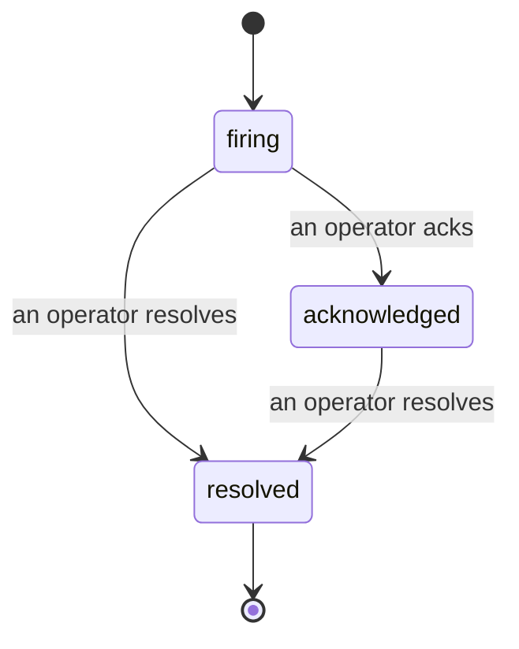

Issues track alert breaches and manually reported problems, including ownership and history.

*The inbox groups open issues by state and filters by severity and assignee.*

## Track ownership

A breach opens an issue in the shared inbox. Operators can acknowledge it, assign an owner,
and filter by severity or assignee. Multiple acknowledgements are recorded separately.

## Review the timeline

Each issue includes breach evidence, assignees, subscribers, comments, and an append-only
activity timeline.

*Everything that happened, in order, each line signed by whoever did it.*

Each entry identifies the operator or **automated** actor that created it.

## Issue states

- **Open (firing):** a breach opens the issue and notifies its channels. Repeated breaches
  update the same issue.
- **Acknowledged:** an operator owns it. Later breaches update its evidence.
- **Resolved:** an operator closes it. Issues do not resolve automatically. The same alert
  can open another issue later.

One alert can have one open issue at a time. You can also open a standalone issue or attach
one to an alert with `incidents:write`.

## Where to find it

Issues live at `/<org-slug>/issues`. Viewing requires **`incidents:read`**; opening an issue
requires **`incidents:write`**; acknowledging, assigning, commenting, and resolving require
**`incidents:ack`**. Older keys with `alerts:ack` remain compatible.

## Related

- [Alerts](/cloud/alerts): rules that open issues when a threshold breaches.
- [Errors](/cloud/errors): see every failure in one place and promote one to an alert.
- [Audits](/cloud/audits): the scheduled analyst that finds the failures no rule was watching.
