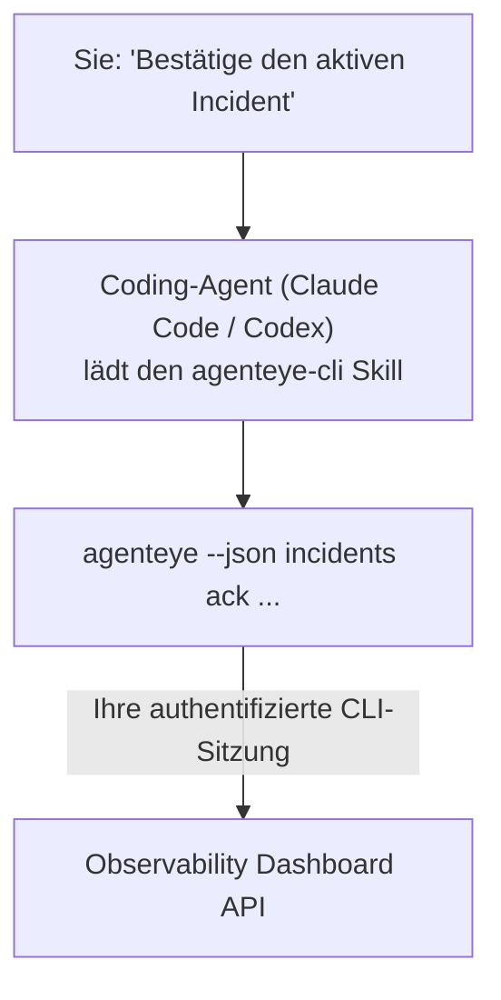

Fragen Sie Ihren Coding-Agenten *„Ist heute irgendetwas kaputt?"* und lassen Sie ihn direkt aus Ihren Live-Daten von Failproof AI Observability antworten – ganz ohne Befehle auswendig zu lernen. Der **Failproof AI Observability CLI Skill** (`agenteye-cli`) ist ein *Agent Skill*: ein kleiner Ordner mit Anweisungen, den ein Coding-Agent wie Claude Code oder Codex bei Bedarf lädt. Er bringt dem Agenten bei, Ihr Observability-Deployment über die [`agenteye` CLI](/de/agenteye/cli) mit einfachen Formulierungen auf Englisch zu steuern, zum Beispiel *„Gib CI einen Schlüssel, der nur Events pushen darf"* oder *„Bestätige den aktiven Incident und weise ihn mir zu."*

Es handelt sich **nicht** um einen Dienst oder ein separates Binary – es gibt nichts zu deployen. Der Skill setzt auf der bereits installierten CLI auf: Der Agent ruft `agenteye --json …` auf, verarbeitet das saubere JSON und antwortet Ihnen in Prosa. Alles, was er tun kann, könnten Sie auch selbst durch Eingabe derselben Befehle erreichen.

---

## Verhältnis zu den anderen Failproof AI Observability-Schnittstellen

Failproof AI Observability bietet vier Wege, um auf dieselben Daten und Steuerungsmöglichkeiten zuzugreifen. Sie ergänzen einander:

| Schnittstelle | Was es ist | Wo es läuft | Wann Sie es verwenden |
|---|---|---|---|
| **[CLI](/de/agenteye/cli)** | Die Befehls- und Flag-Referenz für `agenteye` | Ihr Terminal | Wenn Sie einen bestimmten Befehl ausführen oder scripten möchten |
| **[CLI-Rezepte](/de/agenteye/cli-recipes)** | Copy-paste-`jq`-/Pipeline-Muster | Ihr Terminal / Skripte | Wenn Sie die CLI in Automatisierungen einbinden |
| **CLI Skill** (dieses Dokument) | Ein natürlichsprachlicher Einstieg in die CLI | Ihr Coding-Agent auf Ihrer Workstation | Wenn Sie einfach fragen möchten und den Agenten den richtigen Befehl wählen lassen |
| **[Evaluator Skill](/de/agenteye/evaluator-skill)** | Ein Geschwister-Skill, der Ihren Scoring-Dienst entwirft und aufbaut | Ihr Coding-Agent auf Ihrer Workstation | Wenn Sie Eval-Scores *erzeugen* statt nur lesen möchten |
| **[Python SDK Skill](/de/agenteye/python-sdk-skill)** | Ein Geschwister-Skill, der Ihren Agenten instrumentiert, damit er überhaupt Telemetriedaten ausgibt | Ihr Coding-Agent auf Ihrer Workstation | Wenn Ihr Agent die Events, die dieser Skill liest, erst *erzeugen* soll |
| **[In-Dashboard-KI-Assistent](/de/agenteye/assistant)** | Ein im Dashboard eingebetteter Chat | Serverseitig (im Dashboard) | Wenn Sie im Dashboard Fragen über Ihre Daten stellen möchten |

Der Skill selbst besitzt keine eigenen Berechtigungen; er übersetzt Ihre Worte lediglich in CLI-Aufrufe, die als Sie ausgeführt werden:



### vs. der In-Dashboard-KI-Assistent: ein wichtiger Unterschied

Dies sind zwei unterschiedliche Werkzeuge mit sehr verschiedenen Wirkungsradien:

- Der **In-Dashboard-KI-Assistent** ([KI-Assistent](/de/agenteye/assistant)) ist ein im Dashboard eingebetteter Chat, der vom Agentendienst unterstützt wird. Er ist **lesend plus genehmigungspflichtig beim Erstellen**: Er kann gespeicherte Abfragen und Dashboards entwerfen, aber jeder Schreibvorgang pausiert für Ihre explizite Bestätigung per Klick – und er löscht niemals. Er ist durch die Berechtigung `agent:use` gesichert und sieht stets nur Daten der Organisation, die Sie gerade ansehen.
- Der **CLI Skill** läuft auf *Ihrer* Workstation innerhalb *Ihres* Coding-Agenten und steuert die `agenteye` CLI als **Sie**. Er kann die **gesamte Oberfläche der CLI nutzen, einschließlich Mutationen** (API-Schlüssel erstellen/rotieren/deaktivieren, Org-Einstellungen ändern, Incidents lösen, gespeicherte Abfragen löschen) – begrenzt nur durch die Berechtigungen Ihres CLI-Logins. Gehen Sie damit genauso sorgfältig um, wie Sie mit dem manuellen Eingeben derselben Befehle umgehen würden.

---

## Voraussetzungen

1. Die **`agenteye` CLI ist installiert** und im `PATH` verfügbar (siehe [CLI](/de/agenteye/cli)-Referenz: `pipx install agenteye`).
2. Ihre **Dashboard-URL** ist gesetzt (`AGENTEYE_DASHBOARD_URL` oder der Agent übergibt `--base-url`).
3. Eine **aktive Sitzung**: Führen Sie `agenteye login` selbst aus. Der Skill kann den per E-Mail zugesandten Einmalcode-Login **nicht** für Sie abschließen; er weist Sie an, `agenteye login` auszuführen, falls die Sitzung fehlt oder abgelaufen ist (CLI-Exit-Code `4`).

---

## Bezugsquelle

Der Skill ist in Failproof AIs öffentlicher Skills-Sammlung veröffentlicht:

**[github.com/FailproofAI/skills](https://github.com/FailproofAI/skills)** → [`skills/agenteye-cli/`](https://github.com/FailproofAI/skills/tree/main/skills/agenteye-cli)

Es gibt keine Zugangsbeschränkungen – das Repository ist öffentlich, und der Skill benötigt keine eigenen Zugangsdaten, da er lediglich die **öffentliche** `agenteye` CLI gegen *Ihr* Dashboard betreibt und dabei die Sitzung verwendet, mit der *Sie* sich angemeldet haben. Sie müssen niemanden darum bitten.

Beachten Sie, dass der Skill als eigener Ordner ausgeliefert wird und **nicht** im `pipx install agenteye`-Paket enthalten ist – suchen Sie dort also nicht danach.

## Den Skill installieren

Der schnellste Weg ist die [`skills`](https://skills.sh) CLI, die den Ordner abruft und dort ablegt, wo Ihr Agent ihn sucht:

```bash
# Claude Code, nur dieses Projekt
npx skills add FailproofAI/skills --skill agenteye-cli -a claude-code

# jedes Projekt (installiert nach ~/.claude/skills/)
npx skills add FailproofAI/skills --skill agenteye-cli -a claude-code -g --copy

# stattdessen Codex
npx skills add FailproofAI/skills --skill agenteye-cli -a codex
```

Dann verwalten Sie ihn wie jeden anderen Skill:

```bash
npx skills list -a claude-code      # was ist installiert
npx skills update agenteye-cli      # neueste Version laden
npx skills remove agenteye-cli      # entfernen
```

Lieber manuell installieren? Ein Agent Skill ist nur ein Ordner mit einer `SKILL.md` (plus optionalen Referenzen), daher funktioniert auch einfaches Kopieren:

- **Claude Code**: Legen Sie den Ordner `agenteye-cli/` in `~/.claude/skills/` (alle Projekte) oder `<Ihr-Repo>/.claude/skills/` (nur dieses Repo) ab. Claude Code erkennt ihn automatisch – überprüfen Sie dies mit der `/skills`-Liste oder stellen Sie einfach eine Frage, die seiner Beschreibung entspricht.
- **Codex (OpenAI)**: Codex liest dieselbe `SKILL.md`. Die mitgelieferte `agents/openai.yaml` setzt `allow_implicit_invocation: true`, sodass Codex den Skill automatisch auswählt, wenn eine Aufgabe passt; andernfalls rufen Sie ihn explizit als `$agenteye-cli` auf.

---

## Sicherheit: Mutationen fragen NICHT nach Bestätigung, wenn ein Agent die CLI ausführt

> **Warnung:** Lesen Sie dies, bevor Sie einem Agenten erlauben, Änderungen vorzunehmen.

Die `agenteye` CLI fragt normalerweise *„Sind Sie sicher?"* vor einer destruktiven Aktion. Sie **überspringt diese Bestätigung automatisch, wenn sie nicht an ein Terminal angebunden ist (was genau der Fall ist, wenn ein Coding-Agent sie ausführt) – und `--json` überspringt sie ebenfalls.** Die Sicherheitsabfrage wird für den Agenten also **nicht** ausgelöst.

Der Skill ist so konzipiert, dass er dies ausgleicht: Er ist angewiesen, den genauen Befehl anzugeben, den er ausführen wird, und Ihr ausdrückliches **OK vor jeder Zustandsänderung** einzuholen. Halten Sie diese Disziplin aufrecht. Wenn Sie Failproof AI Observability über einen Agenten steuern, sind *Sie* der Bestätigungsschritt. Die zustandsändernden Befehle, auf die Sie achten sollten:

- `keys create` / `update` / `disable` / `regenerate`
- `users create` / `update` / `disable` / `enable`
- `settings set`
- `alerts create` / `update` / `delete` / `test`
- die schreibenden `incidents`-Unterbefehle: `ack` / `assign` / `resolve` / `open` / `comment-add` / `comment-delete` / `subscribe` / `unsubscribe`
- `query create` / `update` / `delete`
- `agent rename` / `delete`
- `orgs switch`

Alles unter **Observe** (`events`, `sessions`, `evals`, `errors`, `list`, `whoami`, `orgs list/current/perms`) ist schreibgeschützt und ändert nichts.

Da der Agent als **Sie** handelt, kann er nur das tun, wozu Ihr Login berechtigt ist; Berechtigungen werden **pro Organisation** aufgelöst (siehe [API-Schlüssel](/de/agenteye/api-keys)). Ein Befehl, für den Ihnen die Berechtigung fehlt, gibt Exit-Code `5` mit dem genauen Berechtigungsnamen zurück – der Agent kann Ihnen also genau sagen, was Sie bei einem Administrator anfragen müssen, anstatt undurchsichtig zu scheitern.

---

## Was Sie fragen können

So sieht ein echter Durchlauf aus – erst eine Leseoperation, dann eine Änderung, die auf Ihre Zustimmung wartet:

```text
Sie    ▸ Ist in den letzten 24 Stunden irgendetwas kaputt gegangen?

Agent  ▸ Ausführen: agenteye --json errors --since 24h --aggregate
         3 Fehlertypen in den letzten 24 Stunden. Der häufigste ist TimeoutError
         (18 Treffer, alle beim checkout-agent), dann RateLimited (5).
         Soll ich die fehlgeschlagenen Sessions für TimeoutError abrufen?

Sie    ▸ Gib CI einen Schlüssel, der nur Events pushen darf.

Agent  ▸ Damit wird ein API-Schlüssel erstellt. Ich führe Folgendes aus:
           agenteye keys create ci --add events:add
         OK zum Fortfahren?

Sie    ▸ ja

Agent  ▸ Fertig. Schlüssel „ci" erstellt mit events:add als einziger Berechtigung.
         Der Secret wird nur einmal angezeigt – speichern Sie ihn jetzt. Ich kann ihn nicht erneut ausgeben.
```

Der Skill ordnet jede natürlichsprachliche Absicht dem richtigen `agenteye`-Befehl zu, ermittelt dabei gültige Werte vorab (`list <kind>`, `whoami`), sodass er nicht rät, und gibt den genauen Befehl vor jeder Änderung an. Weitere Beispiele:

- *„Ist in den letzten 24 Stunden irgendetwas kaputt / fehlgeschlagen?"* → `errors --since 24h --aggregate`, dann eine Aufschlüsselung.
- *„Warum ist Session `run-001` fehlgeschlagen?"* → `events --session-id run-001 --all` + `evals --session-id run-001`.
- *„Wie entwickelt sich die Qualität diese Woche?"* → `evals --aggregate --since 7d`, dann Einblick in schlecht bewertete Läufe.
- *„Gib CI einen Schlüssel, der nur Events pushen darf."* → `keys create ci --add events:add` (der Skill gibt den Befehl an, erstellt ihn dann und erfasst das einmalige Secret).
- *„Wer hat Zugriff? Mache Dana schreibgeschützt."* → `users list` → `users update dana@… --permission-set read-only` (nach Bestätigung durch Sie).
- *„Bestätige den aktiven Incident und weise ihn mir zu."* → `incidents list --state firing` → `incidents ack <id>` / `incidents assign <id> Sie@…`.

Die genauen Befehle, Flags und JSON-Strukturen dahinter finden Sie in der [CLI](/de/agenteye/cli)-Referenz und den [CLI-Rezepten für Agenten](/de/agenteye/cli-recipes).

---

## Nächste Schritte

- **[CLI](/de/agenteye/cli)**: vollständige Befehls- und Flag-Referenz für `agenteye`.
- **[CLI-Rezepte für Agenten](/de/agenteye/cli-recipes)**: Copy-paste-`jq`-Muster und Exit-Code-Behandlung.
- **[Evaluator Agent Skill](/de/agenteye/evaluator-skill)**: der Geschwister-Skill zum Aufbau des Evaluators, dessen Scores `agenteye evals` liest.
- **[Python SDK Agent Skill](/de/agenteye/python-sdk-skill)**: der Geschwister-Skill zur Instrumentierung eines Agenten, damit er die Telemetriedaten ausgibt, die `agenteye` liest.
- **[KI-Assistent](/de/agenteye/assistant)**: der In-Dashboard-Assistent (nicht zu verwechseln mit diesem Terminal-Skill).
- **[API-Schlüssel](/de/agenteye/api-keys)**: das organisationsweite Berechtigungsmodell, das den Wirkungsbereich des Skills begrenzt.