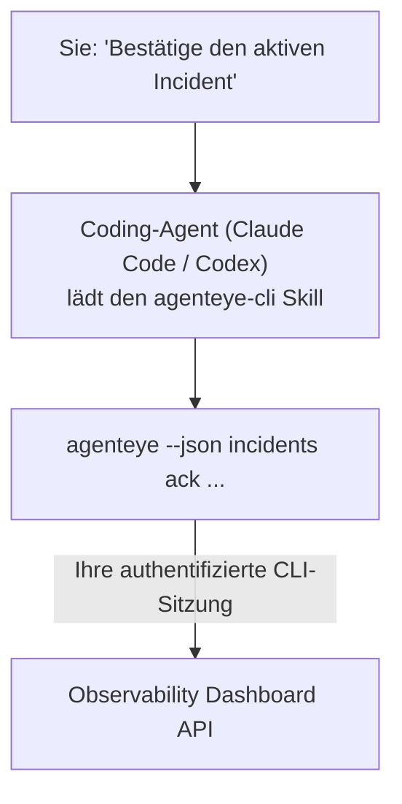

Fragen Sie Ihren Coding-Agent einfach *„Gibt es heute irgendwelche Probleme?"* – er antwortet Ihnen direkt aus Ihren Live-Daten von Failproof AI Observability, ohne dass Sie einen einzigen Befehl auswendig kennen müssen. Der **Failproof AI Observability CLI Skill** (`agenteye-cli`) ist ein *Agent Skill*: ein kleiner Ordner mit Anweisungen, den ein Coding-Agent wie Claude Code oder Codex bei Bedarf lädt. Er bringt dem Agent bei, Ihr Observability-Deployment über die [`agenteye` CLI](/de/agenteye/cli) durch Anfragen in natürlicher Sprache zu bedienen – zum Beispiel *„Gib CI einen Schlüssel, der nur Events pushen kann"* oder *„Bestätige den aktiven Incident und weise ihn mir zu."*

Dies ist **kein** Service und keine separate Binärdatei – es gibt nichts zu deployen. Der Skill setzt auf der bereits installierten CLI auf: Der Agent ruft `agenteye --json …` auf, parst das saubere JSON und antwortet Ihnen in Prosa. Alles, was er tun kann, könnten Sie auch selbst durch Eingabe derselben Befehle erreichen.

---

## Verhältnis zu den anderen Failproof AI Observability-Schnittstellen

Failproof AI Observability bietet vier Möglichkeiten, auf dieselben Daten und Funktionen zuzugreifen. Sie ergänzen sich gegenseitig:

| Schnittstelle | Was es ist | Wo es läuft | Wann Sie es verwenden |
|---|---|---|---|
| **[CLI](/de/agenteye/cli)** | Die Befehls- und Flag-Referenz für `agenteye` | Ihr Terminal | Wenn Sie einen bestimmten Befehl ausführen oder skripten möchten |
| **[CLI-Rezepte](/de/agenteye/cli-recipes)** | Copy-Paste-`jq`/Pipeline-Muster | Ihr Terminal / Skripte | Wenn Sie die CLI in Automatisierungen einbinden |
| **CLI Skill** (dieses Dokument) | Ein natürlichsprachiger Zugang zur CLI | Ihr Coding-Agent, auf Ihrer Workstation | Wenn Sie einfach fragen und den Agent den richtigen Befehl wählen lassen möchten |
| **[Evaluator Skill](/de/agenteye/evaluator-skill)** | Ein verwandter Skill, der Ihren Scoring-Service entwirft und aufbaut | Ihr Coding-Agent, auf Ihrer Workstation | Wenn Sie Eval-Scores *erzeugen* statt lesen möchten |
| **[Python SDK Skill](/de/agenteye/python-sdk-skill)** | Ein verwandter Skill, der Ihren Agent instrumentiert, sodass er Telemetrie aussendet | Ihr Coding-Agent, auf Ihrer Workstation | Wenn Ihr Agent die Events, die dieser Skill liest, erst *erzeugen* soll |
| **[In-Dashboard-KI-Assistent](/de/agenteye/assistant)** | Ein im Dashboard eingebetteter Chat | Serverseitig (im Dashboard) | Wenn Sie im Dashboard Fragen zu Ihren Daten stellen möchten |

Der Skill selbst besitzt keine eigenen Berechtigungen; er übersetzt Ihre Worte lediglich in CLI-Aufrufe, die als Sie ausgeführt werden:



### Abgrenzung zum In-Dashboard-KI-Assistenten

Dies sind zwei grundlegend verschiedene Tools mit sehr unterschiedlichem Wirkungsbereich:

- Der **In-Dashboard-KI-Assistent** ([AI-Assistent](/de/agenteye/assistant)) ist ein im Dashboard eingebetteter Chat, der vom Agent-Service betrieben wird. Er ist **nur lesend plus genehmigungspflichtig bei Änderungen**: Er kann gespeicherte Queries und Dashboards entwerfen, aber jeder Schreibvorgang wartet auf Ihre ausdrückliche Bestätigung per Klick, und er löscht niemals. Er ist durch die Berechtigung `agent:use` geschützt und sieht ausschließlich Daten der Organisation, die Sie gerade betrachten.
- Der **CLI Skill** läuft auf *Ihrer* Workstation innerhalb *Ihres* Coding-Agents und steuert die `agenteye` CLI als **Sie**. Er kann den **vollen Funktionsumfang der CLI nutzen, einschließlich Mutationen** (API-Schlüssel erstellen/rotieren/deaktivieren, Organisationseinstellungen ändern, Incidents lösen, gespeicherte Queries löschen) – begrenzt nur durch die Berechtigungen Ihres CLI-Logins. Behandeln Sie ihn genauso sorgfältig, wie Sie die Befehle selbst eingeben würden.

---

## Voraussetzungen

1. Die **`agenteye` CLI ist installiert** und im `PATH` (siehe [CLI](/de/agenteye/cli)-Referenz: `pipx install agenteye`).
2. Ihre **Dashboard-URL** ist gesetzt (`AGENTEYE_DASHBOARD_URL`, oder der Agent übergibt `--base-url`).
3. Eine **aktive Sitzung**: Führen Sie zunächst selbst `agenteye login` aus. Der Skill **kann** den per E-Mail gesendeten Einmalcode-Login nicht für Sie abschließen; er weist Sie an, `agenteye login` auszuführen, wenn die Sitzung fehlt oder abgelaufen ist (CLI-Exit-Code `4`).

---

## Bezugsquelle

Der Skill ist in Failproof AIs öffentlicher Skills-Sammlung veröffentlicht:

**[github.com/FailproofAI/skills](https://github.com/FailproofAI/skills)** → [`skills/agenteye-cli/`](https://github.com/FailproofAI/skills/tree/main/skills/agenteye-cli)

Der Zugang ist nicht eingeschränkt – das Repository ist öffentlich, und der Skill benötigt keine eigenen Zugangsdaten, da er ausschließlich die **öffentliche** `agenteye` CLI gegen *Ihr* Dashboard betreibt und dabei die Sitzung nutzt, mit der *Sie* sich angemeldet haben. Sie müssen niemanden um Erlaubnis bitten.

Beachten Sie, dass der Skill als eigenständiger Ordner ausgeliefert wird und **nicht** im `pipx install agenteye`-Paket enthalten ist – suchen Sie ihn also nicht dort.

## Den Skill installieren

Der schnellste Weg ist die [`skills`](https://skills.sh) CLI, die den Ordner abruft und an den Ort legt, wo Ihr Agent sucht:

```bash
# Claude Code, nur dieses Projekt
npx skills add FailproofAI/skills --skill agenteye-cli -a claude-code

# alle Projekte (installiert nach ~/.claude/skills/)
npx skills add FailproofAI/skills --skill agenteye-cli -a claude-code -g --copy

# stattdessen Codex
npx skills add FailproofAI/skills --skill agenteye-cli -a codex
```

Verwalten Sie ihn anschließend wie jeden anderen Skill:

```bash
npx skills list -a claude-code      # installierte Skills anzeigen
npx skills update agenteye-cli      # neueste Version laden
npx skills remove agenteye-cli      # entfernen
```

Bevorzugen Sie manuelle Installation? Ein Agent Skill ist nur ein Ordner mit einer `SKILL.md` (plus optionalen Referenzen) – einfaches Kopieren funktioniert ebenfalls:

- **Claude Code**: Legen Sie den Ordner `agenteye-cli/` in `~/.claude/skills/` (alle Projekte) oder `<ihr-repo>/.claude/skills/` (nur dieses Repo). Claude Code erkennt ihn automatisch – prüfen Sie dies mit der `/skills`-Liste oder stellen Sie einfach eine Frage, die seiner Beschreibung entspricht.
- **Codex (OpenAI)**: Codex liest dieselbe `SKILL.md`. Das mitgelieferte `agents/openai.yaml` setzt `allow_implicit_invocation: true`, sodass Codex den Skill automatisch auswählt, wenn eine Aufgabe passt; andernfalls können Sie ihn explizit als `$agenteye-cli` aufrufen.

---

## Sicherheitshinweis: Mutationen fragen NICHT nach, wenn ein Agent die CLI ausführt

> **Warnung:** Lesen Sie dies, bevor Sie einem Agent erlauben, Änderungen vorzunehmen.

Die `agenteye` CLI fragt normalerweise *„Sind Sie sicher?"* vor einer destruktiven Aktion. Sie **überspringt diese Bestätigung automatisch, sobald sie nicht an ein Terminal angeschlossen ist – genau so, wie ein Coding-Agent sie ausführt – und `--json` überspringt sie ebenfalls.** Die Sicherheitsabfrage wird für den Agent also **nicht** ausgelöst.

Der Skill ist darauf ausgelegt, dies zu kompensieren: Er ist angewiesen, den genauen auszuführenden Befehl anzugeben und Ihre ausdrückliche **Bestätigung einzuholen, bevor er irgendeinen Zustand verändert**. Halten Sie diese Disziplin aufrecht. Wenn Sie Failproof AI Observability über einen Agent steuern, *sind Sie* der Bestätigungsschritt. Die zustandsändernden Befehle, auf die Sie achten sollten:

- `keys create` / `update` / `disable` / `regenerate`
- `users create` / `update` / `disable` / `enable`
- `settings set`
- `alerts create` / `update` / `delete` / `test`
- die schreibenden `incidents`-Unterbefehle: `ack` / `assign` / `resolve` / `open` / `comment-add` / `comment-delete` / `subscribe` / `unsubscribe`
- `query create` / `update` / `delete`
- `agent rename` / `delete`
- `orgs switch`

Alles unter **Observe** (`events`, `sessions`, `evals`, `errors`, `list`, `whoami`, `orgs list/current/perms`) ist schreibgeschützt und ändert nichts.

Da der Agent als **Sie** handelt, kann er nur das tun, wozu Ihr Login berechtigt ist; Berechtigungen werden **pro Organisation** aufgelöst (siehe [API-Schlüssel](/de/agenteye/api-keys)). Ein Befehl, für den Ihnen die Berechtigung fehlt, gibt Exit-Code `5` mit der genauen Berechtigungsbezeichnung zurück – der Agent kann Ihnen also präzise sagen, was Sie einen Administrator bitten müssen, anstatt undurchsichtig zu scheitern.

---

## Was Sie fragen können

So sieht ein echter Austausch aus – erst eine Leseanfrage, dann eine Änderung, die auf Ihre Bestätigung wartet:

```text
Sie   ▸ Gibt es irgendwelche Probleme in den letzten 24 Stunden?

Agent ▸ Ausführen: agenteye --json errors --since 24h --aggregate
        3 Fehlertypen in den letzten 24 Stunden. Der häufigste ist TimeoutError
        (18 Treffer, alle beim checkout-agent), dann RateLimited (5).
        Soll ich die fehlgeschlagenen Sessions für TimeoutError anzeigen?

Sie   ▸ Gib CI einen Schlüssel, der nur Events pushen kann.

Agent ▸ Damit wird ein API-Schlüssel erstellt. Ich werde Folgendes ausführen:
          agenteye keys create ci --add events:add
        Fortfahren?

Sie   ▸ ja

Agent ▸ Erledigt. Schlüssel "ci" wurde mit events:add erstellt.
        Das Secret wird nur einmal angezeigt – speichern Sie es jetzt. Ich kann es nicht erneut ausgeben.
```

Der Skill ordnet jede natürlichsprachige Absicht dem richtigen `agenteye`-Befehl zu, ermittelt zunächst gültige Werte (`list <kind>`, `whoami`), um nicht zu raten, und gibt den genauen Befehl vor jeder Änderung an. Weitere Beispiele:

- *„Gibt es in den letzten 24 Stunden etwas Defektes oder Fehlgeschlagenes?"* → `errors --since 24h --aggregate`, dann eine Aufschlüsselung.
- *„Warum ist Session `run-001` fehlgeschlagen?"* → `events --session-id run-001 --all` + `evals --session-id run-001`.
- *„Wie entwickelt sich die Qualität diese Woche?"* → `evals --aggregate --since 7d`, dann Einblick in schlecht bewertete Läufe.
- *„Gib CI einen Schlüssel, der nur Events pushen kann."* → `keys create ci --add events:add` (der Befehl wird angegeben, dann ausgeführt und das einmalige Secret gespeichert).
- *„Wer hat Zugriff? Mach Dana nur leseberechtigt."* → `users list` → `users update dana@… --permission-set read-only` (nach Ihrer Bestätigung).
- *„Bestätige den aktiven Incident und weise ihn mir zu."* → `incidents list --state firing` → `incidents ack <id>` / `incidents assign <id> you@…`.

Die genauen Befehle, Flags und JSON-Strukturen dahinter finden Sie in der [CLI](/de/agenteye/cli)-Referenz und in den [CLI-Rezepten für Agents](/de/agenteye/cli-recipes).

---

## Nächste Schritte

- **[CLI](/de/agenteye/cli)**: vollständige Befehls- und Flag-Referenz für `agenteye`.
- **[CLI-Rezepte für Agents](/de/agenteye/cli-recipes)**: Copy-Paste-`jq`-Muster und Exit-Code-Behandlung.
- **[Evaluator Agent Skill](/de/agenteye/evaluator-skill)**: der verwandte Skill zum Aufbau des Evaluators, dessen Scores `agenteye evals` liest.
- **[Python SDK Agent Skill](/de/agenteye/python-sdk-skill)**: der verwandte Skill zur Instrumentierung eines Agents, sodass er die Telemetrie aussendet, die `agenteye` liest.
- **[KI-Assistent](/de/agenteye/assistant)**: der In-Dashboard-Assistent (nicht zu verwechseln mit diesem Terminal-Skill).
- **[API-Schlüssel](/de/agenteye/api-keys)**: das organisationsweite Berechtigungsmodell, das den Wirkungsbereich des Skills begrenzt.