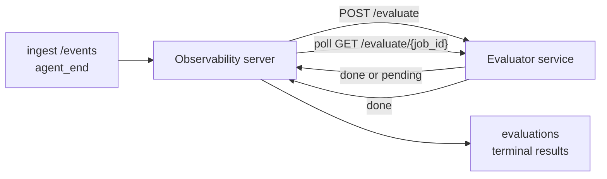

Failproof AI Observability kann jeden abgeschlossenen Agentenlauf automatisch auf Qualität bewerten: Sie stellen einen kleinen Scoring-Dienst bereit, und Observability erledigt den Rest. Damit lassen sich die für Sie relevanten Dimensionen verfolgen (Hilfsbereitschaft, Tool-Effizienz, Faktentreue, Sicherheit – Sie entscheiden), Regressionen frühzeitig erkennen und Agenten oder Umgebungen auf einen Blick vergleichen. Das Scoring ist optional: Die Pipeline ist inaktiv, solange `EVALUATOR_ENDPOINT` auf dem Server nicht gesetzt ist.

> **Hinweis:** Sie definieren die Score-Dimensionen. Ihr Evaluator kann beliebige numerische Schlüssel zurückgeben; Observability speichert, trendiert und zeigt alles an, was Sie zurücksenden.

## Auf einen Blick

1. **Einen Scorer schreiben.** Starten Sie einen kleinen HTTP-Dienst, der ein Sitzungsprotokoll liest und Scores zurückgibt. Observability wird mit einem funktionierenden Referenz-Evaluator ausgeliefert, den Sie kopieren können. Siehe [Einen Evaluator mit dem SDK schreiben](#writing-an-evaluator-with-the-sdk).
2. **Observability darauf hinweisen.** Setzen Sie `EVALUATOR_ENDPOINT` (und ein gemeinsames `EVALUATOR_TOKEN`) auf dem Serverprozess.
3. **Die Scores beobachten.** Jede abgeschlossene Sitzung wird automatisch bewertet; die Ergebnisse erscheinen auf der Sitzungsdetailseite, im Sitzungsraster und in gespeicherten Dashboards.


*Sobald ein Evaluator konfiguriert ist, wird jeder abgeschlossene Lauf bewertet und die Ergebnisse erscheinen in der rechten Spalte der Sitzung: oben die Zusammenfassung, darunter Scorebalken pro Dimension mit Begründung.*

---

## So funktioniert es



Wenn das Observability SDK ein `agent_end`-Ereignis für eine Sitzung sendet, plant der Server eine Auswertung. Anschließend sendet er per POST das vollständige Ereignisprotokoll an Ihren Evaluatordienst, der entweder:

- **Das Ergebnis direkt zurückgeben** kann mit `{"status":"done", "scores":{...}, "reasoning":{...}, "summary":"..."}`. Das Ergebnis wird an die Auswertungszeitleiste der Sitzung angehängt. `reasoning` und `summary` sind optional.
- **Verzögern** kann mit `{"status":"pending", "job_id":"abc-123"}`. Observability ruft dann `GET {EVALUATOR_ENDPOINT}/evaluate/abc-123` auf, bis Ihr Evaluator `{"status":"done", ...}` oder `{"status":"error", "error":"..."}` zurückgibt.

  Der Abfragerhythmus ist pro Job: Eine `pending`-Antwort kann `next_poll_secs` enthalten, um ihn zu überschreiben; andernfalls verwendet Observability den Wert `default_poll_interval_secs` aus `GET /config`; andernfalls fällt der Server auf `EVALUATOR_POLLING_INTERVAL_SECS` zurück (Standard 10 s). Alle Werte werden auf [1 s, 1 h] begrenzt.

Sitzungen, die nie `agent_end` senden (z. B. ein abgestürzter Agentenprozess), können ebenfalls erfasst werden: `GET /config` des Evaluators kann `{"inactivity_timeout_secs": 1800}` zurückgeben, und Observability wertet jede Sitzung aus, die so lange inaktiv war. Setzen Sie das Feld auf `null` oder lassen Sie es weg, um diesen Fallback zu deaktivieren.

Die Pipeline ist vollständig inaktiv, wenn `EVALUATOR_ENDPOINT` nicht gesetzt ist.

Eine Sitzung kann **im Laufe der Zeit mehrere terminale Auswertungen ansammeln**: Jedes `agent_end`-Ereignis (und jede manuelle Neu-Auswertung über das Dashboard) hängt eine neue Auswertungszeile an. Dies ist der unterstützte Weg, um ein fortgesetztes Gespräch auszuwerten: Ein Benutzer beendet einen Agenten, kehrt später zurück, sendet weitere Ereignisse, beendet den Agenten erneut, und eine zweite Auswertung läuft gegen das vollständig aktualisierte Protokoll. Das Dashboard zeigt die aktuellste Auswertung als Hauptanzeige und die vorherigen Auswertungen als aufklappbare Zeitleiste. Während eine Auswertung für eine Sitzung läuft, werden weitere `agent_end`-Ereignisse für diese Sitzung ignoriert; das nächste nach Abschluss der laufenden Auswertung stellt wie gewohnt eine neue Auswertung in die Warteschlange.

Der Inaktivitäts-Fallback greift auch bei fortgesetzten Sitzungen erneut: Wenn nach einer früheren terminalen Auswertung neue Ereignisse eintreffen und die Sitzung dann länger als `inactivity_timeout_secs` inaktiv bleibt, wird eine neue Auswertung eingereiht.

Vorübergehende Fehler (5xx, 429, Timeouts, Netzwerkfehler) werden mit exponentiellem Backoff bis zu `EVALUATOR_MAX_ATTEMPTS` wiederholt; 4xx-Antworten sind terminal. Observability kann sicher mit mehreren horizontal skalierten Serverinstanzen betrieben werden; die Arbeit wird so aufgeteilt, dass dieselbe Sitzung nie zweimal gleichzeitig verarbeitet wird.

---

## HTTP-Vertrag

Jede authentifizierte Route verwendet **Bearer-Token-Authentifizierung**. Derselbe Wert muss auf beiden Seiten konfiguriert sein:

- Observability-Server: Umgebungsvariable `EVALUATOR_TOKEN`
- Evaluatordienst: auf die gleiche Weise konfiguriert (das `agenteye-evaluator`-SDK liest `EVALUATOR_TOKEN` per Konvention)

Wenn `EVALUATOR_TOKEN` nicht gesetzt ist, sendet der Server keinen `Authorization`-Header; der Evaluator kann dann anonyme Anfragen akzeptieren, was für ein rein internes Netzwerk in Ordnung ist, im öffentlichen Internet jedoch nicht empfohlen wird.

### Routen, die der Evaluator bereitstellen muss

| Route | Body / Parameter | Antwort |
|---|---|---|
| `GET /health` | keine | `{"status":"ok"}` (offen, keine Authentifizierung) |
| `GET /config` | keine | `{"inactivity_timeout_secs": <int> \| null, "default_poll_interval_secs": <int> \| omitted}` |
| `POST /evaluate` | `EvalRequest` JSON | `{"status":"done", ...}` oder `{"status":"pending", "job_id":"..."}` |
| `GET /evaluate/{id}` | keine | gleiche Antwortstruktur wie `/evaluate` |

### Vom Server gesendeter `EvalRequest`-Body

```json
{
  "schema_version": "1",
  "session_id":     "session-abc123",
  "agent_id":       "planner",
  "environment":    "production",
  "started_at":     "2026-05-10T12:00:00Z",
  "ended_at":       "2026-05-10T12:05:00Z",
  "events": [
    { "id": 1234, "ts": "...", "event_type": "agent_start", "payload": { ... } },
    ...
  ]
}
```

### Antwortstrukturen

**Synchron (done):**

```json
{
  "status": "done",
  "scores": { "helpfulness": 0.85, "tool_efficiency": 0.6 },
  "reasoning": {
    "helpfulness": "answered the question directly with citations",
    "tool_efficiency": "called list_files three times when one would have done"
  },
  "summary": "strong answer quality, weak tool selection"
}
```

`reasoning` (eine Begründungszuordnung pro Score) und `summary` (eine übergreifende Ein-Absatz-Zusammenfassung) sind beide optional. Schlüssel in `reasoning` sollten die Schlüssel in `scores` widerspiegeln; das Dashboard zeigt jeden Eintrag inline unter dem zugehörigen Scorebalken an. Ältere Evaluatoren, die nur `scores` zurückgeben, funktionieren weiterhin unverändert; `reasoning` und `summary` werden dann einfach als null gelesen und die entsprechenden UI-Elemente werden weggelassen.

**Asynchron (verzögert):**

```json
{ "status": "pending", "job_id": "abc-123", "next_poll_secs": 30 }
```

`next_poll_secs` ist optional; wenn weggelassen, fällt der Server auf `default_poll_interval_secs` des Evaluators aus `/config` zurück, dann auf seine eigene Umgebungsvariable `EVALUATOR_POLLING_INTERVAL_SECS`.

**Terminaler Fehler auf Evaluatorseite:**

```json
{ "status": "error", "error": "model service unavailable" }
```

Der Server behandelt jeden anderen 2xx-Body als Protokollfehler und zeichnet einen terminalen `error` für die Sitzung auf.

---

## Einen Evaluator mit dem SDK schreiben

Sie müssen den HTTP-Vertrag nicht manuell implementieren. Das Python-Paket `agenteye-evaluator` bietet einen typisierten FastAPI-Wrapper, der Authentifizierung, Routing und die Anfrage-/Antwortstrukturen für Sie übernimmt.

Failproof AI Observability wird außerdem mit einem **funktionierenden Referenz-Evaluator** ausgeliefert, der `helpfulness`, `tool_efficiency` und `factuality` anhand der Struktur des Protokolls bewertet. Kopieren Sie ihn als Ausgangspunkt und ersetzen Sie die Logik durch Ihre eigene: einen LLM-Richter, eine Regelmaschine oder was auch immer zu Ihrem Qualitätsmaßstab passt.

Minimal lebensfähiger Evaluator:

```python
import os
from agenteye_evaluator import Evaluator, EvalRequest, EvalResponse

app = Evaluator(token=os.environ["EVALUATOR_TOKEN"])

@app.evaluator
def run(req: EvalRequest) -> EvalResponse:
    # Inspect req.events (the full session transcript) and return scores.
    tool_calls = sum(1 for e in req.events if e.event_type == "tool_use")
    return EvalResponse(
        scores={"tool_calls": float(tool_calls)},
        reasoning={"tool_calls": f"{tool_calls} tool invocations in the transcript"},
        summary="tight tool loop" if tool_calls < 5 else "agent looped on tools",
    )
```

Die `app`-Instanz läuft unter jedem ASGI-Server, sodass `uvicorn module:app` sie startet.

Für Evaluatoren, die aufwändige Arbeit verzögern müssen, geben Sie stattdessen `JobPending` zurück und registrieren Sie einen `@app.job_lookup`-Handler; der Observability-Server fragt `GET /evaluate/{job_id}` ab, bis Sie einen terminalen Status zurückgeben oder die Obergrenze `EVALUATOR_MAX_POLL_DURATION_SECS` (Standard 1 h) überschritten wird.

Die vollständige API-Referenz, das asynchrone Muster und das Ereignisschema sind in der README des `agenteye-evaluator`-SDKs dokumentiert.

---

## Ihren Evaluator ausführen

Der Evaluator ist **Ihr Dienst** – Failproof AI Observability wird ohne Standard-Evaluator ausgeliefert, daher erstellen und betreiben Sie ihn dort, wo Sie Ihre eigenen Dienste betreiben. Er läuft unter jedem ASGI-Server (z. B. `uvicorn my_evaluator:app`); stellen Sie die Routen `/health`, `/config` und `/evaluate` aus dem [HTTP-Vertrag](#http-contract) bereit und verweisen Sie dann den Server darauf (siehe [Den Server konfigurieren](#configuring-the-server)).

Sobald der Evaluator erreichbar ist, gibt `GET /health` `{"status":"ok"}` zurück. Nachdem ein Agent einen vollständigen Lauf abgeschlossen hat, gibt `GET /evaluations` auf dem Server eine Zeile mit `status: "done"` und den von Ihrem Evaluator erzeugten Scores zurück.

---

## Den Server konfigurieren

Auf dem Serverprozess setzen:

| Umgebungsvariable | Bedeutung |
|---|---|
| `EVALUATOR_ENDPOINT` | Basis-URL Ihres Evaluators (`http://evaluator:9000`). Nicht gesetzt = Pipeline deaktiviert. |
| `EVALUATOR_TOKEN` | Bearer-Token. Muss dem Wert entsprechen, mit dem der Evaluatordienst konfiguriert ist. |
| `EVALUATOR_WORKERS` | Worker-Tasks pro Serverinstanz (Standard 2). |
| `EVALUATOR_CLAIM_BATCH` | Zeilen, die pro Worker-Takt beansprucht werden (Standard 4). Batches werden **gleichzeitig** verarbeitet; die effektive Parallelität auf Ihrem Evaluator-Endpunkt beträgt `EVALUATOR_WORKERS × EVALUATOR_CLAIM_BATCH`. |
| `EVALUATOR_POLL_IDLE_SECS` | Wie lange ein Worker zwischen Dispatch-Versuchen schläft, wenn keine Auswertung fällig ist (Standard 2 s). |
| `EVALUATOR_POLLING_INTERVAL_SECS` | Letzter Fallback für den `GET /evaluate/{id}`-Rhythmus, wenn weder das pro-Antwort-`next_poll_secs` noch das `default_poll_interval_secs` des Evaluators gesetzt ist (Standard 10 s). |
| `EVALUATOR_REQUEST_TIMEOUT_MS` | Timeout pro Anfrage (Standard 30000). |
| `EVALUATOR_MAX_ATTEMPTS` | Nach so vielen vorübergehenden Fehlern wird das Ergebnis als terminaler `error` aufgezeichnet (Standard 5). |
| `EVALUATOR_CONFIG_REFRESH_SECS` | `GET /config`-Rhythmus (Standard 300). |
| `EVALUATOR_MAX_POLL_DURATION_SECS` | Maximale Wanduhrzeit, die eine Sitzung in der Abfragequeue verbleiben darf, bevor sie als `timeout` beendet wird (Standard 3600 s). Schützt vor einem Evaluator, der dauerhaft `pending` zurückgibt. |

Um automatisches Scoring zu aktivieren, setzen Sie sowohl `EVALUATOR_ENDPOINT` als auch `EVALUATOR_TOKEN` auf dem Server und starten Sie ihn dann neu, um die Änderung zu übernehmen. Wenn `EVALUATOR_ENDPOINT` nicht gesetzt ist, bleibt die Pipeline inaktiv.

Die obigen Einstellungsoptionen sind optional; setzen Sie die entsprechenden Umgebungsvariablen auf dem Server nur, wenn Sie die Standardwerte überschreiben müssen.

---

## API-Referenz

| Methode | Pfad | Erforderliche Berechtigung | Zweck |
|---|---|---|---|
| `GET` | `/evaluations` | `evaluations:read` | Terminale Ergebnisse abfragen. Unterstützt `session_id`, `agent_id`, `environment`, `status` (`done`/`error`/`timeout`), `ts_from`, `ts_to`, `cursor`, `limit`, `score_filters`, `latest_per_session`. `limit` ist standardmäßig 50 und auf 200 begrenzt (beachten Sie, dass dies von `/events` abweicht, das auf 1000 begrenzt ist). `environment` akzeptiert eine kommagetrennte Liste (z. B. `environment=prod,staging`); einzelne Werte funktionieren weiterhin. Mit `latest_per_session=true` enthält die Antwort höchstens eine Zeile pro `session_id` (die aktuellste nach `completed_at`), die von der Sitzungsliste verwendet wird, um die Auswertungszeitleiste einer Sitzung auf ihre aktuelle Hauptanzeige zu reduzieren. Standardmäßig false (gibt die vollständige Historie zurück). |
| `GET` | `/evaluations/aggregate` | `evaluations:read` | Zusammengefasste Auswertungsqualität für einen gefilterten Ausschnitt: Gesamtanzahl, eine done/error/timeout-Aufschlüsselung, Statistiken pro Score-Schlüssel (Anzahl/Durchschnitt/Min/Max/p50 über die beliebigen `scores`-Schlüssel) und eine zeitlich aufgeteilte Zeitleiste. Akzeptiert die **gleichen Filterparameter wie `/evaluations`** plus `featured_keys` (CSV der Score-Schlüssel zum Trendverfolgen) und `latest_per_session`. Treibt die Dashboards-Funktion an; Metriken sind exakt über die gesamte übereinstimmende Menge, nicht gesampelt. |
| `GET` | `/evaluations/environments` | `evaluations:read` | Unterschiedliche Umgebungswerte aus der `evaluations`-Tabelle. Wird verwendet, um Filter-Dropdowns befüllt mit auswertungslesbaren Daten zu befüllen. |
| `GET` | `/evaluation-jobs` | `evaluations:read` | Einblick in laufende Auswertungen. Nach `status` (`pending`/`polling`) filtern. |
| `GET` | `/events` | `events:read` | Rohereignisse einer Sitzung streamen. Unterstützt `session_id`, `agent_id`, `event_type` (CSV), `environment` (CSV), `ts_from`, `ts_to`, `cursor`, `limit` und `order`. `order` ist `desc` (neueste zuerst, Standard) oder `asc` (älteste zuerst); ein nicht erkannter Wert fällt auf `desc` zurück. Cursor-paginieren über den `next_cursor` der Antwort (eine Ereignis-ID): übergeben Sie ihn als `cursor`, um die nächste Seite zu erhalten; mit `asc` ist die nächste Seite die Ereignisse nach dieser ID, mit `desc` die Ereignisse davor. `limit` ist standardmäßig 50 und auf 1000 begrenzt. |
| `GET` | `/sessions/:session_id/export` | `events:read` | Gibt den genauen JSON-Body zurück, den der Evaluator für diese Sitzung erhalten würde, als herunterladbaren Anhang namens `session-<id>.json`. Nützlich zum Wiedergeben von Produktionssitzungen durch `agenteye-evaluator` für Offline-Tests. Die Bytes sind byte-identisch mit dem, was die Evaluator-Pipeline sendet. |
| `POST` | `/sessions/:session_id/re-evaluate` | `evaluations:trigger` | Stellt eine neue Auswertung für eine Sitzung in die Warteschlange; läuft unabhängig davon, ob bereits eine frühere Auswertung existiert. Das neue Ergebnis wird **an** die Auswertungszeitleiste der Sitzung **angehängt**, anstatt das vorherige zu überschreiben, sodass frühere Scores als Verlauf sichtbar bleiben. Gibt `202` bei der Einreihung zurück, `404` für eine unbekannte Sitzung, `409` wenn bereits eine Auswertung läuft. Verwenden Sie dies nach dem Bereitstellen eines neuen Evaluators oder für Sitzungen, die nie `agent_end` gesendet haben. |

### Nach Score-Bereich filtern: `score_filters`

`GET /evaluations` akzeptiert einen optionalen `score_filters`-Parameter, der Ergebnisse anhand numerischer Werte im `scores`-Objekt eingrenzt. Der Parameter ist eine kommagetrennte Liste von `key:min..max`-Einträgen; beide Grenzen können weggelassen werden. Mehrere Einträge werden mit logischem UND kombiniert. Zeilen, bei denen der genannte Schlüssel fehlt oder nicht numerisch ist, werden ausgeschlossen. Eine Anfrage kann höchstens 20 Filtereinträge enthalten; bei Überschreitung wird HTTP 400 zurückgegeben.

Beispiele:
```text
# helpfulness in [0.5, 0.8]
GET /evaluations?score_filters=helpfulness:0.5..0.8

# tool_efficiency höchstens 0.3 (keine Untergrenze)
GET /evaluations?score_filters=tool_efficiency:..0.3

# helpfulness >= 0.5 UND factuality >= 0.9
GET /evaluations?score_filters=helpfulness:0.5..,factuality:0.9..
```

Jedes `/evaluations`-Antwortobjekt hat diese Felder:

| Feld | Typ | Hinweise |
|---|---|---|
| `evaluation_id` | string (UUID) | Der kanonische Bezeichner für diese terminale Auswertung. Jede terminale Auswertung erhält eine neue UUID; eine einzelne Sitzung kann mehrere besitzen. |
| `id` | string (UUID) | Rückwärtskompatibilitäts-Alias mit demselben Wert wie `evaluation_id`. |
| `session_id` | string | Die Sitzung, gegen die diese Auswertung lief. Eine Sitzung kann mehrere Auswertungen in der Zeitleiste haben. |
| `agent_id` | string | Identifiziert den Agenten, der die Sitzung erzeugt hat. |
| `environment` | string | Umgebungsbezeichnung, die aus der Sitzung kopiert wurde. |
| `status` | enum | Eines von `"done"`, `"error"`, `"timeout"`. |
| `scores` | object \| null | Von Ihrem Evaluator zurückgegebene Scores. |
| `reasoning` | object \| null | Optionale per-Score-Begründungszuordnung, die von Ihrem Evaluator zurückgegeben wird. Schlüssel spiegeln typischerweise die in `scores` wider. Das Dashboard zeigt jeden Eintrag unter dem zugehörigen Scorebalken an. |
| `summary` | string \| null | Optionale übergreifende Ein-Absatz-Zusammenfassung, die von Ihrem Evaluator zurückgegeben wird. Das Dashboard zeigt diese über der Aufschlüsselung pro Score als Überschrift der Auswertung an. |
| `error` | string \| null | Nur bei `"error"` / `"timeout"` befüllt. |
| `attempt_count` | integer | Anzahl der Dispatch-Versuche (≥ 1). |
| `duration_ms` | integer \| null | Dauer des letzten Versuchs. |
| `completed_at` | string (ISO 8601 UTC) | Zeitpunkt, zu dem das terminale Ergebnis aufgezeichnet wurde. Ergebnisse sind nach `completed_at` geordnet (neueste zuerst). |
| `created_at` | string (ISO 8601 UTC) | Enthält denselben Zeitstempel wie `completed_at` (Schreib-einmal-Semantik). |

---

## Berechtigungen

| Berechtigung | Gewährt |
|---|---|
| `evaluations:read` | Auswertungsergebnisse auflisten, Scores im Dashboard anzeigen und Dashboard-Qualitätsmetriken laden. |
| `evaluations:trigger` | Manuell eine Auswertung für eine Sitzung über `POST /sessions/:session_id/re-evaluate` oder die Neu-auswerten-Schaltfläche im Dashboard einreihen. |
| `dashboards:read` | Gespeicherte Dashboards anzeigen (benötigt außerdem `evaluations:read`, um deren Metriken zu laden). |
| `dashboards:write` | Dashboards erstellen und bearbeiten. |
| `dashboards:delete` | Dashboards löschen. |

Der Bootstrap-Admin (`ADMIN_KEY`, `ADMIN_EMAIL`) erhält diese automatisch.

---

## Ergebnisse anzeigen

- **`/sessions/<id>`**: Ereigniszeitleiste + eine rechte Spalte mit den Scores der Sitzung und etwaigen Fehlern beim Dispatch-Versuch. Wenn Ihr Schlüssel `evaluations:trigger` hat, erscheint neben der Export-Schaltfläche eine **Neu-auswerten**-Schaltfläche, nützlich für Sitzungen, die nie `agent_end` gesendet haben, oder zum Aktualisieren von Scores nach dem Bereitstellen eines neuen Evaluators. Das Dashboard fragt das neue Ergebnis ab und aktualisiert die rechte Spalte, sobald es vorliegt.
- **`/sessions`**: filterbares Sitzungsraster; die Score-Spalte zeigt den Auswertungsstatus und die Scores jeder Sitzung auf einen Blick.
- **`/dashboards`**: gespeicherte Auswertungsqualitätsansichten (siehe [Dashboards](#dashboards) unten).


*Das Sitzungsraster zeigt den Auswertungsstatus und die Scores jedes Laufs auf einen Blick; rote/gelbe/grüne Abzeichen machen niedrige Scores sofort sichtbar.*

---

## Dashboards

Die **Dashboards**-Seite (`/dashboards`) ermöglicht es Ihnen, eine Kombination von Auswertungsfiltern als benannte, wiederverwendbare Ansicht zu speichern und zu beobachten, wie dieser Ausschnitt von Auswertungen auf einen Blick abschneidet. Dashboards werden **organisationsweit geteilt**; alle mit `dashboards:read` sehen dieselbe Sammlung.

Jedes Dashboard fixiert:

- **Filter**: dieselben Steuerelemente wie auf der Sitzungsseite: Umgebung, Status, Agent, ein rollierendes Zeitfenster und Score-Bereichsfilter (`key:min..max`).
- **Eine Anzeigehekonfiguration**: welche Score-Schlüssel hervorgehoben werden sollen, die grün/gelb/rot-Qualitätsschwellenwerte, welche Panels angezeigt werden sollen und ob auf die neueste Auswertung pro Sitzung reduziert werden soll.

Jede Karte zeigt die Anzahl der übereinstimmenden Sitzungen, eine done/error/timeout-Aufschlüsselung, den Durchschnitt jedes hervorgehobenen Scores und eine kleine Trendsparkline. Das Öffnen eines Dashboards zeigt die Panels in voller Größe; **„in Sitzungen öffnen"** bringt Sie auf die Sitzungsseite mit genau diesem Ausschnitt vorgefilterter Daten. Metriken werden serverseitig über die gesamte übereinstimmende Menge berechnet (über `GET /evaluations/aggregate`), sodass die Zahlen exakt und nicht gesampelt sind.


**Berechtigungen:** Zum Anzeigen werden sowohl `dashboards:read` als auch `evaluations:read` benötigt; zum Erstellen und Bearbeiten wird `dashboards:write` benötigt; zum Löschen wird `dashboards:delete` benötigt. Der Bootstrap-Admin erhält alle automatisch.

---

## Fehlerbehebung

**Sitzungen existieren, aber es werden keine Auswertungen erstellt.** Bestätigen Sie, dass `EVALUATOR_ENDPOINT` auf dem Serverprozess gesetzt ist, dass Server und Evaluator denselben `EVALUATOR_TOKEN`-Wert teilen und dass der `/health`-Endpunkt des Evaluators vom Server aus erreichbar ist. Wenn `EVALUATOR_ENDPOINT` nicht gesetzt ist, ist die Pipeline inaktiv.

**Laufende Auswertungen häufen sich an.** Fragen Sie `GET /evaluation-jobs` ab, um die laufende Warteschlange zu sehen. Überprüfen Sie `attempt_count`, `next_attempt_at` und `last_error` für jede Zeile. Häufige Ursachen: Evaluatordienst nicht erreichbar oder gibt 5xx zurück (wird mit Backoff wiederholt), falsches `EVALUATOR_TOKEN` (401 ist terminal) oder ein asynchroner Evaluator, der `pending` auf unbestimmte Zeit zurückgibt (siehe unten).

**Sitzungen abgeschlossen, aber keine terminale Auswertung.** Fragen Sie `GET /evaluation-jobs?status=polling` ab; das Ergebnis könnte noch in Bearbeitung sein. Wenn ein Job in `pending` feststeckt, hat der Server Schwierigkeiten, den Evaluator zu erreichen; prüfen Sie, ob der Evaluator läuft und ob `EVALUATOR_TOKEN` übereinstimmt.

**`HTTP 401 from evaluator: invalid bearer token`.** Das `EVALUATOR_TOKEN` auf dem Server stimmt nicht mit dem Wert überein, mit dem der Evaluatordienst konfiguriert ist. Sie müssen identisch sein.

**Asynchroner Evaluator gibt dauerhaft `pending` zurück.** Der Server fragt `GET /evaluate/{job_id}` ab, bis der Evaluator `done` oder `error` zurückgibt, oder bis die Obergrenze `EVALUATOR_MAX_POLL_DURATION_SECS` (Standard 1 h) überschritten wird. Nach der Obergrenze wird die Auswertung als `timeout` aufgezeichnet und aus der laufenden Warteschlange entfernt. Erhöhen Sie `EVALUATOR_MAX_POLL_DURATION_SECS`, wenn Ihr Evaluator legitim länger als die Standardzeit benötigt.

---

## Nächste Schritte

- [Evaluator-Agentenfähigkeit](/de/agenteye/evaluator-skill): Lassen Sie einen Coding-Agenten Ihre Dimensionen anhand echter Sitzungen entwerfen und diesen Dienst für Sie erstellen.
- [Python SDK](/de/agenteye/python-sdk): Senden Sie die `agent_end`-Ereignisse, die das Scoring auslösen.
- [API-Schlüssel](/de/agenteye/api-keys): die Berechtigungen `evaluations:read` und `evaluations:trigger`.
- [Audits](/de/agenteye/audits): die andere automatisierte Qualitätsfunktion von Observability für richtlinienbasierte Überprüfungen.