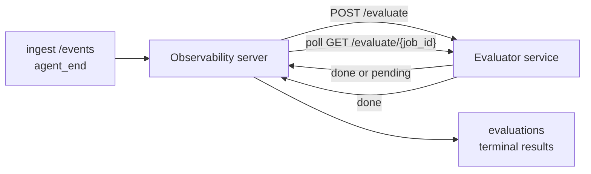

Failproof AI Observability kann jeden abgeschlossenen Agenten-Lauf automatisch auf Qualität bewerten: Sie stellen einen kleinen Bewertungsdienst bereit, und Observability übernimmt den Rest. Verwenden Sie es, um die Dimensionen zu verfolgen, die Ihnen wichtig sind (Hilfsbereitschaft, Tool-Effizienz, Faktentreue, Sicherheit – Sie entscheiden), Regressionen frühzeitig zu erkennen und Agenten oder Umgebungen auf einen Blick zu vergleichen. Das Scoring ist optional: Die Pipeline tut nichts, bis Sie `EVALUATOR_ENDPOINT` auf dem Server setzen.

> **Hinweis:** Sie definieren die Score-Dimensionen. Ihr Evaluator kann beliebige numerische Schlüssel zurückgeben; Observability speichert, verfolgt und zeigt alles an, was Sie zurücksenden.

## Auf einen Blick

1. **Schreiben Sie einen Scorer.** Richten Sie einen kleinen HTTP-Dienst ein, der ein Sitzungsprotokoll liest und Scores zurückgibt. Observability enthält einen funktionierenden Referenz-Evaluator, den Sie kopieren können. Siehe [Einen Evaluator mit dem SDK schreiben](#writing-an-evaluator-with-the-sdk).
2. **Zeigen Sie Observability darauf.** Setzen Sie `EVALUATOR_ENDPOINT` (und ein gemeinsames `EVALUATOR_TOKEN`) auf dem Serverprozess.
3. **Beobachten Sie, wie die Scores eintreffen.** Jede abgeschlossene Sitzung wird automatisch bewertet; die Ergebnisse erscheinen auf der Sitzungsdetailseite, dem Sitzungsraster und gespeicherten Dashboards.


*Sobald ein Evaluator konfiguriert ist, wird jeder abgeschlossene Lauf bewertet und die Ergebnisse erscheinen in der rechten Leiste der Sitzung: die Zusammenfassung oben, dann Bewertungsbalken pro Dimension mit Begründung.*

---

## Funktionsweise



Wenn das Observability SDK ein `agent_end`-Ereignis für eine Sitzung ausgibt, plant der Server eine Evaluierung. Anschließend sendet er das vollständige Ereignisprotokoll per POST an Ihren Evaluatordienst, der entweder:

- **Das Ergebnis direkt zurückgeben** kann mit `{"status":"done", "scores":{...}, "reasoning":{...}, "summary":"..."}`. Das Ergebnis wird an die Evaluierungszeitachse der Sitzung angehängt. `reasoning` und `summary` sind optional.
- **Zurückstellen** kann mit `{"status":"pending", "job_id":"abc-123"}`. Observability ruft dann `GET {EVALUATOR_ENDPOINT}/evaluate/abc-123` auf, bis Ihr Evaluator `{"status":"done", ...}` oder `{"status":"error", "error":"..."}` zurückgibt.

  Der Polling-Rhythmus ist pro Job: Eine `pending`-Antwort kann `next_poll_secs` enthalten, um diesen zu überschreiben; andernfalls verwendet Observability den Wert `default_poll_interval_secs` aus `GET /config`; andernfalls greift der Server auf `EVALUATOR_POLLING_INTERVAL_SECS` zurück (Standard: 10s). Alle Werte werden auf [1s, 1h] begrenzt.

Sitzungen, die nie `agent_end` ausgeben (z. B. ein abgestürzter Agentenprozess), können ebenfalls erfasst werden: Das `GET /config` des Evaluators kann `{"inactivity_timeout_secs": 1800}` zurückgeben, und Observability bewertet jede Sitzung, die so lange inaktiv war. Setzen Sie das Feld auf `null` oder lassen Sie es weg, um diesen Fallback zu deaktivieren.

Die Pipeline ist vollständig inaktiv, wenn `EVALUATOR_ENDPOINT` nicht gesetzt ist.

Eine Sitzung kann **mehrere abschließende Evaluierungen im Laufe der Zeit** ansammeln: Jedes `agent_end`-Ereignis (und jede manuelle Neubewertung vom Dashboard) fügt eine neue Evaluierungszeile hinzu. Dies ist die unterstützte Methode zur Bewertung einer fortgesetzten Konversation: Ein Benutzer beendet einen Agenten, kehrt später zurück, sendet weitere Ereignisse, beendet den Agenten erneut, und eine zweite Evaluierung läuft gegen das vollständige aktualisierte Protokoll. Das Dashboard zeigt die aktuellste Evaluierung als Überschrift und die vorherigen Evaluierungen als einklappbare Zeitachse an. Solange eine Evaluierung für eine Sitzung läuft, werden zusätzliche `agent_end`-Ereignisse für diese Sitzung ignoriert; das nächste nach Abschluss der laufenden Evaluierung wird wie gewohnt eine neue Evaluierung in die Warteschlange stellen.

Der Inaktivitäts-Fallback greift auch bei fortgesetzten Sitzungen: Wenn neue Ereignisse nach einer vorherigen abschließenden Evaluierung eintreffen und die Sitzung dann über `inactivity_timeout_secs` hinaus inaktiv wird, wird eine neue Evaluierung eingereiht.

Vorübergehende Fehler (5xx, 429, Timeouts, Netzwerkfehler) werden mit exponentiellem Backoff bis zu `EVALUATOR_MAX_ATTEMPTS` wiederholt; 4xx-Antworten sind endgültig. Observability kann sicher mit mehreren horizontal skalierten Serverinstanzen betrieben werden; die Arbeit wird aufgeteilt, sodass dieselbe Sitzung nie zweimal gleichzeitig verarbeitet wird.

---

## HTTP-Vertrag

Alle authentifizierten Routen verwenden **Bearer-Token-Authentifizierung**. Derselbe Wert muss auf beiden Seiten konfiguriert sein:

- Observability-Server: Umgebungsvariable `EVALUATOR_TOKEN`
- Evaluatordienst: auf dieselbe Weise konfiguriert (das `agenteye-evaluator` SDK liest `EVALUATOR_TOKEN` per Konvention)

Wenn `EVALUATOR_TOKEN` nicht gesetzt ist, sendet der Server keinen `Authorization`-Header; der Evaluator kann dann anonyme Anfragen akzeptieren, was für ein rein internes Netzwerk in Ordnung ist, im öffentlichen Internet jedoch nicht empfohlen wird.

### Routen, die der Evaluator bereitstellen muss

| Route | Body / Parameter | Antwort |
|---|---|---|
| `GET /health` | keine | `{"status":"ok"}` (offen, keine Authentifizierung) |
| `GET /config` | keine | `{"inactivity_timeout_secs": <int> \| null, "default_poll_interval_secs": <int> \| omitted}` |
| `POST /evaluate` | `EvalRequest` JSON | `{"status":"done", ...}` oder `{"status":"pending", "job_id":"..."}` |
| `GET /evaluate/{id}` | keine | gleiche Antwortstruktur wie `/evaluate` |

### Vom Server gesendeter `EvalRequest`-Body

```json
{
  "schema_version": "1",
  "session_id":     "session-abc123",
  "agent_id":       "planner",
  "environment":    "production",
  "started_at":     "2026-05-10T12:00:00Z",
  "ended_at":       "2026-05-10T12:05:00Z",
  "events": [
    { "id": 1234, "ts": "...", "event_type": "agent_start", "payload": { ... } },
    ...
  ]
}
```

### Antwortstrukturen

**Synchron (abgeschlossen):**

```json
{
  "status": "done",
  "scores": { "helpfulness": 0.85, "tool_efficiency": 0.6 },
  "reasoning": {
    "helpfulness": "answered the question directly with citations",
    "tool_efficiency": "called list_files three times when one would have done"
  },
  "summary": "strong answer quality, weak tool selection"
}
```

`reasoning` (eine Begründungszuordnung pro Score) und `summary` (eine zusammenfassende Beschreibung in einem Absatz) sind beide optional. Schlüssel in `reasoning` sollten die Schlüssel in `scores` spiegeln; das Dashboard rendert jeden Eintrag direkt unter seinem Bewertungsbalken. Ältere Evaluatoren, die nur `scores` zurückgeben, funktionieren weiterhin unverändert; `reasoning` und `summary` werden dann als null gelesen und die entsprechenden UI-Elemente werden weggelassen.

**Asynchron (zurückgestellt):**

```json
{ "status": "pending", "job_id": "abc-123", "next_poll_secs": 30 }
```

`next_poll_secs` ist optional; wenn weggelassen, greift der Server auf `default_poll_interval_secs` des Evaluators aus `/config` zurück, dann auf seine eigene Umgebungsvariable `EVALUATOR_POLLING_INTERVAL_SECS`.

**Endgültiger evaluatorseitiger Fehler:**

```json
{ "status": "error", "error": "model service unavailable" }
```

Der Server behandelt jeden anderen 2xx-Body als Protokollfehler und zeichnet einen endgültigen `error` für die Sitzung auf.

---

## Einen Evaluator mit dem SDK schreiben

Sie müssen den HTTP-Vertrag nicht manuell implementieren. Das Python-Paket `agenteye-evaluator` bietet Ihnen einen typisierten FastAPI-Wrapper, der Authentifizierung, Routing und die Anfrage-/Antwortstrukturen für Sie übernimmt.

Failproof AI Observability enthält auch einen **funktionierenden Referenz-Evaluator**, der `helpfulness`, `tool_efficiency` und `factuality` anhand der Struktur des Protokolls bewertet. Kopieren Sie ihn als Ausgangspunkt und ersetzen Sie die Logik durch Ihre eigene: ein LLM-Richter, eine Regelmaschine oder was auch immer Ihrem Qualitätsmaßstab entspricht.

Minimaler funktionsfähiger Evaluator:

```python
import os
from agenteye_evaluator import Evaluator, EvalRequest, EvalResponse

app = Evaluator(token=os.environ["EVALUATOR_TOKEN"])

@app.evaluator
def run(req: EvalRequest) -> EvalResponse:
    # Inspect req.events (the full session transcript) and return scores.
    tool_calls = sum(1 for e in req.events if e.event_type == "tool_use")
    return EvalResponse(
        scores={"tool_calls": float(tool_calls)},
        reasoning={"tool_calls": f"{tool_calls} tool invocations in the transcript"},
        summary="tight tool loop" if tool_calls < 5 else "agent looped on tools",
    )
```

Die `app`-Instanz läuft unter jedem ASGI-Server, sodass `uvicorn module:app` sie startet.

Für Evaluatoren, die aufwändige Arbeit zurückstellen müssen, geben Sie stattdessen `JobPending` zurück und registrieren Sie einen `@app.job_lookup`-Handler; der Observability-Server fragt `GET /evaluate/{job_id}` ab, bis Sie einen endgültigen Status zurückgeben oder die Obergrenze `EVALUATOR_MAX_POLL_DURATION_SECS` (Standard: 1 h) erreicht ist.

Die vollständige API-Referenz, das asynchrone Muster und das Ereignisschema sind in der README des `agenteye-evaluator` SDK dokumentiert.

---

## Ihren Evaluator betreiben

Der Evaluator ist **Ihr Dienst** – Failproof AI Observability liefert keinen Standard-Evaluator mit, daher erstellen und betreiben Sie ihn dort, wo Sie Ihre eigenen Dienste betreiben. Er läuft unter jedem ASGI-Server (z. B. `uvicorn my_evaluator:app`); stellen Sie die Routen `/health`, `/config` und `/evaluate` gemäß dem [HTTP-Vertrag](#http-contract) bereit und zeigen Sie dann den Server darauf (siehe [Server konfigurieren](#configuring-the-server)).

Sobald der Evaluator erreichbar ist, gibt `GET /health` `{"status":"ok"}` zurück. Nachdem ein Agent vollständig durchgelaufen ist, gibt `GET /evaluations` auf dem Server eine Zeile mit `status: "done"` und den von Ihrem Evaluator produzierten Scores zurück.

---

## Server konfigurieren

Auf dem Serverprozess setzen:

| Umgebungsvariable | Bedeutung |
|---|---|
| `EVALUATOR_ENDPOINT` | Basis-URL Ihres Evaluators (`http://evaluator:9000`). Nicht gesetzt = Pipeline deaktiviert. |
| `EVALUATOR_TOKEN` | Bearer-Token. Muss dem Wert entsprechen, mit dem der Evaluatordienst konfiguriert ist. |
| `EVALUATOR_WORKERS` | Worker-Tasks pro Serverinstanz (Standard: 2). |
| `EVALUATOR_CLAIM_BATCH` | Pro Worker-Tick beanspruchte Zeilen (Standard: 4). Batches werden **gleichzeitig** verarbeitet; effektive Parallelität an Ihrem Evaluator-Endpunkt ist `EVALUATOR_WORKERS × EVALUATOR_CLAIM_BATCH`. |
| `EVALUATOR_POLL_IDLE_SECS` | Wie lange ein Worker zwischen Dispatch-Versuchen schläft, wenn keine Evaluierung fällig ist (Standard: 2s). |
| `EVALUATOR_POLLING_INTERVAL_SECS` | Letzter Fallback für den `GET /evaluate/{id}`-Rhythmus, wenn weder das antwortbezogene `next_poll_secs` noch das `default_poll_interval_secs` des Evaluators gesetzt ist (Standard: 10s). |
| `EVALUATOR_REQUEST_TIMEOUT_MS` | Timeout pro Anfrage (Standard: 30000). |
| `EVALUATOR_MAX_ATTEMPTS` | Nach so vielen vorübergehenden Fehlern wird das Ergebnis als endgültiger `error` aufgezeichnet (Standard: 5). |
| `EVALUATOR_CONFIG_REFRESH_SECS` | `GET /config`-Rhythmus (Standard: 300). |
| `EVALUATOR_MAX_POLL_DURATION_SECS` | Maximale Echtzeit, die eine Sitzung in der Polling-Warteschlange verbleiben darf, bevor sie als `timeout` beendet wird (Standard: 3600s). Schützt vor einem Evaluator, der dauerhaft `pending` zurückgibt. |

Um automatisches Scoring zu aktivieren, setzen Sie sowohl `EVALUATOR_ENDPOINT` als auch `EVALUATOR_TOKEN` auf dem Server und starten Sie ihn neu, um die Änderung zu übernehmen. Wenn `EVALUATOR_ENDPOINT` nicht gesetzt ist, bleibt die Pipeline inaktiv.

Die oben genannten Abstimmungsparameter sind optional; setzen Sie die entsprechenden Umgebungsvariablen auf dem Server nur, wenn Sie die Standardwerte überschreiben müssen.

---

## API-Referenz

| Methode | Pfad | Erforderliche Berechtigung | Zweck |
|---|---|---|---|
| `GET` | `/evaluations` | `evaluations:read` | Endgültige Ergebnisse abfragen. Unterstützt `session_id`, `agent_id`, `environment`, `status` (`done`/`error`/`timeout`), `ts_from`, `ts_to`, `cursor`, `limit`, `score_filters`, `latest_per_session`. `limit` ist standardmäßig 50 und auf 200 begrenzt (beachten Sie, dass dies von `/events` abweicht, das auf 1000 begrenzt ist). `environment` akzeptiert eine kommagetrennte Liste (z. B. `environment=prod,staging`); einzelne Werte funktionieren weiterhin. Mit `latest_per_session=true` enthält die Antwort höchstens eine Zeile pro `session_id` (die aktuellste nach `completed_at`), die von der Sitzungsliste verwendet wird, um die Evaluierungszeitachse einer Sitzung auf ihre aktuelle Überschrift zu reduzieren. Standardmäßig false (gibt die vollständige Historie zurück). |
| `GET` | `/evaluations/aggregate` | `evaluations:read` | Zusammengefasste Bewertungsgesundheit für einen gefilterten Ausschnitt: Gesamtanzahl, Aufschlüsselung nach done/error/timeout, Statistiken pro Score-Schlüssel (Anzahl/Durchschnitt/Min/Max/p50 über die beliebigen `scores`-Schlüssel) und eine zeitlich gegliederte Zeitachse. Akzeptiert **dieselben Filterparameter wie `/evaluations`** plus `featured_keys` (CSV der Score-Schlüssel für Trends) und `latest_per_session`. Treibt die Dashboards-Funktion an; Metriken sind exakt über die gesamte übereinstimmende Menge, nicht stichprobenartig. |
| `GET` | `/evaluations/environments` | `evaluations:read` | Unterschiedliche Umgebungswerte aus der `evaluations`-Tabelle. Wird verwendet, um Filter-Dropdowns zu befüllen, die auf evaluierungslesbare Daten beschränkt sind. |
| `GET` | `/evaluation-jobs` | `evaluations:read` | Einblick in laufende Evaluierungen. Nach `status` (`pending`/`polling`) filtern. |
| `GET` | `/events` | `events:read` | Rohereignisse einer Sitzung streamen. Unterstützt `session_id`, `agent_id`, `event_type` (CSV), `environment` (CSV), `ts_from`, `ts_to`, `cursor`, `limit` und `order`. `order` ist `desc` (neueste zuerst, Standard) oder `asc` (älteste zuerst); ein nicht erkannter Wert fällt auf `desc` zurück. Cursor-Paginierung über den `next_cursor` der Antwort (eine Ereignis-ID): übergeben Sie ihn als `cursor`, um die nächste Seite zu erhalten; mit `asc` ist die nächste Seite die Ereignisse nach dieser ID, mit `desc` die Ereignisse davor. `limit` ist standardmäßig 50 und auf 1000 begrenzt. |
| `GET` | `/sessions/:session_id/export` | `events:read` | Gibt den genauen JSON-Body zurück, den der Evaluator für diese Sitzung erhalten würde, als herunterladbarer Anhang mit dem Namen `session-<id>.json`. Nützlich zum Wiederholen von Produktionssitzungen durch `agenteye-evaluator` für Offline-Tests. Die Bytes sind byteidentisch mit dem, was die Evaluator-Pipeline sendet. |
| `POST` | `/sessions/:session_id/re-evaluate` | `evaluations:trigger` | Eine neue Evaluierung für eine Sitzung einreihen; läuft unabhängig davon, ob eine vorherige Evaluierung existiert. Das neue Ergebnis wird an die Evaluierungszeitachse der Sitzung **angehängt** statt das vorherige zu überschreiben, sodass frühere Scores als Verlauf sichtbar bleiben. Gibt `202` bei der Einreihung zurück, `404` für eine unbekannte Sitzung, `409` wenn bereits eine Evaluierung läuft. Verwenden Sie dies nach der Bereitstellung eines neuen Evaluators oder für Sitzungen, die nie `agent_end` ausgegeben haben. |

### Filterung nach Score-Bereich: `score_filters`

`GET /evaluations` akzeptiert einen optionalen `score_filters`-Parameter, der Ergebnisse nach numerischen Werten innerhalb des `scores`-Objekts einschränkt. Der Parameter ist eine kommagetrennte Liste von `key:min..max`-Einträgen; beide Grenzen können weggelassen werden. Mehrere Einträge werden mit logischem AND kombiniert. Zeilen, in denen der benannte Schlüssel fehlt oder nicht numerisch ist, werden ausgeschlossen. Eine Anfrage darf höchstens 20 Filtereinträge enthalten; bei Überschreitung wird HTTP 400 zurückgegeben.

Beispiele:
```text
# helpfulness in [0.5, 0.8]
GET /evaluations?score_filters=helpfulness:0.5..0.8

# tool_efficiency höchstens 0.3 (keine Untergrenze)
GET /evaluations?score_filters=tool_efficiency:..0.3

# helpfulness >= 0.5 UND factuality >= 0.9
GET /evaluations?score_filters=helpfulness:0.5..,factuality:0.9..
```

Jedes `/evaluations`-Antwortobjekt hat diese Felder:

| Feld | Typ | Hinweise |
|---|---|---|
| `evaluation_id` | string (UUID) | Der kanonische Bezeichner für diese abschließende Evaluierung. Jede abschließende Evaluierung erhält eine neue UUID; eine einzelne Sitzung kann mehrere haben. |
| `id` | string (UUID) | Rückwärtskompatibilitäts-Alias mit demselben Wert wie `evaluation_id`. |
| `session_id` | string | Die Sitzung, gegen die diese Evaluierung lief. Eine Sitzung kann mehrere Evaluierungen in der Zeitachse haben. |
| `agent_id` | string | Identifiziert den Agenten, der die Sitzung produziert hat. |
| `environment` | string | Umgebungsbezeichnung, aus der Sitzung kopiert. |
| `status` | enum | Eines von `"done"`, `"error"`, `"timeout"`. |
| `scores` | object \| null | Von Ihrem Evaluator zurückgegebene Scores. |
| `reasoning` | object \| null | Optionale Begründungszuordnung pro Score, die von Ihrem Evaluator zurückgegeben wird. Schlüssel spiegeln typischerweise die in `scores` wider. Das Dashboard rendert jeden Eintrag unter seinem Bewertungsbalken. |
| `summary` | string \| null | Optionale zusammenfassende Beschreibung in einem Absatz, die von Ihrem Evaluator zurückgegeben wird. Das Dashboard rendert diese über der Score-Aufschlüsselung als Überschrift der Evaluierung. |
| `error` | string \| null | Nur bei `"error"` / `"timeout"` ausgefüllt. |
| `attempt_count` | integer | Anzahl der Dispatch-Versuche (≥ 1). |
| `duration_ms` | integer \| null | Dauer des letzten Versuchs. |
| `completed_at` | string (ISO 8601 UTC) | Zeitpunkt, zu dem das endgültige Ergebnis aufgezeichnet wurde. Ergebnisse sind nach `completed_at` geordnet (neueste zuerst). |
| `created_at` | string (ISO 8601 UTC) | Enthält denselben Zeitstempel wie `completed_at` (Write-once-Semantik). |

---

## Berechtigungen

| Berechtigung | Gewährt |
|---|---|
| `evaluations:read` | Evaluierungsergebnisse auflisten, Scores im Dashboard anzeigen und Dashboard-Gesundheitsmetriken laden. |
| `evaluations:trigger` | Manuell eine Evaluierung für eine Sitzung über `POST /sessions/:session_id/re-evaluate` oder die Neubewertunsschaltfläche des Dashboards einreihen. |
| `dashboards:read` | Gespeicherte Dashboards anzeigen (benötigt auch `evaluations:read`, um deren Metriken zu laden). |
| `dashboards:write` | Dashboards erstellen und bearbeiten. |
| `dashboards:delete` | Dashboards löschen. |

Der Bootstrap-Admin (`ADMIN_KEY`, `ADMIN_EMAIL`) erhält diese automatisch.

---

## Ergebnisse anzeigen

- **`/sessions/<id>`**: Ereigniszeitachse + eine rechte Leiste mit den Scores der Sitzung und etwaigen Fehlern aus dem Dispatch-Versuch. Wenn Ihr Schlüssel `evaluations:trigger` hat, erscheint neben der Exportschaltfläche eine **Neu bewerten**-Schaltfläche, nützlich für Sitzungen, die nie `agent_end` ausgegeben haben, oder zum Aktualisieren von Scores nach der Bereitstellung eines neuen Evaluators. Das Dashboard fragt nach dem neuen Ergebnis ab und aktualisiert die rechte Leiste, wenn es eintrifft.
- **`/sessions`**: Filterbares Sitzungsraster; die Score-Spalte zeigt den Evaluierungsstatus und die Scores jeder Sitzung auf einen Blick.
- **`/dashboards`**: Gespeicherte Bewertungsgesundheitsansichten (siehe [Dashboards](#dashboards) unten).


*Das Sitzungsraster zeigt den Evaluierungsstatus und die Scores jedes Laufs auf einen Blick; rote/gelbe/grüne Abzeichen lassen niedrige Scores sofort auffallen.*

---

## Dashboards

Die **Dashboards**-Seite (`/dashboards`) ermöglicht es Ihnen, eine Kombination von Evaluierungsfiltern als benannte, wiederverwendbare Ansicht zu speichern und zu beobachten, wie dieser Ausschnitt von Evaluierungen auf einen Blick abschneidet. Dashboards sind **organisationsweit geteilt**; alle mit `dashboards:read` sehen dieselbe Sammlung.

Jedes Dashboard speichert:

- **Filter**: dieselben Steuerelemente wie die Sitzungsseite: Umgebung, Status, Agent, ein gleitendes Zeitfenster und Score-Bereichsfilter (`key:min..max`).
- **Eine Anzeigekonkonfiguration**: welche Score-Schlüssel hervorgehoben werden sollen, die grün/gelb/roten Gesundheitsschwellenwerte, welche Panels angezeigt werden sollen und ob auf die neueste Evaluierung pro Sitzung reduziert werden soll.

Jede Karte zeigt die Anzahl der übereinstimmenden Sitzungen, eine done/error/timeout-Aufschlüsselung, den Durchschnitt jedes hervorgehobenen Scores und einen kleinen Trend-Sparkline. Das Öffnen eines Dashboards zeigt die Panels in voller Größe; **„In Sitzungen öffnen"** bringt Sie zur Sitzungsseite, die genau auf diesen Ausschnitt vorgefiltert ist. Metriken werden serverseitig über die gesamte übereinstimmende Menge berechnet (über `GET /evaluations/aggregate`), sodass die Zahlen exakt statt stichprobenartig sind.


**Berechtigungen:** Für die Anzeige werden sowohl `dashboards:read` als auch `evaluations:read` benötigt; zum Erstellen und Bearbeiten wird `dashboards:write` benötigt; zum Löschen wird `dashboards:delete` benötigt. Der Bootstrap-Admin erhält alle diese Berechtigungen automatisch.

---

## Fehlerbehebung

**Sitzungen existieren, aber es werden keine Evaluierungen erstellt.** Bestätigen Sie, dass `EVALUATOR_ENDPOINT` auf dem Serverprozess gesetzt ist, dass Server und Evaluator denselben `EVALUATOR_TOKEN`-Wert teilen, und dass der `/health`-Endpunkt des Evaluators vom Server aus erreichbar ist. Wenn `EVALUATOR_ENDPOINT` nicht gesetzt ist, ist die Pipeline inaktiv.

**Laufende Evaluierungen häufen sich an.** Fragen Sie `GET /evaluation-jobs` ab, um die laufende Warteschlange zu sehen. Überprüfen Sie `attempt_count`, `next_attempt_at` und `last_error` in jeder Zeile. Häufige Ursachen: Evaluatordienst nicht erreichbar oder gibt 5xx zurück (wird mit Backoff wiederholt), falsches `EVALUATOR_TOKEN` (401 ist endgültig) oder ein asynchroner Evaluator, der dauerhaft `pending` zurückgibt (siehe unten).

**Sitzungen abgeschlossen, aber keine abschließende Evaluierung.** Fragen Sie `GET /evaluation-jobs?status=polling` ab; das Ergebnis könnte noch in Bearbeitung sein. Wenn ein Job in `pending` steckt, hat der Server Schwierigkeiten, den Evaluator zu erreichen; überprüfen Sie, ob der Evaluator läuft und ob `EVALUATOR_TOKEN` übereinstimmt.

**`HTTP 401 from evaluator: invalid bearer token`.** Das `EVALUATOR_TOKEN` auf dem Server stimmt nicht mit dem Wert überein, mit dem der Evaluatordienst konfiguriert ist. Sie müssen identisch sein.

**Asynchroner Evaluator gibt dauerhaft `pending` zurück.** Der Server fragt `GET /evaluate/{job_id}` ab, bis der Evaluator `done` oder `error` zurückgibt, oder bis die Obergrenze `EVALUATOR_MAX_POLL_DURATION_SECS` (Standard: 1 h) erreicht ist. Nach der Obergrenze wird die Evaluierung als `timeout` aufgezeichnet und aus der laufenden Warteschlange entfernt. Erhöhen Sie `EVALUATOR_MAX_POLL_DURATION_SECS`, wenn Ihr Evaluator legitim länger als den Standard benötigt.

---

## Nächste Schritte

- [Evaluator-Agent-Skill](/de/agenteye/evaluator-skill): Lassen Sie einen Coding-Agenten Ihre Dimensionen anhand echter Sitzungen entwerfen und diesen Dienst für Sie erstellen.
- [Python SDK](/de/agenteye/python-sdk): Die `agent_end`-Ereignisse ausgeben, die das Scoring auslösen.
- [API-Schlüssel](/de/agenteye/api-keys): Die Berechtigungen `evaluations:read` und `evaluations:trigger`.
- [Audits](/de/agenteye/audits): Observabilitys andere automatische Qualitätsfunktion für richtlinienbasierte Überprüfung.