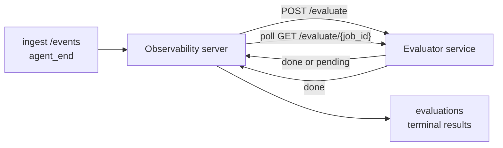

Failproof AI Observability kann jeden abgeschlossenen Agenten-Run automatisch auf Qualität bewerten: Sie stellen einen kleinen Scoring-Service bereit, und Observability übernimmt den Rest. Nutzen Sie es, um die für Sie relevanten Dimensionen zu verfolgen (Hilfsbereitschaft, Tool-Effizienz, Faktentreue, Sicherheit – Sie bestimmen die Kriterien), Regressionen frühzeitig zu erkennen und Agenten oder Umgebungen auf einen Blick zu vergleichen. Das Scoring ist optional: Die Pipeline ist inaktiv, bis Sie `EVALUATOR_ENDPOINT` auf dem Server setzen.

> **Hinweis:** Sie definieren die Score-Dimensionen. Ihr Evaluator kann beliebige numerische Schlüssel zurückgeben; Observability speichert, verfolgt und zeigt alles an, was Sie zurücksenden.

## Auf einen Blick

1. **Schreiben Sie einen Scorer.** Stellen Sie einen kleinen HTTP-Service bereit, der ein Session-Transkript liest und Scores zurückgibt. Observability enthält einen funktionierenden Referenz-Evaluator, den Sie kopieren können. Siehe [Einen Evaluator mit dem SDK schreiben](#writing-an-evaluator-with-the-sdk).
2. **Richten Sie Observability darauf aus.** Setzen Sie `EVALUATOR_ENDPOINT` (und ein gemeinsames `EVALUATOR_TOKEN`) im Server-Prozess.
3. **Beobachten Sie die eintreffenden Scores.** Jede abgeschlossene Session wird automatisch bewertet; die Ergebnisse erscheinen auf der Session-Detailseite, im Sessions-Grid und in gespeicherten Dashboards.


*Sobald ein Evaluator konfiguriert ist, wird jeder abgeschlossene Run bewertet und die Ergebnisse erscheinen in der rechten Spalte der Session: die Zusammenfassung oben, dann dimensionsspezifische Score-Balken mit Begründung.*

---

## Funktionsweise



Wenn das Observability SDK ein `agent_end`-Event für eine Session ausgibt, plant der Server eine Evaluierung. Anschließend sendet er das vollständige Event-Transkript per POST an Ihren Evaluator-Service, der entweder:

- **Das Ergebnis direkt zurückgeben** kann mit `{"status":"done", "scores":{...}, "reasoning":{...}, "summary":"..."}`. Das
  Ergebnis wird der Evaluierungs-Timeline der Session hinzugefügt. `reasoning` und
  `summary` sind optional.
- **Zurückstellen** kann mit `{"status":"pending", "job_id":"abc-123"}`. Observability ruft dann
  `GET {EVALUATOR_ENDPOINT}/evaluate/abc-123` auf, bis Ihr Evaluator
  `{"status":"done", ...}` oder `{"status":"error", "error":"..."}` zurückgibt.

  Die Polling-Frequenz ist pro Job konfigurierbar: Eine `pending`-Antwort kann
  `next_poll_secs` enthalten, um den Standardwert zu überschreiben; andernfalls verwendet Observability den
  `default_poll_interval_secs`-Wert aus `GET /config`; andernfalls fällt der Server
  auf `EVALUATOR_POLLING_INTERVAL_SECS` zurück (Standard: 10s). Alle Werte
  werden auf [1s, 1h] begrenzt.

Sessions, die nie ein `agent_end`-Event senden (z. B. ein abgestürzter Agenten-Prozess),
können ebenfalls erfasst werden: Das `GET /config` des Evaluators kann
`{"inactivity_timeout_secs": 1800}` zurückgeben, und Observability bewertet jede Session,
die so lange inaktiv war. Setzen Sie das Feld auf `null` oder lassen Sie es weg, um
diesen Fallback zu deaktivieren.

Die Pipeline ist vollständig inaktiv, wenn `EVALUATOR_ENDPOINT` nicht gesetzt ist.

Eine Session kann **im Laufe der Zeit mehrere abschließende Evaluierungen ansammeln**: Jedes
`agent_end`-Event (und jede manuelle Neubewertung über das Dashboard) fügt eine neue
Evaluierungszeile hinzu. Dies ist der empfohlene Weg, um ein fortgeführtes
Gespräch zu evaluieren: Ein Nutzer beendet einen Agenten, kehrt später zurück, sendet weitere Events,
beendet den Agenten erneut, und eine zweite Evaluierung wird gegen das vollständige aktualisierte
Transkript durchgeführt. Das Dashboard zeigt die aktuellste Evaluierung als Hauptanzeige
und die vorherigen Evaluierungen als ausklappbare Timeline. Während eine
Evaluierung für eine Session läuft, werden weitere `agent_end`-Events für diese
Session ignoriert; das nächste nach Abschluss der laufenden Evaluierung
stellt eine neue Evaluierung in die Warteschlange.

Der Inaktivitäts-Fallback greift auch bei fortgeführten Sessions: Wenn nach einer
vorherigen abschließenden Evaluierung neue Events eintreffen und die Session dann
länger als `inactivity_timeout_secs` inaktiv bleibt, wird eine neue Evaluierung eingereiht.

Vorübergehende Fehler (5xx, 429, Timeouts, Netzwerkfehler) werden mit
exponentiellem Backoff bis zu `EVALUATOR_MAX_ATTEMPTS`-mal wiederholt; 4xx-Antworten sind
endgültig. Observability lässt sich sicher mit mehreren horizontal skalierten Server-Instanzen betreiben;
die Arbeit wird so aufgeteilt, dass dieselbe Session nie gleichzeitig zweimal verarbeitet wird.

---

## HTTP-Vertrag

Jede authentifizierte Route verwendet **Bearer-Token-Authentifizierung**. Derselbe Wert muss
auf beiden Seiten konfiguriert sein:

- Observability-Server: Umgebungsvariable `EVALUATOR_TOKEN`
- Evaluator-Service: gleich konfiguriert (das `agenteye-evaluator`-SDK
  liest `EVALUATOR_TOKEN` per Konvention)

Wenn `EVALUATOR_TOKEN` nicht gesetzt ist, sendet der Server keinen `Authorization`-Header; der
Evaluator kann dann anonyme Anfragen akzeptieren, was für ein
rein internes Netzwerk akzeptabel ist, im öffentlichen Internet jedoch nicht empfohlen wird.

### Routen, die der Evaluator bereitstellen muss

| Route | Body / Parameter | Antwort |
|---|---|---|
| `GET /health` | keine | `{"status":"ok"}` (offen, keine Authentifizierung) |
| `GET /config` | keine | `{"inactivity_timeout_secs": <int> \| null, "default_poll_interval_secs": <int> \| omitted}` |
| `POST /evaluate` | `EvalRequest` JSON | `{"status":"done", ...}` oder `{"status":"pending", "job_id":"..."}` |
| `GET /evaluate/{id}` | keine | gleiche Antwortstruktur wie `/evaluate` |

### `EvalRequest`-Body, der vom Server gesendet wird

```json
{
  "schema_version": "1",
  "session_id":     "session-abc123",
  "agent_id":       "planner",
  "environment":    "production",
  "started_at":     "2026-05-10T12:00:00Z",
  "ended_at":       "2026-05-10T12:05:00Z",
  "events": [
    { "id": 1234, "ts": "...", "event_type": "agent_start", "payload": { ... } },
    ...
  ]
}
```

### Antwortformate

**Synchron (done):**

```json
{
  "status": "done",
  "scores": { "helpfulness": 0.85, "tool_efficiency": 0.6 },
  "reasoning": {
    "helpfulness": "answered the question directly with citations",
    "tool_efficiency": "called list_files three times when one would have done"
  },
  "summary": "strong answer quality, weak tool selection"
}
```

`reasoning` (eine Begründungszuordnung pro Score) und `summary` (eine allgemeine
Zusammenfassung in einem Absatz) sind beide optional. Schlüssel in `reasoning` sollten
die Schlüssel in `scores` widerspiegeln; das Dashboard rendert jeden Eintrag direkt unter
dem zugehörigen Score-Balken. Ältere Evaluatoren, die nur `scores` zurückgeben, funktionieren
weiterhin unverändert; `reasoning` und `summary` werden dann als null interpretiert und
die entsprechenden UI-Elemente werden ausgeblendet.

**Asynchron (zurückgestellt):**

```json
{ "status": "pending", "job_id": "abc-123", "next_poll_secs": 30 }
```

`next_poll_secs` ist optional; wenn nicht angegeben, fällt der Server auf den
`default_poll_interval_secs`-Wert des Evaluators aus `/config` zurück, dann auf seine eigene
`EVALUATOR_POLLING_INTERVAL_SECS`-Umgebungsvariable.

**Abschließender Fehler auf Evaluator-Seite:**

```json
{ "status": "error", "error": "model service unavailable" }
```

Der Server behandelt jeden anderen 2xx-Body als Protokollfehler und zeichnet einen
abschließenden `error` für die Session auf.

---

## Einen Evaluator mit dem SDK schreiben

Sie müssen den HTTP-Vertrag nicht manuell implementieren. Das Python-Paket `agenteye-evaluator`
bietet Ihnen einen typisierten FastAPI-Wrapper, der Authentifizierung, Routing und
die Anfrage-/Antwortformate für Sie übernimmt.

Failproof AI Observability enthält außerdem einen **funktionierenden Referenz-Evaluator**, der
`helpfulness`, `tool_efficiency` und `factuality` anhand der Struktur des
Transkripts bewertet. Kopieren Sie ihn als Ausgangspunkt und ersetzen Sie die Logik durch Ihre eigene: einen LLM-
Richter, eine Regelmaschine oder was auch immer Ihrem Qualitätsanspruch entspricht.

Minimaler funktionsfähiger Evaluator:

```python
import os
from agenteye_evaluator import Evaluator, EvalRequest, EvalResponse

app = Evaluator(token=os.environ["EVALUATOR_TOKEN"])

@app.evaluator
def run(req: EvalRequest) -> EvalResponse:
    # Inspect req.events (the full session transcript) and return scores.
    tool_calls = sum(1 for e in req.events if e.event_type == "tool_use")
    return EvalResponse(
        scores={"tool_calls": float(tool_calls)},
        reasoning={"tool_calls": f"{tool_calls} tool invocations in the transcript"},
        summary="tight tool loop" if tool_calls < 5 else "agent looped on tools",
    )
```

Die `app`-Instanz läuft unter jedem ASGI-Server, `uvicorn module:app` startet sie.

Für Evaluatoren, die aufwändige Arbeit zurückstellen müssen, geben Sie stattdessen `JobPending`
zurück und registrieren Sie einen `@app.job_lookup`-Handler; der Observability-Server
pollt `GET /evaluate/{job_id}`, bis Sie einen abschließenden Status zurückgeben oder die
`EVALUATOR_MAX_POLL_DURATION_SECS`-Grenze (Standard: 1 h) erreicht wird.

Die vollständige API-Referenz, das asynchrone Muster und das Event-Schema sind in der
README des `agenteye-evaluator`-SDKs dokumentiert.

---

## Den Evaluator betreiben

Der Evaluator ist **Ihr Service** – Failproof AI Observability liefert keinen
Standard-Evaluator mit, Sie bauen und betreiben ihn dort, wo Sie Ihre eigenen Services betreiben.
Er läuft unter jedem ASGI-Server (z. B. `uvicorn my_evaluator:app`); stellen Sie
die Routen `/health`, `/config` und `/evaluate` gemäß dem
[HTTP-Vertrag](#http-contract) bereit und verweisen Sie den Server darauf (siehe
[Den Server konfigurieren](#configuring-the-server)).

Sobald der Evaluator erreichbar ist, gibt `GET /health` `{"status":"ok"}` zurück. Nachdem
ein Agent einen vollständigen Durchlauf absolviert hat, gibt `GET /evaluations` auf dem Server eine Zeile mit
`status: "done"` und den von Ihrem Evaluator produzierten Scores zurück.

---

## Den Server konfigurieren

Auf dem Server-Prozess setzen:

| Umgebungsvariable | Bedeutung |
|---|---|
| `EVALUATOR_ENDPOINT` | Basis-URL Ihres Evaluators (`http://evaluator:9000`). Nicht gesetzt = Pipeline deaktiviert. |
| `EVALUATOR_TOKEN` | Bearer-Token. Muss dem Wert entsprechen, mit dem der Evaluator-Service konfiguriert ist. |
| `EVALUATOR_WORKERS` | Worker-Tasks pro Server-Instanz (Standard: 2). |
| `EVALUATOR_CLAIM_BATCH` | Zeilen, die pro Worker-Tick beansprucht werden (Standard: 4). Batches werden **gleichzeitig** verarbeitet; die effektive Parallelität auf Ihrem Evaluator-Endpunkt beträgt `EVALUATOR_WORKERS × EVALUATOR_CLAIM_BATCH`. |
| `EVALUATOR_POLL_IDLE_SECS` | Wie lange ein Worker zwischen Dispatch-Versuchen wartet, wenn keine Evaluierung fällig ist (Standard: 2s). |
| `EVALUATOR_POLLING_INTERVAL_SECS` | Letzter Fallback für die `GET /evaluate/{id}`-Frequenz, wenn weder das antwortspezifische `next_poll_secs` noch das `default_poll_interval_secs` des Evaluators gesetzt ist (Standard: 10s). |
| `EVALUATOR_REQUEST_TIMEOUT_MS` | Timeout pro Anfrage (Standard: 30000). |
| `EVALUATOR_MAX_ATTEMPTS` | Nach so vielen vorübergehenden Fehlern wird das Ergebnis als abschließender `error` aufgezeichnet (Standard: 5). |
| `EVALUATOR_CONFIG_REFRESH_SECS` | `GET /config`-Frequenz (Standard: 300). |
| `EVALUATOR_MAX_POLL_DURATION_SECS` | Maximale Echtzeit, die eine Session in der Polling-Warteschlange verbleiben darf, bevor sie als `timeout` beendet wird (Standard: 3600s). Schützt vor einem Evaluator, der dauerhaft `pending` zurückgibt. |

Um automatisches Scoring zu aktivieren, setzen Sie sowohl `EVALUATOR_ENDPOINT` als auch
`EVALUATOR_TOKEN` auf dem Server und starten Sie ihn neu, damit die Änderung übernommen wird. Wenn
`EVALUATOR_ENDPOINT` nicht gesetzt ist, bleibt die Pipeline inaktiv.

Die oben genannten Konfigurationsoptionen sind optional; setzen Sie die entsprechenden Umgebungsvariablen
auf dem Server nur, wenn Sie die Standardwerte überschreiben möchten.

---

## API-Referenz

| Methode | Pfad | Erforderliche Berechtigung | Zweck |
|---|---|---|---|
| `GET` | `/evaluations` | `evaluations:read` | Abschließende Ergebnisse abfragen. Unterstützt `session_id`, `agent_id`, `environment`, `status` (`done`/`error`/`timeout`), `ts_from`, `ts_to`, `cursor`, `limit`, `score_filters`, `latest_per_session`. `limit` ist standardmäßig 50 und maximal 200 (beachten Sie, dass dies von `/events` abweicht, das maximal 1000 zulässt). `environment` akzeptiert eine kommagetrennte Liste (z. B. `environment=prod,staging`); einzelne Werte funktionieren weiterhin. Mit `latest_per_session=true` enthält die Antwort höchstens eine Zeile pro `session_id` (die aktuellste nach `completed_at`), die von der Sessions-Listenseite verwendet wird, um die Evaluierungs-Timeline einer Session auf ihre aktuelle Hauptanzeige zu reduzieren. Standardmäßig false (gibt den vollständigen Verlauf zurück). |
| `GET` | `/evaluations/aggregate` | `evaluations:read` | Aggregierte Evaluierungs-Kennzahlen für einen gefilterten Bereich: Gesamtanzahl, Aufschlüsselung nach done/error/timeout, statistiken pro Score-Schlüssel (count/avg/min/max/p50 über die beliebigen `scores`-Schlüssel) und eine zeitlich gegliederte Timeline. Akzeptiert **dieselben Filterparameter wie `/evaluations`** plus `featured_keys` (CSV der Score-Schlüssel für Trends) und `latest_per_session`. Treibt die Dashboards-Funktion an; Metriken sind exakt über die gesamte übereinstimmende Menge berechnet, nicht gesampelt. |
| `GET` | `/evaluations/environments` | `evaluations:read` | Eindeutige Umgebungswerte aus der `evaluations`-Tabelle. Wird verwendet, um Filter-Dropdowns zu befüllen, die auf evaluierungslesbare Daten beschränkt sind. |
| `GET` | `/evaluation-jobs` | `evaluations:read` | Einblick in laufende Evaluierungen. Filtern nach `status` (`pending`/`polling`). |
| `GET` | `/events` | `events:read` | Rohe Events einer Session streamen. Unterstützt `session_id`, `agent_id`, `event_type` (CSV), `environment` (CSV), `ts_from`, `ts_to`, `cursor`, `limit` und `order`. `order` ist `desc` (neueste zuerst, Standard) oder `asc` (älteste zuerst); ein unbekannter Wert fällt auf `desc` zurück. Cursor-Paginierung über `next_cursor` der Antwort (eine Event-ID): als `cursor` zurückgeben, um die nächste Seite zu erhalten; mit `asc` sind das die Events nach dieser ID, mit `desc` die Events davor. `limit` ist standardmäßig 50 und maximal 1000. |
| `GET` | `/sessions/:session_id/export` | `events:read` | Gibt den genauen JSON-Body zurück, den der Evaluator für diese Session erhalten würde, als herunterladbaren Anhang namens `session-<id>.json`. Nützlich zum Wiederholen von Produktions-Sessions durch `agenteye-evaluator` für Offline-Tests. Die Bytes sind byteidentisch mit dem, was die Evaluator-Pipeline sendet. |
| `POST` | `/sessions/:session_id/re-evaluate` | `evaluations:trigger` | Stellt eine neue Evaluierung für eine Session in die Warteschlange; wird ausgeführt, unabhängig davon, ob eine vorherige Evaluierung vorhanden ist. Das neue Ergebnis wird der Evaluierungs-Timeline der Session **hinzugefügt** und überschreibt die vorherige nicht, sodass frühere Scores als Verlauf sichtbar bleiben. Gibt `202` bei Einreihen zurück, `404` für eine unbekannte Session, `409` wenn bereits eine Evaluierung läuft. Verwenden Sie dies nach dem Deployment eines neuen Evaluators oder für Sessions, die nie `agent_end` gesendet haben. |

### Nach Score-Bereich filtern: `score_filters`

`GET /evaluations` akzeptiert einen optionalen `score_filters`-Parameter, der
Ergebnisse nach numerischen Werten innerhalb des `scores`-Objekts einschränkt. Der
Parameter ist eine kommagetrennte Liste von `key:min..max`-Einträgen; beide
Grenzen können weggelassen werden. Mehrere Einträge werden mit logischem UND verknüpft. Zeilen,
bei denen der genannte Schlüssel fehlt oder nicht numerisch ist, werden ausgeschlossen. Eine Anfrage darf
höchstens 20 Filtereinträge enthalten; bei Überschreitung wird HTTP 400 zurückgegeben.

Beispiele:
```text
# helpfulness in [0.5, 0.8]
GET /evaluations?score_filters=helpfulness:0.5..0.8

# tool_efficiency höchstens 0.3 (keine Untergrenze)
GET /evaluations?score_filters=tool_efficiency:..0.3

# helpfulness >= 0.5 UND factuality >= 0.9
GET /evaluations?score_filters=helpfulness:0.5..,factuality:0.9..
```

Jedes `/evaluations`-Antwortobjekt hat diese Felder:

| Feld | Typ | Hinweise |
|---|---|---|
| `evaluation_id` | string (UUID) | Der kanonische Bezeichner für diese abschließende Evaluierung. Jede abschließende Evaluierung erhält eine neue UUID; eine einzelne Session kann mehrere haben. |
| `id` | string (UUID) | Rückwärtskompatibilitäts-Alias mit demselben Wert wie `evaluation_id`. |
| `session_id` | string | Die Session, gegen die diese Evaluierung durchgeführt wurde. Eine Session kann mehrere Evaluierungen in der Timeline haben. |
| `agent_id` | string | Identifiziert den Agenten, der die Session erzeugt hat. |
| `environment` | string | Aus der Session kopiertes Umgebungs-Label. |
| `status` | enum | Eines von `"done"`, `"error"`, `"timeout"`. |
| `scores` | object \| null | Von Ihrem Evaluator zurückgegebene Scores. |
| `reasoning` | object \| null | Optionale, von Ihrem Evaluator zurückgegebene Begründungszuordnung pro Score. Schlüssel entsprechen typischerweise denen in `scores`. Das Dashboard rendert jeden Eintrag unter dem zugehörigen Score-Balken. |
| `summary` | string \| null | Optionale, vom Evaluator zurückgegebene allgemeine Zusammenfassung in einem Absatz. Das Dashboard rendert diese über der dimensionsspezifischen Aufschlüsselung als Evaluierungs-Überschrift. |
| `error` | string \| null | Nur bei `"error"` / `"timeout"` befüllt. |
| `attempt_count` | integer | Anzahl der Dispatch-Versuche (≥ 1). |
| `duration_ms` | integer \| null | Dauer des letzten Versuchs. |
| `completed_at` | string (ISO 8601 UTC) | Zeitpunkt, zu dem das abschließende Ergebnis aufgezeichnet wurde. Ergebnisse werden nach `completed_at` geordnet (neueste zuerst). |
| `created_at` | string (ISO 8601 UTC) | Trägt denselben Zeitstempel wie `completed_at` (Einmal-Schreib-Semantik). |

---

## Berechtigungen

| Berechtigung | Gewährt |
|---|---|
| `evaluations:read` | Evaluierungsergebnisse auflisten, Scores im Dashboard anzeigen und Dashboard-Kennzahlen laden. |
| `evaluations:trigger` | Manuell eine Evaluierung für eine Session über `POST /sessions/:session_id/re-evaluate` oder den Neubewertungs-Button im Dashboard einreihen. |
| `dashboards:read` | Gespeicherte Dashboards anzeigen (erfordert auch `evaluations:read` zum Laden der Kennzahlen). |
| `dashboards:write` | Dashboards erstellen und bearbeiten. |
| `dashboards:delete` | Dashboards löschen. |

Der Bootstrap-Administrator (`ADMIN_KEY`, `ADMIN_EMAIL`) erhält diese automatisch.

---

## Ergebnisse anzeigen

- **`/sessions/<id>`**: Event-Timeline und eine rechte Spalte mit den Scores der Session
  sowie eventuellen Fehlern aus dem Dispatch-Versuch. Wenn Ihr Schlüssel
  `evaluations:trigger` hat, erscheint neben dem Export-Button ein **Neubewerten**-Button,
  nützlich für Sessions, die nie `agent_end` gesendet haben, oder um Scores nach dem Deployment
  eines neuen Evaluators zu aktualisieren. Das Dashboard pollt das neue Ergebnis und aktualisiert die rechte Spalte, wenn es eintrifft.
- **`/sessions`**: Filterbares Session-Grid; die Score-Spalte zeigt auf einen Blick den Evaluierungsstatus und die Scores jeder Session.
- **`/dashboards`**: Gespeicherte Evaluierungs-Gesundheitsansichten (siehe [Dashboards](#dashboards) unten).


*Das Sessions-Grid zeigt den Evaluierungsstatus und die Scores jedes Runs auf einen Blick; rote/gelbe/grüne Badges heben niedrige Scores hervor.*

---

## Dashboards

Die **Dashboards**-Seite (`/dashboards`) ermöglicht es Ihnen, eine Kombination aus Evaluierungsfiltern
als benannte, wiederverwendbare Ansicht zu speichern und zu beobachten, wie dieser Evaluierungsausschnitt
auf einen Blick abschneidet. Dashboards werden **innerhalb Ihrer gesamten Organisation geteilt**;
alle mit `dashboards:read` sehen denselben Satz.

Jedes Dashboard speichert:

- **Filter**: dieselben Steuerelemente wie die Sessions-Seite: Umgebung, Status,
  Agent, ein rollierendes Zeitfenster und Score-Bereich-Filter (`key:min..max`).
- **Eine Anzeigekonfiguration**: welche Score-Schlüssel hervorgehoben werden, die grünen/gelben/roten
  Schwellenwerte für den Gesundheitsstatus, welche Panels angezeigt werden und ob auf die aktuellste
  Evaluierung pro Session reduziert werden soll.

Jede Karte zeigt die Anzahl übereinstimmender Sessions, eine Aufschlüsselung nach done/error/timeout,
den Durchschnitt jedes hervorgehobenen Scores und einen kleinen Trend-Sparkline. Das Öffnen eines
Dashboards zeigt die Panels in voller Größe; **„in Sessions öffnen"** wechselt zur
Sessions-Seite mit genau diesem Filter vorausgewählt. Metriken werden serverseitig über die gesamte
übereinstimmende Menge berechnet (über `GET /evaluations/aggregate`), sodass die Zahlen exakt und nicht gesampelt sind.


**Berechtigungen:** Anzeigen erfordert sowohl `dashboards:read` als auch `evaluations:read`;
Erstellen und Bearbeiten erfordert `dashboards:write`; Löschen erfordert `dashboards:delete`.
Der Bootstrap-Administrator erhält alle diese automatisch.

---

## Fehlerbehebung

**Sessions vorhanden, aber keine Evaluierungen werden erstellt.** Stellen Sie sicher, dass `EVALUATOR_ENDPOINT`
im Server-Prozess gesetzt ist, dass Server und Evaluator denselben `EVALUATOR_TOKEN`-Wert verwenden,
und dass der `/health`-Endpunkt des Evaluators vom Server erreichbar ist. Wenn `EVALUATOR_ENDPOINT` nicht gesetzt ist, ist die Pipeline inaktiv.

**Laufende Evaluierungen häufen sich an.** Fragen Sie `GET /evaluation-jobs` ab, um die
laufende Warteschlange einzusehen. Prüfen Sie `attempt_count`, `next_attempt_at` und `last_error`
für jede Zeile. Häufige Ursachen: Evaluator-Service nicht erreichbar oder gibt 5xx zurück
(wird mit Backoff wiederholt), falsches `EVALUATOR_TOKEN` (401 ist abschließend), oder ein
asynchroner Evaluator, der dauerhaft `pending` zurückgibt (siehe unten).

**Sessions abgeschlossen, aber keine abschließende Evaluierung.** Fragen Sie
`GET /evaluation-jobs?status=polling` ab; das Ergebnis könnte noch in Bearbeitung sein.
Wenn ein Job in `pending` feststeckt, hat der Server Probleme, den Evaluator zu erreichen;
prüfen Sie, ob der Evaluator läuft und ob `EVALUATOR_TOKEN` übereinstimmt.

**`HTTP 401 from evaluator: invalid bearer token`.** Das `EVALUATOR_TOKEN`
auf dem Server stimmt nicht mit dem Wert überein, mit dem der Evaluator-Service konfiguriert ist.
Sie müssen identisch sein.

**Asynchroner Evaluator gibt dauerhaft `pending` zurück.** Der Server pollt
`GET /evaluate/{job_id}`, bis der Evaluator `done` oder `error` zurückgibt, oder bis
`EVALUATOR_MAX_POLL_DURATION_SECS` (Standard: 1 h) abläuft. Nach Erreichen der Grenze
wird die Evaluierung als `timeout` aufgezeichnet und aus der laufenden Warteschlange entfernt.
Erhöhen Sie `EVALUATOR_MAX_POLL_DURATION_SECS`, wenn Ihr Evaluator legitim länger als den Standardwert benötigt.

---

## Nächste Schritte

- [Evaluator-Agent-Skill](/de/agenteye/evaluator-skill): Lassen Sie einen Coding-Agenten Ihre Dimensionen anhand echter Sessions gestalten und diesen Service für Sie erstellen.
- [Python SDK](/de/agenteye/python-sdk): Die `agent_end`-Events ausgeben, die das Scoring auslösen.
- [API-Schlüssel](/de/agenteye/api-keys): Die Berechtigungen `evaluations:read` und `evaluations:trigger`.
- [Audits](/de/agenteye/audits): Das andere automatisierte Qualitätsmerkmal von Observability für richtlinienbasierte Überprüfungen.