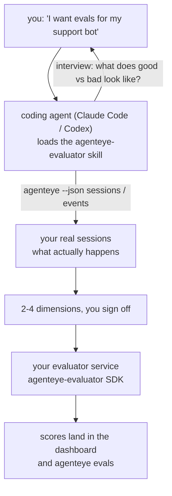

Von *„Ich glaube, unser Agent ist manchmal schlecht"* zu einem bereitgestellten Scoring-Service – wobei dein Coding-Agent sowohl die Entscheidungen trifft als auch den Aufbau übernimmt. Der **Failproof AI Observability Evaluator Skill** (`agenteye-evaluator`) ist ein *Agent Skill*: ein kleiner Ordner mit Anweisungen, den ein Coding-Agent wie Claude Code oder Codex bei Bedarf lädt. Er bringt dem Agenten bei, herauszufinden, welche Qualitätsdimensionen für *deinen* Agenten es wert sind, verfolgt zu werden, und dann den [Evaluator-Service](/de/agenteye/evaluation-suite) zu schreiben, zu testen und bereitzustellen, der sie bewertet.

Er ist **kein** gehosteter Scorer, keine Registry zum Hochladen und kein Plugin-System. Dein Evaluator bleibt dein eigener HTTP-Service auf deiner eigenen Infrastruktur, genau wie im Leitfaden zur [Evaluation suite](/de/agenteye/evaluation-suite) beschrieben. Der Skill bringt deinem Agenten lediglich bei, ihn gut zu bauen – alles, was er tut, könntest du also selbst tun, indem du denselben Code schreibst.

---

## Das Schwierige ist zu entscheiden, was bewertet werden soll

Die SDK-Oberfläche ist klein – ein Decorator und zwei Modelle – und ein Agent kann das allein aus dem [Contract](/de/agenteye/evaluation-suite#http-contract) ableiten. Daran scheitern Evaluatoren nicht. Sie scheitern, weil sie das Falsche bewerten, und ein Evaluator, der das Falsche bewertet, ist schlimmer als keiner: Er produziert ein Dashboard, das alle lernen zu ignorieren.

Daher befasst sich der Großteil des Skills mit der Phase, bevor überhaupt Code existiert. Der Agent interviewt dich (*„Beschreibe einen Run, der gut lief; jetzt einen, der schlecht lief"*), zieht dann deine echten Sessions über die [`agenteye` CLI](/de/agenteye/cli) und liest sie von Anfang bis Ende. Diese beiden Hälften stimmen meistens nicht überein, und die Lücke ist der Kern: Was du messen willst, im Vergleich zu dem, was deine Transkripte tatsächlich unterstützen können. Eine Dimension überlebt nur, wenn sie aus den Events **berechenbar** und **diskriminierend** ist – wenn sie sowohl bei deinem guten als auch bei deinem schlechten Run 0,9 erzielt, lehrt sie nichts und wird gestrichen.

Das Ergebnis ist ein Vorschlag von 2–4 Dimensionen mit der dazugehörigen Begründung, den du abzeichnen musst, bevor eine einzige Zeile geschrieben wird.



---

## Wie es sich zu den anderen Evaluierungsbausteinen verhält

Vier Docs behandeln das Scoring und gehen in der folgenden Reihenfolge ineinander über:

| Seite | Was es ist | Greife darauf zurück, wenn |
|---|---|---|
| **[Evaluations](/de/agenteye/evaluations)** | Das Feature: Scores im Sessions-Grid, Dashboards, Re-Evaluate | Du wissen willst, was automatisches Scoring dir bringt |
| **[Evaluation suite](/de/agenteye/evaluation-suite)** | Der HTTP-Contract, das SDK, die Server-Umgebungsvariablen | Du den Evaluator selbst implementierst oder debuggst |
| **Evaluator skill** (dieses Dokument) | Eine natürlichsprachliche Eingangstür zum Entwerfen *und* Bauen des Scorers | Du von „Ich will Evals" zu einem laufenden Service gelangen willst |
| **[CLI skill](/de/agenteye/cli-skill)** | Eine natürlichsprachliche Eingangstür zur `agenteye` CLI | Du die bereits vorhandenen Scores *lesen* willst |
| **[Python SDK skill](/de/agenteye/python-sdk-skill)** | Eine natürlichsprachliche Eingangstür zur Instrumentierung deines Agenten | Dein Agent noch keine Sessions ausgibt – es gibt noch nichts zu bewerten |

### vs. CLI skill: Bauen versus Lesen

Die beiden Skills überschneiden sich absichtlich nicht, und beide zu installieren ist die normale Vorgehensweise – der Agent wählt zwischen ihnen basierend auf dem, was du anfragst:

- **`agenteye-evaluator`** (dieses Dokument) baut das Ding, das Scores *erzeugt*. Seine Aufgabe endet, wenn Scores zum ersten Mal eintreffen.
- **[`agenteye-cli`](/de/agenteye/cli-skill)** liest bereits vorhandene Scores (`agenteye evals`). *„Hat die Qualität diese Woche abgenommen?"* ist seine Frage, nicht die dieses Skills.

---

## Voraussetzungen

1. Die **`agenteye` CLI installiert und eingeloggt** (`pipx install agenteye`, dann `agenteye login`). Der Skill nutzt sie zweimal: um die echten Sessions zu laden, gegen die er das Design entwickelt, und um am Ende zu bestätigen, dass deine Scores angekommen sind. Dein Login benötigt `events:read` sowie `evaluations:read` für diese abschließende Prüfung. Wie beim CLI Skill gilt: Er **kann** den per E-Mail versendeten Einmalcode-Login nicht für dich abschließen.
2. **Einen Ort für den Evaluator.** Er wird in ein Image gebaut und als langlebiger Service betrieben, braucht also ein echtes Repo, keine temporäre Datei. Evaluatoren leben oft in einem eigenen Repo, getrennt vom bewerteten Agenten – der Skill sucht nach einem vorhandenen und fragt, bevor er ein neues scaffoldet.
3. **Das `agenteye-evaluator` SDK-Wheel** – lies den nächsten Abschnitt, bevor dein Agent anfängt, `pip`-Befehle einzutippen.

---

## Wo du es bekommst

Der Skill ist in Failproof AIs öffentlicher Skills-Sammlung veröffentlicht:

**[github.com/FailproofAI/skills](https://github.com/FailproofAI/skills)** → [`skills/agenteye-evaluator/`](https://github.com/FailproofAI/skills/tree/main/skills/agenteye-evaluator)

Das Repository ist öffentlich und der Skill benötigt keine eigenen Zugangsdaten – er steuert lediglich die `agenteye` CLI mit der Session, mit der *du* eingeloggt bist, und schreibt Code in *dein* Repo. Beachte, dass er als eigener Ordner ausgeliefert wird und **nicht** im `pipx install agenteye`-Paket enthalten ist – suche also nicht dort danach.

## Den Skill installieren

Der schnellste Weg ist die [`skills`](https://skills.sh) CLI, die den Ordner abruft und dort ablegt, wo dein Agent ihn findet:

```bash
# Claude Code, nur dieses Projekt
npx skills add FailproofAI/skills --skill agenteye-evaluator -a claude-code

# jedes Projekt (installiert nach ~/.claude/skills/)
npx skills add FailproofAI/skills --skill agenteye-evaluator -a claude-code -g --copy

# stattdessen Codex
npx skills add FailproofAI/skills --skill agenteye-evaluator -a codex
```

Dann verwalte ihn wie jeden anderen Skill:

```bash
npx skills list -a claude-code           # was installiert ist
npx skills update agenteye-evaluator     # neueste Version laden
npx skills remove agenteye-evaluator     # entfernen
```

Lieber manuell installieren? Ein Agent Skill ist nur ein Ordner mit einer `SKILL.md` (plus optionalen Referenzen), also funktioniert auch Kopieren:

- **Claude Code**: Lege den `agenteye-evaluator/`-Ordner in `~/.claude/skills/` (jedes Projekt) oder `<dein-repo>/.claude/skills/` (nur dieses Repo). Claude Code erkennt ihn automatisch – überprüfe mit der `/skills`-Liste oder frag einfach nach Evals.
- **Codex (OpenAI)**: Codex liest dieselbe `SKILL.md`. Die mitgelieferte `agents/openai.yaml` setzt `allow_implicit_invocation: true`, sodass Codex den Skill automatisch auswählt, wenn eine Aufgabe passt; andernfalls ruf ihn explizit als `$agenteye-evaluator` auf.

---

## Das SDK ist nicht auf dem öffentlichen PyPI

> **Warnung:** Lies dies, bevor du einem Agenten erlaubst, das SDK zu installieren.

Der Skill ist öffentlich; das SDK, das er verwendet, ist es nicht. `agenteye-evaluator` wird nur als privates Release-Artefakt ausgeliefert, und im Gegensatz zu `agenteye` ist der Name auf dem **öffentlichen PyPI nicht beansprucht** – ein bloßes `pip install agenteye-evaluator` könnte also das Paket eines Fremden in den Service laden, der deine Produktionstranskripte liest. Das ist ein Supply-Chain-Problem, kein Tippfehler.

Der Skill weiß das und arbeitet stattdessen eine Installationsleiter ab, die beim ersten zutreffenden Schritt stoppt: die Monorepo-Quelle, falls du dich im AgentEye-Repo befindest, andernfalls das private Release-Wheel von GitHub Releases (benötigt Zugriff), und falls keines erreichbar ist, **stoppt er und weist dich an, deinen Failproof AI-Ansprechpartner nach dem Wheel zu fragen**, anstatt zu improvisieren.

Wenn dein Agent also ein bloßes `pip install agenteye-evaluator` von PyPI vorschlägt, ist das das Zeichen, dass der Skill nie geladen wurde. Halte dort inne und prüfe, ob er installiert ist.

---

## Was du ihn fragen kannst

Eine echte Runde beginnt mit einer vagen Anfrage und endet mit einem abgezeichneten Design, nicht mit Code:

```text
you   ▸ I want evals for our support bot. I think it's sometimes bad.

agent ▸ Before I write anything: describe a run that went well,
        and one that went badly.

you   ▸ Good: it answers from the docs. Bad: it makes stuff up,
        or gives up and says "contact support".

agent ▸ Running: agenteye --json sessions --status error --since 7d
        Reading 5 sessions, including two you'd call bad.

        Your words say factuality and deflection. The transcripts
        agree on deflection (2 of 5 end with a support hand-off,
        and it's plain in model_response.content), but factuality
        needs a ground truth your events don't carry.

        So I'd score three things:
          - deflection      rules, cheap, separates your two runs
          - tool_efficiency rules, catches the retry loop in run-004
          - groundedness    LLM judge: is every claim in the docs it retrieved?

        "factuality" would need ground truth we don't have; groundedness
        is the closest thing your transcripts can actually support.
        OK with those three names? Renaming later splits the history.

you   ▸ yes

agent ▸ No evaluator in this repo. Should I scaffold one here, or do
        you have one elsewhere?
```

Danach schreibt er zuerst die regelbasierten Dimensionen (kostenlos, sofort, deterministisch), testet sie gegen eine echte aufgezeichnete Session – einschließlich der leeren und nie abgeschlossenen, die naive Evaluatoren zum Absturz bringen –, und greift erst für die subjektive Dimension auf einen LLM-Judge zurück. Er kennt die [Grenzen des Dispatchers](/de/agenteye/evaluation-suite#configuring-the-server) – ein 30-Sekunden-Request-Timeout und 8 gleichzeitige Aufrufe deployment-weit –, sodass er bei einem Judge, der nicht zuverlässig in diesen Rahmen passt, asynchron mit `JobPending` arbeitet, anstatt zu riskieren, dass dein Judge fünfmal abgebrochen und wiederholt wird – zu fünffachen Kosten.

Dann deployt er, setzt die zwei Server-Umgebungsvariablen und bestätigt mit `agenteye --json evals --session-id <id>`, dass Scores tatsächlich angekommen sind. Scores, die ankommen, sind der einzige Beweis.

---

## Worauf du achten solltest

- **Dimensionsnamen sind nahezu dauerhaft.** Score-Keys sind beliebige Strings, und die Plattform trendiert alles, was du sendest – nichts stromabwärts korrigiert eine schlechte Wahl. Benenne später um, und die History spaltet sich: Alte Sessions behalten den alten Key, und der Trend bricht. Deshalb holt der Skill explizite Zustimmung ein, bevor Code geschrieben wird – nimm diese Aufforderung ernst.
- **Fixtures sind echte Produktionstranskripte.** Das Design gegen echte Sessions erfordert, diese auf die Festplatte zu laden, und sie können Kundendaten enthalten. Der Skill fragt, bevor er sie zu git committet; im Zweifelsfall halte `fixtures/` aus dem Repo heraus und lass jeden Entwickler seine eigenen laden.
- **Der Agent schreibt und deployt einen Service, der jedes Transkript liest.** Er handelt als du, begrenzt durch die Berechtigungen deines CLI-Logins, aber überprüfe den Evaluator wie jeden anderen Code, der Produktionsdaten berührt.

---

## Nächste Schritte

- **[Evaluation suite](/de/agenteye/evaluation-suite)**: Der HTTP-Contract, das SDK und die Server-Umgebungsvariablen, die der Skill konfiguriert.
- **[Evaluations](/de/agenteye/evaluations)**: Wo die Scores auftauchen, sobald sie ankommen.
- **[CLI skill](/de/agenteye/cli-skill)**: Der Geschwister-Skill – zum Lesen von Ergebnissen statt zum Bauen des Scorers.
- **[CLI](/de/agenteye/cli)**: Die Befehlsreferenz hinter den Session-Daten, gegen die der Skill designed.