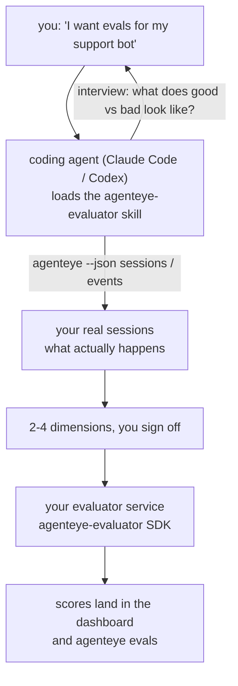

Vom vagen Gefühl, dass *der Agent manchmal schlechte Arbeit leistet*, zu einem bereitgestellten Scoring-Service – mit dem Coding-Agenten, der sowohl die Entscheidungen trifft als auch den Service baut. Die **Failproof AI Observability Evaluator Skill** (`agenteye-evaluator`) ist ein *Agent Skill*: ein kleiner Ordner mit Anweisungen, den ein Coding-Agent wie Claude Code oder Codex bei Bedarf lädt. Er bringt dem Agenten bei, herauszufinden, welche Qualitätsdimensionen es sich lohnt, für *Ihren* Agenten zu verfolgen, und dann den [Evaluator-Service](/de/agenteye/evaluation-suite) zu schreiben, zu testen und bereitzustellen, der diese bewertet.

Es handelt sich **nicht** um einen gehosteten Scorer, eine Registry zum Hochladen oder ein Plugin-System. Ihr Evaluator bleibt Ihr eigener HTTP-Service auf Ihrer eigenen Infrastruktur, genau wie im Leitfaden zur [Evaluation Suite](/de/agenteye/evaluation-suite) beschrieben. Der Skill bringt Ihrem Agenten lediglich bei, ihn gut zu bauen – alles, was er tut, könnten Sie also selbst tun, indem Sie denselben Code schreiben.

---

## Das Schwierige ist zu entscheiden, was bewertet werden soll

Die SDK-Oberfläche ist klein – ein Decorator und zwei Modelle – und ein Agent kann das allein aus dem [Vertrag](/de/agenteye/evaluation-suite#http-contract) heraus schreiben. Daran scheitern Evaluatoren nicht. Sie scheitern daran, dass sie die falschen Dinge bewerten, und ein Evaluator, der die falschen Dinge bewertet, ist schlimmer als keiner: Er produziert ein Dashboard, das alle lernen zu ignorieren.

Der größte Teil des Skills besteht daher aus dem, was vor dem eigentlichen Code steht. Der Agent interviewt Sie (*„Beschreiben Sie einen Durchlauf, der gut gelaufen ist; jetzt einen, der schlecht gelaufen ist"*), zieht dann Ihre echten Sessions über die [`agenteye` CLI](/de/agenteye/cli) und liest sie von Anfang bis Ende durch. Diese beiden Hälften stimmen meist nicht überein, und genau diese Lücke ist der springende Punkt: was Sie messen wollen, im Vergleich zu dem, was Ihre Transkripte tatsächlich unterstützen können. Eine Dimension überlebt nur, wenn sie aus den Events **berechenbar** und **diskriminierend** ist – bewertet sie sowohl Ihren guten als auch Ihren schlechten Durchlauf mit 0,9, lehrt sie nichts und wird gestrichen.

Das Ergebnis ist ein Vorschlag von 2–4 Dimensionen mit der dazugehörigen Begründung, den Sie genehmigen müssen, bevor eine Zeile Code geschrieben wird.



---

## Bezug zu den anderen Evaluierungs-Komponenten

Vier Dokumente behandeln das Scoring und bauen in dieser Reihenfolge aufeinander auf:

| Seite | Was es ist | Wann Sie es verwenden |
|---|---|---|
| **[Evaluations](/de/agenteye/evaluations)** | Das Feature: Scores im Sessions-Grid, Dashboards, Neu-Evaluieren | Wenn Sie wissen wollen, was automatisches Scoring Ihnen bringt |
| **[Evaluation suite](/de/agenteye/evaluation-suite)** | Der HTTP-Vertrag, das SDK, die Server-Umgebungsvariablen | Wenn Sie den Evaluator selbst implementieren oder debuggen |
| **Evaluator Skill** (dieses Dokument) | Eine natürlichsprachliche Eingangstür zum Entwerfen *und* Bauen des Scorers | Wenn Sie von „Ich möchte Evals" zu einem laufenden Service gelangen wollen |
| **[CLI skill](/de/agenteye/cli-skill)** | Eine natürlichsprachliche Eingangstür zur `agenteye` CLI | Wenn Sie die bereits vorhandenen Scores *lesen* möchten |
| **[Python SDK skill](/de/agenteye/python-sdk-skill)** | Eine natürlichsprachliche Eingangstür zur Instrumentierung Ihres Agenten | Wenn Ihr Agent noch keine Sessions ausgibt – es gibt nichts zu bewerten |

### vs. CLI Skill: Bauen vs. Lesen

Die beiden Skills überschneiden sich bewusst nicht, und beide zu installieren ist die normale Konfiguration – der Agent wählt zwischen ihnen basierend auf Ihrer Anfrage:

- **`agenteye-evaluator`** (dieses Dokument) baut das, was Scores *produziert*. Seine Aufgabe endet, wenn Scores zum ersten Mal eingehen.
- **[`agenteye-cli`](/de/agenteye/cli-skill)** liest bereits vorhandene Scores (`agenteye evals`). *„Hat die Qualität diese Woche nachgelassen?"* ist seine Frage, nicht die dieses Skills.

---

## Voraussetzungen

1. **Die `agenteye` CLI installiert und eingeloggt** (`pipx install agenteye`, dann `agenteye login`). Der Skill nutzt sie an zwei Stellen: um die echten Sessions zu laden, gegen die er entwirft, und um am Ende zu bestätigen, dass Ihre Scores eingegangen sind. Ihr Login benötigt `events:read` sowie `evaluations:read` für diese abschließende Überprüfung. Wie beim CLI Skill kann er die per E-Mail gesendete Einmalcode-Anmeldung **nicht** für Sie abschließen.
2. **Ein Ort für den Evaluator.** Er wird in ein Image gebaut und als dauerhaft laufender Service betrieben, benötigt also ein echtes Repo und keine Scratch-Datei. Evaluatoren leben oft in einem eigenen Repo, getrennt vom bewerteten Agenten – der Skill sucht nach einem vorhandenen Repo und fragt nach, bevor er ein neues anlegt.
3. **Das `agenteye-evaluator` SDK Wheel** – lesen Sie den nächsten Abschnitt, bevor Ihr Agent beginnt, `pip`-Befehle einzutippen.

---

## Bezugsquelle

Der Skill ist in Failproof AI's öffentlicher Skills-Sammlung veröffentlicht:

**[github.com/FailproofAI/skills](https://github.com/FailproofAI/skills)** → [`skills/agenteye-evaluator/`](https://github.com/FailproofAI/skills/tree/main/skills/agenteye-evaluator)

Das Repository ist öffentlich, und der Skill benötigt keine eigenen Zugangsdaten – er steuert lediglich die `agenteye` CLI mit der Session, mit der *Sie* eingeloggt sind, und schreibt Code in *Ihrem* Repo. Beachten Sie, dass er als eigener Ordner ausgeliefert wird und **nicht** im `pipx install agenteye`-Paket enthalten ist – suchen Sie also nicht dort danach.

## Den Skill installieren

Der schnellste Weg ist die [`skills`](https://skills.sh) CLI, die den Ordner holt und dort ablegt, wo Ihr Agent sucht:

```bash
# Claude Code, nur dieses Projekt
npx skills add FailproofAI/skills --skill agenteye-evaluator -a claude-code

# alle Projekte (installiert nach ~/.claude/skills/)
npx skills add FailproofAI/skills --skill agenteye-evaluator -a claude-code -g --copy

# stattdessen Codex
npx skills add FailproofAI/skills --skill agenteye-evaluator -a codex
```

Dann verwalten Sie ihn wie jeden anderen Skill:

```bash
npx skills list -a claude-code           # was installiert ist
npx skills update agenteye-evaluator     # neueste Version holen
npx skills remove agenteye-evaluator     # entfernen
```

Bevorzugen Sie die manuelle Installation? Ein Agent Skill ist nur ein Ordner mit einer `SKILL.md` (plus optionalen Referenzen), das Kopieren funktioniert also ebenfalls:

- **Claude Code**: Legen Sie den `agenteye-evaluator/`-Ordner in `~/.claude/skills/` (alle Projekte) oder `<ihr-repo>/.claude/skills/` (nur dieses Repo). Claude Code erkennt ihn automatisch – überprüfen Sie es mit der `/skills`-Liste oder fragen Sie einfach nach Evals.
- **Codex (OpenAI)**: Codex liest dieselbe `SKILL.md`. Die mitgelieferte `agents/openai.yaml` setzt `allow_implicit_invocation: true`, sodass Codex den Skill automatisch auswählt, wenn eine Aufgabe passt; andernfalls rufen Sie ihn explizit als `$agenteye-evaluator` auf.

---

## Das SDK ist nicht auf dem öffentlichen PyPI

> **Warnung:** Lesen Sie dies, bevor Sie einen Agenten das SDK installieren lassen.

Der Skill ist öffentlich; das SDK, das er steuert, ist es nicht. `agenteye-evaluator` wird nur als privates Release-Artefakt ausgeliefert, und im Gegensatz zu `agenteye` ist der Name auf dem öffentlichen PyPI **nicht reserviert** – ein einfaches `pip install agenteye-evaluator` könnte also das Paket eines Fremden in den Service einschleusen, der Ihre Produktionstranskripte liest. Das ist ein Supply-Chain-Problem, kein Tippfehler.

Der Skill weiß das und arbeitet stattdessen eine Installationsleiter nach unten ab, wobei er bei der ersten zutreffenden Sprosse anhält: die Monorepo-Quelle, wenn Sie sich im AgentEye-Repo befinden, andernfalls das private Release Wheel von GitHub Releases (benötigt Zugriff), und wenn keines erreichbar ist, **hält er an und teilt Ihnen mit, Ihren Failproof AI-Kontakt nach dem Wheel zu fragen**, anstatt zu improvisieren.

Wenn Ihr Agent also ein einfaches `pip install agenteye-evaluator` vom öffentlichen PyPI vorschlägt, ist das ein sicheres Zeichen, dass der Skill nie geladen wurde. Stoppen Sie dort und überprüfen Sie, ob er installiert ist.

---

## Was Sie fragen können

Ein echter Durchlauf beginnt mit einer vagen Anfrage und endet mit einem genehmigten Design, nicht mit Code:

```text
you   ▸ I want evals for our support bot. I think it's sometimes bad.

agent ▸ Before I write anything: describe a run that went well,
        and one that went badly.

you   ▸ Good: it answers from the docs. Bad: it makes stuff up,
        or gives up and says "contact support".

agent ▸ Running: agenteye --json sessions --status error --since 7d
        Reading 5 sessions, including two you'd call bad.

        Your words say factuality and deflection. The transcripts
        agree on deflection (2 of 5 end with a support hand-off,
        and it's plain in model_response.content), but factuality
        needs a ground truth your events don't carry.

        So I'd score three things:
          - deflection      rules, cheap, separates your two runs
          - tool_efficiency rules, catches the retry loop in run-004
          - groundedness    LLM judge: is every claim in the docs it retrieved?

        "factuality" would need ground truth we don't have; groundedness
        is the closest thing your transcripts can actually support.
        OK with those three names? Renaming later splits the history.

you   ▸ yes

agent ▸ No evaluator in this repo. Should I scaffold one here, or do
        you have one elsewhere?
```

Von dort aus schreibt er zuerst die regelbasierten Dimensionen (kostenlos, sofort, deterministisch), testet sie gegen eine echte aufgezeichnete Session – einschließlich der leeren und nie abgeschlossenen, die naive Evaluatoren zum Absturz bringen – und greift nur für die subjektive Dimension auf einen LLM-Judge zurück. Er kennt die [Grenzen des Dispatchers](/de/agenteye/evaluation-suite#configuring-the-server) – ein 30-Sekunden-Request-Timeout und 8 gleichzeitige Aufrufe deployment-weit – wenn der Judge also nicht zuverlässig passt, wechselt er auf async mit `JobPending`, anstatt den Judge fünfmal zum fünffachen Preis abbrechen und wiederholen zu lassen.

Dann deployed er, setzt die beiden Server-Umgebungsvariablen und bestätigt mit `agenteye --json evals --session-id <id>`, dass Scores tatsächlich eingegangen sind. Das Eingehen von Scores ist der einzige Beweis.

---

## Worauf Sie achten sollten

- **Dimensions-Namen sind nahezu dauerhaft.** Score-Keys sind beliebige Strings, und die Plattform bildet Trends für alles, was Sie senden – das bedeutet, dass nichts downstream eine schlechte Wahl korrigiert. Benennen Sie sie später um, und die Historie teilt sich: Alte Sessions behalten den alten Key, und der Trend bricht ab. Deshalb holt der Skill eine explizite Genehmigung ein, bevor Code geschrieben wird – nehmen Sie diese Aufforderung ernst.
- **Fixtures sind echte Produktionstranskripte.** Das Entwerfen gegen echte Sessions bedeutet, sie auf die Festplatte zu ziehen, und sie können Kundendaten enthalten. Der Skill fragt nach, bevor er sie zu git commitet; im Zweifelsfall halten Sie `fixtures/` aus dem Repo heraus und lassen jeden Entwickler seine eigenen ziehen.
- **Der Agent schreibt und deployed einen Service, der jedes Transkript liest.** Er handelt als Sie, begrenzt durch die Berechtigungen Ihres CLI-Logins, aber überprüfen Sie den Evaluator wie jeden anderen Code, der Produktionsdaten berührt.

---

## Nächste Schritte

- **[Evaluation suite](/de/agenteye/evaluation-suite)**: der HTTP-Vertrag, das SDK und die Server-Umgebungsvariablen, die der Skill konfiguriert.
- **[Evaluations](/de/agenteye/evaluations)**: wo die Scores erscheinen, sobald sie eingehen.
- **[CLI skill](/de/agenteye/cli-skill)**: der Schwester-Skill zum Lesen von Ergebnissen statt zum Bauen des Scorers.
- **[CLI](/de/agenteye/cli)**: die Befehlsreferenz hinter den Session-Daten, gegen die der Skill entwirft.